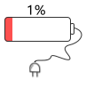

# 安全研究员无意间发现谷歌手机一个锁屏绕过漏洞，收获七万美元赏金

<!-- vulwiki-editorial-rebuild:system-misc -->
## 条目范围与校订

- 本文对象：Google Pixel／Android锁屏
- 文献类型：漏洞发现新闻
- 版本、权限及部署边界：物理接触、攻击者SIM及其PUK；初始解锁状态和冷启动后首次解锁须区分
- 核验状态：仅重建文本校订；未执行文中代码、PoC 或扫描，未把截图或转载声明记为本站复现

### 具体结论与待核项

以下为原归档的逐项勘误与证据缺口；可由文本确定的问题已在下文订正，仍缺来源的事实保持待核。

1. 正文重启后失败与解锁后热插卡成功的差异是关键前提，不支持所有锁定状态均可绕过
2. 把手机锁屏PIN与SIM PIN1混为一谈，应纠正术语
3. 给出2022-11-05补丁日期但未给受影响Android版本、Pixel型号和构建；研究者链接只有站点根域，缺原帖及谷歌公告
4. 赏金叙事可作背景，锁屏绕过不能直接等同root；分类应为移动系统

### 操作风险

正文重启后失败与解锁后热插卡成功的差异是关键前提，不支持所有锁定状态均可绕过

技术请求、代码与实验方法按原文保留；其中的破坏性动作仅限授权、可恢复的隔离环境。缺失代码、参数或版本事实不猜补。

### 来源追溯

- 原文参考链接（未重新核验）：<https://bugs.xdavidhu.me/>
- 原始披露 URL 未确认；既有归档来源标签保留，不能替代原始公告

### 归档技术正文

看雪学苑  看雪学苑   2022-11-14 17:59  
  
几天前，一名安全研究人员因一个无意间发现的Google Pixel手机的漏洞而获得了7万美元的赏金。据其所说，给他任何一部锁定的Pixel 设备，他都能够将之解锁。  
  
  
据悉，该漏洞是一个影响几乎所有Google Pixel手机的锁屏绕过漏洞（CVE-2022-20465），允许任何能够对设备进行物理访问的攻击者绕过锁屏保护（指纹、PIN码等）并获得对用户设备的完全访问权限。该漏洞已在谷歌2022年11月5日的安全更新中得到修复。  
  
  
据该漏洞的发现者亲述，他发现该漏洞的过程完全是个巧合。故事起于该安全研究员某天手机电量不足自动关机。而在接上充电器重新启动手机后，该研究人员忘记了SIM卡的PIN码，三次输入错误后SIM卡自行锁定并需要PUK码才能解锁。研究人员找到了自己SIM卡的原始包装获得了PUK码，最终成功进入了锁屏界面。  
  
  
但是，研究人员在这过程中发觉了一些不对劲的地方：它是一次全新的启动，启动后锁屏界面上显示的是指纹图标。不该是这样子的，重新启动后仍需输入一次PIN码才能解锁设备才对。研究人员认为其中非常有可能会有一些安全隐患，于是对此进行了更深入的调查。  
> 手机的PIN码（PIN1）是指SIM卡的个人识别密码，是保护自己的SIM卡不被他人盗用的一种安全措施。如果启用了开机PIN码，那么每次开机后就要输入4-8位数PIN码。   
  
PUK码则是PIN解锁码（Personal ldentification NumberUnlock Key）的缩写，它的主要功能是当SIM卡连续三次错误输入PIN码导致手机被锁时，用于解锁的解锁码。  
  
  
  
手机在接受指纹之后一直卡在“Pixel正在启动”界面不动，于是研究人员重新启动了手机并多次重复了这一过程，直到某一次他无意中进行了一次SIM卡热插拨。这次他照旧输入PUK码并设置了新的PIN码，结果他直接进入了个人主屏幕界面。  
  
  
在一阵不安席卷全身之后，研究人员顿时意识到，这里存在一个锁屏绕过漏洞。经过多次试验后，研究人员确认了该漏洞的利用手法：  
  
①故意在想要破解的目标设备上三次输入错误的指纹，导致禁用生物识别身份验证；  
  
②将目标设备的SIM卡热插拨，调换为攻击者自己携带的SIM卡；  
  
③故意三次输入错误的PIN码，锁定SIM卡；  
  
④攻击者输入自己的SIM卡的PUK码；  
  
⑤设备自动解锁，成功绕过锁屏保护。  
  
  
破解过程朴实无华，这意味着若想要利用该漏洞，攻击者仅需要携带一张自己的SIM卡。  
  
  
在上报漏洞后，谷歌为这个锁屏绕过漏洞给予了该安全研究员7万美元赏金。  
  
  
  
编辑：左右里  
  
资讯来源：  
https://bugs.xdavidhu.me/  
  
转载请注明出处和本文链接  
  
  
  
**每日涨知识**  
  
已知明文攻击（  
known-plaintext attack  
）  
  
一种利用大量互相对应的明文和密文进行分析的密码攻击方法。  
  
  
﹀  
  
﹀  
  
﹀  
  
  
  
  
  
  
  
**球分享**  
  
  
  
**球点赞**  
  
  
  
**球在看**  
  
****  
****  
  
  
  
戳  
“阅读原文  
”  
一起来充电吧！  
  

---

> 来源：gelusus/wxvl（微信公众号漏洞文章自动归档，原始披露 URL 尚未确认，现有链接按来源追溯区分别标注）
