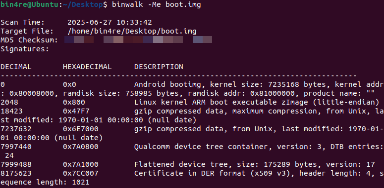
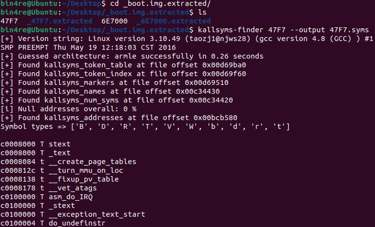
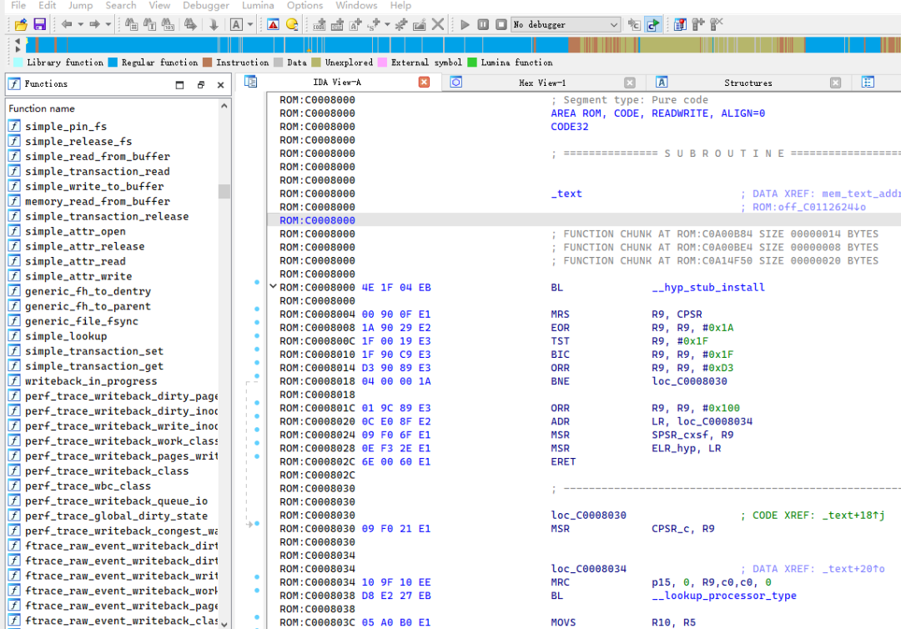
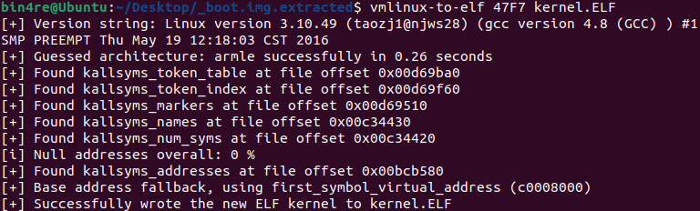
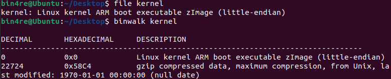

# 安卓旧系统 OTA 包分析与漏洞提权适配

<!-- vulwiki-editorial-rebuild:system-misc -->
## 条目范围与校订

- 本文对象：Android OEM内核
- 文献类型：固件分析与历史提权适配
- 版本、权限及部署边界：本地提权；具体ARM固件、内核符号及结构偏移需与运行内核一致；目标设备/OTA构建未给
- 核验状态：仅重建文本校订；未执行文中代码、PoC 或扫描，未把截图或转载声明记为本站复现

### 具体结论与待核项

以下为原归档的逐项勘误与证据缺口；可由文本确定的问题已在下文订正，仍缺来源的事实保持待核。

1. frontmatter仅1805，正文三组适配；PingPong标2015-5195却使用fi01/CVE-2015-3636项目，CVE身份明确冲突须查原始项目
2. 未给设备型号、OTA原件/哈希与补丁级别，ARM加载基址和固定八位地址解析不能推广所有Android
3. IDA脚本及C结构/预处理器坍缩为单行，注释会吞掉后续内容；jni/inlcude疑拼写错，脚本也未区分数据符号与函数
4. 关闭kptr_restrict需要权限，不能当成未提权用户天然具备的前置步骤；NDK r11c经验须注明个别环境
5. 宣称三项成功却未保留执行身份/结果，作者也说明省略复现；适配价值应保留但不能标完整PoC；缺原项目与工具直接来源

### 操作风险

原文技术操作的实际副作用未复现核验；按其请求/代码评估状态变更、凭据暴露和业务影响

技术请求、代码与实验方法按原文保留；其中的破坏性动作仅限授权、可恢复的隔离环境。缺失代码、参数或版本事实不猜补。

### 来源追溯

- 原文参考链接（未重新核验）：<https://bbs.kanxue.com/user-home-802108.htm>
- 原文参考链接（未重新核验）：<https://mp.weixin.qq.com/s?__biz=MjM5NTc2MDYxMw==&mid=2458593263&idx=1&sn=b3503a7dded4e013a4cc644bedbabb48&scene=21#wechat_redirect>
- 原文参考链接（未重新核验）：<https://mp.weixin.qq.com/s?__biz=MjM5NTc2MDYxMw==&mid=2458595995&idx=1&sn=7861e1699b2afe72b1973c8529e76cff&scene=21#wechat_redirect>
- 原文参考链接（未重新核验）：<https://mp.weixin.qq.com/s?__biz=MjM5NTc2MDYxMw==&mid=2458595942&idx=1&sn=5474a50cdf6fa924e6cde1c034f06eef&scene=21#wechat_redirect>
- 原文参考链接（未重新核验）：<https://mp.weixin.qq.com/s?__biz=MjM5NTc2MDYxMw==&mid=2458595872&idx=1&sn=27acee2988a95060ede7a8b826b9a11b&scene=21#wechat_redirect>
- 原文参考链接（未重新核验）：<https://mp.weixin.qq.com/s?__biz=MjM5NTc2MDYxMw==&mid=2458595848&idx=1&sn=39c6196cfee31db5bd7add19ebf6be9c&scene=21#wechat_redirect>
- 原始披露 URL 未确认；既有归档来源标签保留，不能替代原始公告

### 归档技术正文

0x指纹  看雪学苑   2025-07-17 10:05  
  
之前碰到一款安卓旧系统版本的设备，对其有提权调试需求，试了几款 Root 工具感觉不太好用，加上发现设备系统有检测措施会进行相应的保护，于是思路转向了通过 CVE 漏洞对设备进行临时提权。经过一番摸索分析，找到了还没有挂掉的系统 OTA 升级包的下载链接，恢复出来了内核符号表及地址，从而打开突破口，定位到 CVE 提权漏洞需要的符号信息，最后适配编译了 CVE-2015-1805（Pipe Read）、CVE-2015-5195（Ping Pong）和 CVE-2017-8890（Phoenix Talon）三个漏洞利用提权程序，可以成功提权，这里记录一下。  
  
  
  
**OTA 包提取内核符号表**  
  
  
如果有 root 权限的话，可以执行echo 0 > /proc/sys/kernel/kptr_restrict  
和cat /proc/kallsyms > kallsyms.txt  
来获取内核符号表及地址信息，但只有 OTA 更新包的话情况会有些不同。  
  
  
可以通过最简单的抓包方式获取到 OTA 更新包下载地址，不同系统的 OTA 更新包内容各不相同，常见的是会包含一个 boot.img，由内核自解压引导程序、压缩的内核镜像、文件系统、设备树等一起打包，使用binwalk -Me  
命令能查看和提取打包的内容。  
  
  
图中根据描述信息和区块大小，可以判断 0x800 位置开始包括后面的 0x47F7 区块，是一个 ARM 架构的 zImage 格式内核镜像文件，前者是内核引导头，后者是压缩的 Linux 文件 vmlinux。得到的 47F7 文件是解压后的 vmlinux 文件，如果是一个 ELF 文件的话，直接用nm -n  
命令即可查看符号表，但分析发现碰到的是一个没有 ELF 头的纯二进制内核代码，这个方法不能使用。  
  
  
  
  
  
经过一番分析搜索，使用vmlinux-to-elf项目的kallsyms_find.py模块，可以从 47F7 文件中提取生成内核符号表。  
  
  
  
  
  
有了内核符号表后，可以直接把 47F7 拖进 IDA，选择 arm 小端序架构后将 ROM start address 和 Loading address 设置为 0xc0008000 加载，再撰写执行 IDAPython 脚本来给内核二进制文件恢复符号。  
  
  
```
ksyms = open(r"D:\47F7.kallsyms")for line in ksyms:    addr = int(line[0:8],16)    name = line[11:-1]print(f"addr:{hex(addr)},{name}")if not ida_funcs.add_func(addr):print(f"Warning: Failed to add function at {hex(addr)}")if not idc.set_name(addr, name, idc.SN_NOWARN):print(f"Warning: Failed to set name at {hex(addr)}")
```  
  
  
  
执行完后便可看到已经有函数符号了，现在就能查找相关 CVE 提取漏洞函数来进行适配了。  
  
  
  
  
  
其实整个过程还可以更简单，vmlinux-to-elf项目包含了解压 zImage、提取内核符号表和封装为 ELF 文件的功能，直接执行vmlinux-to-elf 47F7 kernel.ELF  
，便可得到一个拥有符号可拖进 IDA 直接进行分析的内核文件。  
  
  
  
  
  
以及上面的 47F7 是我们手动用 binwalk 解包出来的，有些 OTA 包里面可能没有 boot.img 文件，而是有一个 kernel 文件，binwalk 查看是由内核引导头和压缩的 Linux 文件 vmlinux 组成，这时候直接用 vmlinux-to-elf 来生成内核 ELF 文件，就会用到其解压 zImage 模块功能，经测试是要比一些extract-vmlinux脚本支持适配得更广泛。  
  
  
  
  
  
翻一下vmlinux-to-elf项目代码会发现，这个工具根据 Linux 内核 kallsyms 系统演变的不同版本进行了适配，通过特征搜索定位，模拟内核解压算法过程，最后构建符号表，实现从内核二进制文件中直接解析出符号表。  
  
  
  
**CVE 漏洞适配**  
  
  
拥有内核符号表后，加上在前人大量的漏洞分析与分享的基础上，进行提权漏洞适配就轻松得多了，这里就不进行具体的漏洞复现、调试和分析过程了，简要说下漏洞适配过程，还有一些踩的坑。  
  
  
CVE-2015-1805  
参考dosomder/iovyroot项目，在jni/inlcude/offsets.h  
中看到有结构体 offset，我们需要在内核符号表中找到 ptmx_fops、sidtab、policydb、selinux_enabled 和 selinux_enforcing 位置值，在jni/offset.c  
文件中添加即可。  
  
  
```
struct offsets {char* devname; //ro.product.modelchar* kernelver; // /proc/versionunion {void* fsync; //ptmx_fops -> fsyncvoid* check_flags; //ptmx_fops -> check_flags    };#if (__LP64__)void* joploc; //gadget location, see getroot.cvoid* jopret; //return to setfl after check_flags() (fcntl.c), usually inlined in sys_fcntl#endifvoid* sidtab; //optional, for selinux contenxtvoid* policydb; //optional, for selinux contextvoid* selinux_enabled;void* selinux_enforcing;};
```  
  
  
  
CVE-2015-5195  
参考项目fi01/CVE-2015-3636，需要确定结构体 sock 的 sk_prot、sk_stamp 和结构体 inet_sock 的 mc_list 成员偏移，可分别在 inet_release、sock_get_timestampns 和 ip_mc_drop_socket 函数中对比源码找到，随后替换即可。  
  
  
CVE-2017-8890  
参考项目idhyt/androotzf，需要的结构体代码中直接定义了，不用怎么修改，就 mmap 传入的 fake_iml_next_rcu 值根据自己系统情况进行了修改。  
  
编译的话据我测试 NDK 版本是有影响的，高些版本的编译出来的可能会报错或者利用失败，测下来 NDK r11c 算是比较稳定，可在Android NDK Unsupported Downloads中下载。  
  
  
不同系统上内存占用情况不一样，mmap 函数调用传入的 MMAP_SIZE 可能需要进行一些尝试修改。  
  
  
  
**总结**  
  
  
本文记录了笔者在想办法 Root 安卓旧系统设备时候，通过未过期的 OTA 更新包下载链接，提取分析出了内核文件和符号表，进一步适配了三个提权漏洞，实现了对旧设备的提权调试目的。  
  
  
之前并没有怎么了解过 Linux 漏洞挖掘和利用分析，虽然事后看来整个过程相当简单，只是提取下内核符号信息找偏移适配下即可，但也是花了一番功夫摸索实践。相当多的时间是在翻阅不同的CVE，去理解各自的漏洞成因和利用过程，来看该怎么适配。以前只是听说过“堆喷占位”等觉得高深莫测的词语，也有了具象可验证的实例，没那么抽象遥远了，准备日后空了动手复现调试分析一些经典漏洞，来加深理解。  
###   
  
  
  
  
  
看雪ID：  
0x指纹  
  
https://bbs.kanxue.com/user-home-802108.htm  
  
*本文为看雪论坛优秀文章，由   
0x指纹  
   
原创，转载请注明来自看雪社区  
  
  
[](https://mp.weixin.qq.com/s?__biz=MjM5NTc2MDYxMw==&mid=2458593263&idx=1&sn=b3503a7dded4e013a4cc644bedbabb48&scene=21#wechat_redirect)  
  
议题征集中！看雪·第九届安全开发者峰会  
  
  
# 往期推荐  
  
[IDA旧版本插件移植后卡死的研究及修复](https://mp.weixin.qq.com/s?__biz=MjM5NTc2MDYxMw==&mid=2458595995&idx=1&sn=7861e1699b2afe72b1973c8529e76cff&scene=21#wechat_redirect)  
  
  
[神奇日游保护分析——从Frida的启动说起](https://mp.weixin.qq.com/s?__biz=MjM5NTc2MDYxMw==&mid=2458595942&idx=1&sn=5474a50cdf6fa924e6cde1c034f06eef&scene=21#wechat_redirect)  
  
  
[Linux 3.10 版本编译 qemu仿真 busybox](https://mp.weixin.qq.com/s?__biz=MjM5NTc2MDYxMw==&mid=2458595872&idx=1&sn=27acee2988a95060ede7a8b826b9a11b&scene=21#wechat_redirect)  
  
  
[深入理解IOS重签名检测](https://mp.weixin.qq.com/s?__biz=MjM5NTc2MDYxMw==&mid=2458595848&idx=1&sn=39c6196cfee31db5bd7add19ebf6be9c&scene=21#wechat_redirect)  
  
  
[驱动挂钩所有内核导出函数来进行驱动逻辑分析](https://mp.weixin.qq.com/s?__biz=MjM5NTc2MDYxMw==&mid=2458595727&idx=1&sn=9f3708ee6e109504785a4827d2de931b&scene=21#wechat_redirect)  
  
  
  
  
  
  
  
**球分享**  
  
  
  
**球点赞**  
  
  
  
**球在看**  
  
  
  
  
点击阅读原文查看更多  
  
  


---

> 来源：gelusus/wxvl（微信公众号漏洞文章自动归档，原始披露 URL 尚未确认，现有链接按来源追溯区分别标注）
