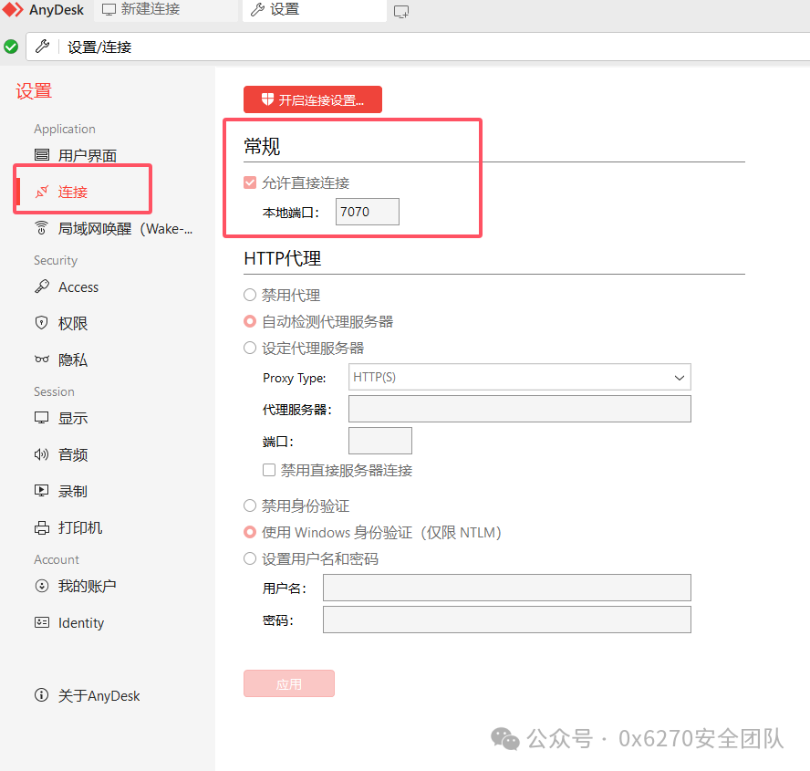
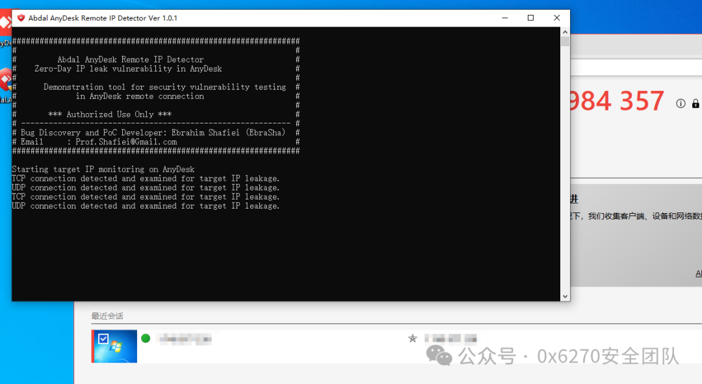
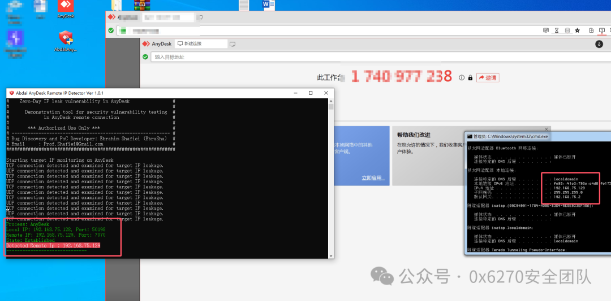

# CVE-2024-52940 AnyDesk信息泄露漏洞复现

<!-- vulwiki-editorial-rebuild:system-misc -->
## 条目范围与校订

- 本文对象：AnyDesk直连地址暴露
- 文献类型：漏洞复现记录
- 版本、权限及部署边界：知道AnyDesk ID、直连配置；是否需要受害者接受会话未明确；测试8.1.0
- 核验状态：仅重建文本校订；未执行文中代码、PoC 或扫描，未把截图或转载声明记为本站复现

### 具体结论与待核项

以下为原归档的逐项勘误与证据缺口；可由文本确定的问题已在下文订正，仍缺来源的事实保持待核。

1. 步骤在建立连接后抓包，不证明仅知道ID即可在未获同意前获得地址；P2P端点可见与越权泄露的边界需厂商说明
2. 直连选项在攻击者还是受害者端启用不清，7070端口、NAT及局域网私有地址与公网地址应拆清
3. 只测8.1.0不能自行外推全部<=8.1.0；2024-11-26暂无修复是历史状态
4. POC改包措辞未给报文/字段，实际仅捕获连接；有GitHub来源但缺厂商回应/CVE登记和明确缓解依据

### 操作风险

原文技术操作的实际副作用未复现核验；按其请求/代码评估状态变更、凭据暴露和业务影响

技术请求、代码与实验方法按原文保留；其中的破坏性动作仅限授权、可恢复的隔离环境。缺失代码、参数或版本事实不猜补。

### 来源追溯

- 原文参考链接（未重新核验）：<https://github.com/ebrasha/abdal-anydesk-remote-ip-detector?tab=readme-ov-file>
- 原始披露 URL 未确认；既有归档来源标签保留，不能替代原始公告

### 归档技术正文

原创 0x6270  0x6270安全团队   2024-11-26 13:00  
  
##   
## 前言  
  
作者：0x6270  
  
由于传播、利用此文所提供的信息而造成的任何直接或者间接的后果及损失，均由使用者本人负责，文章作者不为此承担任何责任。  
  
如果文章中的漏洞出现敏感内容产生了部分影响，请及时联系作者，望谅解。  
## 一、漏洞概况  
### 漏洞简述  
  
AnyDesk是一款由德国公司AnyDesk Software GmbH推出的远程桌面软件。用户可以通过该软件远程控制计算机，同时还能与被控制的计算机之间进行文件传输。  
  
  
  
AnyDesk存在信息泄露漏洞，攻击者可以通过知道受害者的 AnyDesk ID，利用“允许直接连接”功能在网络流量中暴露公共 IP 地址。  
### 漏洞影响范围  
  
**供应商**  
：Anydesk  
  
**产品**  
：Anydesk  
  
**确认受影响版本**  
： Anydesk<= 8.1.0  
  
**修复版本**  
：暂无  
## 二、漏洞复现实战  
### 漏洞复现  
  
以AnyDesk 8.1.0版本为例  
1. 在 AnyDesk 中启用直接连接：在您的系统上打开 AnyDesk，转到设置>连接，然后启用选项允许直接连接。将连接端口设置为 7070。  
  
  
  
1. 启动 PoC 工具：运行 Abdal AnyDesk 远程 IP 检测器工具。  
  
  
  
  
  
1. 输入目标AnyDesk ID：在系统上的AnyDesk应用程序中，输入目标系统的AnyDesk ID。  
  
1. 通过网络流量监控进行 IP 检索：在您的 AnyDesk 中输入目标的 AnyDesk ID 后，PoC 工具会自动侦听您系统上的网络流量，以检测和显示目标的公共 IP 地址。如果两个系统位于同一本地网络中，该工具还将显示目标的私有 IP 地址。  
  
可以看到建立连接后，攻击机POC命令行显示本次连接相关信息，包含靶机IP地址。  
  
  
  
根据POC改包，可以看到存在信息泄露，比较明显是内网IP泄露  
  
链接：  
  
https://github.com/ebrasha/abdal-anydesk-remote-ip-detector?tab=readme-ov-file  
### 漏洞处置  
  
用户可以通过检查AnyDesk的版本号来确定是否受影响，在AnyDesk中查看设置，确认版本信息。  
  
目前没有针对此漏洞的用户端修复程序。要完全解决这个问题，需要 AnyDesk 开发团队的更新或补丁。  
## 结束语  
  
本文主要介绍了CVE-2024-52940 AnyDesk信息泄露漏洞复现过程，漏洞主要利用AnyDesk存在信息泄露，攻击者可以通过知道受害者的 AnyDesk ID，利用“允许直接连接”功能在网络流量中暴露公共 IP 地址。  
  

---

> 来源：gelusus/wxvl（微信公众号漏洞文章自动归档，原始披露 URL 尚未确认，现有链接按来源追溯区分别标注）
