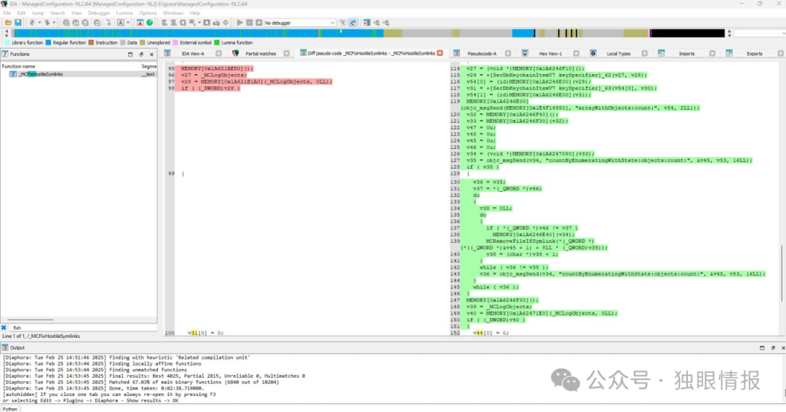

# 苹果CVE-2025-24104漏洞未完全修复，可以读取沙盒外的文件

<!-- vulwiki-editorial-rebuild:system-misc -->
## 条目范围与校订

- 本文对象：iOS备份恢复／ManagedConfiguration
- 文献类型：发现者分析转述
- 版本、权限及部署边界：恶意备份恢复并重启、lockdown及MCInstall访问；设备配对/解锁/备份权限未列
- 核验状态：仅重建文本校订；未执行文中代码、PoC 或扫描，未把截图或转载声明记为本站复现

### 具体结论与待核项

以下为原归档的逐项勘误与证据缺口；可由文本确定的问题已在下文订正，仍缺来源的事实保持待核。

1. 标题未完全修复依据发现者自称保密绕过，正文无复现证据，应标未经独立验证
2. 发现者文件读取与Apple系统文件修改描述存在争议，须并列来源不能直接否定官方范围
3. 任意文件读取受服务权限、数据保护状态、文件格式/返回解析影响，不能无条件外推
4. 补丁时间18.3beta1与正式18.3混用，diff明确22D5034e测试版须单列
5. 保留ifpdz与ipsw-diffs链接；补设备/OS范围和可信lockdown访问前提，迁移动系统

### 操作风险

原文技术操作的实际副作用未复现核验；按其请求/代码评估状态变更、凭据暴露和业务影响

技术请求、代码与实验方法按原文保留；其中的破坏性动作仅限授权、可恢复的隔离环境。缺失代码、参数或版本事实不猜补。

### 来源追溯

- 原文参考链接（未重新核验）：<https://github.com/blacktop/ipsw-diffs/blob/main/18_2_22C152__vs_18_3_22D5034e/DYLIBS/ManagedConfiguration.md>
- 原文参考链接（未重新核验）：<https://github.com/ifpdz/CVE-2025-24104>
- 原始披露 URL 未确认；既有归档来源标签保留，不能替代原始公告

### 归档技术正文

 独眼情报   2025-02-27 01:43  
  
  
# CVE-2025-24104 漏洞分析：沙箱外文件读取  
  
我报告了一个后来被 Apple 标记为 **CVE-2025-24104**  
 的漏洞。在我最初的报告中，我展示了恶意备份如何可以绕过沙箱限制。然而，Apple 的初始描述称这个漏洞可能导致受保护的系统文件被修改。我想澄清一点：这个漏洞实际上允许攻击者读取沙箱外的任意文件。  
## 时间线  
- **发现时间：**  
 2024年4月  
  
- **报告时间：**  
 2024年10月  
  
- **修复时间：**  
 iOS 18.3 beta 1  
  
## 我的发现  
  
当我深入研究这个问题时，我发现该漏洞源于备份恢复过程中缺乏适当的符号链接验证。具体来说，如果你制作一个备份，其中文件  
/private/var/containers/Shared/SystemGroup/systemgroup.com.apple.configurationprofiles/Library/ConfigurationProfiles/CloudConfigurationDetails.plist  
  
被替换为符号链接，系统最终会读取你选择的文件 — 即使该文件位于沙箱之外。  
## 工作原理  
- **缺陷：**  
mc_mobile_tunnel  
 lockdown 服务未能检查 CloudConfigurationDetails.plist  
 是否为符号链接。如果是，该服务会跟随链接，允许攻击者获取任何受限文件的内容。  
  
- **复现步骤：**  
  
- **创建恶意备份：**  
  
我制作了一个备份，其中 CloudConfigurationDetails.plist  
 是指向任何受限文件的符号链接。  
  
- **恢复备份：**  
  
我在设备上恢复了这个备份并重启。  
  
- **利用漏洞：**  
  
使用 lockdown 连接，我向 com.apple.mobile.MCInstall  
 服务发送 GetCloudConfiguration  
 命令。服务返回的不是预期的文件内容，而是我的符号链接指向的文件内容。  
  
## 重要性  
  
读取沙箱外任意文件的能力是一个严重问题。这意味着应当受到保护的敏感系统数据可能会暴露给攻击者。这不仅仅是一个小漏洞 — 它是备份处理方式中的基本安全缺陷。  
## 我的修复建议  
  
要修复这个问题，备份恢复过程需要更严格的检查：  
- **符号链接验证：**  
  
在读取任何文件（如 CloudConfigurationDetails.plist  
）之前，服务应验证它是常规文件而非符号链接。如果是符号链接，恢复过程应拒绝它或安全处理。  
  
- **沙箱强制执行：**  
  
加强沙箱限制，使得即使跟随符号链接，也不能指向预期区域之外的文件。  
  
## 补丁详情  
  
随着 **iOS 18.3**  
 的发布，Apple 在 **ManagedConfiguration**  
 框架中引入了额外检查，以移除在 ConfigurationProfiles  
 文件夹中发现的任何符号链接。具体而言：  
- 新增了一个名为 MCRemoveFileIfSymlink  
 的函数。  
  
- 该函数由 MCFixHostileSymlinks  
 调用。  
  
- 每当 ConfigurationProfiles  
 文件夹中的文件被识别为符号链接时，它会立即被删除。  
  
你可以在这里查看 **bindiff**  
 详情：  
  
https://github.com/blacktop/ipsw-diffs/blob/main/18_2_22C152__vs_18_3_22D5034e/DYLIBS/ManagedConfiguration.md  
  
以下是我自己的差异对比截图，显示了新增检查的位置：  
  
  
  
显示补丁的截图  
### 关于缓解措施的有效性说明  
  
值得一提的是，这个新的缓解措施**并没有100%修复问题**  
。我已经找到了一种绕过它的方法，因为 Apple 没有实施我建议的修复方案，但我会对这些细节保密。  
  
这是我对 **CVE-2025-24104**  
 的个人解析，强调 Apple 的原始描述没有抓住要点。真正的风险是未经授权读取沙箱外的文件，而不是修改系统文件。  
  
**漏洞发现者：Hichem Maloufi (ifpdz)**  
  
原文见：  
>   
> https://github.com/ifpdz/CVE-2025-24104  
  
  
  

---

> 来源：gelusus/wxvl（微信公众号漏洞文章自动归档，原始披露 URL 尚未确认，现有链接按来源追溯区分别标注）
