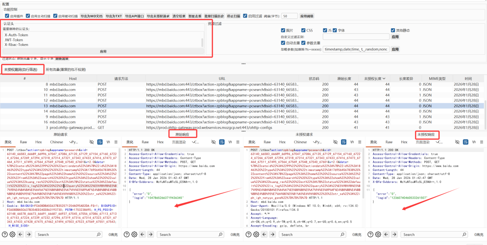
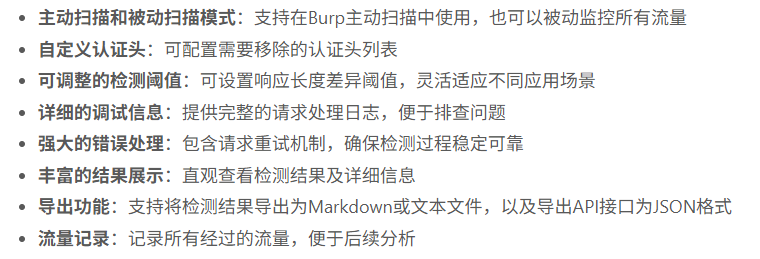
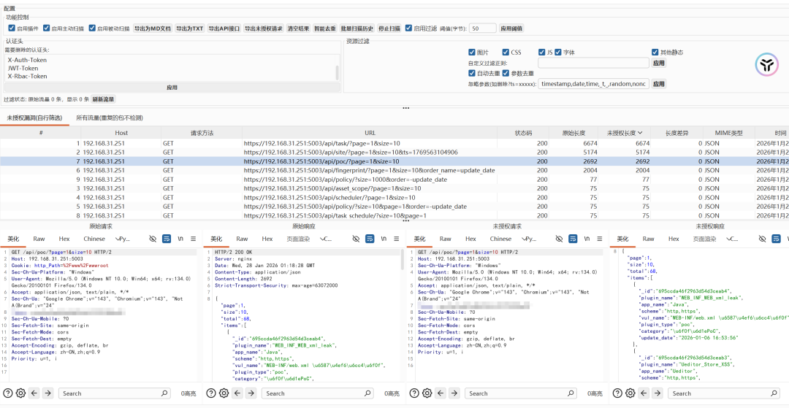
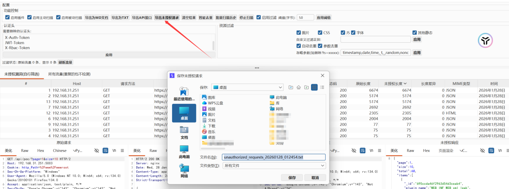
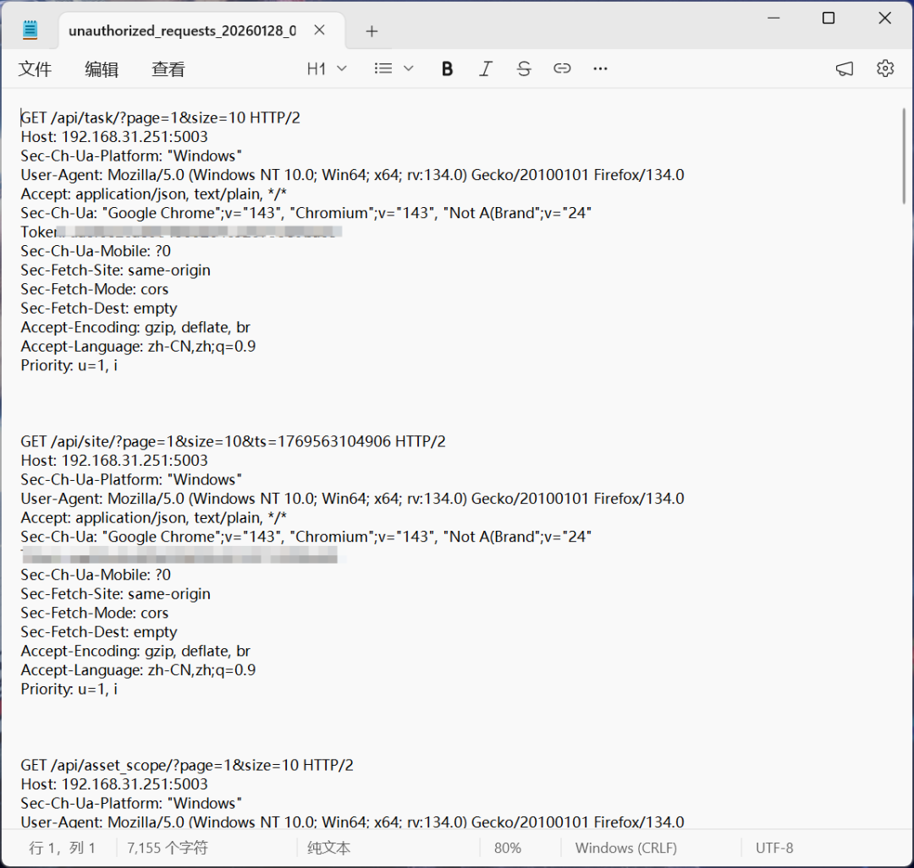

# Burp Suite  Web未授权访问漏洞检测插件

<!-- vulwiki-editorial-rebuild:system-misc -->
## 条目范围与校订

- 本文对象：Burp Suite未授权访问检测扩展
- 文献类型：安全工具介绍
- 版本、权限及部署边界：需要Burp扩展/API兼容与JAR运行环境；移除鉴权头并对比响应属于主动重放
- 核验状态：仅重建文本校订；未执行文中代码、PoC 或扫描，未把截图或转载声明记为本站复现

### 具体结论与待核项

以下为原归档的逐项勘误与证据缺口；可由文本确定的问题已在下文订正，仍缺来源的事实保持待核。

1. 这是检测插件不是Burp Suite本身漏洞，迁工具目录，不能据标题生成产品漏洞
2. 所谓被动模式仍描述移除头重放请求，应披露额外请求和POST/PUT/DELETE副作用，状态码/长度相似只能线索不是确认越权
3. 未处理请求体/URL令牌、缓存、动态页面等鉴权和误报条件，智能判断不等于语义验证
4. 没有公开仓库/Release/哈希/作者可追溯下载，只让公众号回复关键词；安装前真实性无法核验
5. 导出格式丢方法/头/令牌等上下文且可能含敏感数据，需说明；大量推广和重复效果图

### 操作风险

所谓被动模式仍描述移除头重放请求，应披露额外请求和POST/PUT/DELETE副作用，状态码/长度相似只能线索不是确认越权

技术请求、代码与实验方法按原文保留；其中的破坏性动作仅限授权、可恢复的隔离环境。缺失代码、参数或版本事实不猜补。

### 来源追溯

- 原文参考链接（未重新核验）：<https://mp.weixin.qq.com/s?__biz=Mzk0ODM0NDIxNQ==&mid=2247496244&idx=1&sn=e542fc8c3097f9d5ea2e17b6c3c04028&scene=21#wechat_redirect>
- 原文参考链接（未重新核验）：<https://mp.weixin.qq.com/s?__biz=Mzk0ODM0NDIxNQ==&mid=2247496237&idx=1&sn=a6ae0ce228701005bfb51116a83430bb&scene=21#wechat_redirect>
- 原文参考链接（未重新核验）：<https://mp.weixin.qq.com/s?__biz=Mzk0ODM0NDIxNQ==&mid=2247496226&idx=1&sn=ecafcf54d1f1045ba48d79fa9a93c017&scene=21#wechat_redirect>
- 原文参考链接（未重新核验）：<https://mp.weixin.qq.com/s?__biz=Mzk0ODM0NDIxNQ==&mid=2247496206&idx=1&sn=2f66c041839790707f33a08c7a846352&scene=21#wechat_redirect>
- 原文参考链接（未重新核验）：<https://mp.weixin.qq.com/s?__biz=Mzk0ODM0NDIxNQ==&mid=2247496195&idx=1&sn=f2688674fc322b4513d7895fdbde7aa6&scene=21#wechat_redirect>
- 原始披露 URL 未确认；既有归档来源标签保留，不能替代原始公告

### 归档技术正文

sh2493770457
                    sh2493770457  夜组安全   2026-02-04 00:04  
  
免责声明  
  
由于传播、利用本公众号夜组安全所提供的信息而造成的任何直接或者间接的后果及损失，均由使用者本人负责，公众号夜组安全及作者不为此承担任何责任，一旦造成后果请自行承担！如有侵权烦请告知，我们会立即删除并致歉。谢谢！  
**所有工具安全性自测！！！VX：**  
**NightCTI**  
  
朋友们现在只对常读和星标的公众号才展示大图推送，建议大家把  
**夜组安全**  
“**设为星标**  
”，  
否则可能就看不到了啦！  
  
  
  
  
## 工具介绍  
  
这是一个Burp Suite扩展工具，用于自动检测Web应用程序中的未授权访问漏洞。  
  
  
## 功能介绍  
  
未授权访问漏洞是Web应用中常见的安全问题，当应用程序未正确验证用户权限就允许访问敏感资源时，就会出现这类漏洞。本插件通过以下方式检测这类漏洞：  
1. **自动移除认证头**  
：从HTTP请求中移除认证相关的头部信息（如 Authorization、Cookie、X-Auth-Token 等）  
  
1. **比较响应差异**  
：分析原始响应与未授权响应的内容差异  
  
1. **智能判断漏洞**  
：根据响应状态码、响应长度等因素自动判断是否存在未授权访问漏洞  
  
## 主要特性  
  
  
## 安装方法  
1. 下载最新的release版本JAR文件（unauthorized-access-detector-1.0-shaded.jar  
）  
  
1. 打开Burp Suite，进入Extender > Extensions  
  
1. 点击"Add"按钮，选择下载的JAR文件  
  
1. 成功加载后，在顶部标签中会出现"Unauthorized Scan"选项卡  
  
## 使用说明  
### 基本配置  
1. 在"需要删除的认证头"文本框中配置要移除的认证头（每行一个）  
  
1. 设置响应长度差异阈值（默认50字节）  
  
1. 选择是否启用主动扫描、被动扫描等功能  
  
### 检测未授权访问漏洞  
  
**被动扫描模式**  
：  
- 启用"启用插件"和"启用被动扫描"选项  
  
- 正常浏览目标应用，插件会自动检测所有经过的流量  
  
**主动扫描模式**  
：  
- 启用"启用插件"和"启用主动扫描"选项  
  
- 在Burp Scanner中进行主动扫描时，插件会自动运行检测  
  
### 查看结果  
- "未授权漏洞"选项卡显示检测到的漏洞  
  
- "所有流量"选项卡记录所有经过的流量及其未授权测试结果  
  
- 选择列表中的项目可在下方查看详细的请求和响应信息  
  
### 导出结果  
- 点击"导出为MD文档"按钮可将结果以Markdown格式导出  
  
- 点击"导出为TXT"按钮可将结果以文本格式导出  
  
- 点击"导出API接口"按钮可将检测到的未授权漏洞接口以JSON格式导出，格式与api.json一致  
  
#### API接口导出格式说明  
  
导出的JSON文件格式如下：  
- GET请求：{"url": null}  
  
- POST/PUT/DELETE等有请求体的接口：{"url": {"参数1": "值1", "参数2": "值2"}}  
  
- 支持多种Content-Type：  
  
- application/json  
：导出为_json_body  
字段  
  
- application/x-www-form-urlencoded  
：解析表单参数  
  
- multipart/form-data  
：导出为_multipart_body  
字段  
  
- 其他格式：导出为_raw_body  
字段  
  
  
## 使用效果  
  
  
  
  
  
  
  
  
  
  
## 工具获取  
  
  
  
点击关注下方名片  
进入公众号  
  
回复关键字【  
260204  
】获取  
下载链接  
  
  
## 往期精彩  
  
  
[一个专为渗透测试和安全评估设计的资产管理平台，提供强大的数据聚合、关系分析和可视化能力2026-02-03](https://mp.weixin.qq.com/s?__biz=Mzk0ODM0NDIxNQ==&mid=2247496244&idx=1&sn=e542fc8c3097f9d5ea2e17b6c3c04028&scene=21#wechat_redirect)  
[基于腾讯云函数 (SCF) 的分布式 IP 代理池。用于绕过 WAF IP限制，支持安全扫描工具调用2026-02-02](https://mp.weixin.qq.com/s?__biz=Mzk0ODM0NDIxNQ==&mid=2247496237&idx=1&sn=a6ae0ce228701005bfb51116a83430bb&scene=21#wechat_redirect)  
[一个专为 AWD/AWDP 设计的竞赛自动化平台，提供 IP探测、WebShell 管理、SSH 终端、基线加固、Flag 读取等核心功能2026-01-30](https://mp.weixin.qq.com/s?__biz=Mzk0ODM0NDIxNQ==&mid=2247496226&idx=1&sn=ecafcf54d1f1045ba48d79fa9a93c017&scene=21#wechat_redirect)  
[一款专为红队渗透测试人员和安全研究员设计的自动化信息泄露侦察工具。2026-01-29](https://mp.weixin.qq.com/s?__biz=Mzk0ODM0NDIxNQ==&mid=2247496206&idx=1&sn=2f66c041839790707f33a08c7a846352&scene=21#wechat_redirect)  
[GUI | CVE-2026-24061  telnetd 身份验证绕过漏洞检测与利用工具2026-01-28](https://mp.weixin.qq.com/s?__biz=Mzk0ODM0NDIxNQ==&mid=2247496195&idx=1&sn=f2688674fc322b4513d7895fdbde7aa6&scene=21#wechat_redirect)  
  
  
  
  

---

> 来源：gelusus/wxvl（微信公众号漏洞文章自动归档，原始披露 URL 尚未确认，现有链接按来源追溯区分别标注）
