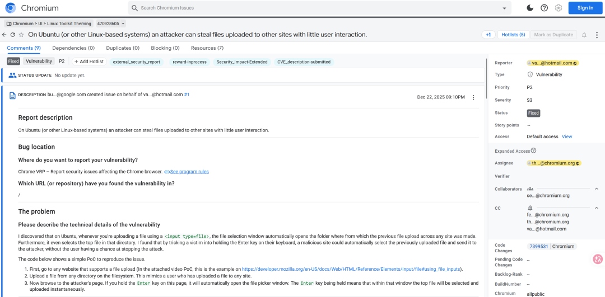

# Chrome新bug 恶意网站可以0.5 click窃取用户之前上传的文件，漏洞赏金$1000

<!-- vulwiki-editorial-rebuild:system-misc -->
## 条目范围与校订

- 本文对象：Chrome Linux文件选择器
- 文献类型：漏洞新闻与交互攻击说明
- 版本、权限及部署边界：诱导长按Enter；Linux/Ubuntu文件选择器近期文件与焦点状态；文称145.0.7632.45修复
- 核验状态：仅重建文本校订；未执行文中代码、PoC 或扫描，未把截图或转载声明记为本站复现

### 具体结论与待核项

以下为原归档的逐项勘误与证据缺口；可由文本确定的问题已在下文订正，仍缺来源的事实保持待核。

1. 0.5click是非正式名称，不能改写成精确0.5秒或零交互；键盘重复确认不等于鼠标双击，真实交互时序须原报告确认
2. 从文件选择器近期文件推广为能调取所有曾在其他网站上传文件过宽，缓存、默认选择及文件仍存在等条件未交代
3. 明确Linux受影响却理论推断其他OS风险，需标未知而不放入确认范围
4. 前称低风险后Google Medium，评级归属混乱；有Chromiumissue直接来源，缺正式版本公告/RedHat链接
5. input HTML标签未转义可能被渲染吞掉；删除社区推广，新闻不需伪造PoC

### 操作风险

原文技术操作的实际副作用未复现核验；按其请求/代码评估状态变更、凭据暴露和业务影响

技术请求、代码与实验方法按原文保留；其中的破坏性动作仅限授权、可恢复的隔离环境。缺失代码、参数或版本事实不猜补。

### 来源追溯

- 原文参考链接（未重新核验）：<https://issues.chromium.org/issues/470928605>
- 原始披露 URL 未确认；既有归档来源标签保留，不能替代原始公告

### 归档技术正文

原创 助力行业的
                    助力行业的  李白你好   2026-04-19 09:09  
  
## 🎯 一句话速览  
  
一个编号为CVE-2026-2322  
的Chrome浏览器漏洞被发现，它可以让一个精心设计的恶意网站，在你**长按回车键**  
的瞬间，悄无声息地窃取你之前在其他网站上上传过的文件。由于其利用了简单的键盘操作，该手法也被戏称为 **“0.5点击”攻击**  
。  
```
https://issues.chromium.org/issues/470928605
```  
  
  
## ⚙️ 攻击手法：一次简单的“按键模仿”  
- **精心设计的陷阱**  
：当你访问一个恶意网站时，该网站会通过JavaScript动态创建一个文件上传按钮（<input type="file">  
），并强制让这个按钮处于页面的激活状态。  
  
- **完美的“替身”**  
：同时，网站会伪造一个诱饵按钮，比如“点击参与抽奖”或“领取优惠券”，并利用页面布局或视觉欺骗，让你以为自己在点击这个假按钮。但实际上，你点击的却是那个隐藏的、真实的文件上传按钮。  
  
- **关键的0.5秒**  
：最关键的一步来了——文件上传按钮被点击后，会弹出一个系统文件选择窗口。此时，如果你正巧按着回车键（Enter键），浏览器会默认将这个回车操作理解成用户对“确认选择”按钮的“双击”，从而自动确认并上传文件，无需你进行任何额外的鼠标点击。  
  
**总结一下：你长按的回车键，被漏洞利用，直接“批准”了恶意网站上传文件的操作。**  
  
  
## ⚠️ 你的什么文件最危险？  
  
该漏洞主要威胁的是你曾在浏览器中上传过的文件，这些文件的路径通常会被浏览器缓存。攻击者通过上述技巧，可以直接调取这些“历史记录”中的文件。具体来说，最危险的文件包括：  
- **网站配置文件**  
：如 .env  
、config.php  
 等，它们可能包含数据库密码、API密钥等核心凭证，是黑客窃取的首选目标。  
  
- **用户数据文件**  
：如 .csv  
、.xlsx  
 等数据导出文件，可能包含大量用户个人信息或业务数据。  
  
- **脚本文件**  
：如 .sh  
、.py  
 等，一旦被篡改或分析，可能被用于后续的渗透攻击。  
  
- **任何你在网页上提交过的文件**  
：比如你上传到网盘、社交媒体、在线办公软件的图片、文档等，都有可能被恶意网站利用此漏洞尝试窃取。  
  
## 🌍 谁最受影响？  
  
该漏洞（CVE-2026-2322）主要影响了**在Ubuntu或其他Linux发行版上运行的Chrome浏览器**  
，但理论上其他操作系统也存在一定风险。鉴于Chrome的庞大用户群体，该漏洞的影响范围十分广泛。  
## 🛡️ 如何修复？立即行动！  
  
该漏洞已在Chrome 145.0.7632.45及更高版本中得到修复。  
  
**🔧 立即检查更新：**  
1. 打开Chrome浏览器，点击右上角的“三个点”菜单。  
  
1. 选择“**帮助**  
” -> “**关于Google Chrome**  
”。  
  
1. 浏览器会自动检查更新，如有新版本，请立即**重启浏览器**  
完成更新。  
  
## 💡 反思与建议  
  
这个“低”风险的漏洞被谷歌开出了$1000美金的赏金，它提醒我们：**即使是被评定为低风险的漏洞，也可能造成严重的数据泄露。**  
 更值得注意的是，Red Hat等安全机构对此漏洞给出了“**Moderate**  
”（中等）的威胁评级，谷歌的Chromium安全团队也将其标记为“**Medium**  
”（中等）风险，这进一步印证了其潜在威胁不容小觑。  
  
除了更新浏览器，你还应培养良好的上网习惯：  
- 在点击任何链接前，都仔细检查其真实目的。  
  
- 不要轻易在不可信的网站上按住回车键。  
  
- 为你的操作系统和浏览器开启“自动更新”功能。  
  
## 网络安全情报攻防站  
  
**www.libaisec.com**  
  
综合性的技术交流与资源共享社区  
  
专注于红蓝对抗、攻防渗透、威胁情报、数据泄露  
  
  
  
  


---

> 来源：gelusus/wxvl（微信公众号漏洞文章自动归档，原始披露 URL 尚未确认，现有链接按来源追溯区分别标注）
