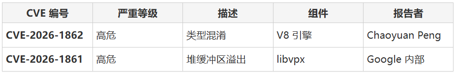

# Chrome漏洞可导致攻击者执行任意代码并引发系统崩溃

<!-- vulwiki-editorial-rebuild:system-misc -->
## 条目范围与校订

- 本文对象：Chrome V8/libvpx
- 文献类型：双漏洞更新新闻
- 版本、权限及部署边界：恶意网页/视频；144.0.7559.132/.133；沙箱内执行
- 核验状态：仅重建文本校订；未执行文中代码、PoC 或扫描，未把截图或转载声明记为本站复现

### 具体结论与待核项

以下为原归档的逐项勘误与证据缺口；可由文本确定的问题已在下文订正，仍缺来源的事实保持待核。

1. 与邑安全篇正文基本相同且同CyberSecurityNews链接，非独立研究
2. 漏洞表仅截图未视检，比同组文本表信息可检索性差，合并选文本表保留
3. 元数据空、系统崩溃标题过强、未披露在野状态须保留；空推荐链接/小标题/广告删除

### 操作风险

元数据空、系统崩溃标题过强、未披露在野状态须保留；空推荐链接/小标题/广告删除

技术请求、代码与实验方法按原文保留；其中的破坏性动作仅限授权、可恢复的隔离环境。缺失代码、参数或版本事实不猜补。

### 来源追溯

- 原文参考链接（未重新核验）：<https://cybersecuritynews.com/chrome-vulnerabilities-arbitrary-code-2/>
- 原文参考链接（未重新核验）：<https://mp.weixin.qq.com/s?__biz=MjM5NjA0NjgyMA==&mid=2651334777&idx=1&sn=e052da512a608ee2d0ee20b662e93404&scene=21#wechat_redirect>
- 原始披露 URL 未确认；既有归档来源标签保留，不能替代原始公告

### 归档技术正文

 FreeBuf   2026-02-05 10:05  
  
  
  
  
  
  
Google 已针对 Chrome 稳定版发布关键安全更新，修复了两个高危漏洞，这些漏洞可能导致用户遭受任意代码执行（ACE）和拒绝服务（DoS）攻击。  
  
  
本次更新将 Windows 和 macOS 版本升级至 144.0.7559.132/.133，Linux 版本升级至 144.0.7559.132。这家科技巨头确认，更新将在未来数日或数周内逐步推送。这些补丁专门修复了浏览器 JavaScript 引擎和视频处理库中的内存损坏问题。  
  
  
**Part01**  
## 漏洞详情  
  
  
更新修复了两个被归类为"高危"的安全缺陷。成功利用这些漏洞通常需要用户访问特制网站，从而在浏览器渲染进程中触发攻击。  
  
  
CVE-2026-1862：V8 引擎类型混淆漏洞  
  
  
最严重的漏洞存在于 Google 开源的高性能 JavaScript 和 WebAssembly 引擎 V8 中。当引擎被诱骗使用不兼容的类型访问内存资源时（例如将整数视为指针），就会发生类型混淆漏洞。  
  
  
攻击者经常利用 V8 类型混淆漏洞来操控内存指针。这种操控允许他们越界读取或写入内存，可能导致在沙箱环境中执行任意代码。该漏洞由研究员 Chaoyuan Peng（@ret2happy）报告。  
  
  
CVE-2026-1861：libvpx 堆缓冲区溢出漏洞  
  
  
第二个漏洞存在于 VP8 和 VP9 视频编码格式的参考软件库 libvpx 中。当进程尝试向固定长度的内存缓冲区写入超过其容量的数据时，就会发生堆缓冲区溢出。  
  
  
在此情况下，攻击者可在网页中嵌入畸形视频流。当 Chrome 尝试使用 libvpx 处理该视频时，溢出可能损坏堆上的相邻内存。这通常会导致浏览器崩溃（DoS），但也可与其他漏洞利用链结合实现代码执行。  
  
  
**Part02**  
## 漏洞信息表  
  
  
  
  
  
**Part03**  
## 缓解措施  
  
  
Google 未披露这些漏洞是否已被实际利用（0Day 状态），在大多数用户完成更新前将限制漏洞细节公开。但鉴于 V8 和堆溢出漏洞的性质，武器化风险仍然很高。  
  
  
建议企业管理员和用户立即更新。验证安装步骤如下：  
  
1. 打开 Chrome 并导航至菜单 > 帮助 > 关于 Google Chrome  
  
1. 确保浏览器检查更新并重启至 144.0.7559.132 或更高版本  
  
**参考来源：**  
  
Chrome Vulnerabilities Let Attackers Execute Arbitrary Code and Crash System  
  
https://cybersecuritynews.com/chrome-vulnerabilities-arbitrary-code-2/  
  
  
###   
###   
###   
  
**推荐阅读**  
  
  
  
  
### 电台讨论  
  
  
  
  
****  
  
  
  
  

---

> 来源：gelusus/wxvl（微信公众号漏洞文章自动归档，原始披露 URL 尚未确认，现有链接按来源追溯区分别标注）
