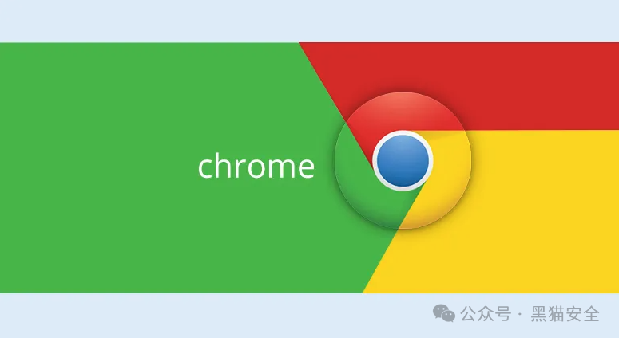

# 谷歌解决了三月份 Pwn2Own 比赛中利用的另一个 Chrome 零日漏洞

<!-- vulwiki-editorial-rebuild:system-misc -->
## 条目范围与校订

- 本文对象：Chrome V8/Bookmarks
- 文献类型：竞赛漏洞及补丁新闻
- 版本、权限及部署边界：Chrome123.0.6312.105/.106/.107；恶意HTML；3159竞赛验证渲染器执行
- 核验状态：仅重建文本校订；未执行文中代码、PoC 或扫描，未把截图或转载声明记为本站复现

### 具体结论与待核项

以下为原归档的逐项勘误与证据缺口；可由文本确定的问题已在下文订正，仍缺来源的事实保持待核。

1. 元数据只有3159，当前另两修复需关联，2886/2887/0519是历史背景
2. 写3月22日又称比赛第二天，日期/赛程需核对；奖励和成功叙述重复一次
3. 原文明确渲染器任意代码执行，不能上升到完整系统；UAF译成使用后释放方向错误
4. 缺所有Chrome/ZDI原链接，版本三个尾号要逐平台/通道精确对应；无PoC正常为新闻

### 操作风险

原文技术操作的实际副作用未复现核验；按其请求/代码评估状态变更、凭据暴露和业务影响

技术请求、代码与实验方法按原文保留；其中的破坏性动作仅限授权、可恢复的隔离环境。缺失代码、参数或版本事实不猜补。

### 来源追溯

- 原始披露 URL 未确认；既有归档来源标签保留，不能替代原始公告

### 归档技术正文

鹏鹏同学  黑猫安全   2024-04-04 13:00  
  
  
  
谷歌已经解决了Chrome浏览器中的另一个零日漏洞，该漏洞被标识为CVE-2024-3159，于2024年3月在Pwn2Own黑客大赛中被利用。CVE-2024-3159漏洞是V8 JavaScript引擎中的越界内存访问。该漏洞由Palo Alto Networks的Edouard Bochin (@le_douds)和Tao Yan (@Ga1ois)在2024年3月22日的Pwn2Own 2024比赛中展示。这对组合展示了他们针对谷歌Chrome和微软Edge的漏洞利用，赢得了42500美元和9个Master of Pwn积分。@le_douds和@Ga1ois来自Palo Alto使用了OOB读取加上一种新颖的技术来击败V8硬化，从而在渲染器中获得任意代码执行。他们成功利用了相同的漏洞攻击了#Chrome和#Edge，赢得了42500美元和9个Master of Pwn积分。  
  
远程攻击者可以利用这个问题欺骗受害者访问一个特别设计的HTML页面，以访问超出内存缓冲区的数据，触发堆破坏。利用可能导致敏感信息的泄露或崩溃。Palo Alto Networks的安全研究人员Edouard Bochin和Tao Yan在Pwn2Own Vancouver 2024的第二天展示了这个零日漏洞，以击败V8硬化。  
  
来自Chrome团队的发布更新表示：“稳定频道已更新至123.0.6312.105/.106/.107，适用于Windows和Mac，以及123.0.6312.105到Linux，将在未来几天/几周内推出。”  
  
这家IT巨头还解决了以下问题：  
  
[$7000][329130358]高危CVE-2024-3156：V8中不当的实现。由Zhenghang Xiao (@Kipreyyy)于2024年03月12日报告  
  
[$3000][329965696]高危CVE-2024-3158：书签中使用后释放。由undoingfish于2024年03月17日报告  
  
在三月底，谷歌解决了Chrome浏览器中的几个漏洞，其中包括在Pwn2Own Vancouver 2024黑客大赛期间展示的两个零日漏洞，分别是CVE-2024-2886和CVE-2024-2887。  
  
高危漏洞CVE-2024-2886是WebCodecs中的使用后释放问题。该漏洞由KAIST Hacking Lab的Seunghyun Lee (@0x10n)在Pwn2Own 2024中展示。  
  
高危漏洞CVE-2024-2887是WebAssembly中的类型混淆问题。Manfred Paul在Pwn2Own 2024期间展示了这个漏洞。  
  
在一月份，谷歌解决了今年首个Chrome零日漏洞，该漏洞正在野外被积极利用。这个高危漏洞，标识为CVE-2024-0519，是Chrome JavaScript引擎中的越界内存访问。该漏洞于2024年1月11日由匿名人士报告。  
  
  

---

> 来源：gelusus/wxvl（微信公众号漏洞文章自动归档，原始披露 URL 尚未确认，现有链接按来源追溯区分别标注）
