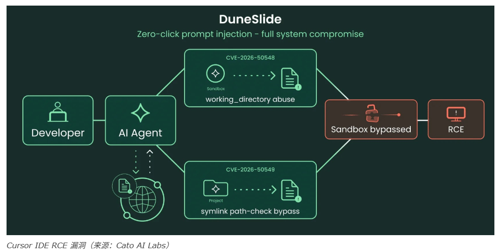

# Cursor IDE 远程代码执行漏洞允许零点击注入提示符

<!-- vulwiki-editorial-rebuild:system-misc -->
## 条目范围与校订

- 本文对象：Cursor IDE沙箱与路径校验
- 文献类型：双漏洞AI代理新闻
- 版本、权限及部署边界：Cursor2.x；代理读取不可信MCP/搜索内容；LLM可控工作目录/符号链接；macOS用户可写目标路径
- 核验状态：仅重建文本校订；未执行文中代码、PoC 或扫描，未把截图或转载声明记为本站复现

### 具体结论与待核项

以下为原归档的逐项勘误与证据缺口；可由文本确定的问题已在下文订正，仍缺来源的事实保持待核。

1. 元数据漏50549；工作目录写权限和规范化失败回退是两独立缺陷，需各自实体
2. 零点击不等没有用户工作流：用户发起提示并启用自动沙箱执行是前提，未区分无后续确认与零交互
3. 覆盖cursorsandbox或.zshrc受当前用户权限/安装所有权限制，不能自动称最高特权/任意系统文件；连接SaaS受凭据权限限制
4. 无准确受影响/修复版本、Cato原研究、厂商公告或PoC来源；9.8及财富500数据待验证
5. 提示注入误译注入提示符/快速注入，机制名应统一

### 操作风险

覆盖cursorsandbox或.zshrc受当前用户权限/安装所有权限制，不能自动称最高特权/任意系统文件；连接SaaS受凭据权限限制

技术请求、代码与实验方法按原文保留；其中的破坏性动作仅限授权、可恢复的隔离环境。缺失代码、参数或版本事实不猜补。

### 来源追溯

- 原始披露 URL 未确认；既有归档来源标签保留，不能替代原始公告

### 归档技术正文

网络安全9527
                    网络安全9527  安全圈的那点事儿   2026-07-02 03:01  
  
Cursor IDE 中存在两个严重的远程代码执行 (RCE) 漏洞，Cursor IDE 是超过一半财富 500 强公司使用的 AI 驱动型开发环境。  
  
Cato AI Labs 披露了两个漏洞，称为“DuneSlide”，这两个漏洞的 CVSS 严重性评分均为 9.8，并分别被分配了 CVE-2026-50548 和 CVE-2026-50549，允许攻击者完全突破 Cursor 的沙箱。  
  
这些漏洞表明，提示注入攻击不仅限于操纵 LLM 的输出，还可以深入到以前从未被视为攻击面一部分的经典代码路径中。  
  
利用此漏洞，攻击者可以覆盖关键系统文件，例如 cursorsandbox 二进制文件，将沙盒终端命令转换为完全非沙盒远程代码执行 (RCE)，从而危及本地计算机和连接的 SaaS 工作区。  
  
这两个漏洞都是在没有任何用户权限或故意交互的情况下触发的；受害者只需要发出一个看似无害的提示，该提示会无意中从不受信任的来源（例如MCP 服务器响应或被污染的 Web 搜索结果）接收攻击者控制的内容。  
  
  
  
Cursor 2.x 会在沙箱内自动运行代理终端命令，无需提示批准，这种设计旨在减少审批疲劳，同时限制简单的提示注入所能造成的后果。  
### 漏洞#1：工作目录操纵  
  
CVE-2026-50548 源于 Cursor 沙箱授予命令工作目录写入权限的方式。由于 working_directory 是 run_terminal_cmd 工具的一个可选的、由 LLM 控制的参数，因此注入提示符可以诱使代理将其设置为攻击者选择的位于项目根目录之外的路径。  
  
这使得攻击者可以写入敏感位置，包括位于 /Applications/Cursor.app/Contents/Resources/app/resources/helpers/cursorsandbox 的 cursorsandbox 助手，或 ~/.zshrc 和 ~/Library/LaunchAgents 等文件，从而使沙箱限制失效，无法执行同一注入中的后续命令。  
### 漏洞#2：符号链接规范化绕过  
  
CVE-2026-50549 是 Cursor 路径解析逻辑中的一个独立缺陷。通过提示注入，可以指示代理在项目目录内创建一个指向外部文件的符号链接；当 Cursor 的规范化步骤失败时（例如，由于目标文件不存在或缺少读取权限），代理会回退到信任原始的、未经验证的符号链接路径。  
  
这样可以绕过越界写入检查，使攻击者能够通过符号链接覆盖同一个 cursorsandbox 助手，并在没有任何用户交互的情况下实现特权远程代码执行。  
  
DuneSlide 强调，仅靠沙箱无法阻止自主编码代理，因为参数验证和路径解析边缘情况仍然可以通过快速注入来利用。  
  

---

> 来源：gelusus/wxvl（微信公众号漏洞文章自动归档，原始披露 URL 尚未确认，现有链接按来源追溯区分别标注）
