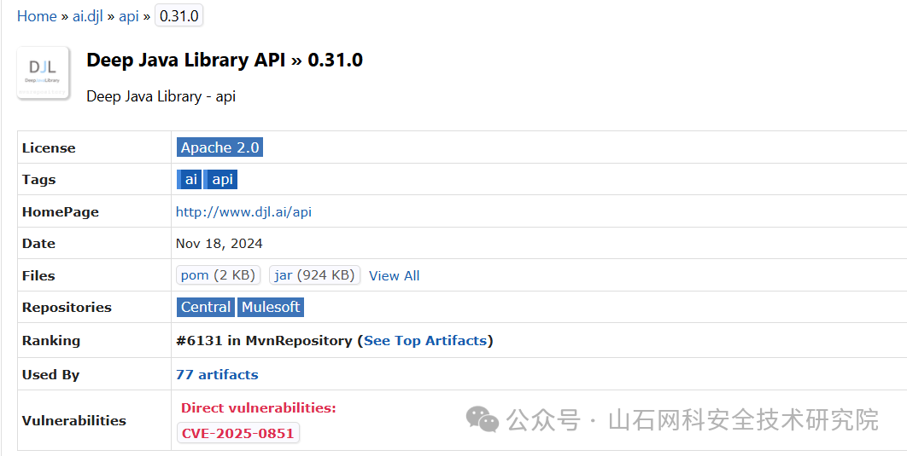
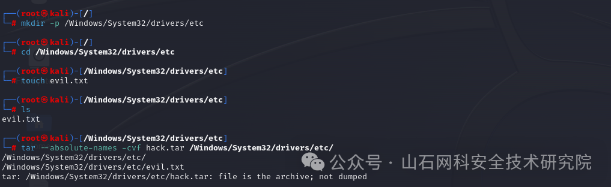
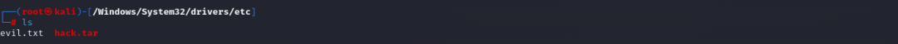
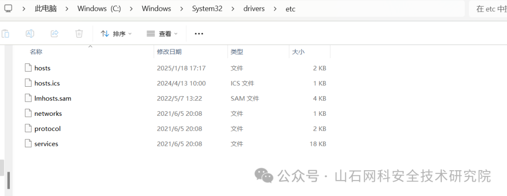
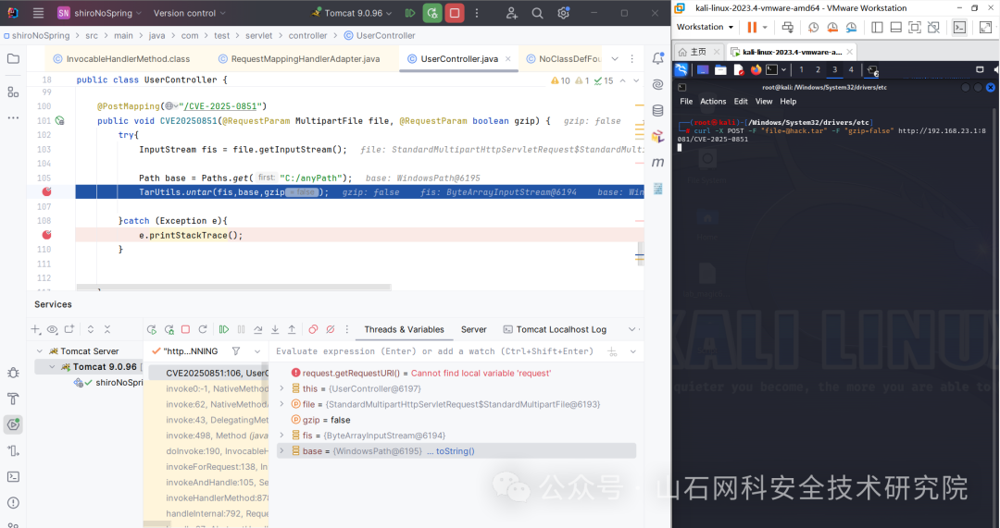
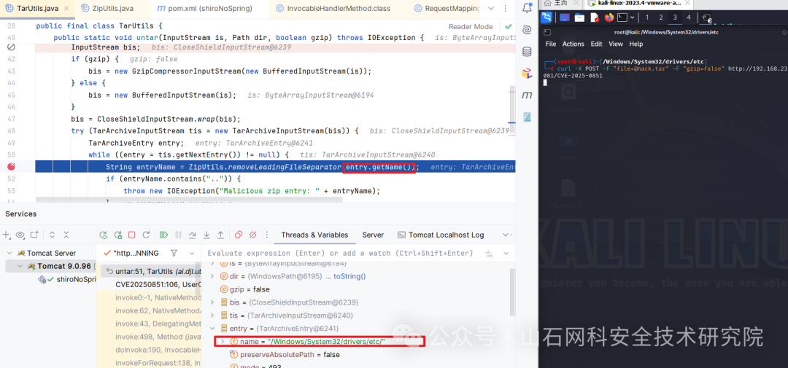
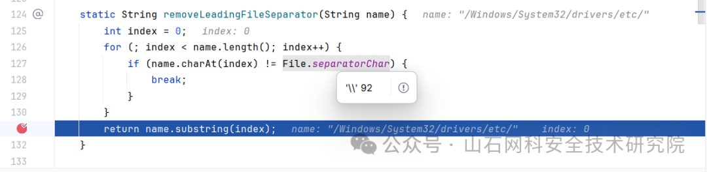
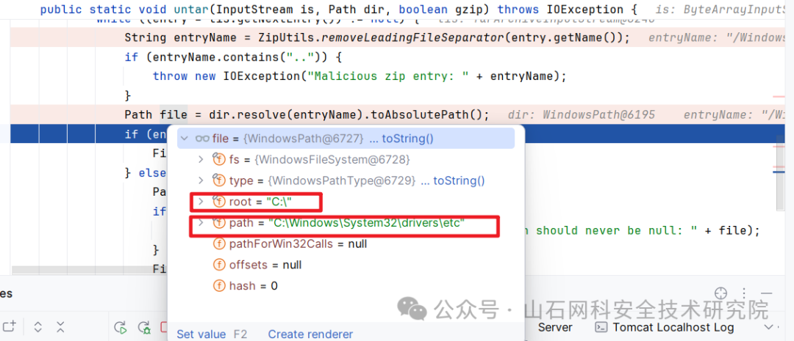
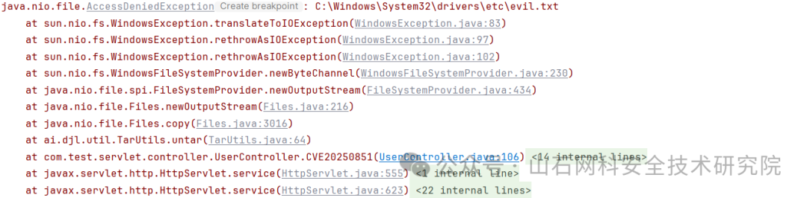
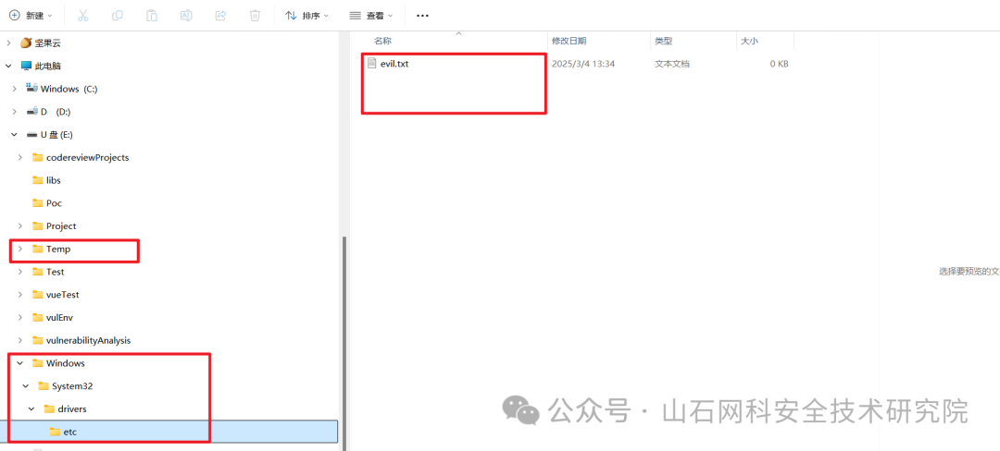

# Deep Java Library (DJL) CVE-2025-0851 漏洞复现与深度剖析

<!-- vulwiki-editorial-rebuild:system-misc -->
## 条目范围与校订

- 本文对象：Deep Java Library Tar/Zip提取工具
- 文献类型：实验复现与原理分析
- 版本、权限及部署边界：DJL0.31.0测试、<0.31.1；攻击者控制模型归档条目；应用主动提取且进程有目标写权限
- 核验状态：仅重建文本校订；未执行文中代码、PoC 或扫描，未把截图或转载声明记为本站复现

### 具体结论与待核项

以下为原归档的逐项勘误与证据缺口；可由文本确定的问题已在下文订正，仍缺来源的事实保持待核。

1. 需要不同OS制作归档被写成必需条件，根因是归档路径格式与解压端解析差异，恶意条目可手工构造不必实际跨机器
2. Windows根相对路径与带盘符绝对路径需区分；文称反方向也成功但无Mac/Linux实验过程，引用公告不能当本篇实测
3. 自建Spring上传端点不是DJL自带未授权远程API，应明确部署鉴权取决于宿主应用
4. 第一次权限失败与换E盘路径成功有助表明边界，不能扩大为任意系统文件无权限写入
5. tar构造、最终文件内容和主要调试结果只截图；Java public掉p、curl断行无续行；补丁短提交名断裂无直链
6. 有GHSA/huntr/CVE来源可追溯，Maven依赖引用序号错误，装饰重复图片/营销清理；应归AI库/开发库

### 操作风险

第一次权限失败与换E盘路径成功有助表明边界，不能扩大为任意系统文件无权限写入

技术请求、代码与实验方法按原文保留；其中的破坏性动作仅限授权、可恢复的隔离环境。缺失代码、参数或版本事实不猜补。

### 来源追溯

- 原文参考链接（未重新核验）：<https://docs.djl.ai/master/index.html>
- 原文参考链接（未重新核验）：<https://github.com/deepjavalibrary/djl/security/advisories/GHSA-jcrp-x7w3-ffmg>
- 原文参考链接（未重新核验）：<https://huntr.com/bounties/6199cf23-c9e0-4fcb-bb42-15dbf250e71c>
- 原文参考链接（未重新核验）：<https://www.cve.org/CVERecord?id=CVE-2025-0851>
- 原始披露 URL 未确认；既有归档来源标签保留，不能替代原始公告

### 归档技术正文

原创 HSCERT  山石网科安全技术研究院   2025-03-16 09:03  
  
  
  
  
  
  
****  
****  
**Java开发者注意！DJL框架中的一个漏洞可能让你的服务器面临被攻击的风险！**  
  
****  
****  
  
  
  
  
在当今数字化时代，深度学习框架的安全性至关重要。然而，即使是备受开发者青睐的开源框架也可能隐藏着潜在的安全漏洞。最近，Deep Java Library（DJL）被曝出存在一个严重的路径遍历漏洞（CVE-2025-0851），这一问题可能让攻击者有机会在目标系统中执行恶意操作。今天，我们就来深入剖析这个漏洞的细节，探讨其危害以及如何有效防范。  
  
  
  
  
**一、漏洞描述**  
  
  
Deep Java Library（DJL）是一个开源的、高级的、引擎无关的Java深度学习框架。DJL旨在让Java开发者易于上手和使用。DJL提供了原生的Java开发体验，并且像其他常规Java库一样运作（**AWS**开源项目）。并且，DJL提供了用于提取tar和zip模型归档的工具，这些归档在加载模型以供DJL使用时会用到。发现这些工具存在问题，未能在提取过程中防止**绝对路径遍历**。  
  
  
**Deep Java Library (DJL}**  
[1]  
 is an open-source, high-level, engine-agnostic Java framework for   
deep learning. DJL is designed to be easy to get started with and simple to use for Java developers. DJL provides a native Java development experience and functions like any other   
regular Java library.  
  
  
DJL provides utilities for extracting tar and zip model archives that are used when loading   
models for use with DJL. These utilities were found to contain issues that do not protect against absolute path traversal during the extraction process.  
[2]  
  
  
  
  
**二、漏洞条件**  
  
- 版本<0.31.1  
  
- 压缩包的创建和解压，分别在**默认分隔符不同**的操作系统（Windows/Linux）进行  
  
  
  
  
  
**三、漏洞定位**  
  
  
```
ai.djl.util.TarUtils#untar

```  
  
  
  
```
ublic static void untar(InputStream is, Path dir, boolean gzip) throws IOException {
        InputStream bis;
        if (gzip) {
            bis = new GzipCompressorInputStream(new BufferedInputStream(is));
       } else {
            bis = new BufferedInputStream(is);
       }
        bis = CloseShieldInputStream.wrap(bis);
        try (TarArchiveInputStream tis = new TarArchiveInputStream(bis)) {
            TarArchiveEntry entry;
            while ((entry = tis.getNextEntry()) != null) {
                String entryName = 
ZipUtils.removeLeadingFileSeparator(entry.getName());
                if (entryName.contains("..")) {
                    throw new IOException("Malicious zip entry: " + entryName);
               }
               Path file = dir.resolve(entryName).toAbsolutePath();
                if (entry.isDirectory()) {
                    Files.createDirectories(file);
               } else {
                    Path parentFile = file.getParent();
                    if (parentFile == null) {
                        throw new AssertionError("Parent path should never be null: " + file);
                   }
                    Files.createDirectories(parentFile);
                    Files.copy(tis, file, StandardCopyOption.REPLACE_EXISTING);
               }
           }
       }
   }

```  
  
  
  
  
  
  
**四、漏洞详情**  
  
****  
  
**（一）环境配置**  
  
  
  
  
首先，引入  
maven  
依赖[2]  
：  
Maven Repository: ai.djl » api » 0.31.0   
  
  
  
  
  
  
接着，  
创建访问点：  
  
```
import ai.djl.util.TarUtils;
@PostMapping("/CVE-2025-0851")
    public void CVE20250851(@RequestParam MultipartFile file, @RequestParam boolean gzip) {
        try{
            InputStream fis = file.getInputStream();
 //这里只关系根路径"C:/"即可，anyPath可以是任意路径
            Path base = Paths.get("C:/anyPath");
            TarUtils.untar(fis,base,gzip);
       }catch (Exception e){
       e.printStackTrace();
       }
   }

```  
  
  
  
并且，  
在  
Kali中创建恶意tar包。  
  
  
  
  
  
  
  
  
  
此时Windows对应路径：  
  
  
  
  
  
  
**（二）测试**  
  
  
  
第一步  
  
**使用curl访问测试点**  
：  
  
```
curl -X POST -F "file=@hack.tar" -F "gzip=false" 
http://192.168.23.1:8081/CVE-2025-0851

```  
  
  
  
  
  
  
进入untar(...):发现获取到entry.name 的分隔符是/，与上述内容一致。  
  
  
  
  
  
进入removeLeadingFileSeparator(...)：windows操作系统的分隔符是**\**，从而绕过检测。  
  
  
  
  
  
  
回到untar:发现生成的最终绝对路径与 anyPath 无关，只和root和entryName有关  
;这是因为当entryName中开头**存在分隔符**时dir.resolve(entryName).toAbsolutePath()会将entryName识别成“绝对路径”，所以会和dir.root("C:\")拼接。若开头**不存在分隔符**则会被识别成“相对路径”，会和dir.path拼接。  
  
  
  
  
  
最终结果：因为服务器权限不足而导致失败,从报错可见，的确是尝试访问了对应的目录。  
  
  
  
  
  
  
换一个低权限路径尝试:当我将上述 base 路径改成 E:/Temp ，会出现以下内容(curl命令不变)。  
  
  
  
  
  
  
成功！  
  
  
**总结：**  
因为不同操作系统的分隔符不同，攻击者在与不同于服务器操作系统的环境中构造tar包，并发送后能够绕过removeLeadingFileSeparator(...)从而导致最终Path生成的是攻击者控制的绝对路径，造成绝对路径遍历（不同于用../的相对路径遍历）。  
  
  
**（三）补充**  
  
  
  
  
通过实操可以发现，反过来操作[2]也是可以的。  
  
  
it is possible to create an archive on a Windows system, and when extracted on a MacOS or Linux system, write artifacts outside the intended destination during the extraction process. The reverse is also true for archives created on MacOS/Linux systems and extracted on Windows systems.  
  
  
  
**五、漏洞修复**  
  
  
请升级到最新版本，且补丁为  
[a  
pi] fix issue in Tar/Zip Utils that resulted in incorrect artifact … · 
deepjavalibrary/djl@7d197ba   
。  
  
  
  
  
**六、相关链接**  
  
  
[1]https://docs.djl.ai/master/index.html  
  
[2  
]Path traversal issue in Deep Java Library · Advisory · deepjavalibrary/djl,https://github.com/deepjavalibrary/djl/security/advisories/GHSA-jcrp-x7w3-ffmg.  
  
[3]huntr - The world’s first bug bounty platform for AI/ML,https://huntr.com/bounties/6199cf23-c9e0-4fcb-bb42-15dbf250e71c  
  
[4]CVE:Common Vulnerabilities and Exposures,https://www.cve.org/CVERecord?id=CVE-2025-0851.  
  
  
  
  
山石网科是中国网络安全行业的技术创新领导厂商，由一批知名网络安全技术骨干于2007年创立，并以首批网络安全企业的身份，于2019年9月登陆科创板（股票简称：山石网科，股票代码：688030）。  
  
现阶段，山石网科掌握30项自主研发核心技术，申请540多项国内外专利。山石网科于2019年起，积极布局信创领域，致力于推动国内信息技术创新，并于2021年正式启动安全芯片战略。2023年进行自研ASIC安全芯片的技术研发，旨在通过自主创新，为用户提供更高效、更安全的网络安全保障。目前，山石网科已形成了具备“全息、量化、智能、协同”四大技术特点的涉及边界安全、云安全、数据安全、业务安全、内网安全、智能安全运营、安全服务、安全运维等八大类产品服务，50余个行业和场景的完整解决方案。  
  
  
  
  


---

> 来源：gelusus/wxvl（微信公众号漏洞文章自动归档，原始披露 URL 尚未确认，现有链接按来源追溯区分别标注）
