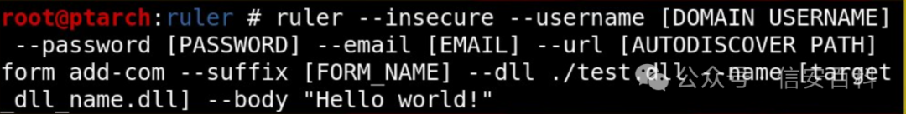

#  CVE-2024-21378｜Microsoft Outlook远程代码执行（RCE）漏洞（POC）   

<!-- vulwiki-editorial-rebuild:system-misc -->
## 条目范围与校订

- 本文对象：Microsoft Outlook COM表单
- 文献类型：Outlook漏洞外链集合
- 版本、权限及部署边界：正文未说明邮箱访问/身份验证、表单触发及用户交互；仅产品系列和架构
- 核验状态：仅重建文本校订；未执行文中代码、PoC 或扫描，未把截图或转载声明记为本站复现

### 具体结论与待核项

以下为原归档的逐项勘误与证据缺口；可由文本确定的问题已在下文订正，仍缺来源的事实保持待核。

1. 漏洞描述只NetSPI链接、PoC只ruler分支与gist，缺实际机制、初始权限和利用步骤，不可按标题推断未授权RCE
2. 需要两个文件配合却未说明文件角色、工具版本/提交和环境，截图未视检
3. 有NetSPI/MSRC原始来源价值，但缺修复构建/KB和逐通道影响范围
4. Outlook不是OutlookExpress简单扩充，产品历史简介应删或核对；推荐三个CVE非主实体

### 操作风险

原文技术操作的实际副作用未复现核验；按其请求/代码评估状态变更、凭据暴露和业务影响

技术请求、代码与实验方法按原文保留；其中的破坏性动作仅限授权、可恢复的隔离环境。缺失代码、参数或版本事实不猜补。

### 来源追溯

- 原文参考链接（未重新核验）：<https://www.netspi.com/blog/technical/red-team-operations/microsoft-outlook-remote-code-execution-cve-2024-21378/>
- 原文参考链接（未重新核验）：<https://github.com/NetSPI/ruler/tree/com-forms>
- 原文参考链接（未重新核验）：<https://gist.github.com/Homer28/7f3559ff993e2598d0ceefbaece1f97f>
- 原文参考链接（未重新核验）：<https://msrc.microsoft.com/update-guide/vulnerability/CVE-2024-21378>
- 原文参考链接（未重新核验）：<http://mp.weixin.qq.com/s?__biz=Mzg2ODcxMjYzMA==&mid=2247485142&idx=1&sn=01ba1dc2f2ccbc5d9711af4bd02beecc&chksm=cea96f0ff9dee6195b10afd3cff3c8db4655bb01d20f0577ce846b0302fdbac633bb1059b9df&scene=21#wechat_redirect>
- 原文参考链接（未重新核验）：<http://mp.weixin.qq.com/s?__biz=Mzg2ODcxMjYzMA==&mid=2247485096&idx=2&sn=dd0048ec7cb3b7ca77d29b9d446f8f8d&chksm=cea96f71f9dee66720c13cb780e66b29b79fee5856b80c7df95371c75b1befb0a4eaeabec812&scene=21#wechat_redirect>
- 原始披露 URL 未确认；既有归档来源标签保留，不能替代原始公告

### 归档技术正文

alicy  信安百科   2024-04-13 08:30  
  
**0x00 前言**  
  
  
Microsoft Office Outlook是微软办公软件套装的组件之一，它对Windows自带的Outlook express的功能进行了扩充。  
  
  
Outlook的功能很多，可以用它来收发电子邮件、管理联系人信息、记日记、安排日程、分配任务。  
  
  
  
**0x01 漏洞描述**  
  
  
https://www.netspi.com/blog/technical/red-team-operations/microsoft-outlook-remote-code-execution-cve-2024-21378/  
  
  
  
**0x02 CVE编号**  
  
****  
CVE-2024-21378  
  
  
  
**0x03 影响版本**  
  
  
  
Microsoft Outlook 2016 (64-bit edition)  
  
Microsoft Outlook 2016 (32-bit edition)  
  
Microsoft Office LTSC 2021 for 32-bit editions  
  
Microsoft Office LTSC 2021 for 64-bit editions  
  
Microsoft 365 Apps for Enterprise for 64-bit Systems  
  
Microsoft 365 Apps for Enterprise for 32-bit Systems  
  
Microsoft Office 2019 for 64-bit editions  
  
Microsoft Office 2019 for 32-bit editions  
  
  
  
**0x04 漏洞详情**  
  
  
POC：（  
需要两个文件配合使用）  
  
https://github.com/NetSPI/ruler/tree/com-forms  
  
  
https://gist.github.com/Homer28/7f3559ff993e2598d0ceefbaece1f97f  
  
  
  
  
  
**0x05 参考链接**  
  
  
https://msrc.microsoft.com/update-guide/vulnerability/CVE-2024-21378  
  
  
https://gist.github.com/Homer28/7f3559ff993e2598d0ceefbaece1f97f  
  
  
  
  
推荐阅读：  
  
  
[CVE-2024-3273｜D-Link NAS设备存在后门帐户（POC）](http://mp.weixin.qq.com/s?__biz=Mzg2ODcxMjYzMA==&mid=2247485142&idx=1&sn=01ba1dc2f2ccbc5d9711af4bd02beecc&chksm=cea96f0ff9dee6195b10afd3cff3c8db4655bb01d20f0577ce846b0302fdbac633bb1059b9df&scene=21#wechat_redirect)  
  
  
  
[CVE-2024-20767｜Adobe ColdFusion 任意文件读取漏洞（POC）](http://mp.weixin.qq.com/s?__biz=Mzg2ODcxMjYzMA==&mid=2247485096&idx=2&sn=dd0048ec7cb3b7ca77d29b9d446f8f8d&chksm=cea96f71f9dee66720c13cb780e66b29b79fee5856b80c7df95371c75b1befb0a4eaeabec812&scene=21#wechat_redirect)  
  
  
  
[CVE-2024-27198｜JetBrains TeamCity身份验证绕过漏洞（POC）](http://mp.weixin.qq.com/s?__biz=Mzg2ODcxMjYzMA==&mid=2247485027&idx=3&sn=acd6773dd65dd81d9c72b43f3dbd04ee&chksm=cea96fbaf9dee6ac5962af104142a664c843d526d7fa436a043d89bf8fe3200ee114cbaefd26&scene=21#wechat_redirect)  
  
  
  
  
  
Ps：国内外安全热点分享，欢迎大家分享、转载，请保证文章的完整性。文章中出现敏感信息和侵权内容，请联系作者删除信息。信息安全任重道远，感谢您的支持  
  
！！！  
  
  
**本公众号的文章及工具仅提供学习参考，由于传播、利用此文档提供的信息而造成任何直接或间接的后果及损害，均由使用者本人负责,本公众号及文章作者不为此承担任何责任。**  
  
  
  
  

---

> 来源：gelusus/wxvl（微信公众号漏洞文章自动归档，原始披露 URL 尚未确认，现有链接按来源追溯区分别标注）
