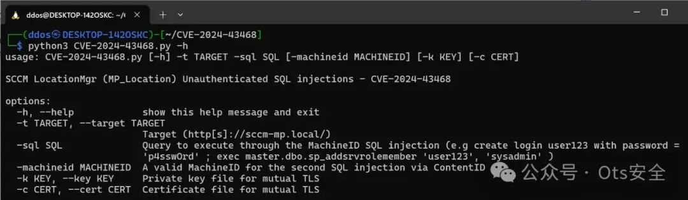

# CVE-2024-43468 ：通过 PoC 代码揭示 Microsoft Configuration Manager 漏洞

<!-- vulwiki-editorial-rebuild:system-misc -->
## 条目范围与校订

- 本文对象：Microsoft Configuration Manager MP_Location
- 文献类型：PoC发布及SQL注入链摘要
- 版本、权限及部署边界：MP_Location可达；getMachineID/getContentID未认证注入；SQL上下文权限和xp_cmdshell决定OS执行
- 核验状态：仅重建文本校订；未执行文中代码、PoC 或扫描，未把截图或转载声明记为本站复现

### 具体结论与待核项

以下为原归档的逐项勘误与证据缺口；可由文本确定的问题已在下文订正，仍缺来源的事实保持待核。

1. SQL sysadmin不等OS SYSTEM；启动xp_cmdshell及数据库主机与MCM主机位置应区分
2. 示例直接创建sysadmin账号是持久性变更，不能当无害检测；缺回滚/实验上下文
3. 只给脚本调用和原GitHub，无完整请求/结果；具体受影响分支与2024-10KB未列
4. 日志检测只说特定错误却不列消息/条件，难以执行；无日志也不能排除利用
5. 实际基础设施管理Web服务非桌面Microsoft泛目录，应迁管理平台

### 操作风险

示例直接创建sysadmin账号是持久性变更，不能当无害检测；缺回滚/实验上下文

技术请求、代码与实验方法按原文保留；其中的破坏性动作仅限授权、可恢复的隔离环境。缺失代码、参数或版本事实不猜补。

### 来源追溯

- 原文参考链接（未重新核验）：<https://github.com/synacktiv/CVE-2024-43468>
- 原始披露 URL 未确认；既有归档来源标签保留，不能替代原始公告

### 归档技术正文

 Ots安全   2025-01-25 10:20  
  
  
  
  
  
Synacktiv 的安全研究员 Mehdi Elyassa 公布了 Microsoft Configuration Manager (MCM) 中一个严重漏洞的技术细节和概念验证 (PoC) 漏洞代码，该漏洞编号为 CVE-2024-43468，CVSS 评分为 9.8。此漏洞允许未经身份验证的攻击者利用 SQL 注入漏洞，从而在服务器及其底层数据库上执行任意命令。  
  
该漏洞存在于 MP_Location 服务中，该服务处理客户端向 Microsoft Configuration Manager 发送的消息。根据分析，该服务不安全地使用输入进行数据库查询，导致两个不同的 SQL 注入向量：getMachineID 和 getContentID。这两个向量都不需要身份验证，因此攻击者很容易利用它们。  
  
Mehdi解释道：“ MP_Location 服务在处理客户端发送的消息时，不安全地使用输入进行数据库查询。”这种不安全的处理方式使攻击者能够以 sysadmin 级权限执行任意 SQL 查询，从而可能激活 xp_cmdshell 程序以实现远程代码执行。  
  
Synacktiv 提供了详细的概念验证 (PoC) 脚本来利用 CVE-2024-43468 漏洞。例如，使用unauth_sqli_LocationMgr.py脚本，攻击者可以通过注入恶意 SQL 查询来创建 sysadmin 帐户：  
  
```
unauth_sqli_LocationMgr.py -t sccm.corp.local -sql "create login poc_sqli_machineid with password = 'p4sswOrd'; exec master.dbo.sp_addsrvrolemember 'poc_sqli_machineid', 'sysadmin'"
```  
  
  
成功利用该漏洞后，攻击者可以访问配置管理器数据库 ( `CM_<SITE_CODE>` ) 并在服务器上执行命令。这可能导致部署环境完全被攻陷、数据被盗，以及网络内潜在的横向移动。  
  
Microsoft在 2024 年 10 月补丁星期二更新中解决了此漏洞。建议使用 Microsoft Configuration Manager 的组织立即应用这些补丁，以防止漏洞被利用。  
  
检测成功的利用可能具有挑战性，因为 SQL 注入负载不会直接反映在日志文件中。但是，Synacktiv 建议监控MP_Location.log文件中是否存在异常，例如与 getMachineID操作相关的特定错误消息。  
  
此漏洞凸显了不安全处理客户端输入所带来的风险，尤其是在 MCM 等关键基础设施工具中。利用 CVE-2024-43468 的攻击者可以绕过身份验证并以最小的努力实现高权限操作，这使得此漏洞成为利用的主要目标。  
  
Synacktiv 总结道：“此类操作允许接管部署并在底层服务器上执行任意命令。”    
- https://github.com/synacktiv/CVE-2024-43468  
  
  
  
感谢您抽出  
  
  
  
.  
  
  
  
.  
  
  
  
来阅读本文  
  
  
  
**点它，分享点赞在看都在这里**  
  
  


---

> 来源：gelusus/wxvl（微信公众号漏洞文章自动归档，原始披露 URL 尚未确认，现有链接按来源追溯区分别标注）
