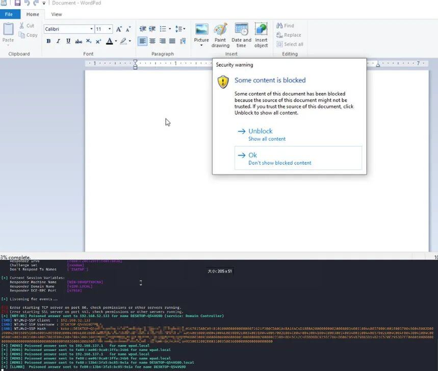

# 【原作者复现通告】Microsoft WordPad 信息泄露漏洞CVE-2023-36563安全风险通告

<!-- vulwiki-editorial-rebuild:system-misc -->
## 条目范围与校订

- 本文对象：Windows WordPad OLE/RTF链接处理
- 文献类型：WordPad风险通告
- 版本、权限及部署边界：用户打开RTF、OLE linked Topic指向UNC并发起NTLM认证；版本覆盖Windows客户端/Server多分支
- 核验状态：仅重建文本校订；未执行文中代码、PoC 或扫描，未把截图或转载声明记为本站复现

### 具体结论与待核项

以下为原归档的逐项勘误与证据缺口；可由文本确定的问题已在下文订正，仍缺来源的事实保持待核。

1. NTLM认证材料泄露宜精确称NetNTLM挑战响应而非直接拿到本地NT哈希，须区分后续中继/破解
2. 标题已复现但正文只有结果截图，无测试构建/样本/响应文本，PoC公开却未直接给原PoC链接；不把作者复现当本次验证
3. 亿级影响数量缺统计方法；首表10月10与时线10月11可涉时区，规范日期而非直接判冲突
4. 注册表缓解影响OLE链接转换，ExclusionList须针对已确认不受影响应用，不能把示例Outlook/Winword当安全白名单默认值
5. 有MSRC/ANSSI/CISA来源可追溯，但需逐OS安全KB/构建；第三方补丁库版本与微软修复版本分开
6. 大量产品营销/HTML样式清理，归Windows组件而非Microsoft泛目录

### 操作风险

原文技术操作的实际副作用未复现核验；按其请求/代码评估状态变更、凭据暴露和业务影响

技术请求、代码与实验方法按原文保留；其中的破坏性动作仅限授权、可恢复的隔离环境。缺失代码、参数或版本事实不猜补。

### 来源追溯

- 原文参考链接（未重新核验）：<https://msrc.microsoft.com/update-guide/en-US/advisory/CVE-2023-36563>
- 原文参考链接（未重新核验）：<https://securityonline.info/poc-released-for-microsoft-wordpad-cve-2023-36563-flaw-exploited-in-attacks/>
- 原文参考链接（未重新核验）：<https://www.cert.ssi.gouv.fr/actualite/CERTFR-2023-ACT-045/>
- 原文参考链接（未重新核验）：<https://www.cert.ssi.gouv.fr/avis/CERTFR-2023-AVI-0827/>
- 原文参考链接（未重新核验）：<https://securityonline.info/five-security-vulnerabilities-added-to-cisas-kev-catalog/>
- 原文参考链接（未重新核验）：<https://www.cisa.gov/known-exploited-vulnerabilities-catalog>
- 原始披露 URL 未确认；既有归档来源标签保留，不能替代原始公告

### 归档技术正文

原创 QAX CERT  奇安信 CERT   2023-11-01 17:25  
  
●   
点击↑蓝字关注我们，获取更多安全风险通告  
  
  
<table><tbody><tr><td valign="middle" align="center" rowspan="1" colspan="4" style="background-color: #4676d9;border-color: #4676d9;">
<strong>漏洞概述</strong> 
</td></tr><tr><td valign="middle" align="left" style="border-color: #4676d9;" width="135">
<strong>漏洞名称</strong>
</td><td valign="middle" align="left" rowspan="1" colspan="3" style="border-color: #4676d9;">
Microsoft WordPad 信息泄露漏洞
</td></tr><tr><td valign="middle" align="left" rowspan="1" colspan="1" style="border-color: #4676d9;" width="135">
<strong>漏洞编号</strong>
</td><td valign="middle" align="left" rowspan="1" colspan="3" style="border-color: #4676d9;">
QVD-2023-24196、CVE-2023-36563
</td></tr><tr><td valign="middle" align="left" style="border-color: #4676d9;" width="135">
<strong>公开时间</strong>
</td><td valign="middle" align="left" style="border-color: #4676d9;" width="151">
2023-10-10
</td><td valign="middle" align="left" style="border-color: #4676d9;" width="177">
<strong>影响对象数量级</strong>
</td><td valign="middle" align="left" style="border-color: #4676d9;" width="94">
亿级
</td></tr><tr><td valign="middle" align="left" style="border-color: #4676d9;" width="135">
<strong>奇安信评级</strong>
</td><td valign="middle" align="left" style="border-color: #4676d9;" width="151">
<strong style="max-inline-size: 100%;margin: 0px;padding: 0px;box-sizing: border-box !important;overflow-wrap: break-word !important;outline: none 0px !important;cursor: text;color: #000000;font-size: 13px;text-align: -webkit-left;caret-color: #ff0000;text-decoration-thickness: initial;font-family: 微软雅黑, &#34;Microsoft YaHei&#34;, sans-serif;">中危</strong>
</td><td valign="middle" align="left" style="border-color: #4676d9;" width="177">
<strong><strong style="max-inline-size: 100%;margin: 0px;padding: 0px;box-sizing: border-box !important;overflow-wrap: break-word !important;outline: none 0px !important;cursor: text;color: #000000;font-size: 13px;text-align: -webkit-left;caret-color: #ff0000;text-decoration-thickness: initial;font-family: 微软雅黑, &#34;Microsoft YaHei&#34;, sans-serif;">CVSS 3.1分数</strong></strong>
</td><td valign="middle" align="left" style="border-color: #4676d9;" width="94">
6.5
</td></tr><tr><td valign="middle" align="left" style="border-color: #4676d9;" width="135">
<strong>威胁类型</strong><strong></strong>
</td><td valign="middle" align="left" style="border-color: #4676d9;" width="151">
信息泄露
</td><td valign="middle" align="left" style="border-color: #4676d9;" width="177">
<strong>利用可能性</strong>
</td><td valign="middle" align="left" style="border-color: #4676d9;" width="94">
<strong>高</strong>
</td></tr><tr><td valign="middle" colspan="1" rowspan="1" align="left" style="border-color: #4676d9;" width="135">
<strong>POC状态</strong>
</td><td valign="middle" colspan="1" rowspan="1" align="left" style="border-color: #4676d9;" width="151">
<strong>已公开</strong>
</td><td valign="middle" colspan="1" rowspan="1" align="left" style="border-color: #4676d9;" width="177">
<strong>在野利用状态</strong>
</td><td valign="middle" colspan="1" rowspan="1" align="left" style="border-color: #4676d9;" width="94">
<strong>已发现</strong>
</td></tr><tr><td valign="middle" colspan="1" rowspan="1" align="left" style="border-color: #4676d9;" width="135">
<strong>EXP状态</strong>
</td><td valign="middle" colspan="1" rowspan="1" align="left" style="border-color: #4676d9;" width="151">
未公开
</td><td valign="middle" colspan="1" rowspan="1" align="left" style="border-color: #4676d9;" width="177">
<strong>技术细节状态</strong>
</td><td valign="middle" colspan="1" rowspan="1" align="left" style="border-color: #4676d9;" width="94">
<strong>已公开</strong>
</td></tr><tr><td valign="middle" colspan="4" rowspan="1" align="left" style="border-color: #4676d9;">
<strong>利用条件：</strong>需要用户交互。
</td></tr></tbody></table>  
  
  
**（注：奇安信CERT的漏洞深度分析报告包含此漏洞的POC及技术细节，订阅方式见文末。）**  
  
  
**0****1**  
  
**漏洞详情**  
  
**>**  
**>**  
**>**  
**>**  
  
**影响组件**  
  
写字板（WordPad）是简单的文字处理器。自从Windows 95开始，Microsoft Windows大部分的版本都内建了这个软体。它的功能比记事本强，但比Microsoft Word弱。WordPad 的功能发源自于Windows 1.0x时期的小作家。  
  
  
**>**  
**>**  
**>**  
**>**  
  
**漏洞描述**  
  
近日，奇安信CERT监测到 **Microsoft WordPad 信息泄露漏洞(CVE-2023-36563)**  
，wordpad在解析rtf文件包含的ole对象时会尝试访问Linked object的Topic指向的文件，如果Topic是一个UNC路径则会尝试通过网络访问，并尝试使用NTLM认证，导致泄露NTLM hash。  
  
  
**鉴于该漏洞影响范围较大，并且已经监测到在野利用,建议客户尽快做好自查及防护。**  
  
  
  
**02**  
  
**影响范围**  
  
**>**  
**>**  
**>**  
**>**  
  
**影响版本**  
  
Windows 10 for x64-based Systems  
  
Windows 10 for 32-bit Systems  
  
Windows 10 Version 22H2 for 32-bit Systems  
  
Windows 10 Version 22H2 for ARM64-based Systems  
  
Windows 10 Version 22H2 for x64-based Systems  
  
Windows 11 Version 22H2 for x64-based Systems  
  
Windows 11 Version 22H2 for ARM64-based Systems  
  
Windows 10 Version 21H2 for x64-based Systems  
  
Windows 10 Version 21H2 for ARM64-based Systems  
  
Windows 10 Version 21H2 for 32-bit Systems  
  
Windows 11 version 21H2 for ARM64-based Systems  
  
Windows Server 2008 for 32-bit Systems Service Pack 2 (Server Core installation)  
  
Windows Server 2008 for 32-bit Systems Service Pack 2  
  
Windows Server 2016 (Server Core installation)  
  
Windows Server 2016  
  
Windows 10 Version 1607 for x64-based Systems  
  
Windows 10 Version 1607 for 32-bit Systems  
  
Windows Server 2012 R2 (Server Core installation)  
  
Windows Server 2012 R2  
  
Windows Server 2012 (Server Core installation)  
  
Windows Server 2012  
  
Windows Server 2008 R2 for x64-based Systems Service Pack 1 (Server Core installation)  
  
Windows Server 2008 R2 for x64-based Systems Service Pack 1  
  
Windows Server 2008 for x64-based Systems Service Pack 2 (Server Core installation)  
  
Windows Server 2008 for x64-based Systems Service Pack 2  
  
Windows 11 version 21H2 for x64-based Systems  
  
Windows Server 2022 (Server Core installation)  
  
Windows Server 2022  
  
Windows Server 2019 (Server Core installation)  
  
Windows Server 2019  
  
Windows 10 Version 1809 for ARM64-based Systems  
  
Windows 10 Version 1809 for x64-based Systems  
  
Windows 10 Version 1809 for 32-bit Systems  
  
  
**>**  
**>**  
**>**  
**>**  
  
**其他受影响组件**  
  
无  
  
  
  
**03**  
  
**复现情况**  
  
目前，奇安信CERT已成功复现**Microsoft WordPad 信息泄露漏洞(CVE-2023-36563)**  
，截图如下：  
  
  
  
  
  
**04**  
  
**处置建议**  
  
**>**  
**>**  
**>**  
**>**  
  
**安全更新**  
  
下载对应目标系统的补丁并安装：  
  
https://msrc.microsoft.com/update-guide/en-US/advisory/CVE-2023-36563  
  
  
**>**  
**>**  
**>**  
**>**  
  
**缓解措施**  
  
设置注册表HKEY_LOCAL_MACHINE\SOFTWARE\Microsoft\Ole\AppCompat\  
  
OLELinkConversionFromOLESTREAMToIStorage，在该项内新建DWORD值Disabled为0x00000001，该项会禁止链接对象的转换，如果已知应用程序不受该漏洞影响，则可以新建REG_MULTI_SZ类型的ExclusionList，并将应用程序名称填入，如Outlook.exe、Winword.exe。  
  
  
**>**  
**>**  
**>**  
**>**  
  
**产品解决方案**  
  
**奇安信天擎终端安全管理系统解决方案**  
  
奇安信天擎终端安全管理系统并且有漏洞修复相关模块的用户，可以将补丁库版本更新到：  
2023.10.11.1及以上版本，对内网终端进行补丁更新。  
  
推荐采用自动化运维方案，如果控制中心可以连接互联网的用户场景，建议设置为自动从奇安信云端更新补丁库至  
2023.10.11.1版本。  
  
控制中心补丁库更新方式：每天04:00-06:00自动升级，升级源为从互联网升级。  
  
纯隔离网内控制中心不能访问互联网，不能下载补丁库和补丁文件，需使用离线升级工具定期导入补丁库和文件到控制中心。  
  
  
**05**  
  
**参考资料**  
  
[1]https://securityonline.info/poc-released-for-microsoft-wordpad-cve-2023-36563-flaw-exploited-in-attacks/  
  
[2]https://www.cert.ssi.gouv.fr/actualite/CERTFR-2023-ACT-045/  
  
[3]https://www.cert.ssi.gouv.fr/avis/CERTFR-2023-AVI-0827/  
  
[4]https://securityonline.info/five-security-vulnerabilities-added-to-cisas-kev-catalog/  
  
[5]https://www.cisa.gov/known-exploited-vulnerabilities-catalog  
  
[6]https://msrc.microsoft.com/update-guide/vulnerability/CVE-2023-36563  
  
  
  
**06**  
  
**时间线**  
  
2023年10月11日，微软补丁日修复Microsoft wordpad 信息泄露漏洞，同时该漏洞已被在野利用。  
  
2023年11月1日，奇安信 CERT监测到此漏洞技术细节在互联网上公开，复现该漏洞，发布安全风险通告。  
  
  
  
**07**  
  
**漏洞情报服务**  
  
奇安信ALPH  
A威胁分析平台已支持漏洞情报订阅服务：  
  
  
  
  
  
  
  
  
  
  
**奇安信 CERT**  
  
**致力于**  
第一时间为企业级用户提供**权威**漏洞情报和**有效**  
解决方案。  
  
  
点击↓**阅读原文**，到**ALPHA威胁分析平台**  
订阅更多漏洞信息。  
  

---

> 来源：gelusus/wxvl（微信公众号漏洞文章自动归档，原始披露 URL 尚未确认，现有链接按来源追溯区分别标注）
