# EKUwu-CVE-2024-49019

<!-- vulwiki-editorial-rebuild:system-misc -->
## 条目范围与校订

- 本文对象：Windows Active Directory Certificate Services
- 文献类型：ADCS证书模板利用与原理分析
- 版本、权限及部署边界：域内已有账户/服务器失陷；v1模板可申请且ENROLLEE_SUPPLIES_SUBJECT；CA发布模板/证书映射与Schannel条件
- 核验状态：仅重建文本校订；未执行文中代码、PoC 或扫描，未把截图或转载声明记为本站复现

### 具体结论与待核项

以下为原归档的逐项勘误与证据缺口；可由文本确定的问题已在下文订正，仍缺来源的事实保持待核。

1. 目录Outlook EKUwu误分类，全文ADCS与Outlook无关，应迁Windows域证书服务
2. 开篇仅两条件不充分，末尾才提注册权限；需要CA发布/批准要求、账户映射和目标身份完整限定
3. 漏洞根因是应用程序策略接受与模板限制缺失，结论全是人为错配淡化软件漏洞，需分配置前提与CVE修复
4. administrstor拼错且UPN缺域后缀，certlm图示/Schannel结果未文本化；不能只凭截图声称取得DC控制
5. 版本1模板不是创建某一些证书模板权限本身；无OS/CA补丁级别、修复KB或MSRC/原研究链接
6. 模板/证书扩展差异解释有价值，保留EKU与Application Policies区分并核官方规则

### 操作风险

原文技术操作的实际副作用未复现核验；按其请求/代码评估状态变更、凭据暴露和业务影响

技术请求、代码与实验方法按原文保留；其中的破坏性动作仅限授权、可恢复的隔离环境。缺失代码、参数或版本事实不猜补。

### 来源追溯

- 原始披露 URL 未确认；既有归档来源标签保留，不能替代原始公告

### 归档技术正文

原创 李木  黑白天实验室   2024-12-21 06:06  
  
背景  
  
MSRC在 2024年11月12日披露了一个名为Active Directory 证书服务特权提升漏洞（CVE-2024-49019)漏洞，分数为7.8分（更有可能被利用），表明攻击者可以通过攻击ADCS（证书服务）中的使用版本 1 证书模板创建某一些证书模板达到权限提升的目的。  
  
利用漏洞需要满足如下条件：  
1. 证书模板版本为1；  
‍‍  
  
1. 使用者名称源可以请求中提供  
  
# 漏洞复现  
  
本次漏洞复现的环境如下：  
  
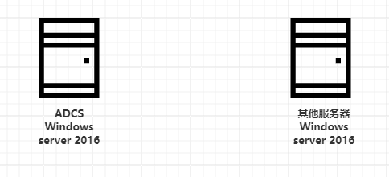  
  
本次环境由一台运行ADCS（证书服务器）的DC（域控制器）和一台其他服务器组成的域环境。  
- ADCS：192.168.70.178  
  
- 其他服务器：192.168.70.156  
  
- 域名：rd.com  
  
‍  
  
ADCS中安装配置了如下的服务：  
  
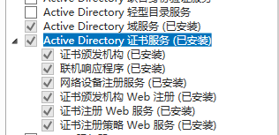  
  
在ADCS中配置了如下的证书模板  
  
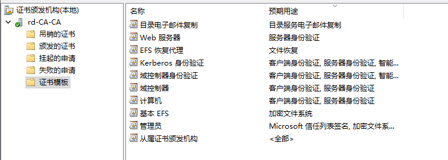  
  
漏洞复现为模拟域中一台服务器失陷之后攻击ADCS获取DC的权限：  
1. 使用.\Certify.exe find /dc:rd.com列出ADCS的证书模板；发现WebServer模板存在漏洞利用：  
  
- Schema Version: 1（证书模板版本为1）  
  
- msPKI-Certificate-Name-Flag: ENROLLEE_SUPPLIES_SUBJECT （表示使用者名称源可以请求中提供）  
  
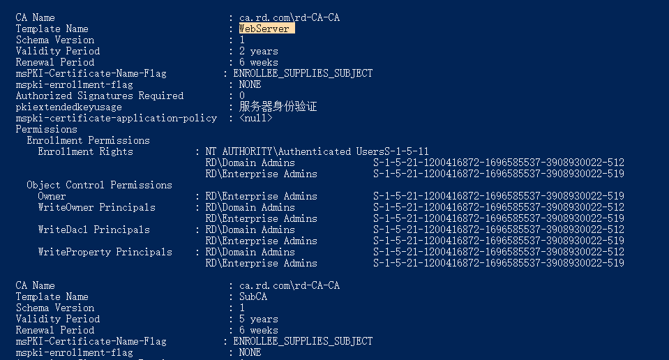  
  
2.申请WebServer模板  
  
通过证书管理工具（certlm）可以对WebServer模板进行证书申请：  
  
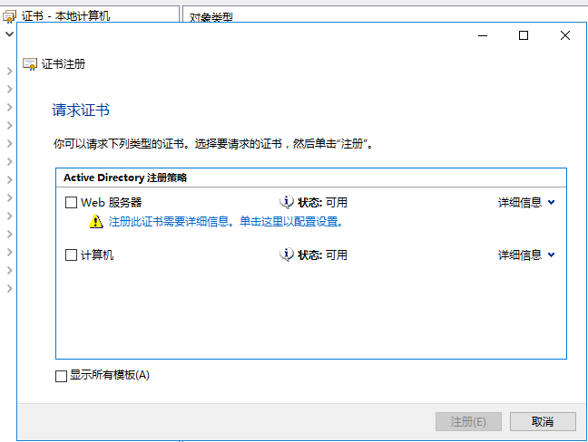  
  
设置备用名称，用户主体名称为administrstor;  
  
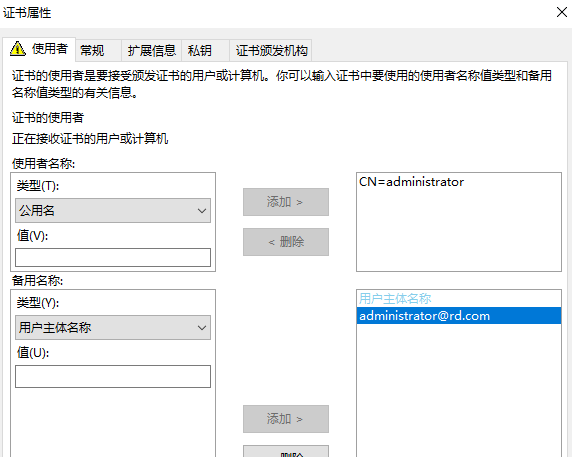  
  
然后在扩展信息，应用程序策略中添加"客户端身份认证"策略，  
然后申请证书。  
  
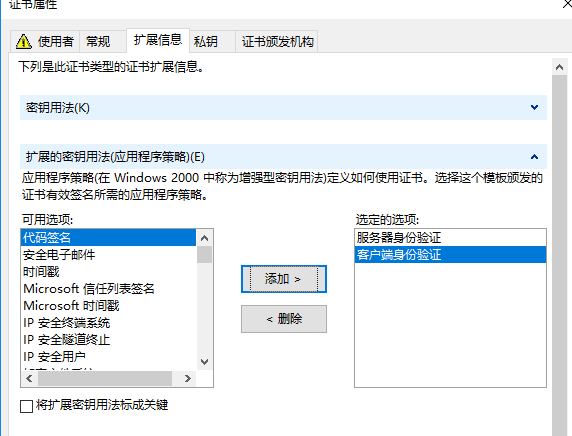  
  
申请下来的证书如下：  
  
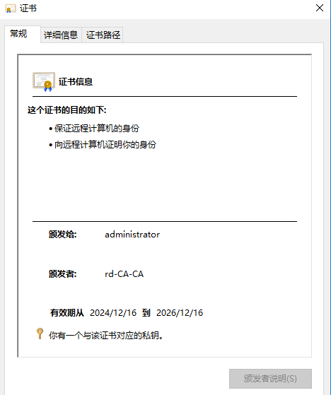  
  
然后导出证书  
  
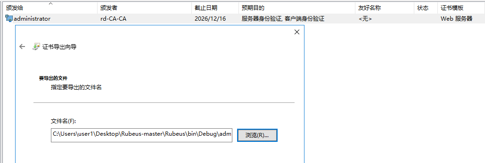  
  
3.使用申请的证书进行身份认证  
  
使用证书通过schannel 针对 LDAP 进行身份验证，可以看到  
  
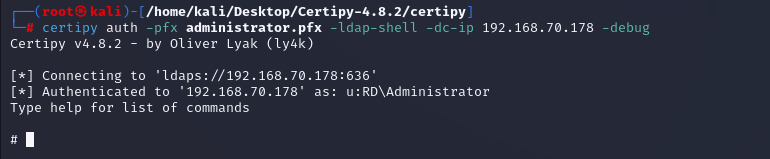  
  
到目前  
为止，漏洞复现完成。  
# 漏洞分析  
## AD CS 模板版本  
  
在 Windows Server 2000 中引入 AD CS 时，ADCS中包含几个用于常用的证书模板，其中包括WebServer模板，这里的模板版本为1：  
  
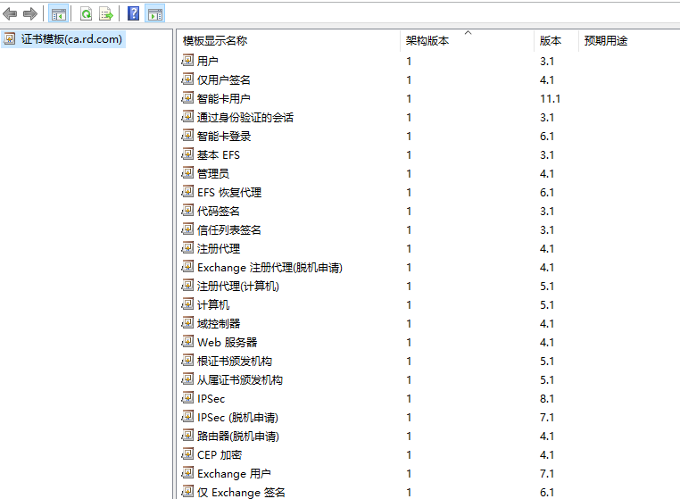  
  
后来在 Windows Server 2003 中引入了版本2模板，它为证书模板提供了更多功能，包括自动注册。  
  
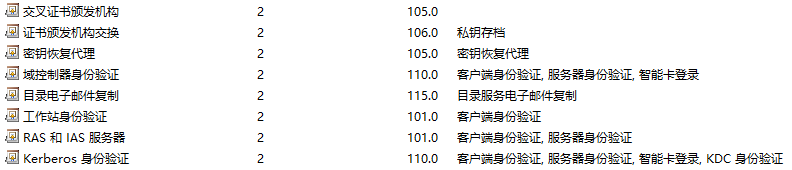  
  
用户没有办法新建证书模板，只可以在证书模板中进行复制会修改后发布，如果复制的证书模板为版本1，复制之后会自动将生成的模板转换为版本2。  
## 增强型密钥用法和应用程序策略  
  
为了让证书变得更加灵活引入了证书扩展，增强型密钥用法(extended key usage，EKU)就是其中的一个扩展，通过限制证书的用途，提高了证书和网络的安全性，例如下面的证书，限制证书的用途为服务器身份认证。  
  
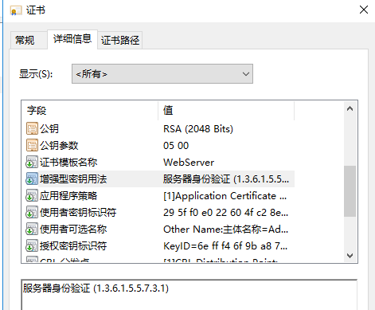  
  
那么应用程序策略是什么，在微软文档中可以知道：  
  
应用程序策略类似于证书中的扩展密钥使用 (EKU) 扩展，因为它们都使用一个或多个对象标识符来规定证书中的公钥必须如何使用。Windows Server 2003 支持扩展密钥使用以支持使用此扩展的 PKI，但使用应用程序策略代替 EKU。  
  
应用程序策略是 Microsoft 特有的，其处理方式与扩展密钥用法非常相似。如果证书的扩展包含应用程序策略，并且还包含 EKU 扩展，则 EKU 扩展将被忽略。但是，如果证书只有 EKU 扩展，则 EKU 扩展将被视为应用程序策略扩展。如果证书包含应用程序策略扩展和 EKU 属性，则证书的有效策略是 EKU 属性对象标识符和应用程序策略对象标识符之间的通用策略。  
  
分析：  
  
1.证书模板版本1中，我们可以看到模板中包含增强型密钥用法并没有包含应用程序策略。  
  
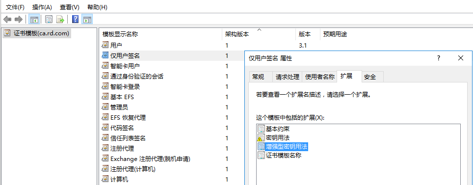  
  
同样申请模板1的证书中只有增强型密钥用法并没有包含应用程序策略。  
  
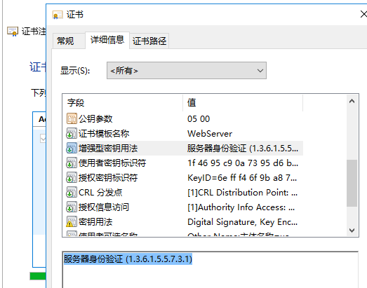  
  
2.证书模板版本2中，我们可以看到模板中包含应用程序策略并没有包含增强型密钥用法，和证书模板版本1恰恰相反。  
  
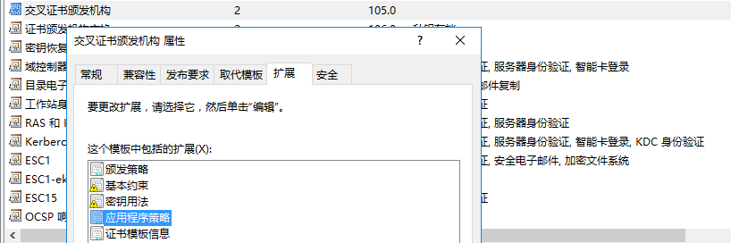  
  
但是申请的证书是包含应用程序策略和增强型密钥用法的，这一点和证书模板版本1不一样。  
  
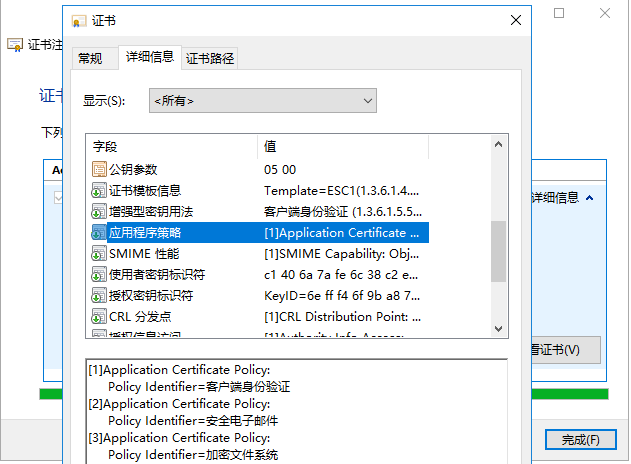  
  
可以知道证书模板版本1和2是存在一定的区别的。  
## 漏洞核心成因  
  
在使用certlm申请证书的时候，允许我们自定义应用程序策略，例如申请的证书模板版本1的证书，请求证书中通过设置属性。  
  
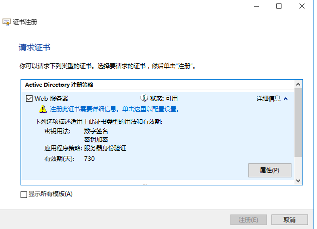  
  
然后进入扩展信息中即可设置应用程序策略，例如添加"客户端身份认证"  
  
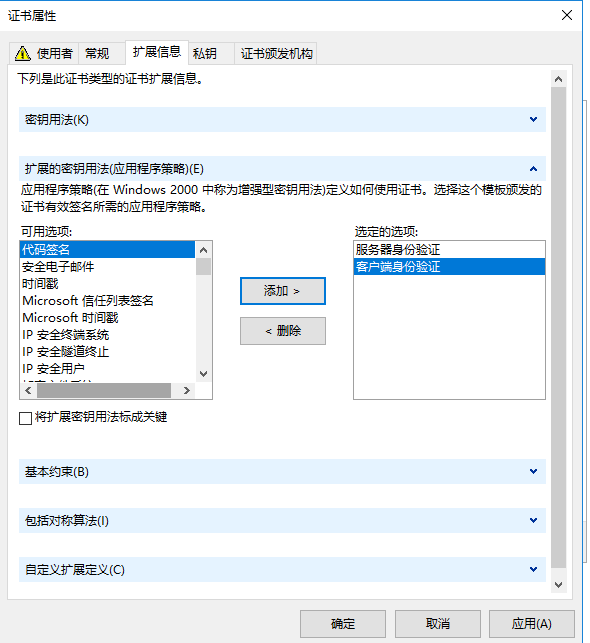  
  
申请下来的证书就跟证书模板版本2一样存在应用程序策略和增强型密钥用法的，其中应用程序策略包含我们定义的策略：  
  
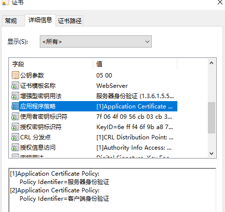  
  
而增强型密钥用法只是包含了证书模板中定义的值，例如在这个申请的证书模板定义的值为服务器身份认证，那么申请下来的证书的增强型密钥用法只有服务器身份认证：  
  
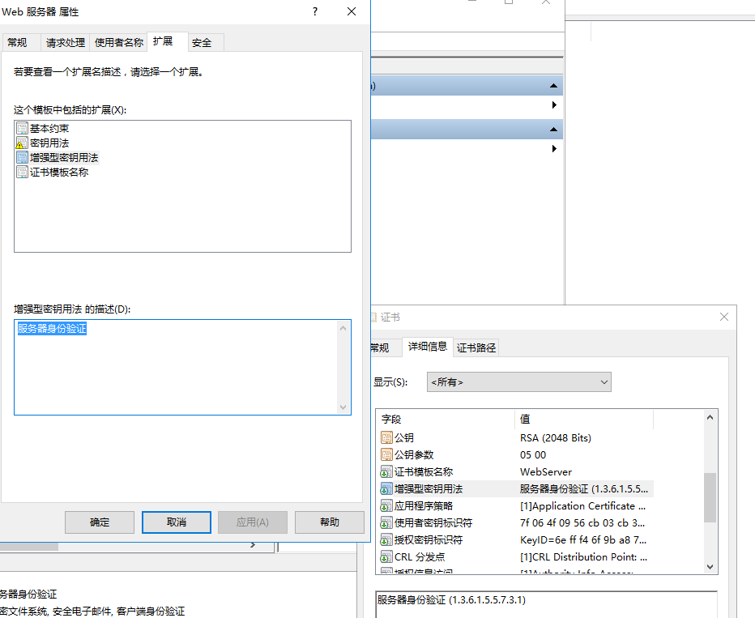  
  
如此如果攻击者拥有注册权限，还可以申请证书模板版本1的话，可以利用只有的方法进行利用。  
  
总结：漏洞利用比较苛刻，都是人为错配才会导致存在这种漏洞。  
‍  
‍  
‍  
‍  
‍  
‍  
‍  
‍  
‍  
  

---

> 来源：gelusus/wxvl（微信公众号漏洞文章自动归档，原始披露 URL 尚未确认，现有链接按来源追溯区分别标注）
