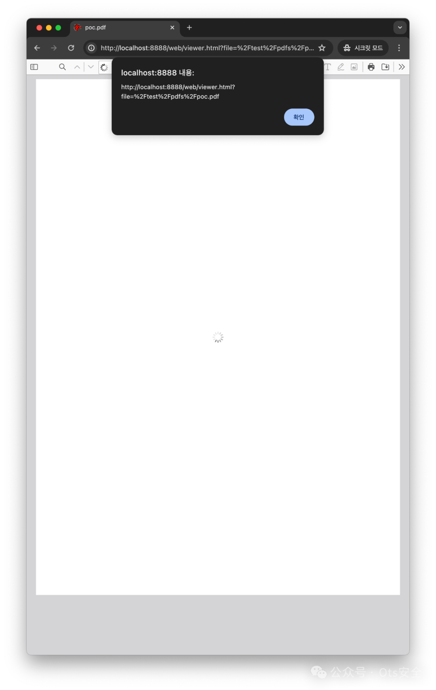
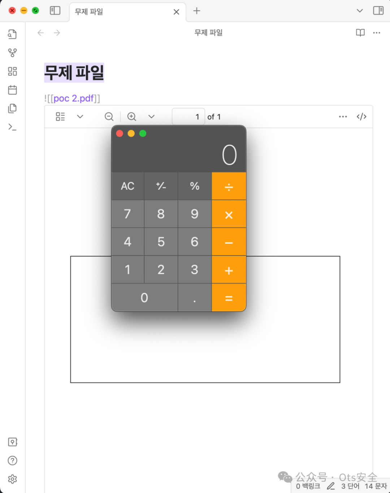

# CVE-2024-4367 & CVE-2024-34342：PDF.js 中的任意 JavaScript 执行

<!-- vulwiki-editorial-rebuild:system-misc -->
## 条目范围与校订

- 本文对象：Mozilla PDF.js及嵌入宿主
- 文献类型：PDF.js双编号PoC介绍
- 版本、权限及部署边界：恶意PDF、isEvalSupported=true；Firefox<126/ESR<115.11/Thunderbird<115.11；Electron需额外Node能力
- 核验状态：仅重建文本校订；未执行文中代码、PoC 或扫描，未把截图或转载声明记为本站复现

### 具体结论与待核项

以下为原归档的逐项勘误与证据缺口；可由文本确定的问题已在下文订正，仍缺来源的事实保持待核。

1. 元数据只有4367，34342与GHSA的别名/重复或组件关系需原始登记核对，不能自动建两个独立漏洞
2. 仅Electron即可OS命令执行过宽，require/child_process需NodeIntegration、preload或隔离失效能力，不是所有Electron应用默认具备
3. 有原PoC仓库/GHSA/NVD来源，比异号链接篇更可追溯；缺PDF.js包本身修复版本、Electron配置和实测构建
4. 命令两例和截图为PoC使用说明，不是完整原理研究；作者明确只写PoC非发现者，保留署名层次

### 操作风险

原文技术操作的实际副作用未复现核验；按其请求/代码评估状态变更、凭据暴露和业务影响

技术请求、代码与实验方法按原文保留；其中的破坏性动作仅限授权、可恢复的隔离环境。缺失代码、参数或版本事实不猜补。

### 来源追溯

- 原文参考链接（未重新核验）：<https://github.com/advisories/GHSA-wgrm-67xf-hhpq>
- 原文参考链接（未重新核验）：<https://nvd.nist.gov/vuln/detail/CVE-2024-4367>
- 原文参考链接（未重新核验）：<https://github.com/LOURC0D3/CVE-2024-4367-PoC>
- 原始披露 URL 未确认；既有归档来源标签保留，不能替代原始公告

### 归档技术正文

LOURC0D3  Ots安全   2024-05-25 12:35  
  
  
  
处理 PDF.js 中的字体时缺少类型检查，这将允许在 PDF.js 上下文中执行任意 JavaScript。此漏洞会影响 Firefox < 126、Firefox ESR < 115.11 和 Thunderbird < 115.11。  
  
如果使用 pdf.js 加载恶意 PDF，并且 PDF.js 配置为将 isEvalSupported 设置为 true（这是默认值），则不受限制的攻击者控制的 JavaScript 将在托管域的上下文中执行。  
- JS 执行  
  
```
python3 CVE-2024-4367.py "alert(document.domain)"
```  
  
  
- 操作系统命令执行（仅基于 Electron）  
  
```
python3 CVE-2024-4367.py "require('child_process').exec('open -a /Applications/Calculator.app');"
```  
  
  
  
这不是我的错误，我只是为它做了一个 PoC。  
  
**参考**  
- https://github.com/advisories/GHSA-wgrm-67xf-hhpq  
  
- https://nvd.nist.gov/vuln/detail/CVE-2024-4367  
  
```
CVE-2024-4367 & CVE-2024-34342 Proof of Concept
https://github.com/LOURC0D3/CVE-2024-4367-PoC
```  
  
  
  
  
感谢您抽出  
  
  
  
.  
  
  
  
.  
  
  
  
来阅读本文  
  
  
  
**点它，分享点赞在看都在这里**  
  


---

> 来源：gelusus/wxvl（微信公众号漏洞文章自动归档，原始披露 URL 尚未确认，现有链接按来源追溯区分别标注）
