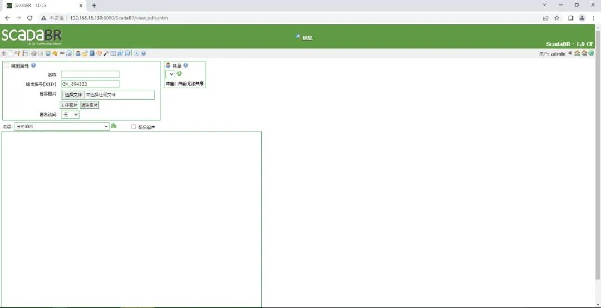
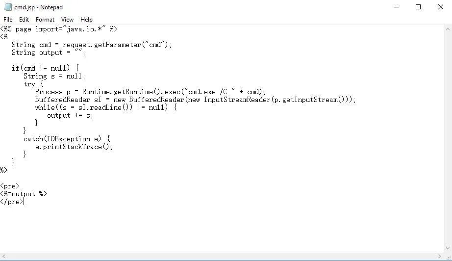
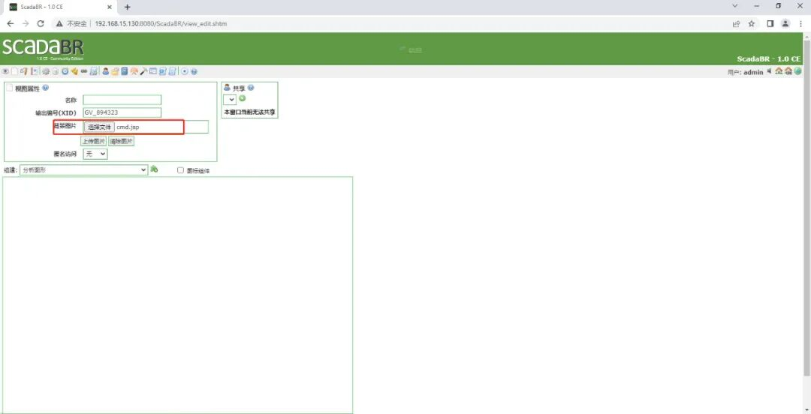
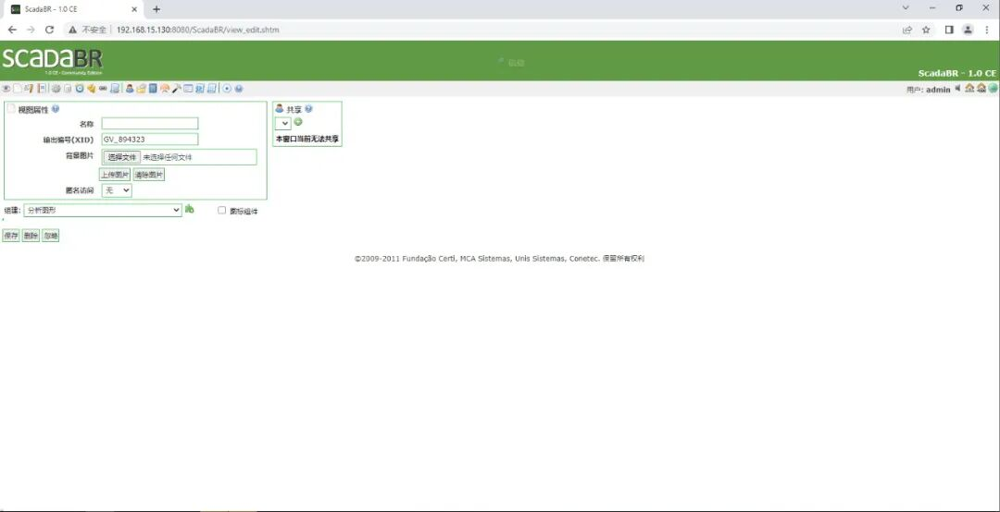
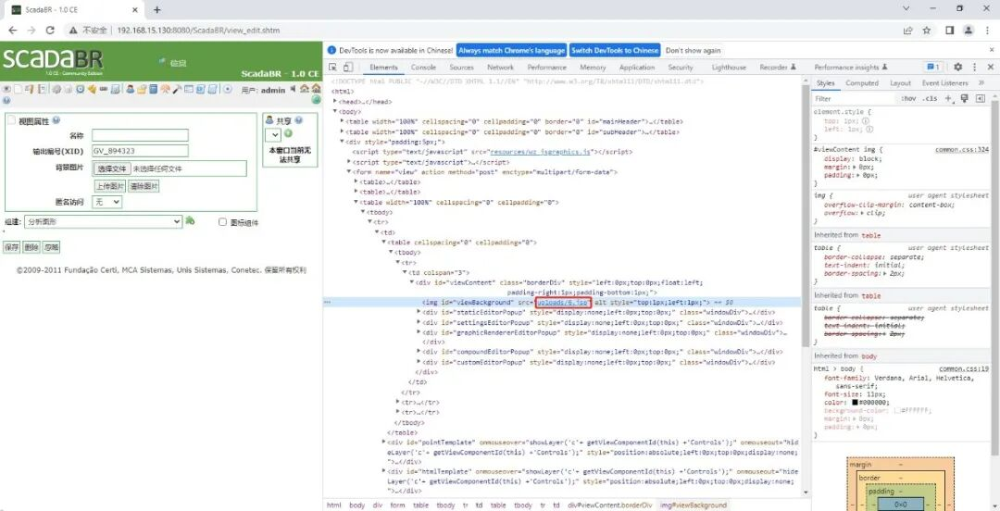
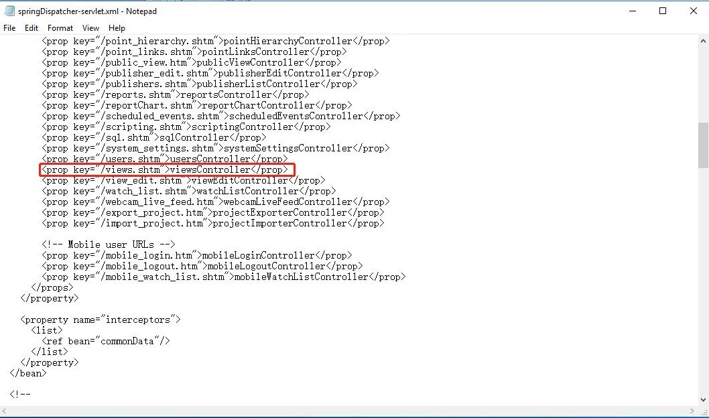
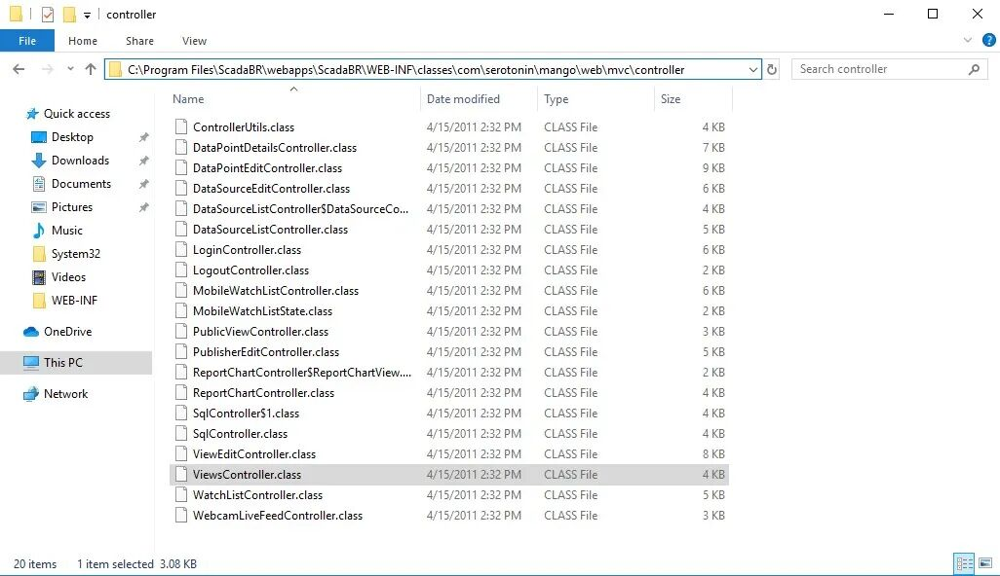
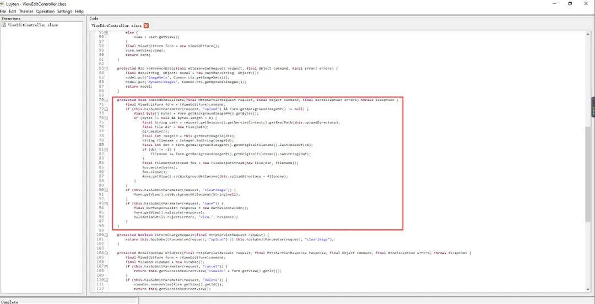

# CVE-2021-26828：ScadaBR 任意文件上传漏洞

<!-- vulwiki-editorial-rebuild:system-misc -->
## 条目范围与校订

- 本文对象：ScadaBR Web HMI
- 文献类型：已认证文件上传复现与分析
- 版本、权限及部署边界：Windows1.0实测；文列Linux0.9.1/Windows1.12.4CE；已登录且可编辑视图/上传，Tomcat可解析JSP
- 核验状态：仅重建文本校订；未执行文中代码、PoC 或扫描，未把截图或转载声明记为本站复现

### 具体结论与待核项

以下为原归档的逐项勘误与证据缺口；可由文本确定的问题已在下文订正，仍缺来源的事实保持待核。

1. 概览漏洞细节无与后文反编译原理矛盾；无在野只属报道时点
2. 保留已认证前提，但具体所需角色权限未列；SYSTEM是测试服务运行身份，不是漏洞自动提升全部部署
3. view_edit.shtm上传与分析views.shtm映射需解释控制器路由关系；缺原HTTP请求/源码文本/脚本，主要截图未视检
4. Linux0.91与0.9.1版本格式不一致，缺修复版和厂商/CVE直接来源
5. ScadaBR是实际产品，SCADA为领域，应按产品归类并关联26829不同漏洞，营销长尾清理

### 操作风险

原文技术操作的实际副作用未复现核验；按其请求/代码评估状态变更、凭据暴露和业务影响

技术请求、代码与实验方法按原文保留；其中的破坏性动作仅限授权、可恢复的隔离环境。缺失代码、参数或版本事实不猜补。

### 来源追溯

- 原文标注出处：<https://mp.weixin.qq.com/s?__biz=MzU3ODQ4NjA3Mg==&mid=2247533982&idx=1&sn=e8125c5704b1f044d29590bc307f5d10&chksm=fd76afc9ca0126df7ab4e0786d6231c7ecfb62f1fabb4b33e1d9c5531d30d581d4a518bd7f7d&scene=21#wechat_redirect>
- 原文参考链接（未重新核验）：<http://ksria.com/simpread/>
- 原文参考链接（未重新核验）：<http://mp.weixin.qq.com/s?__biz=MzU3ODQ4NjA3Mg==&mid=2247533350&idx=1&sn=369c37a7c5ba4d4980d5363633172dbd&chksm=fd76a971ca01206763866bc2e866f279724028d4e8de248cf598ad25c789c7c7d8d24f077a05&scene=21#wechat_redirect>
- 原文参考链接（未重新核验）：<http://mp.weixin.qq.com/s?__biz=MzU3ODQ4NjA3Mg==&mid=2247533011&idx=1&sn=30d2cdb4cb614d4b556cd64effb1dc8d&chksm=fd76ab84ca012292705b092e1268ca4ae418df8d16c35d05670143bb1e1ca20ca44c1af465b0&scene=21#wechat_redirect>
- 原文参考链接（未重新核验）：<http://mp.weixin.qq.com/s?__biz=MzU3ODQ4NjA3Mg==&mid=2247532641&idx=1&sn=194abb0d9dd334969553d80846095ccb&chksm=fd76aa36ca012320b08fab08fa7e6e469e76ed1dce61da4c5b3cca1786120880570e09d86387&scene=21#wechat_redirect>
- 原文参考链接（未重新核验）：<http://mp.weixin.qq.com/s?__biz=MzU3ODQ4NjA3Mg==&mid=2247532563&idx=1&sn=074c9a7ab3b51a4250c13b82c4bb74cb&chksm=fd76aa44ca012352964f1bc708f497db583c81e1022394f5605c0079a3d4168152d93e756f0d&scene=21#wechat_redirect>

### 归档技术正文

<meta name="referrer" content="no-referrer"/>

> 本文由 [简悦 SimpRead](http://ksria.com/simpread/) 转码， 原文地址 [mp.weixin.qq.com](https://mp.weixin.qq.com/s?__biz=MzU3ODQ4NjA3Mg==&mid=2247533982&idx=1&sn=e8125c5704b1f044d29590bc307f5d10&chksm=fd76afc9ca0126df7ab4e0786d6231c7ecfb62f1fabb4b33e1d9c5531d30d581d4a518bd7f7d&scene=21#wechat_redirect)

****
----------------------------------------------------------------------------------------------------------------------------------------------------------------------

ScadaBR 是巴西 Sensorweb 公司的一套用于开发自动化数据采集和监控应用程序的开源软件，允许为自动化项目创建交互式屏幕。ScadaBR 可以与 OpenPLC 通信，进行数据采集与实时监控。

Part1

漏洞状态

<table interlaced="enabled" data-sort="sortDisabled"><tbody><tr><td valign="top" align="center" width="69.66666666666667">漏洞细节 </td><td valign="top" align="center" width="71.66666666666667">漏洞 POC </td><td valign="top" align="center" width="61.66666666666667">漏洞 EXP </td><td valign="top" align="center" width="65.66666666666667">在野利用 </td></tr><tr><td valign="top" align="center" width="10">无</td><td valign="top" align="center" width="71.66666666666667">有 </td><td valign="top" align="center" width="61.66666666666667">有</td><td valign="top" align="center" width="65.66666666666667">无</td></tr></tbody></table>

Part2

漏洞描述

<table interlaced="enabled"><tbody><tr><td width="103" valign="middle" align="center">‍漏洞名称 </td><td valign="middle" align="left" width="416">
&nbsp;&nbsp;ScadaBR 存在任意文件上传漏洞
</td></tr><tr><td width="103" valign="middle" align="center">CVE 编号</td><td valign="top" width="416">CVE-2021-26828</td></tr><tr><td width="103" valign="middle" align="center">漏洞类型</td><td valign="top" width="416">任意文件上传</td></tr><tr><td valign="middle" align="center" colspan="1" rowspan="1">漏洞等级</td><td valign="middle" align="left" colspan="1" rowspan="1" width="416">8.8 高危（High）</td></tr><tr><td valign="middle" align="center" colspan="1" rowspan="1">漏洞描述</td><td valign="middle" align="left" colspan="1" rowspan="1" width="415">ScadaBR Linux 0.9.1 和 ScadaBR Windows 1.0/ 1.12.4CE 允许经过身份验证的远程用户通过 “view_edit.shtm” 页面上传和执行任意 JSP 文件。 </td></tr><tr><td valign="middle" align="center" colspan="1" rowspan="1">受影响版本</td><td valign="middle" align="left" colspan="1" rowspan="1" width="415"><section></section>
ScadaBR Linux 0.91

ScadaBR Windows 1.0

ScadaBR Windows 1.12.4CE
<section></section></td></tr><tr><td valign="middle" align="center" colspan="1" rowspan="1">时间线</td><td valign="middle" align="left" colspan="1" rowspan="1" width="415">2021-06-11 CVE 发布</td></tr></tbody></table>

Part3

漏洞复现

### **1. 复现环境**

靶机：Win10（192.168.15.130）

软件：ScadaBR Windows 1.0

### **2. 复现步骤**

登陆 ScadaBR,，并访问 http://192.168.15.130:8080/ScadaBR/view_edit.shtm 页面。

创建 cmd.jsp 文件。

选择 cmd.jsp 文件。

上传 cmd.jsp 文件后界面发生改变。

在页面代码中定位到 jsp 文件路径，此时 jsp 文件已被重命名。

访问 http://192.168.15.130:8080/ScadaBR/uploads/6.jsp 页面，此时页面没有报错。

访问 http://192.168.15.130:8080/ScadaBR/uploads/6.jsp?cmd=whoami，尝试添加请求参数执行命令。通过执行”whoami” 命令，可以得知当前用户为 system，漏洞复现成功。

Part4

漏洞分析  

在 ScadaBR\webapps\ScadaBR\WEB-INF\springDispatcher-servlet.xml 文件中查询到 views.shtm 映射关系，views.shtm 被映射到 viewsController。

随后在 ScadaBR\webapps\ScadaBR\WEB-INF\classes\com\serotonin\mango\web\mvc\controller 文件夹中查询到 ViewsController.class。

使用 luyten 反编译 ViewsController.class，并查询到处理文件上传的函数。

对 onBindAndValidate 函数进行分析，发现该函数没有对上传文件的扩展名以及文件类型进行检测，从而导致攻击者可以上传任意类型文件。

Part5

缓解建议

1. 软件升级至最新版本。

2. 监控网络流量，查看是否有恶意代码的流量特征。

3. 安装主机卫士，设置 IP 白名单。

**SAFE**

**获取更多情报**

  

联系我们，获取更多漏洞情报详情及处置建议，让企业远离漏洞威胁。  
电话：18511745601

邮箱：shiliangang@andisec.com

**漏洞分析回顾**  

  

北京安帝科技有限公司是新兴的工业网络安全能力供应商，专注于网络化、数字化、智能化背景下的工业网络安全技术、产品、服务的创新研究和实践探索，基于网络空间行为学理论及工业网络系统安全工程方法，围绕工业网络控制系统构建预防、识别、检测、保护、响应、恢复等核心能力优势，为电力、水利、石油石化、轨道交通、烟草、钢铁冶金、智能制造、矿业等关键信息基础设施行业提供安全产品、服务和综合解决方案。坚持 IT 安全与 OT 安全融合发展，坚持产品体系的自主可控，全面赋能客户构建 “业务应用紧耦合、用户行为强相关、安全风险自适应、网络弹性稳增强” 的主动防御和纵深防御相结合的安全保障体系。截至 2021 年底，公司主要产品已应用于数千家 “关基” 企业，其中工业网络安全态势感知平台已部署 4000 余家客户，虚实结合工业网络靶场服务超过 50 家客户。

**点击 “在看” 鼓励一下吧**

****

---

> 来源：MrWQ/vulnerability-paper（https://github.com/MrWQ/vulnerability-paper）
