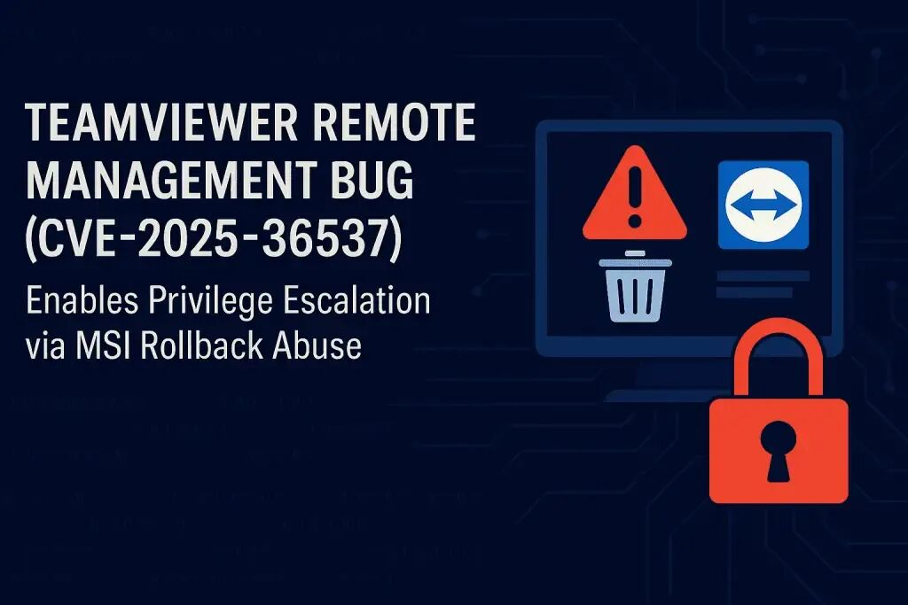

# TeamViewer 远程管理漏洞 (CVE-2025-36537) 可导致权限提升

<!-- vulwiki-editorial-rebuild:system-misc -->
## 条目范围与校订

- 本文对象：TeamViewer Remote Management Windows模块
- 文献类型：本地文件删除漏洞新闻
- 版本、权限及部署边界：本地低权；Remote/Tensor<15.67且启用备份/监控/补丁管理；MSI卸载或回滚路径
- 核验状态：仅重建文本校订；未执行文中代码、PoC 或扫描，未把截图或转载声明记为本站复现

### 具体结论与待核项

以下为原归档的逐项勘误与证据缺口；可由文本确定的问题已在下文订正，仍缺来源的事实保持待核。

1. 明确未启用管理模块不受该漏洞影响、本地初始访问是重要边界应保留
2. SYSTEM文件删除原语不等已经实现SYSTEM代码执行，完整提权只潜在后果须有额外链
3. MSI回滚触发用户交互/权限与实际被删除路径控制没交代，不能默认为随时远程可用
4. 无TeamViewer安全公告或原新闻链接；版本15.67是否完整修复构建及各模块对应需核验
5. 重复模块/权限描述和广告可精简，新闻本身不需要编造PoC

### 操作风险

原文技术操作的实际副作用未复现核验；按其请求/代码评估状态变更、凭据暴露和业务影响

技术请求、代码与实验方法按原文保留；其中的破坏性动作仅限授权、可恢复的隔离环境。缺失代码、参数或版本事实不猜补。

### 来源追溯

- 原始披露 URL 未确认；既有归档来源标签保留，不能替代原始公告

### 归档技术正文

 Ots安全   2025-06-26 04:12  
  
  
  
  
  
TeamViewer 是一个广泛使用的远程访问和管理平台，近日披露了一个新漏洞，该漏洞影响其 Windows 系统上的远程管理功能。该漏洞编号为 CVE-2025-36537，CVSS 评级为 7.0（高）。该漏洞允许本地非特权攻击者以 SYSTEM 权限删除任意文件，并可能导致完全权限提升。  
  
安全公告指出：“ Windows 版 TeamViewer 远程管理中发现一个漏洞，该漏洞允许具有本地非特权访问权限的攻击者使用 SYSTEM 权限删除文件。”  
  
CVE-2025-36537 的根本原因是 TeamViewer 客户端（完整版和主机版）中关键资源的权限分配不正确。该漏洞源于 MSI 回滚机制在卸载或回滚过程中处理文件删除方式的错误配置。  
  
此缺陷特别影响在启用了远程管理功能（即备份、监控和补丁管理）的 Windows 系统上安装的 TeamViewer Remote 和 Tensor（15.67 版本之前）。  
  
该公告澄清道：“该漏洞仅适用于远程管理功能：备份、监控和补丁管理。”  
  
攻击者必须已拥有系统的本地访问权限才能利用此漏洞。通过利用 MSI 回滚机制，低权限用户可以像拥有 SYSTEM 级权限一样删除任意文件，从而为权限提升或进一步利用打开方便之门。  
  
值得注意的是，该漏洞不会影响未启用远程管理模块的 TeamViewer 设备。这包括仅用于屏幕共享或远程桌面访问且未配置备份、监控或补丁管理功能的安装。  
  
TeamViewer 已在15.67版本中发布了修复程序，并敦促所有远程管理功能用户立即升级。  
  
  
  
感谢您抽出  
  
  
  
.  
  
  
  
.  
  
  
  
来阅读本文  
  
  
  
**点它，分享点赞在看都在这里**  
  

---

> 来源：gelusus/wxvl（微信公众号漏洞文章自动归档，原始披露 URL 尚未确认，现有链接按来源追溯区分别标注）
