# winrar(CVE-2023-38831)漏洞原理

<!-- vulwiki-editorial-rebuild:system-misc -->
## 条目范围与校订

- 本文对象：WinRAR ZIP预览与Windows ShellExecute
- 文献类型：逆向原理分析
- 版本、权限及部署边界：用户在WinRAR中打开恶意ZIP中的诱饵文件；文中<6.23，具体Windows与DLL构建号未明
- 核验状态：仅重建文本校订；未执行文中代码、PoC 或扫描，未把截图或转载声明记为本站复现

### 具体结论与待核项

以下为原归档的逐项勘误与证据缺口；可由文本确定的问题已在下文订正，仍缺来源的事实保持待核。

1. 5亿安装量不等于5亿受影响，所有<6.23版本范围需原公告核验
2. 源码级因果链与独立调试有价值，但ShellExecute函数与ShellExecuteEx结构参数名称混写，WM_LBUTTONDOWN不等于双击消息
3. 把指向终止空字符的指针与NULL指针混淆；API返回语义应按实际版本核验
4. 关键反编译和寄存器参数仅图片，需转为文本；引用B1tg图片未给原文章链接，作者主页不能代替原文
5. 空标题/代码围栏与广告密集；缺精确复现版本和补丁对照

### 操作风险

原文技术操作的实际副作用未复现核验；按其请求/代码评估状态变更、凭据暴露和业务影响

技术请求、代码与实验方法按原文保留；其中的破坏性动作仅限授权、可恢复的隔离环境。缺失代码、参数或版本事实不猜补。

### 来源追溯

- 原文参考链接（未重新核验）：<https://bbs.kanxue.com/user-home-967913.htm>
- 原文参考链接（未重新核验）：<http://mp.weixin.qq.com/s?__biz=MjM5NTc2MDYxMw==&mid=2458542779&idx=3&sn=ca6d34e5d9af9acd1abd46ed43224744&chksm=b18d523186fadb2759ffaa18bd8b1b403bce7673bfeeb9162f4528120ba5a76bafab88c15ebc&scene=21#wechat_redirect>
- 原文参考链接（未重新核验）：<http://mp.weixin.qq.com/s?__biz=MjM5NTc2MDYxMw==&mid=2458543004&idx=1&sn=725adc0fb63a7bf7dde7be0e6f3b1bde&chksm=b18d531686fada003b2253064e745de8b3a89e4598b6cc28237ace16653b06ace92de10e13fa&scene=21#wechat_redirect>
- 原文参考链接（未重新核验）：<http://mp.weixin.qq.com/s?__biz=MjM5NTc2MDYxMw==&mid=2458542928&idx=1&sn=be49c9978411b37bc8ddfa677accd4aa&chksm=b18d53da86fadacc89bf45021dfd0333fa1a9b9eeb0588c970f61eb7d3c522d72aea69ce29fd&scene=21#wechat_redirect>
- 原文参考链接（未重新核验）：<http://mp.weixin.qq.com/s?__biz=MjM5NTc2MDYxMw==&mid=2458542926&idx=1&sn=47ff5f90a90cf436b8797d1f9bd0563e&chksm=b18d53c486fadad239ad156749f1a3b6ede82a24537d5570f2602bfcb757ec81ec11c824bd55&scene=21#wechat_redirect>
- 原文参考链接（未重新核验）：<http://mp.weixin.qq.com/s?__biz=MjM5NTc2MDYxMw==&mid=2458542842&idx=1&sn=53afed6329093dd43d7f850562d7a5b4&chksm=b18d527086fadb663dd280f731523c21f433157aec89f81d35ab0ceb8ec959ec00428e1c8659&scene=21#wechat_redirect>
- 原始披露 URL 未确认；既有归档来源标签保留，不能替代原始公告

### 归档技术正文

time.time  看雪学苑   2024-03-06 17:59  
  
##   
  
> 原文此处代码块为空，内容未归档；无法从空块证明或复现所述结果。
  
  
  
WinRAR是最受欢迎的压缩工具之一，在全球拥用超过5亿用户。**2023 年 7 月 10 日**，国外威胁情报机构Group-IB研究**DarkMe**恶意软件传播时，在 WinRAR 处理 ZIP 文件格式中发现了一个以前未知的漏洞。通过利用该程序中的漏洞，威胁行为者能够制作 ZIP 存档，作为各种恶意软件系列的载体。**2023 年 8 月 15 日，MITRE Corporation 将此零日漏洞标记为 CVE-2023-38831**。  
  
  
##   
  
> 原文此处代码块为空，内容未归档；无法从空块证明或复现所述结果。
  
  
  
漏洞受影响范围：5亿WinRAR用户；  
  
漏洞受影响版本：WinRar < v6.23所有版本。  
  
  
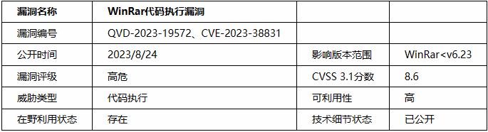  
#   
  
##   
  
> 原文此处代码块为空，内容未归档；无法从空块证明或复现所述结果。
  
  
#   
  
WinRar在小于6.23版本中点击压缩包中的文件预览时错误得将被点击的文件名和同名文件夹下的所有文件释放到临时目录中，随后调用Shellexecute执行文件造成代码执行。  
  
  
正常情况下windows文件系统不允许同一路径下存在同名的文件或文件夹，但是可以通过一些途径绕过此限制。  
  
  
1.创建一个test.txt1文件和一个test.txt2文件夹，在test.txt2文件夹中创建一个test.txt3.cmd，写入打开计算机，然后打包成zip文件。  
  
  
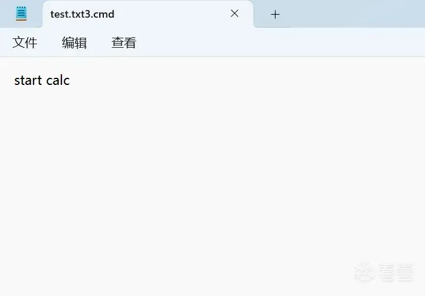  
  
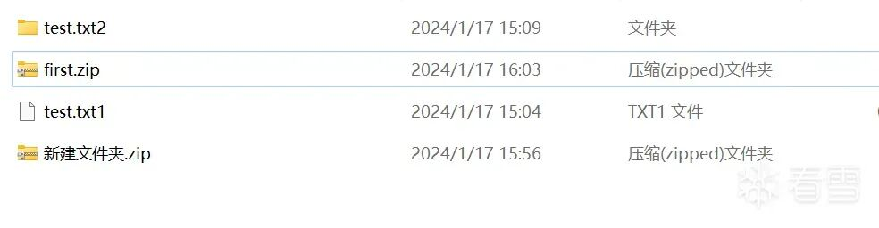  
  
  
2.使用16进制编辑器，如010Editor，对压缩文件中的文件名进行更改。  
  
  
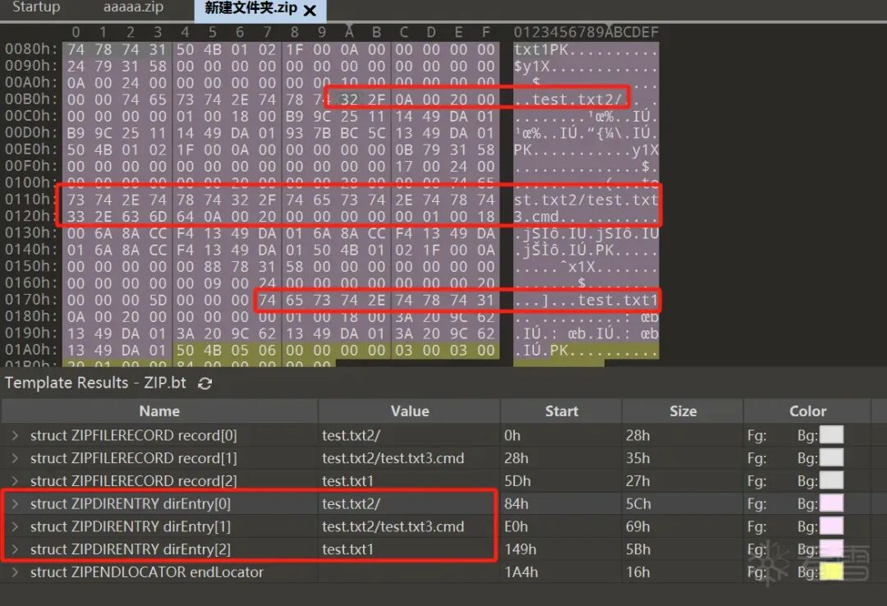  
  
  
这里代表有3个文件，我们把txt后面的数字123都改成空格，空格x`对应的acsll码是0x20。  
  
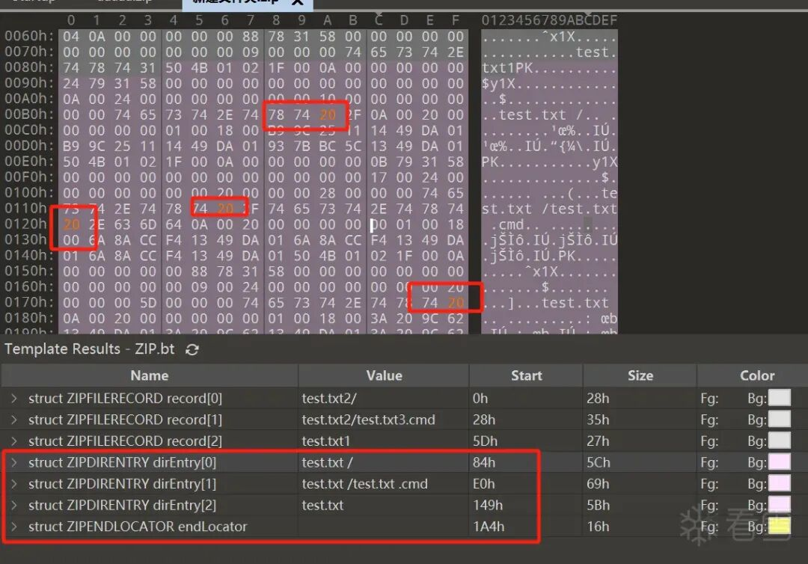  
  
  
再去看压缩包发现文件夹和文件已经是同名的。  
  
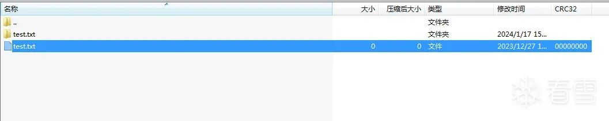  
  
  
此时去双击test.txt 文件，会发现.cmd文件被执行了，弹出了计算机，且临时目录下提取了两个文件。  
  
  
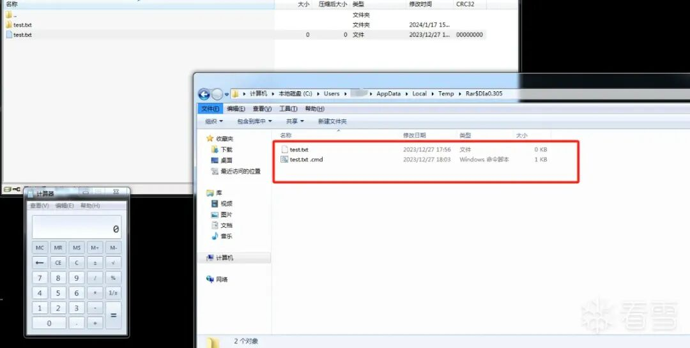  
  
  
至此，Winrar代码执行漏洞复现完毕，下面我们了解下，这个过程发生了什么，为什么要该掉一个字符为空格（0x20)？为什么点击了一个文件却解压出来了两个文件？为什么test.txt .cmd被执行了？  
  
# Winrar的执行流程  
  
  
Winrar是一个GUI程序，在用户双击一个文件预览时会发送一个WM_LBUTTONDOWN消息，然后主程序根据此消息获得点击的文件名，也就是click_name,随即主程序会遍历压缩包中所有的deFileName（文件夹也在此列)，当deFileName==click_name那么该文件就会被释放出来并写入临时目录中，也就是说同名文件夹下的所有文件都会被释放出来。最终Winrar会初始化ShellExecuteInfo结构体，将click_name释放后的路径设置到lpFileName中，并调用Windows系统APi ShellExecute函数执行该文件。  
  
  
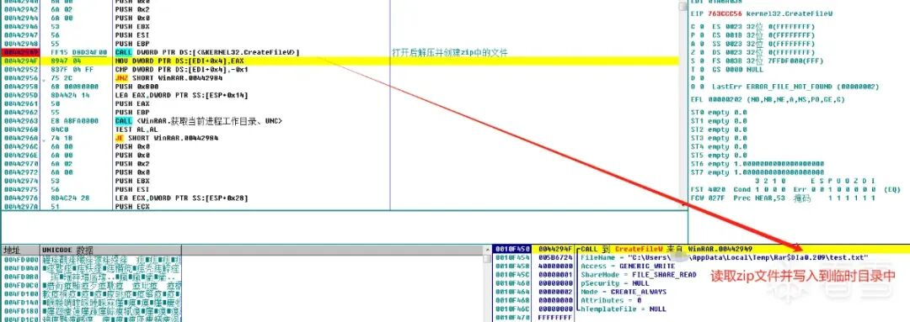  
  
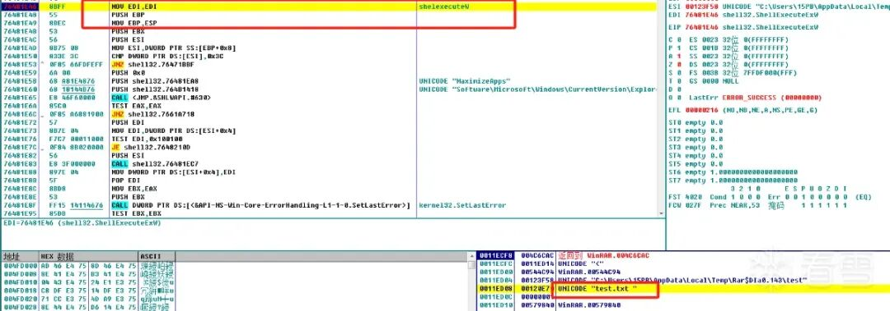  
  
  
我们通过调试逆向的方式看到整个流程确实是这样的，而且在调用Shellexecute函数时可以看到文件名也确实是test.txt 。为什么最终是test.txt .cmd被执行了。带着这个问题继续往下看，我们知道一个程序被运行是要被加载到进程空间的，因此Shellexecute函数最终也会调用CreateProcess等函数来创建进程，于是在进程创建函数上下断点进行调试运行。  
  
  
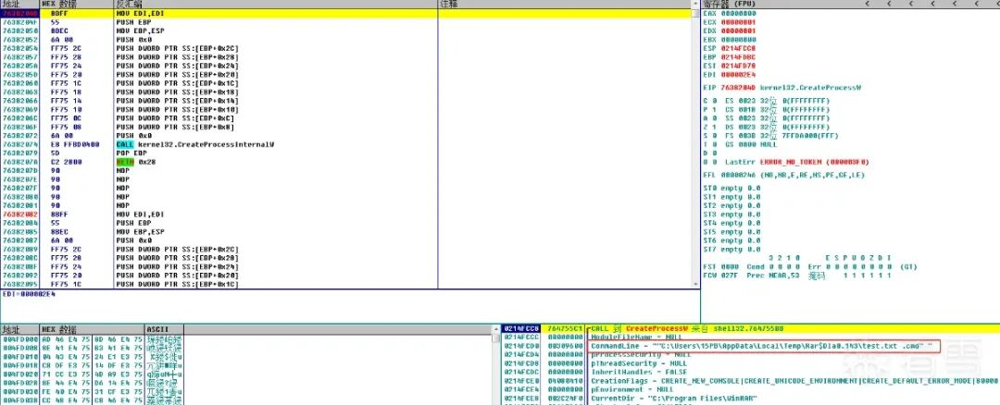  
  
  
此时断点命中CreateProcessW，但这里发现一个问题，WinRAR在调用ShellexecuteW时lpFileName参数明明是"test.txt ",后面调用CreateProcesssW创建进程时却变成了”test.txt .cmd“。很明显ShellexecuteW做了一些我们不知道的操作，更改了参数。那shellexecute做了什么就变成了了解问题的关键。  
  
# ShellExecute函数  
  
  
Shellexecute在处理一个文件时会通过文件路径获取文件的扩展名(PathFindExtension)，然后通过注册表和**AssocQueryString  
**等文件关联函数获取绑定了扩展名的关联程序(例：.xml文件的关联程序：MS Edge微软浏览器)的绝对路径，最后将创建进程所需的ModuleFileName参数设置为获取到的绝对路径，CommandLine参数设置为文件的绝对路径，并调用CreateProcessW启动进程。  
  
  
如果没找到扩展名，则会对当前目录下的所有同名文件进行遍历，如果存在同名文件且是可执行文件(com、cmd、bat、exe等)则使用该可执行文件作为进程的模块地址。若找不到同名文件，或没有找到扩展名的关联程序，那么会弹出窗口让用户自己选择要使用的处理程序。  
  
# 以正常的test.txt文件为例  
  
  
该文件为正常的.txt文本文件，后面无空格。此时再到CreateProcessW断点处，可以看到ModuleFIleName(lpApplicationName)参数被设置为notepad++的地址，CommandLine参数被设置为test.txt文件地址，这些参数都是Shellexecute进行设置的。  
  
  
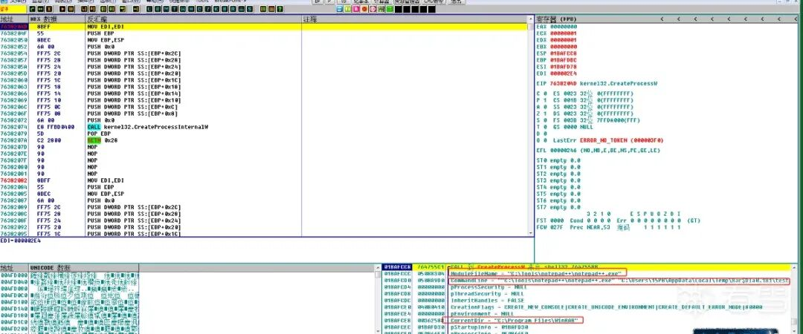  
  
  
Shellexecute会通过.txt后缀名在注册表中找到绑定的ProgID(一般在默认键值中)，如果没设置默认值也可以在子键OpenWithProgID中找到绑定的ProgID，随后根据ProgID找到注册的处理程序的路径地址，将之设为ModuleFilName参数的值。  
  
  
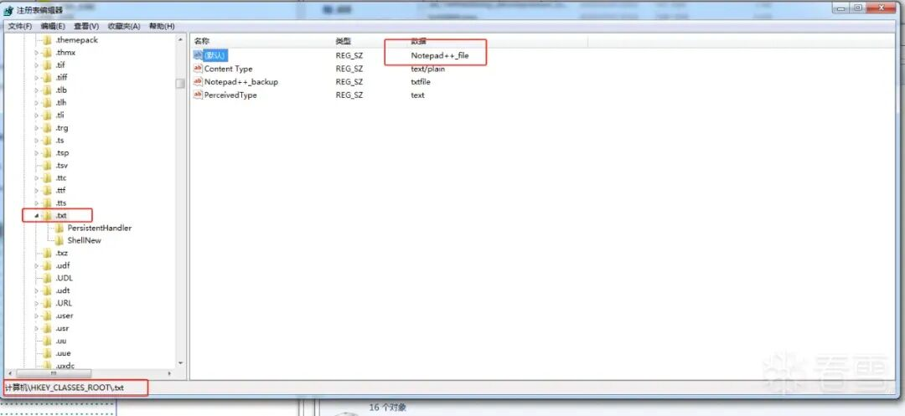  
  
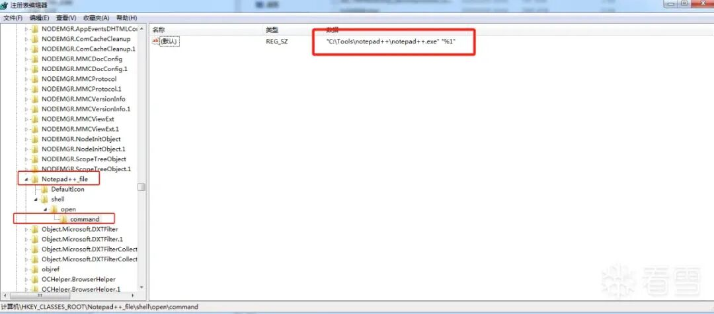  
  
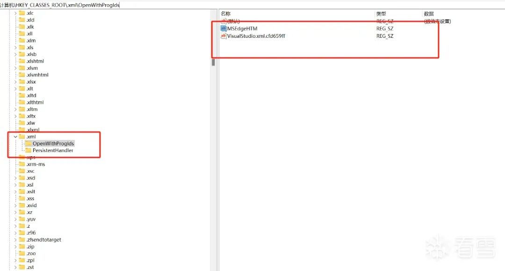  
  
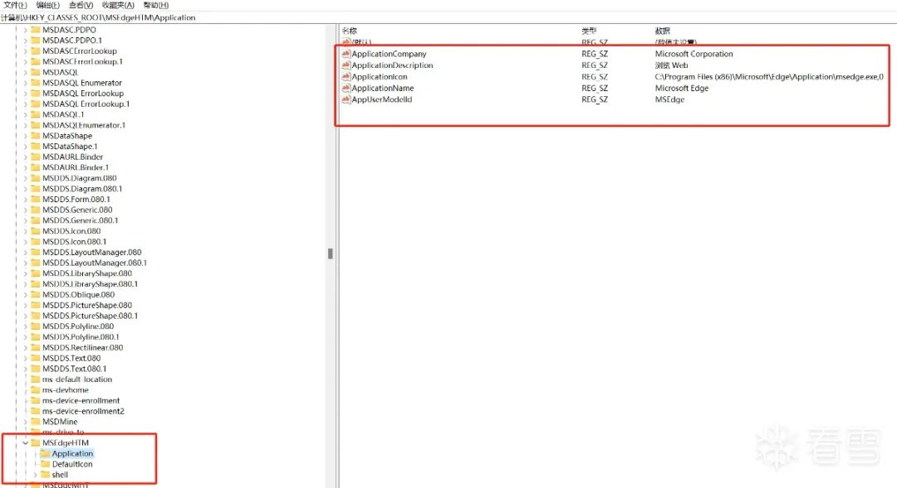  
#   
# 以恶意的test.txt 文件为例  
  
  
注意，test.txt后面有个空格，此时就变成了最初看到的情况，test.txt .cmd被设置成了创建进程的参数。  
  
  
  
  
  
接下来我们通过逆向ShellExecute函数看看为什么加了空格后，原本的执行逻辑就改变了。  
  
# ShellExecute函数逆向  
  
  
ShellExecute在Shell32.dll中，大致执行流程如下图所示，我们只关注的核心的标红函数，这三个函数是最终的问题所在，但他们不在Shell32.dll而是在Shlwapi.dll中。  
  
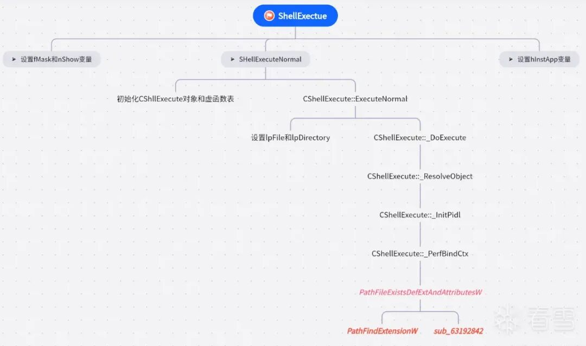  
#   
# PahtFileExistsDefExtAndAttributesW  
  
  
路径字符串末尾为空格或”\“就会返回指向NULL的指针(windwos文件系统在创建文件时首部和尾部会自动把空格清除)。  
  
  
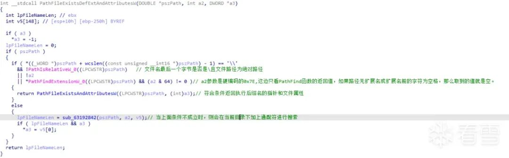  
#   
# PathFindExtensionw  
  
  
该函数没找到符号文件,IDA解析时有问题，故用了另一位博主**B1tg**的图。通过伪代码可以看出如果路径长度超过最大长度或在最后一个点后再次出现空格或\都会返回指向NULL的字符串指针，即未找到后缀名。这也是为什么把最后一个字符串改成空格的原因。  
  
  
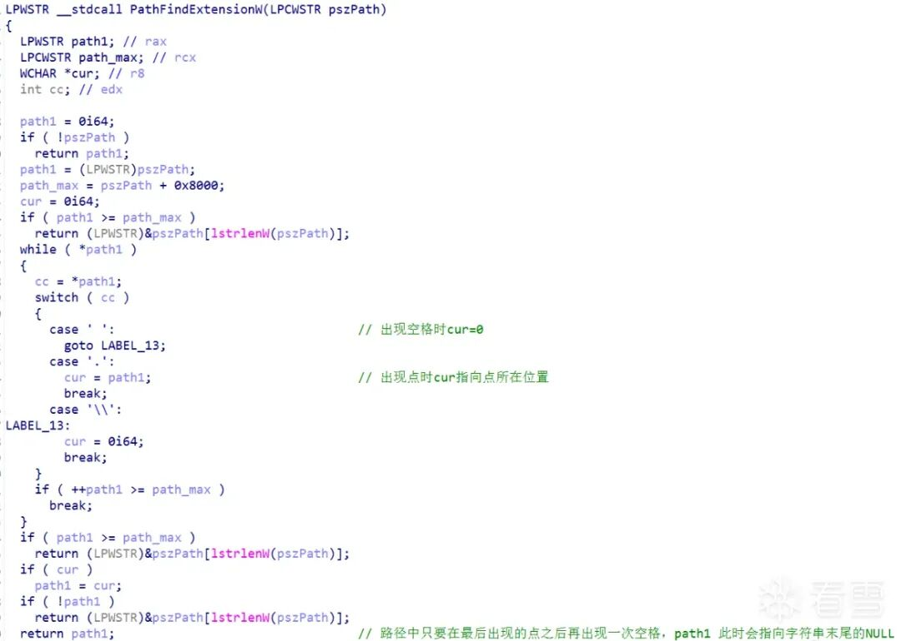  
  
  
当未找到后缀名时会进入sub_63192842函数中。  
  
# sub_63192842  
  
  
这个函数的主要功能是遍历当前路径下的所有文件，并将文件后缀和一个数组比较，数组中是windwos系统下常见可执行文件的后缀名。  
  
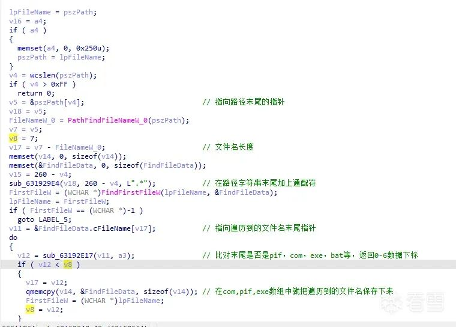  
  
  
对遍历到的文件进行比对，返回数组下标。  
  
  
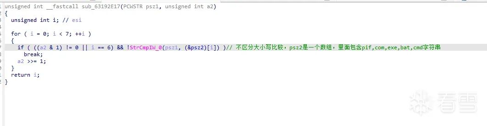  
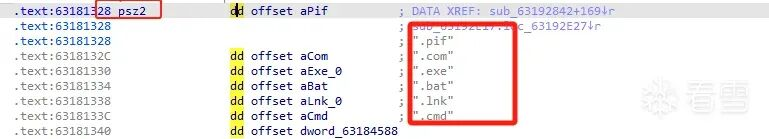  
  
  
所以test.txt 文件因为.后面出现的空格返回了Null，导致if中的表达式为False，于是进入了sub_63192842函数中，搜索到了test.txt .cmd文件，最终该文件被返回并设置了进程创建的参数完成了代码执行。  
  
  
当然如果同一路径下也没发现这6种可执行路径的后缀则会启动rundll32程序，加载shell32的OpenAs_RunDLL函数弹出对话框，让用户选择要执行的程序。  
  
  
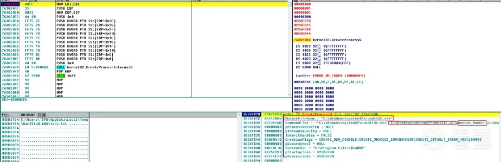  
  
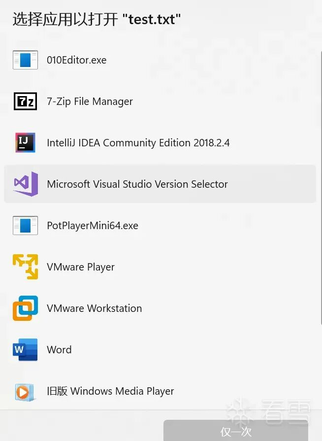  
  
  
##   
  
> 原文此处代码块为空，内容未归档；无法从空块证明或复现所述结果。
  
  
触发该漏洞的完整调用链大致如上所述，究其原因还是Winrar程序本身在双击文件预览时错误的释放逻辑，以及WindowsApi Shellexecute在根据后缀名寻找相应执行文件时触发本地搜索的特性，二者结合才形成了完整的漏洞利用链条。  
  
  
  
  
  
  
  
**看雪ID：time.time**  
  
https://bbs.kanxue.com/user-home-967913.htm  
  
*本文为看雪论坛优秀文章，由 time.time 原创，转载请注明来自看雪社区  
  
  
  
  
  
  
**#****往期推荐**  
  
1、[ELF文件脱壳纪事](http://mp.weixin.qq.com/s?__biz=MjM5NTc2MDYxMw==&mid=2458543004&idx=1&sn=725adc0fb63a7bf7dde7be0e6f3b1bde&chksm=b18d531686fada003b2253064e745de8b3a89e4598b6cc28237ace16653b06ace92de10e13fa&scene=21#wechat_redirect)  
  
  
2、[Glibc-2.35下对tls_dtor_list的利用详解](http://mp.weixin.qq.com/s?__biz=MjM5NTc2MDYxMw==&mid=2458542928&idx=1&sn=be49c9978411b37bc8ddfa677accd4aa&chksm=b18d53da86fadacc89bf45021dfd0333fa1a9b9eeb0588c970f61eb7d3c522d72aea69ce29fd&scene=21#wechat_redirect)  
  
  
3、[对旅行APP的检测以及参数计算分析【Simplesign篇】](http://mp.weixin.qq.com/s?__biz=MjM5NTc2MDYxMw==&mid=2458542926&idx=1&sn=47ff5f90a90cf436b8797d1f9bd0563e&chksm=b18d53c486fadad239ad156749f1a3b6ede82a24537d5570f2602bfcb757ec81ec11c824bd55&scene=21#wechat_redirect)  
  
  
4、[2023强网杯warmup题解](http://mp.weixin.qq.com/s?__biz=MjM5NTc2MDYxMw==&mid=2458542842&idx=1&sn=53afed6329093dd43d7f850562d7a5b4&chksm=b18d527086fadb663dd280f731523c21f433157aec89f81d35ab0ceb8ec959ec00428e1c8659&scene=21#wechat_redirect)  
  
  
5、[Directory Opus 13.2 逆向分析](http://mp.weixin.qq.com/s?__biz=MjM5NTc2MDYxMw==&mid=2458542779&idx=1&sn=bac4e08fa5553f27f206ce3d2480cdca&chksm=b18d523186fadb27f341e2091b9f39e9b829217f15520420ce2d6ab1113fbceaf7cda61cc698&scene=21#wechat_redirect)  
  
  
6、[Pwn-oneday题目解析](http://mp.weixin.qq.com/s?__biz=MjM5NTc2MDYxMw==&mid=2458542755&idx=1&sn=21bd28e83aa99f3ea43a0cc20bec6d0f&chksm=b18d522986fadb3ffda8cb2d08b75f7d5fc27726b50bb242149f73be9ecf5eb273f845cf8bd1&scene=21#wechat_redirect)  
  
  
  
  
  
  
  
  
**球分享**  
  
  
  
**球点赞**  
  
  
  
**球在看**  
  
  
  
  
  
点击阅读原文查看更多  
  

---

> 来源：gelusus/wxvl（微信公众号漏洞文章自动归档，原始披露 URL 尚未确认，现有链接按来源追溯区分别标注）
