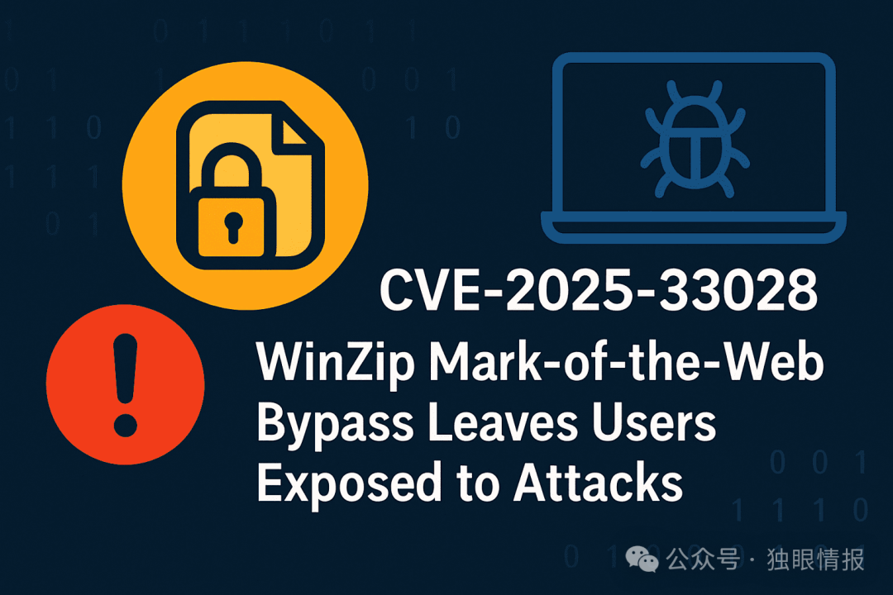

# CVE-2025-33028：WinZip 再次爆出漏洞通过 MotW 绕过导致用户遭受静默代码执行，目前无补丁

<!-- vulwiki-editorial-rebuild:system-misc -->
## 条目范围与校订

- 本文对象：WinZip MotW传播
- 文献类型：安全新闻
- 版本、权限及部署边界：文中WinZip29.0 64位，用户解压并随后打开文件；截至2025-04-22称无补丁
- 核验状态：仅重建文本校订；未执行文中代码、PoC 或扫描，未把截图或转载声明记为本站复现

### 具体结论与待核项

以下为原归档的逐项勘误与证据缺口；可由文本确定的问题已在下文订正，仍缺来源的事实保持待核。

1. MotW缺失不代表文件被系统判定为安全，也不会自动授予更高权限；直接权限提升结论无依据
2. 静默执行需其他执行触发与Office宏策略条件，不应省略用户打开文件和独立防护
3. 未传播标记与主动删除归档标记混述，需逐动作确认
4. 无原始披露/厂商链接；未修复状态必须保留文章日期，替代提取器亦需格式与版本约束

### 操作风险

原文技术操作的实际副作用未复现核验；按其请求/代码评估状态变更、凭据暴露和业务影响

技术请求、代码与实验方法按原文保留；其中的破坏性动作仅限授权、可恢复的隔离环境。缺失代码、参数或版本事实不猜补。

### 来源追溯

- 原始披露 URL 未确认；既有归档来源标签保留，不能替代原始公告

### 归档技术正文

 独眼情报   2025-04-22 05:34  
  
  
  
热门文件压缩工具 WinZip 被发现存在一个安全漏洞，数百万用户面临静默代码执行的风险。该漏洞编号为 CVE-2025-33028，可绕过 Web 标记 (MotW)，允许攻击者通过精心设计的压缩文件传递恶意负载，而无需触发常见的 Windows 安全提示。  
  
Web 标记是 Windows 的一项安全功能，它会标记从互联网下载的文件，并使用特殊的备用数据流进行标记。此标记可确保在打开此类文件（尤其是包含宏或可执行文件的文件）时，Windows 会在文件运行前发出警告。这是抵御网络钓鱼和恶意软件文档的关键第一道防线。  
  
然而，在 CVE-2025-33028 的情况下，这种保障措施彻底失效。根据漏洞披露，“当打开从互联网下载的档案时，WinZip 不会将 Mark-of-the-Web 保护传播到提取的文件”。  
  
当用户下载恶意压缩文件（例如 .zip、.7z）并使用 WinZip 29.0 版（64 位）解压时，其中包含的文件会丢失 MotW 标签。这使得这些文件在 Windows 看来是安全的——即使它们嵌入了危险的宏或脚本。  
  
攻击者可以利用此漏洞的方式如下：  
1. 恶意存档创建：攻击者制作一个恶意存档文件（例如 .zip 或 .7z），其中包含有害文件，例如武器化的 .docm（启用宏的 Word 文档）。  
1. 交付和 MotW 标记：该档案随后会被分发并从互联网上下载。下载完成后，该档案会被打上“网络标记 (Mark-of-the-Web)”的标签。  
1. WinZip 提取：用户使用 WinZip 打开下载的档案并提取其内容。  
1. MotW 删除：至关重要的是，WinZip 会从提取的恶意文件中删除 MotW 标签。  
1. 恶意代码执行：提取的文件现在被视为受信任的本地文件，允许其中的恶意宏或脚本执行而不会触发安全警告。  
此漏洞的后果可能非常严重：  
1. 代码执行：攻击者可以在受害者的系统上执行任意代码，可能安装恶意软件或控制机器。  
  
1. 权限提升：利用此漏洞，攻击者可以在用户环境中获得提升的权限，从而执行通常无权执行的操作。  
  
1. 信息泄露：攻击者可能会访问和窃取存储在受感染系统上的敏感数据。  
  
截至撰写本文时， WinZip Computing 尚未发布**任何官方修复程序**。强烈建议用户：  
- 避免使用 WinZip 打开不受信任的档案。  
- 使用支持 MotW 的替代存档工具（如 Windows 的内置提取器）。  
- 部署能够检测恶意宏执行的端点保护。  

---

> 来源：gelusus/wxvl（微信公众号漏洞文章自动归档，原始披露 URL 尚未确认，现有链接按来源追溯区分别标注）
