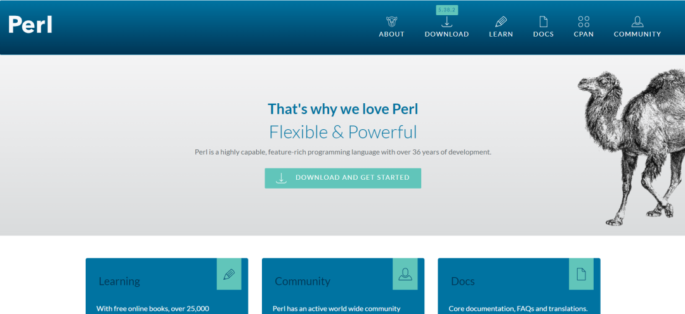

# 漏洞预警  Perl for Windows代码执行漏洞

<!-- vulwiki-editorial-rebuild:system-misc -->
## 条目范围与校订

- 本文对象：Perl for Windows shell查找
- 文献类型：安全通告
- 版本、权限及部署边界：本地攻击者可写当前目录，受害者运行触发shell调用的Perl程序；提权需受害者更高权限
- 核验状态：仅重建文本校订；未执行文中代码、PoC 或扫描，未把截图或转载声明记为本站复现

### 具体结论与待核项

以下为原归档的逐项勘误与证据缺口；可由文本确定的问题已在下文订正，仍缺来源的事实保持待核。

1. 不能从运行任何Perl可执行文件推定一定查找cmd.exe，应说明具体调用条件
2. 影响<5.32.1与2023漏洞修复时间/分支关系需厂商原公告核对，主页不是修复依据
3. ProgramData目录可写性取决ACL，不能普遍假定；非远程零点击漏洞
4. 缺原始披露、准确修复版本及复现证据；清理空标题

### 操作风险

原文技术操作的实际副作用未复现核验；按其请求/代码评估状态变更、凭据暴露和业务影响

技术请求、代码与实验方法按原文保留；其中的破坏性动作仅限授权、可恢复的隔离环境。缺失代码、参数或版本事实不猜补。

### 来源追溯

- 原文参考链接（未重新核验）：<https://www.perl.org/>
- 原始披露 URL 未确认；既有归档来源标签保留，不能替代原始公告

### 归档技术正文

浅安  浅安安全   2024-01-06 08:04  
  
**0x00 漏洞编号**  
- # CVE-2023-47039  
  
**0x01 危险等级**  
- 高危  
  
**0x02 漏洞概述**  
  
Perl是一种功能丰富的计算机程序语言，可以运行在多种计算机平台上，适用广泛，可被用于各种任务，包括系统管理、Web开发、网络编程、GUI开发等。  
  
  
  
**0x03 漏洞详情**  
###   
###   
  
**CVE-2023-47039**  
  
**漏洞类型：**  
代码执行****  
  
**影响：**  
  
执行任意代码  
  
****  
  
**简述：**  
Perl for Windows中存在代码执行漏洞，其受影响版本中依赖系统路径环境变量来查找shell(`cmd.exe`)时存在安全问题。当运行使用Windows Perl解释器的可执行文件时，Perl会尝试在操作系统中查找并执行`cmd.exe`，由于路径搜索顺序问题，Perl最初是在当前工作目录中查找cmd.exe。低权限威胁者可将`cmd.exe`放在权限较弱的位置（如`C:\ProgramData`）来利用该漏洞，当管理员尝试从这些受影响的位置使用该可执行文件时，可以执行任意代码。  
###   
  
**0x04 影响版本**  
- Perl < 5.32.1  
  
**0x05****修复建议**  
  
**目前官方已发布漏洞修复版本，建议用户升级到安全版本****：**  
  
https://www.perl.org/  
  
  
  

---

> 来源：gelusus/wxvl（微信公众号漏洞文章自动归档，原始披露 URL 尚未确认，现有链接按来源追溯区分别标注）
