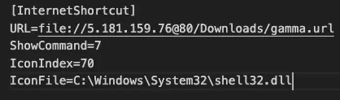
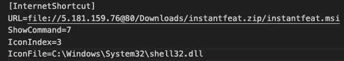
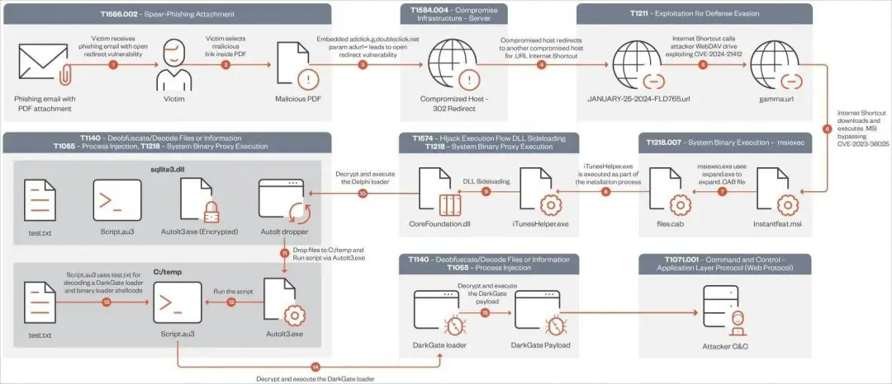
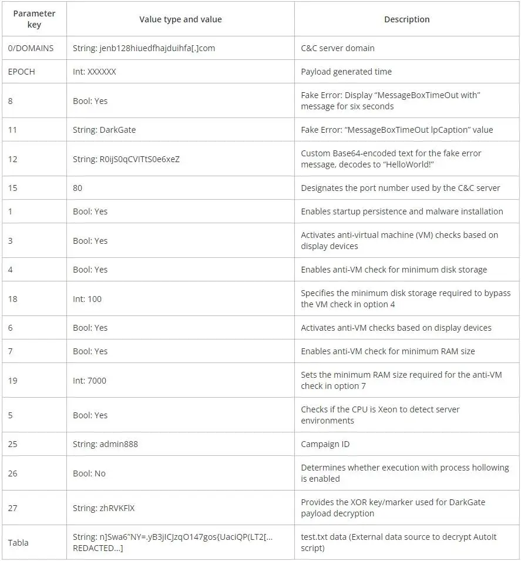

# 黑客利用 Windows SmartScreen 漏洞投放 DarkGate 恶意软件

<!-- vulwiki-editorial-rebuild:system-misc -->
## 条目范围与校订

- 本文对象：Windows SmartScreen Internet快捷方式
- 文献类型：威胁活动分析新闻
- 版本、权限及部署边界：钓鱼PDF链接、快捷方式处理与后续MSI执行链；修复为2024-02 Windows更新
- 核验状态：仅重建文本校订；未执行文中代码、PoC 或扫描，未把截图或转载声明记为本站复现

### 具体结论与待核项

以下为原归档的逐项勘误与证据缺口；可由文本确定的问题已在下文订正，仍缺来源的事实保持待核。

1. 漏洞实体是安全特性绕过，DarkGate6.1.7属于载荷版本不可混为受影响软件版本
2. 前文SMB后文WebDAV传输路径不同，需准确区分特定攻击链，不将全部快捷方式泛化自动执行
3. 自动安装叙述须说明点击/确认及UAC上下文；DLL侧载属于后续手法，不自动是同一CVE或另一个已确认漏洞
4. 分析师/IOC/原始报告未直接链接，只有媒体转载；截图流程和配置未视检
5. 保留独立活动情报并关联漏洞基础条目，补具体系统KB

### 操作风险

原文技术操作的实际副作用未复现核验；按其请求/代码评估状态变更、凭据暴露和业务影响

技术请求、代码与实验方法按原文保留；其中的破坏性动作仅限授权、可恢复的隔离环境。缺失代码、参数或版本事实不猜补。

### 来源追溯

- 原文参考链接（未重新核验）：<https://www.bleepingcomputer.com/news/security/hackers-exploit-windows-smartscreen-flaw-to-drop-darkgate-malware/>
- 原始披露 URL 未确认；既有归档来源标签保留，不能替代原始公告

### 归档技术正文

 网络安全应急技术国家工程中心   2024-04-17 14:46  
  
DarkGate 恶意软件操作发起的新一波攻击，利用现已修复的 Windows Defender SmartScreen 漏洞来绕过安全检查，并自动安装虚假软件安装程序。  
  
SmartScreen 是一项 Windows 安全功能，当用户尝试运行从 Internet 下载的无法识别或可疑文件时，它会显示警告。   
  
被追踪为 CVE-2024-21412 的缺陷是 Windows Defender SmartScreen 缺陷，允许特制的下载文件绕过这些安全警告。  
  
攻击者可以通过创建指向远程 SMB 共享上托管的另一个 .url 文件的 Windows Internet 快捷方式（.url 文件）来利用该缺陷，这将导致最终位置的文件自动执行。  
  
微软于 2 月中旬修复了该漏洞。出于经济动机的 Water Hydra 黑客组织此前就曾利用该漏洞作为零日漏洞 ，将其 DarkMe 恶意软件植入到交易者的系统中。  
  
有分析师报告称，DarkGate 运营商正在利用相同的缺陷来提高他们在目标系统上成功（感染）的机会。  
  
该恶意软件与 Pikabot 一起填补了去年夏天 QBot 破坏造成的空白 ，并被多个网络犯罪分子用于分发恶意软件。  
# DarkGate 攻击细节  
  
该攻击从一封恶意电子邮件开始，其中包含一个 PDF 附件，其中的链接利用 Google DoubleClick 数字营销 (DDM) 服务的开放重定向，来绕过电子邮件安全检查。  
  
当受害者点击该链接时，他们会被重定向到托管互联网快捷方式文件的受感染 Web 服务器。此快捷方式文件 (.url) 链接到托管在攻击者控制的 WebDAV 服务器上的第二个快捷方式文件。  
  
  
  
利用 CVE-2024-21412 SmartScreen 漏洞  
  
使用一个 Windows 快捷方式在远程服务器上打开第二个快捷方式，可有效利用 CVE-2024-21412 缺陷，导致恶意 MSI 文件在设备上自动执行。  
  
  
  
自动安装 MSI 文件的第二个 URL 快捷方式  
  
这些 MSI 文件伪装成来自 NVIDIA、Apple iTunes 应用程序或 Notion 的合法软件。  
  
执行 MSI 安装程序后，涉及“libcef.dll”文件和名为“sqlite3.dll”的加载程序的另一个 DLL 侧载缺陷将解密并执行系统上的 DarkGate 恶意软件负载。  
  
一旦初始化，恶意软件就可以窃取数据，获取额外的有效负载并将其注入正在运行的进程中，执行按键日志记录，并为攻击者提供实时远程访问。  
  
自 2024 年 1 月中旬以来，DarkGate 运营商采用的复杂且多步骤的感染链总结如下：  
  
  
  
DarkGate感染链  
  
该活动采用了 DarkGate 6.1.7 版本，与旧版本 5 相比，该版本具有 XOR 加密配置、新配置选项以及命令和控制 (C2) 值的更新。  
  
DarkGate 6 中提供的配置参数，使其操作员能够确定各种操作策略和规避技术，例如启用启动持久性或指定最小磁盘存储和 RAM 大小以规避分析环境。  
  
  
  
DarkGate v6配置参数  
  
减轻这些攻击风险的第一步是应用 Microsoft 的 2024 年 2 月补丁星期二更新，该更新修复了 CVE-2024-21412。  
  
**参考及来源：**  
  
https://www.bleepingcomputer.com/news/security/hackers-exploit-windows-smartscreen-flaw-to-drop-darkgate-malware/  
  
  
  
原文来源  
：嘶吼专业版  
  
“投稿联系方式：010-82992251   sunzhonghao@cert.org.cn”  
  
  
  

---

> 来源：gelusus/wxvl（微信公众号漏洞文章自动归档，原始披露 URL 尚未确认，现有链接按来源追溯区分别标注）
