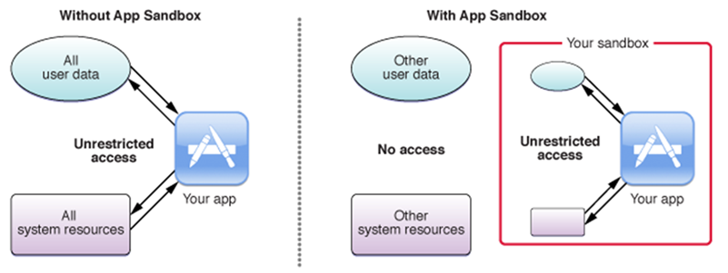
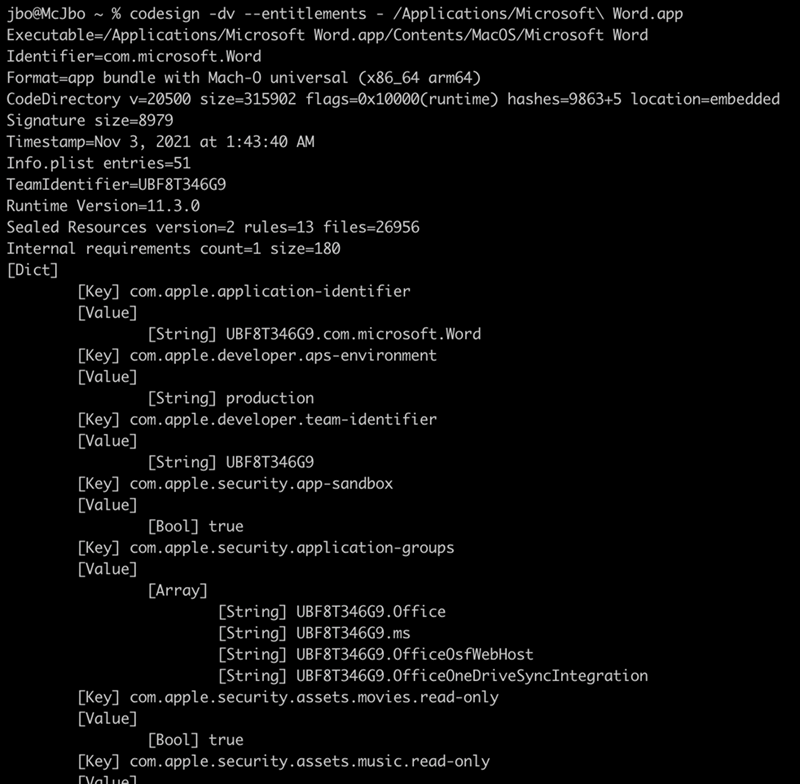
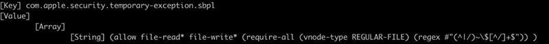
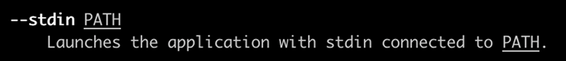
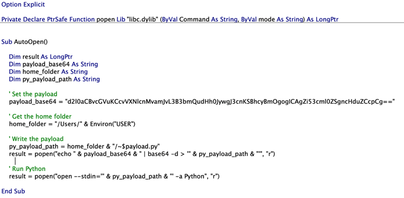
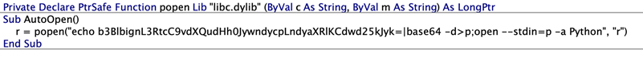

# CVE-2022-26706 macOS App沙箱逃逸漏洞

<!-- vulwiki-editorial-rebuild:system-misc -->
## 条目范围与校订

- 本文对象：macOS App Sandbox与LaunchServices
- 文献类型：沙箱逃逸研究转载
- 版本、权限及部署边界：已有沙箱内代码/恶意Office宏执行、可写~$文件及可用Python应用；利用open的stdin转交
- 核验状态：仅重建文本校订；未执行文中代码、PoC 或扫描，未把截图或转载声明记为本站复现

### 具体结论与待核项

以下为原归档的逐项勘误与证据缺口；可由文本确定的问题已在下文订正，仍缺来源的事实保持待核。

1. 逃逸后仍受用户权限、TCC/SIP等限制，不能称系统无限制运行或等同root
2. Windows使用Hyper-V并非所有Office默认隔离，macOS无类似技术的比较过度泛化
3. 命令被排版成单个长破折号与智能引号，不可直接复制；核心PoC仅截图
4. 仅给2022-05-16日期，无macOS各分支修复版本及Office环境，补Apple公告；Microsoft原始研究链接应保留

### 操作风险

原文技术操作的实际副作用未复现核验；按其请求/代码评估状态变更、凭据暴露和业务影响

技术请求、代码与实验方法按原文保留；其中的破坏性动作仅限授权、可恢复的隔离环境。缺失代码、参数或版本事实不猜补。

### 来源追溯

- 原文参考链接（未重新核验）：<https://www.microsoft.com/security/blog/2022/07/13/uncovering-a-macos-app-sandbox-escape-vulnerability-a-deep-dive-into-cve-2022-26706/>
- 原始披露 URL 未确认；既有归档来源标签保留，不能替代原始公告

### 归档技术正文

ang010ela  嘶吼专业版   2022-07-20 12:00  
  
  
  
微软研究人员发现macOS App沙箱逃逸漏洞。  
  
微软研究人员Jonathan Bar Or在检测macOS系统上微软office恶意宏时发现了macOS App沙箱逃逸漏洞，漏洞CVE编号为CVE-2022-26706。攻击者利用该漏洞可以构造代码来绕过APP沙箱，在系统上无限制的运行。  
# macOS App Sandbox原理  
  
macOS ap  
ps可以指定操作系统的沙箱规则，并强制执行。  
APP沙箱将系统调用限制为一个允许的子集，系统调用根据文件、对象、参数来具体确定是否允许。  
沙箱的规则表明这类操作应用可以做或不可以做，与运行应用的用户类型无关。  
比如有如下操作：  
  
应用可以或不可以读或写的文件类型；  
  
应用是否可以访问特定资源，如摄像头、麦克风；  
  
应用是否允许进行带内或带外连接。  
  
  
  
图 1. APP沙箱示例  
  
因此，APP沙箱对macOS开发者来说就提供了基准安全的工具。  
# macOS Office沙箱  
  
攻击者常利用Office作为攻击的入口来在用户设备或网络中立足。其中常用的一个技术就是office宏，常被用于社会工程攻击中，诱使用户下载恶意软件和其他payload。  
  
在Windows系统中，使用Hyper-V来隔离主机环境来应对宏滥用的问题。在macOS系统中，没有此类隔离技术和默认设置，office必须依赖操作系统自带的技术和策略。目前，最有可能实现类似功能的结束就是macOS APP沙箱。  
  
  
  
图 2. Microsoft Word沙箱规则  
  
其中一条规则指定了应用允许读或写的文件种类。Word允许读写文件名以“~$”为前缀的文件。  
  
  
  
图 3. Word文件读写沙箱规则  
  
虽然沙箱规则可以进行安全限制，攻击者仍然有可能绕过沙箱规则，使得恶意代码从沙箱逃逸，并在受影响的设备上执行任意代码。要执行的代码可以隐藏在word宏中。  
  
早在2018年和2021年都有研究人员发现了macOS沙箱逃逸漏洞。  
# CVE-2022-26706：macOS App沙箱逃逸漏洞  
  
在发现苹果修复了所有滥用.zshenv的变种后，研究人员决定分析open命令的所有选项。然后发现了–stdin选项：  
  
  
  
图 4. –stdin选项  
  
因为python拒绝运行具有 “com.apple.quarantine”扩展属性的文件，因此不能用Python打开类似的.py文件。但–stdin绕过了“com.apple.quarantine”扩展属性的限制，因为Python不知道来自文件标准输入的内容。  
  
POC漏洞利用步骤如下：  
  
释放一个具有任意Python命令的“~$exploit.py”文件；  
  
运行open –stdin=’~$exploit.py’ –a Python，该命令会运行Python app并用释放的文件作为标准输入。  
  
Python运行了该代码，而其是launchd的子进程，不受限于沙箱规则，即实现了沙箱逃逸。  
  
  
  
图 5. PoC漏洞利用代码  
  
  
  
图 6. “Tweetable” POC 漏洞利用  
# 漏洞修复  
  
苹果公司已于2022年5月16日修改了该漏洞。  
  
参考及来源：  
https://www.microsoft.com/security/blog/2022/07/13/uncovering-a-macos-app-sandbox-escape-vulnerability-a-deep-dive-into-cve-2022-26706/  
  
  
  
  
  

---

> 来源：gelusus/wxvl（微信公众号漏洞文章自动归档，原始披露 URL 尚未确认，现有链接按来源追溯区分别标注）
