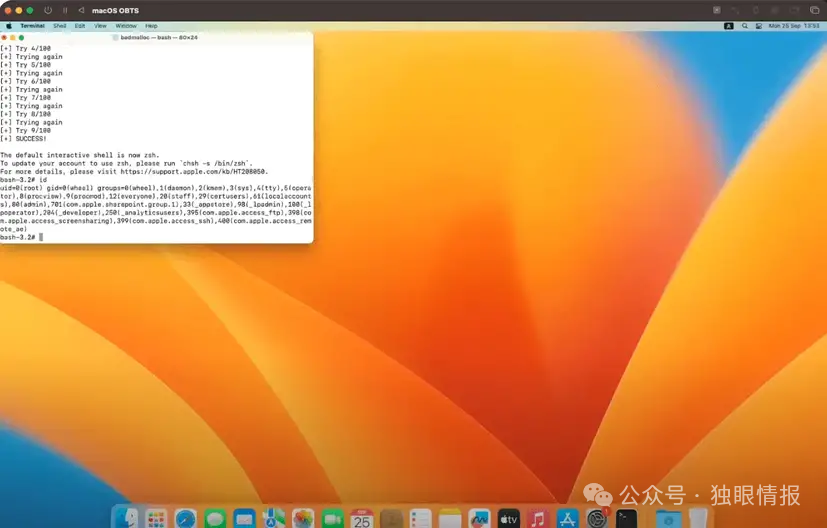

# macOS 漏洞 (CVE-2023-32428)本地提权，有poc

<!-- vulwiki-editorial-rebuild:system-misc -->
## 条目范围与校订

- 本文对象：macOS MallocStackLogging
- 文献类型：本地提权新闻
- 版本、权限及部署边界：本地可运行进程、可控MallocStack环境与suid程序及竞争文件操作；文中Ventura13.4修复
- 核验状态：仅重建文本校订；未执行文中代码、PoC 或扫描，未把截图或转载声明记为本站复现

### 具体结论与待核项

以下为原归档的逐项勘误与证据缺口；可由文本确定的问题已在下文订正，仍缺来源的事实保持待核。

1. any进程/所有环境变量加载说法需限定系统版本和受限二进制策略；不能推广当前系统
2. 随机日志路径与任意位置可控内容到sudoers之间缺关键链证据，新闻应明确为研究者PoC结论
3. macOS利用样例不能据相同修复条目推断iOS/tvOS可同法root；补Apple分支公告
4. 原作者GitHub保留，未给精确测试构建和原技术博客；赏金评论无漏洞技术价值

### 操作风险

原文技术操作的实际副作用未复现核验；按其请求/代码评估状态变更、凭据暴露和业务影响

技术请求、代码与实验方法按原文保留；其中的破坏性动作仅限授权、可恢复的隔离环境。缺失代码、参数或版本事实不猜补。

### 来源追溯

- 原文参考链接（未重新核验）：<https://github.com/gergelykalman/CVE-2023-32428-a-macOS-LPE-via-MallocStackLogging>
- 原始披露 URL 未确认；既有归档来源标签保留，不能替代原始公告

### 归档技术正文

 独眼情报   2024-11-27 12:57  
  
  
  
安全研究员 Gergely Kalman 详细介绍了 Apple MallocStackLogging 框架中的一个高危漏洞，该漏洞可能允许攻击者在 macOS 系统上获得本地特权提升 (LPE)。该漏洞编号为 CVE-2023-32428，CVSS 评分为 7.8，它展示了如何利用看似有用的开发人员工具来绕过安全措施并破坏高权限操作。  
  
MallocStackLogging 是 macOS 中的一个调试框架，用于监控内存分配。该漏洞利用了该框架无需特殊权限即可动态加载到进程中的能力。“只要检测到 MallocStack* 环境变量，动态加载器 (dyld) 就会将 MallocStackLogging.framework 加载到任何进程中， ”Kalman解释道。此功能甚至可以用于 suid-root 二进制文件，使其成为攻击者的理想目标。  
  
关键的危险在于框架写入日志文件的方式：“目标进程根本不知道发生了什么，”Kalman 指出，并强调这些文件是使用正在运行的进程的权限创建的。  
  
Apple 采取了多项缓解措施来限制漏洞利用，其中包括：  
- 使用open()安全标志来防止覆盖文件和跟踪符号链接。  
  
- 随机化日志文件名以阻止预测尝试。  
  
- 限制文件权限以增强安全性。  
  
然而，Kalman 指出了这些缓解措施的重大缺陷。例如，“ access() 对于保护文件系统操作毫无用处”，因为可以在权限检查之后但在打开之前交换文件。此外，O_NOFOLLOW中的标志open()仅阻止最后一个路径组件中的符号链接，而路径的其他部分则容易受到操纵。  
  
Kalman 开发了一种漏洞，利用竞争条件将日志文件写入重定向到进程可访问的任意位置。通过结合适时的符号链接替换，攻击者可以操纵特权二进制文件（例如 crontab）。  
  
例如，该漏洞会在 /etc/sudoers.d 中创建一个文件，以授予 root 访问权限而无需密码。Kalman 在概念验证中演示了此方法，通过利用该漏洞获得 root 权限。  
  
该漏洞影响 macOS Ventura 13.3 及更早版本。Apple 已在 macOS Ventura 13.4 和 iOS 及 tvOS 16.5 等其他平台中修复了此问题。强烈建议用户更新其设备以避免潜在的攻击。  
  
卡尔曼对这一发现表达了复杂的感受，他指出，“对于所有这些工作，我只得到了 22,500 美元，这相当令人失望，因为我的 TCC 旁路价值更高。”  
### poc  
>   
> https://github.com/gergelykalman/CVE-2023-32428-a-macOS-LPE-via-MallocStackLogging  
  
  
  
  

---

> 来源：gelusus/wxvl（微信公众号漏洞文章自动归档，原始披露 URL 尚未确认，现有链接按来源追溯区分别标注）
