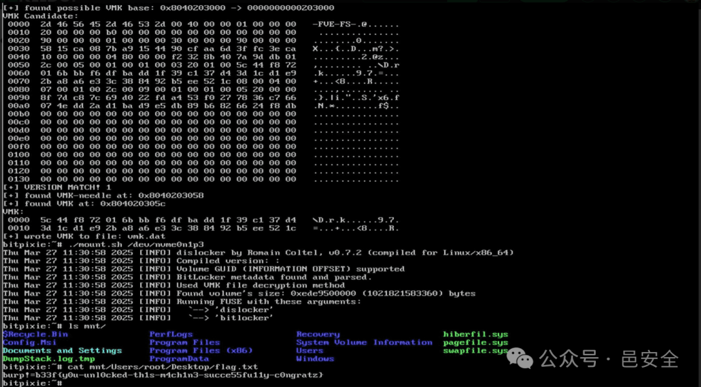

# 利用Bitpixie漏洞（CVE-2023-21563）可在数分钟内绕过BitLocker加密——概念验证揭示高风险攻击路径

<!-- vulwiki-editorial-rebuild:system-misc -->
## 条目范围与校订

- 本文对象：Windows BitLocker与启动管理器
- 文献类型：BitLocker绕过利用新闻
- 版本、权限及部署边界：需设备启动控制/现场访问、TPM-only、允许相关PXE与受信任旧启动组件；Linux和WinPE路径不同
- 核验状态：仅重建文本校订；未执行文中代码、PoC 或扫描，未把截图或转载声明记为本站复现

### 具体结论与待核项

以下为原归档的逐项勘误与证据缺口；可由文本确定的问题已在下文订正，仍缺来源的事实保持待核。

1. 无螺丝刀或硬件改造不等于无需物理访问，标题与导语应显著强调启动控制前提
2. 只要无PIN即成功过度泛化，Secure Boot吊销、固件、启动版本、策略和内存保留条件缺失
3. 取得VMK允许解密访问不等于五分钟内完成全盘转换；时间为特定实验非保证
4. 缺MSRC更新/吊销缓解与Compass原始技术报告，只有二次SecurityOnline链接；PIN等缓解不能绝对覆盖各类攻击
5. 0796仅推荐文章编号

### 操作风险

缺MSRC更新/吊销缓解与Compass原始技术报告，只有二次SecurityOnline链接；PIN等缓解不能绝对覆盖各类攻击

技术请求、代码与实验方法按原文保留；其中的破坏性动作仅限授权、可恢复的隔离环境。缺失代码、参数或版本事实不猜补。

### 来源追溯

- 原文标注出处：<https://securityonline.info/bitlocker-encryption-bypassed-in-minutes-via-bitpixie-cve-2023-21563-poc-reveals-high-risk-attack-path/>
- 原文参考链接（未重新核验）：<http://mp.weixin.qq.com/s?__biz=MzUyMzczNzUyNQ==&mid=2247488913&idx=1&sn=acbf595a4a80dcaba647c7a32fe5e06b&chksm=fa39554bcd4edc5dc90019f33746404ab7593dd9d90109b1076a4a73f2be0cb6fa90e8743b50&scene=21#wechat_redirect>
- 原文参考链接（未重新核验）：<http://mp.weixin.qq.com/s?__biz=MzUyMzczNzUyNQ==&mid=2247483652&idx=1&sn=b2f2ec90db499e23cfa252e9ee743265&chksm=fa3941decd4ec8c83a268c3480c354a621d515262bcbb5f35e1a2dde8c828bdc7b9011cb5072&scene=21#wechat_redirect>

### 归档技术正文

邑安科技  邑安全   2025-05-16 02:23  
  
更多全球网络安全资讯尽在邑安全  
  
  
  
图片来源：Compass Security  
  
安全研究人员近日展示了一种纯软件技术，可在无需物理工具（如螺丝刀、焊枪）或硬件破解的情况下，成功绕过微软BitLocker加密防护。  
  
通过利用名为Bitpixie（CVE-2023-21563）的漏洞，红队成员与攻防安全专家能够从内存中提取BitLocker卷主密钥（VMK），在五分钟内完整解密受保护的Windows设备。Compass Security研究员Marc Tanner在红队评估报告中指出："该漏洞利用过程具有非侵入性，既不需要永久性设备改造，也无需获取完整磁盘映像"。  
## 两种主要攻击路径  
  
报告详细描述了两种基于软件的攻击路径：一种基于Linux系统，另一种基于Windows PE环境——二者均利用了存在缺陷的启动路径，以及BitLocker在缺乏预启动认证时对TPM（可信平台模块）的依赖机制。  
### Linux环境攻击（Bitpixie Linux版）  
1. 通过Shift+重启组合键进入Windows恢复环境  
  
1. 通过PXE网络启动存在漏洞的Windows启动管理器  
  
1. 修改启动配置数据（BCD）强制PXE软重启  
  
1. 加载已签名的Linux引导程序（shimx64.efi）  
  
1. 链式加载GRUB引导器、Linux内核及初始化内存盘  
  
1. 使用内核模块扫描物理内存获取VMK  
  
1. 通过dislocker工具挂载含提取密钥的加密卷  
  
报告特别指出："只要设备启动时不要求输入PIN码或插入USB密钥，该攻击就能完全绕过BitLocker保护，在约5分钟内实现入侵，并可灵活融入社会工程攻击场景。"  
### Windows PE环境攻击（Bitpixie WinPE版）  
  
针对阻止第三方签名组件的系统（如联想安全核心PC），攻击者可切换至Windows原生攻击路径：  
1. 通过修改BCD再次PXE启动Windows启动管理器  
  
1. 加载包含winload.efi、ntoskrnl.exe等微软签名组件的WinPE镜像  
  
1. 运行定制版WinPmem工具扫描内存获取VMK  
  
1. 利用VMK解密BitLocker元数据并提取可读恢复密钥  
  
研究人员解释："该攻击流仅使用微软签名的核心组件...只要设备信任微软Windows Production PCA 2011证书，所有受影响设备均可能遭入侵。"  
## 安全建议  
  
报告强调，虽然仅启用TPM保护的BitLocker配置为用户提供了便利，但这种设置使系统暴露于纯软件攻击之下。研究人员建议："启用预启动认证（PIN码、USB密钥或密钥文件）可有效缓解Bitpixie漏洞及各类软硬件攻击。"安全团队应立即审计所有使用BitLocker的设备，并强制启用预启动认证机制。  
  
原文来自:   
securityonline.info  
  
原文链接:   
https://securityonline.info/bitlocker-encryption-bypassed-in-minutes-via-bitpixie-cve-2023-21563-poc-reveals-high-risk-attack-path/  
  
欢迎收藏并分享朋友圈，让五邑人网络更安全  
  
  
欢迎扫描关注我们，及时了解最新安全动态、学习最潮流的安全姿势！  
  
推荐文章  
  
1  
  
[新永恒之蓝？微软SMBv3高危漏洞（CVE-2020-0796）分析复现](http://mp.weixin.qq.com/s?__biz=MzUyMzczNzUyNQ==&mid=2247488913&idx=1&sn=acbf595a4a80dcaba647c7a32fe5e06b&chksm=fa39554bcd4edc5dc90019f33746404ab7593dd9d90109b1076a4a73f2be0cb6fa90e8743b50&scene=21#wechat_redirect)  
  
  
2  
  
[重大漏洞预警：ubuntu最新版本存在本地提权漏洞（已有EXP）　](http://mp.weixin.qq.com/s?__biz=MzUyMzczNzUyNQ==&mid=2247483652&idx=1&sn=b2f2ec90db499e23cfa252e9ee743265&chksm=fa3941decd4ec8c83a268c3480c354a621d515262bcbb5f35e1a2dde8c828bdc7b9011cb5072&scene=21#wechat_redirect)  
  
  
  

---

> 来源：gelusus/wxvl（微信公众号漏洞文章自动归档，原文见文首链接）
